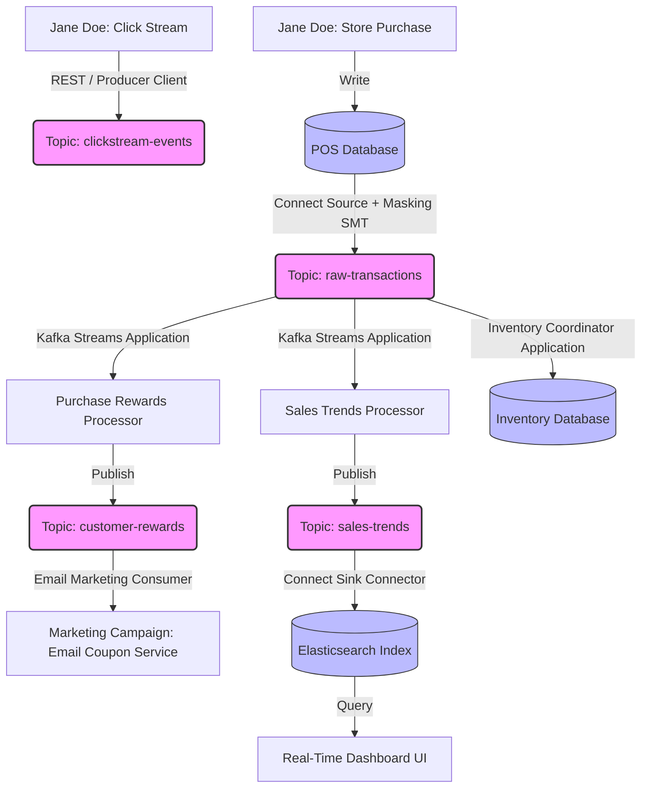

# Module 03: Real-World Case Study: The ZMart Retail Pipeline

To understand how the components of the Apache Kafka platform collaborate in a production scenario, we will analyze the architecture of **ZMart**, a high-volume retail enterprise. ZMart uses an event streaming platform to unify its online clickstream campaigns, physical point-of-sale (POS) systems, customer loyalty engines, real-time analytics dashboard, and inventory control loops.

---

## 1. ZMart Event Streaming Architecture Topology

ZMart's architecture replaces siloed department databases with a shared event streaming backbone. 

---

## 2. Walkthrough: The Lifecycle of ZMart Operations

Let’s trace ZMart’s event lifecycle through two distinct but linked user interactions: Jane Doe’s online prepurchase clickstream and her subsequent brick-and-mortar purchase transaction.

### Phase 1: Online Clickstream Ad Campaign Ingestion
1.  Jane Doe receives a marketing email from ZMart containing a link for a 15% discount.
2.  She clicks the link, navigating to ZMart's promotional landing page. Once there, she clicks an activation link to print the coupon.
3.  Each click generates a user interaction event. A lightweight **Producer microservice** embedded within the web server captures these events immediately and publishes them to the `clickstream-events` topic.
4.  **Decoupling in Action**: The marketing department's analytical services consume from this topic to monitor the campaign's click-through rates. Concurrently, data science teams consume the same stream to attribute eventual offline purchases to online ad click vectors.

### Phase 2: Brick-and-Mortar POS Purchase
1.  Jane visits a physical ZMart store, scans items at the self-checkout, applies her printed 15% discount coupon, scans her loyalty card, and pays using her debit card.
2.  The point-of-sale (POS) terminal records the transaction in a localized store database.

### Phase 3: Connect Ingestion & Data Security (SMT Masking)
1.  ZMart uses **Kafka Connect** with a Source Connector (such as Debezium for CDC or a JDBC source connector) to tail the POS transactions.
2.  **Security Constraint**: Regulatory standards (PCI-DSS) mandate that credit card numbers and personally identifiable information (PII) must not be written to Kafka in cleartext.
3.  **Solution (SMT)**: Before the connector sends the database records to the `raw-transactions` topic, it applies a **Single Message Transform (SMT)**. The SMT intercepts the event, masks the credit card field (e.g., converting `4111222233334444` to `XXXXXXXXXXXX4444`), and only writes the protected event bytes to the broker.

### Phase 4: Downstream Stream Processing (Kafka Streams)
As soon as the protected event is appended to `raw-transactions`, two independent **Kafka Streams** applications process it concurrently in real time:

#### 1. The Rewards Processor
*   This application reads from the `raw-transactions` topic.
*   It checks if the purchase includes a valid customer loyalty ID.
*   If the customer qualifies for points or bonuses, it calculates the updated points value and publishes a reward-earned event to the `customer-rewards` topic.
*   A downstream **Email Marketing consumer microservice** reads from the `customer-rewards` topic and immediately dispatches a customized thank-you email with coupons to Jane Doe's inbox. Jane receives the reward email minutes after leaving the register.

#### 2. The Sales Trends Processor
*   This application consumes the same `raw-transactions` stream.
*   It aggregates transaction details dynamically, group by store location and product category, to calculate real-time sales trends.
*   The aggregated trends are published to a `sales-trends` topic.
*   A **Kafka Connect Sink Connector** consumes from `sales-trends` and continuously updates an Elasticsearch index.
*   A management UI dashboard queries Elasticsearch, allowing ZMart executives to visualize sales velocity trends in real time.

### Phase 5: Inventory Coordination
*   A dedicated **Inventory Management application** consumes from `raw-transactions`.
*   It decrements stock levels of items purchased.
*   If stock of a particular item drops below a critical threshold, it triggers an automated replenishment order in the ERP system, ensuring shelves are restocked dynamically.

---

## 3. Key Architectural Takeaways

*   **Write Once, Read Many**: The same transaction event in `raw-transactions` is written once, but consumed independently by the Loyalty engine, the Analytics engine, and the Inventory controller without lock contention or performance degradation.
*   **Security at the Edge**: PII is masked at the Connect ingestion edge before entering the broker storage files, minimizing compliance exposure.
*   **Decoupled Scaling**: If the Email Marketing service crashes or slows down, the Sales Trends Processor and Inventory system continue working at full speed.
