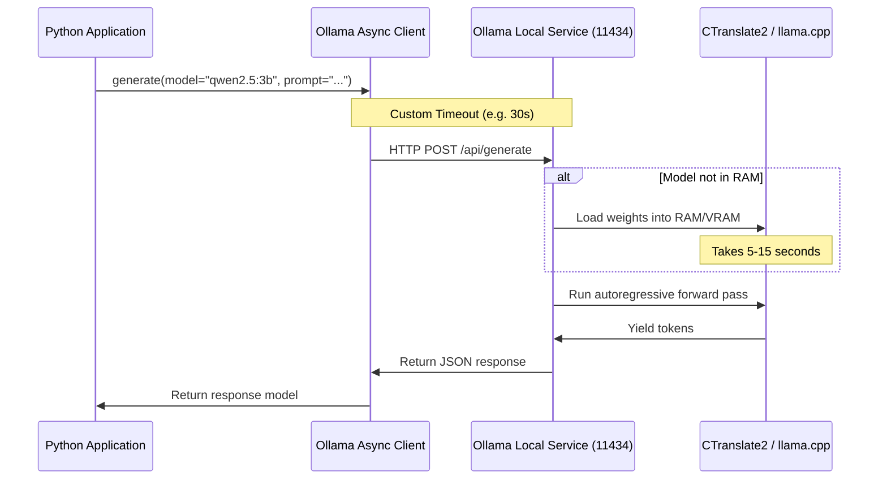

# Module 01: Local LLM Orchestration & Ollama Foundations

Welcome back, class. Today we analyze **Local LLM Orchestration & Ollama Foundations (CS-525)**.

In previous architectures, engineers relied heavily on external cloud APIs (such as OpenAI or Anthropic) to handle reasoning. While this is simple to implement, sending sensitive candidate data across network boundaries poses compliance risks, and token-based pricing scales unpredictably. For a thesis-defensible, controllable technical interview platform, we must run models locally. 

Today we study **Ollama**, an open-source tool built on top of `llama.cpp` that lets us run quantized models directly on our local CPU or GPU. We will analyze local model selection criteria, write a resilient async client wrapper, and configure strict timeout handlers to prevent execution locks.

---

## 1. Academic Lecture: The Mechanics of Local LLMs

### 1. How Ollama Works Under the Hood
Ollama packages model weights, prompt templates, context parameters, and system variables into a single archive format called a **Modelfile**.
*   **The Runtime Backend**: Ollama runs on `llama.cpp`, which compiles neural network operations into highly optimized C/C++ execution paths. It utilizes hardware accelerators such as Apple Metal, NVIDIA CUDA, or AMD ROCm. If no GPU is available, it gracefully falls back to CPU execution using optimized multi-threaded vector math.
*   **The Server Architecture**: Ollama runs as a background service listening on `http://localhost:11434`. It exposes a REST API that handles inference requests, model downloads, and state monitoring.

### 2. Model Selection: Balancing Parameter Count and Latency
When selecting models for a local interview engine, we must evaluate model size, memory constraints, and reasoning speed:
*   **Qwen2.5-3B-Instruct**: A 3-billion parameter model. It requires approximately 2.2 GB of VRAM/RAM. Despite its size, its instruction-following and JSON formatting capabilities rival much larger models. Highly recommended for CPU-constrained setups.
*   **Llama-3-8B-Instruct**: An 8-billion parameter model. It requires approximately 4.8 GB of VRAM/RAM in a 4-bit quantized layout (`Q4_K_M`). It provides broader general knowledge and reasoning capacity, but exhibits higher latency on CPU-only hardware.

### 3. Connection and Execution Boundaries
*   **Connection Timeout Risks**: Quantized models can experience "first-token latency" (Time to First Token or TTFT). If the model has been unloaded from RAM/VRAM to make room for other tasks, Ollama must load the entire model file back into memory. This process can take 5 to 30 seconds, causing standard HTTP clients without timeout overrides to raise exceptions.



---

## 2. Theory vs. Production Trade-offs

When choosing between cloud APIs and local deployment engines, consider these parameters:

| Metric / Dimension | Hosted Cloud APIs (e.g. OpenAI) | Local Ollama (GPU Accelerated) | Local Ollama (CPU Execution) |
| :--- | :--- | :--- | :--- |
| **Data Privacy** | Poor (Data leaves your boundary) | Excellent (100% Local / Sandbox) | Excellent (100% Local / Sandbox) |
| **Token Cost** | Variable (Pay-per-token scales) | Zero (Unlimited usage) | Zero (Unlimited usage) |
| **Latency (TTFT)** | Fast (100ms - 500ms) | Fast (100ms - 300ms) | Slow (1.0s - 5.0s) |
| **Concurrency** | Infinite (Handled by provider) | Low (Queued requests) | Very Low (Locks CPU threads) |
| **Hardware Requisites**| Minimal (Internet connection) | Dedicated GPU (VRAM >= 8GB) | Standard RAM (>= 16GB) |

*   **Production Rule**: In local development and academic evaluation, run **Qwen2.5-3B-Instruct** with CPU quantization to verify code structures. For production scalability or live mock interview simulations, deploy Ollama to a server with a dedicated GPU (e.g., NVIDIA T4 or A10G) to ensure response times stay under 2 seconds.

---

## 3. How to Use: Resilient Async Integration

Let us write a compile-grade Python 3.11+ application that configures a resilient async Ollama service, managing timeout safety during model instantiation.

### A. The Brittle Client Pattern (Anti-Pattern)

Avoid instantiating clients without explicit HTTP transport overrides. By default, missing models or slow loading will lock your application threads indefinitely:

```python
import ollama

# DANGER: This synchronous connection blocks the execution thread.
# If Ollama needs to load the model or download weights, the program
# will hang, leading to client timeouts or socket leaks.
def run_naive_chat(prompt: str) -> str:
    # No timeouts specified, synchronous execution
    response = ollama.chat(
        model="qwen2.5:3b",
        messages=[{"role": "user", "content": prompt}]
    )
    return response["message"]["content"]
```

### B. The Resilient Async Client Service (Production Pattern)

Here is the hardened pattern. We write an orchestrator class that wraps `ollama.AsyncClient` with custom `httpx.Timeout` controls, performs pre-flight model status checks, and handles connection failures gracefully.

```python
import httpx
import asyncio
from typing import Dict, Any, List
from ollama import AsyncClient, ResponseError

class ResilientOllamaService:
    def __init__(self, host: str = "http://localhost:11434", connection_timeout: float = 30.0):
        # Build custom HTTP transport settings to protect client threads
        self.timeout = httpx.Timeout(
            connect=5.0,     # Time to establish socket connection
            read=connection_timeout,  # VRAM load & inference execution buffer
            write=5.0,
            pool=10.0
        )
        self.client = AsyncClient(host=host, timeout=self.timeout)

    async def verify_model_installed(self, model_name: str) -> bool:
        """
        Verify if the model weights exist locally in Ollama's storage.
        """
        try:
            models_response = await self.client.list()
            local_models = models_response.get("models", [])
            # Ollama models can be tagged (e.g. qwen2.5:3b or qwen2.5:3b-instruct)
            installed_names = [m.get("model", "") for m in local_models]
            return any(model_name in name for name in installed_names)
        except httpx.ConnectError:
            raise RuntimeError("Ollama service is not running. Start the service before executing queries.")

    async def execute_chat(self, model_name: str, system_prompt: str, user_content: str) -> str:
        """
        Executes an asynchronous inference request with error boundary checks.
        """
        # Pre-flight check to prevent silent hangs
        is_installed = await self.verify_model_installed(model_name)
        if not is_installed:
            raise FileNotFoundError(
                f"Model '{model_name}' is not installed locally. Run 'ollama pull {model_name}' first."
            )

        messages = [
            {"role": "system", "content": system_prompt},
            {"role": "user", "content": user_content}
        ]

        try:
            response = await self.client.chat(
                model=model_name,
                messages=messages,
                options={
                    "temperature": 0.2,  # Low temperature for deterministic evaluation
                    "num_ctx": 4096      # Enforce context window capacity
                }
            )
            return response["message"]["content"]
        except ResponseError as re:
            # Internal model processing exception (e.g., context overflow)
            return f"Ollama Error: Model execution failed with status {re.status_code} - {re.error}"
        except httpx.ReadTimeout:
            # VRAM load or token generation took longer than timeout parameter
            return "Client Timeout Error: The local model took too long to return a response."
```

---

## 4. Common Errors & Pitfalls

### Pitfall 1: Silent Connection Blocking
Attempting to connect to Ollama when the service is stopped or restarting.
*   **Why it fails**: Standard client constructors do not check for socket availability. The application will block until the operating system's tcp stack reaches its default timeout threshold (often 75+ seconds).
*   **Mitigation**: Always perform a quick `/api/tags` connection test (e.g., `client.list()`) during service initialization with a short 2-second connection timeout parameter.

### Pitfall 2: Context Window Truncation
Passing large datasets (e.g., multiple transcripts and rules) without verifying the context window parameter (`num_ctx`).
*   **Why it fails**: By default, many Ollama model configurations initialize with a context buffer of 2048 tokens. If your inputs exceed this size, Ollama silently truncates the oldest context, causing the LLM to forget its system prompt instructions.
*   **Mitigation**: Set `"num_ctx": 4096` or `8192` explicitly in the client options dictionary.

---

## 5. Socratic Review Questions

### Question 1
Why does Ollama's first token generation take significantly longer than subsequent tokens (Time to First Token vs. Inter-Token Latency)?

#### Answer
During initialization, the model weights must be loaded from local non-volatile storage (SSD/HDD) into volatile memory (system RAM or GPU VRAM). This storage read speed is the major bottleneck. Once loaded, the calculations for token generation run directly in high-speed RAM/VRAM, resulting in fast generation times.

### Question 2
When running Ollama in a multi-user environment, what happens to inference requests that arrive while the model is already evaluating a query?

#### Answer
Ollama serializes processing queue streams. By default, it processes queries sequentially. If multiple users execute requests simultaneously, subsequent requests are placed in an execution queue. This increases latency for waiting clients. To support concurrent users, Ollama must be configured with `OLLAMA_NUM_PARALLEL` environment parameters to load multiple model instances.

---

## 6. Hands-on Challenge: Model Availability Checker & Router

### The Challenge
In this challenge, you will implement an automated model router.
Your task:
1. Complete the `route_and_generate` method inside `OllamaModelRouter`.
2. Check if the primary model is installed. If yes, query it.
3. If the primary model is missing, fallback to the backup model.
4. If the backup model is also missing, raise a `RuntimeError`.

Complete the implementation below:

```python
import httpx
from typing import Dict, Any, List

class OllamaModelRouter:
    def __init__(self, client: Any, primary_model: str, backup_model: str):
        self.client = client
        self.primary = primary_model
        self.backup = backup_model

    async def get_installed_models(self) -> List[str]:
        """
        Queries the Ollama client list to return names of installed models.
        """
        try:
            res = await self.client.list()
            return [m.get("model", "") for m in res.get("models", [])]
        except Exception:
            return []

    async def route_and_generate(self, system_prompt: str, user_content: str) -> str:
        # TODO: Implement the routing logic:
        # 1. Fetch installed models list using self.get_installed_models().
        # 2. Check if self.primary is in the installed list (partial matches allowed).
        # 3. If primary is installed, execute client.chat with self.primary.
        # 4. If primary is missing but self.backup is installed, query self.backup.
        # 5. If both are missing, raise RuntimeError("No models available").
        # Use options={"temperature": 0.1} inside client.chat.
        
        return ""
```

Write the validation and fallback routing logic. Save the completed file and verify that the routing behaves correctly under `modules/01-ollama-local-llms.md`.
