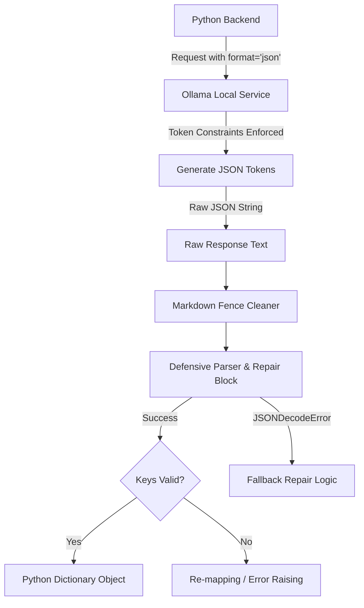

# Module 03: Structured Output & JSON Parsing

Welcome back, class. Today we analyze **Structured Output & JSON Parsing (CS-525)**.

When building automated systems, your code cannot consume a conversational paragraph of text. If the evaluation engine output is: `"The candidate did quite well, I would rate them an 8. However, they missed key points..."`, your backend database cannot easily extract the score or filter candidates. The language model must output structured data that complies with a strict schema.

Today we study the challenges of extracting valid JSON from autoregressive language models. We will analyze Ollama's native **JSON Mode** options, explore programmatic bracket recovery strategies, and write a defensive JSON parser with error boundaries.

---

## 1. Academic Lecture: Autoregressive Text vs. Structured JSON

### 1. The Challenge of Autoregressive JSON
Large Language Models are probabilistic next-token predictors. They do not have a separate compiler to check syntax. When generating JSON, the model must output every curly brace, quotation mark, colon, comma, and escape character in the correct order.
*   **The Syntax Gap**: If the model generates a list of items but fails to write the closing bracket `]` before the generation token limit is reached, the entire block becomes invalid JSON. A standard `json.loads()` call will throw a `JSONDecodeError`.

### 2. Ollama Native JSON Mode
Rather than relying on prompt guidelines to convince the model to output JSON (e.g. `"Please output valid JSON, no markdown code block formatting..."`), Ollama supports native schema enforcement.
*   **The `format="json"` parameter**: When sending a chat request to Ollama, we can supply the option `format="json"`. When this flag is active, Ollama's generation engine restricts the token vocabulary selection at runtime. It forces the output characters to follow valid JSON syntax boundaries.

### 3. Key Names & Schema Drift
While native JSON Mode ensures that the output is syntactically valid (i.e. it can be parsed by `json.loads()`), it does **not** guarantee semantic compliance. The model may generate valid JSON containing keys like `evaluation_score` and `critique`, instead of the expected keys `score` and `feedback`.



---

## 2. Theory vs. Production Trade-offs

When enforcing structured output from local models, weigh the implementation strategies:

| Strategy | Pros | Cons | Recommendation |
| :--- | :--- | :--- | :--- |
| **Prompt Enforcement Only** | Works on all models and API providers. | High failure rate; model frequently adds conversational wrappers. | Avoid in production. |
| **Markdown Fences Parser** | Easy to handle models that wrap JSON in ` ```json ... ``` `. | Still requires string parsing and regex extraction. | Use as a backup sanitization step. |
| **Native JSON Mode (`format="json"`)**| Guarantees syntactically valid JSON output. | Slightly increases generation latency; requires structured prompts. | **Recommended for local execution**. |
| **Constrained Grammar (GBNF)** | Enforces exact schema structure at token-selection level. | Highly model-specific; complex to maintain. | Use for highly critical low-power CPU deployments. |

---

## 3. How to Use: Hardened JSON Ingestion

Let us write a compile-grade Python 3.11+ application that queries Ollama in JSON mode, cleans the response string of markdown decoration, repairs unclosed brackets, and validates dictionary keys.

### A. The Brittle Parsing Pattern (Anti-Pattern)

Avoid raw conversions without cleaning or key verification. This will cause service crashes when models return slightly altered keys:

```python
import json
import ollama

# DANGER: If the model wraps the JSON in markdown code blocks or
# renames "score" to "points", this function throws a KeyError or JSONDecodeError,
# breaking the execution flow.
def get_evaluation_naive(transcript: str) -> dict:
    response = ollama.chat(
        model="qwen2.5:3b",
        messages=[{"role": "user", "content": f"Score this: {transcript}. Output JSON."}]
    )
    # Direct parsing without validation or sanitization
    return json.loads(response["message"]["content"])
```

### B. The Hardened Defensive Parser (Production Pattern)

Here is the hardened pattern. We write an evaluation parser service that configures native JSON formatting, cleans surrounding markdown text, repairs basic bracket truncations, and maps keys to a strict format schema.

```python
import json
import httpx
from typing import Dict, Any, List, Optional
from ollama import AsyncClient

class DefensiveJsonParserService:
    def __init__(self, expected_keys: List[str]):
        self.expected_keys = expected_keys
        self.client = AsyncClient()

    def clean_json_string(self, raw_text: str) -> str:
        """
        Strips markdown wrappers and trailing/leading whitespace.
        """
        raw_text = raw_text.strip()
        # Remove markdown code block markers
        if raw_text.startswith("```"):
            # Strip first line if it specifies language (e.g. ```json)
            lines = raw_text.splitlines()
            if len(lines) > 1 and lines[0].startswith("```"):
                lines = lines[1:]
            if lines and lines[-1].strip() == "```":
                lines = lines[:-1]
            raw_text = "\n".join(lines).strip()
        return raw_text

    def attempt_bracket_repair(self, malformed_text: str) -> str:
        """
        Programmatically repair basic truncated bracket completions.
        """
        malformed_text = malformed_text.strip()
        # Check if JSON starts with '{' but is missing closing brace
        if malformed_text.startswith("{") and not malformed_text.endswith("}"):
            # Check if it was truncated inside a string value
            if malformed_text.count('"') % 2 != 0:
                malformed_text += '"'
            # Append closing brackets in order
            if malformed_text.endswith(",") or malformed_text.endswith('"'):
                malformed_text += "}"
            else:
                malformed_text += "}"
        return malformed_text

    async def get_secure_evaluation(self, prompt_payload: Dict[str, str]) -> Dict[str, Any]:
        """
        Execute Chat request enforcing JSON format, with cleaning and repair logic.
        """
        try:
            # Query Ollama with native format='json' option active
            response = await self.client.chat(
                model="qwen2.5:3b",
                messages=[
                    {"role": "system", "content": prompt_payload["system"]},
                    {"role": "user", "content": prompt_payload["user"]}
                ],
                format="json", # Enforces JSON syntax in output token generation
                options={"temperature": 0.1}
            )
            
            raw_content = response["message"]["content"]
            
            # Step 1: Clean markdown boundaries
            clean_content = self.clean_json_string(raw_content)
            
            # Step 2: Attempt parsing
            try:
                data = json.loads(clean_content)
            except json.JSONDecodeError:
                # Step 3: Attempt fallback repair logic if truncated
                repaired_content = self.attempt_bracket_repair(clean_content)
                data = json.loads(repaired_content)

            # Step 4: Schema verification
            validated_data = {}
            for key in self.expected_keys:
                if key not in data:
                    # Log mapping failure and apply default parameter values
                    validated_data[key] = self.get_default_for_key(key)
                else:
                    validated_data[key] = data[key]
            
            return validated_data

        except Exception as e:
            # Fail-safe default object
            return {
                "error": f"Failed to fetch structured response: {str(e)}",
                "score": 0,
                "feedback": "Evaluation failed due to infrastructure processing errors."
            }

    def get_default_for_key(self, key: str) -> Any:
        if key == "score":
            return 0
        if key == "feedback":
            return "No feedback generated due to schema validation mismatch."
        return None
```

---

## 4. Common Errors & Pitfalls

### Pitfall 1: Truncated Generation Tokens (`num_predict`)
When requesting complex JSON tables or lists, the model stops generating in the middle of a string because it hit its maximum generation token limit (`num_predict`).
*   **Why it fails**: Truncated JSON is extremely difficult to parse or repair programmatically, leading to total message loss.
*   **Mitigation**: Set a generous `"num_predict": 1024` or `2048` in the Ollama client options to ensure the model has enough output space to complete the JSON schema.

### Pitfall 2: Prompt Contradiction
Instructing the model in your system prompt to: `"Write a detailed analysis, then return JSON."` while setting `format="json"`.
*   **Why it fails**: The native JSON mode forces token selection to begin with `{`. If the model attempts to generate standard English words first, the token constraint conflicts with the model's prediction, causing it to output gibberish or hang.
*   **Mitigation**: Always ensure your system instructions command the model to output *only* raw JSON matching the target keys.

---

## 5. Socratic Review Questions

### Question 1
How does setting `format="json"` in Ollama affect the internal token sampling of the language model during inference?

#### Answer
During inference, a language model outputs a probability distribution over its entire vocabulary for the next token. When `format="json"` is enabled, the API client filters the logits (vocabulary probabilities) at each step to set the probability of syntax-violating tokens to zero. For example, if a key has just been declared, it enforces that the next tokens must consist of a colon `:` and whitespace.

### Question 2
Why does the model output invalid JSON schemas when the temperature parameter is set to high values (e.g. `temperature = 1.2`)?

#### Answer
Higher temperatures increase token selection randomness (entropy). At high temperatures, the model is more likely to choose low-probability tokens. This can cause the model to forget structural relationships (such as writing matching double quotes or using correct keys), resulting in syntactically correct but semantically corrupted JSON.

---

## 6. Hands-on Challenge: Robust JSON Repair & Schema Validator

### The Challenge
In this challenge, you will implement a JSON sanitizer and key validator.
Your task:
1. Complete the `sanitize_and_validate` method inside `EvaluationLoader`.
2. Strip markdown markers and spaces from the raw LLM output text.
3. If parsing fails, try to repair a missing closing brace `}`.
4. Verify if keys `score` (int) and `passed` (bool) exist.
5. If keys are missing or of incorrect type, apply fallback values.

Complete the implementation below:

```python
import json
from typing import Dict, Any

class EvaluationLoader:
    def __init__(self):
        self.default_score = 0
        self.default_passed = False

    def sanitize_and_validate(self, raw_output: str) -> Dict[str, Any]:
        # TODO: Implement the parsing pipeline:
        # 1. Strip whitespace. Remove leading/trailing ```json and ``` code markers if present.
        # 2. Attempt to parse using json.loads.
        # 3. If json.JSONDecodeError is raised:
        #    - Check if string starts with '{' and doesn't end with '}'.
        #    - Append '}' and try parsing again. If it still fails, return a dictionary containing
        #      {"score": self.default_score, "passed": self.default_passed, "error": "Unrepairable"}
        # 4. Once parsed, validate that "score" is an integer and "passed" is a boolean.
        #    - If "score" is missing or not an int, set it to self.default_score.
        #    - If "passed" is missing or not a bool, set it to self.default_passed.
        # 5. Return the cleaned and validated dictionary.
        
        return {}
```

Write the parsing and validator logic. Save the completed file and verify that the parsing behavior works under `modules/03-json-parsing-validation.md`.
