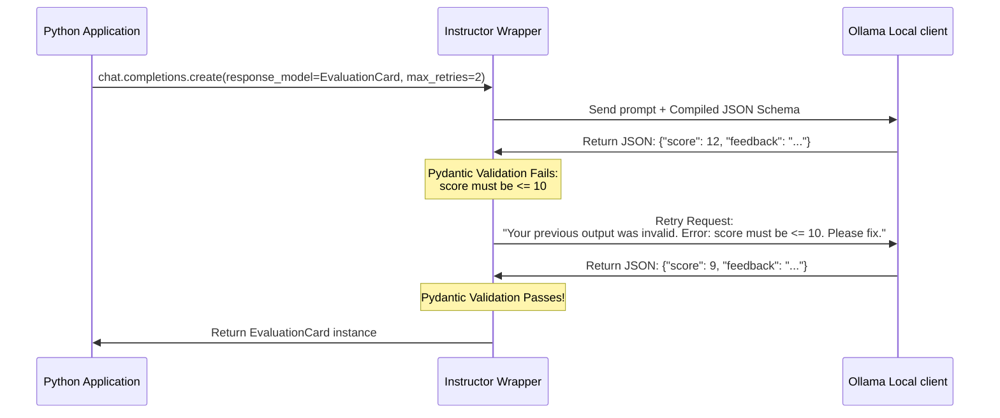

# Module 04: Pydantic Validation & Instructor Integration

Welcome back, class. Today we analyze **Pydantic Validation & Instructor Integration (CS-525)**.

In previous modules, we parsed raw JSON strings into Python dictionaries. While this is functional, dictionaries are fundamentally unsafe: they do not enforce value ranges (e.g. ensuring a score stays between 1 and 10), verify data types (e.g. rejecting string-based numbers like `"eight"`), or provide autocomplete support. In production, we need a declarative layer to translate unstructured transcripts into type-safe Python objects.

Today we study **Pydantic V2** schema design and **Instructor**, an open-source library that wraps API clients to enforce strict Pydantic structures and automate evaluation retry loops.

---

## 1. Academic Lecture: Declarative Schemas and Auto-Correction Loops

### 1. The Power of Declarative Schema Validation
Rather than writing manual post-processing logic to verify that our parsed dictionaries contain correct values, we define a schema class using Pydantic. Pydantic evaluates incoming data against these type constraints at runtime, raising a `ValidationError` if the data violates constraints.
```python
from pydantic import BaseModel, Field

class EvaluationCard(BaseModel):
    score: int = Field(..., ge=1, le=10, description="The score from 1 to 10")
    feedback: str = Field(..., description="Detailed technical feedback")
```

### 2. What is Instructor?
Instructor is a lightweight helper built on top of Pydantic. It intercepts chat completion client requests.
*   **System Prompt Injection**: Instructor automatically compiles your Pydantic schema into a JSON Schema representation and appends it to the system instructions.
*   **Response Deserialization**: Once Ollama returns the raw JSON string, Instructor automatically passes it into the Pydantic parser, returning a fully instantiated type-safe Python object.
*   **The Validation Retry Loop**: If the model returns data that fails validation (e.g. a score of `15`), Instructor intercepts the `ValidationError`. It automatically executes a retry request to Ollama, sending back the invalid output alongside the validator's error message, instructing the model to self-correct.



---

## 2. Theory vs. Production Trade-offs

When managing validation loops, consider these engineering choices:

| Validation Level | Pros | Cons | Recommendation |
| :--- | :--- | :--- | :--- |
| **Manual Dictionary Checking**| Zero external dependencies; lightweight execution. | High code complexity; verbose try-except logic. | Avoid for complex structures. |
| **Pydantic Parsing Only** | Robust type-safety. Decouples parsing from client execution. | Fails immediately on invalid responses; requires manual catch. | Use when client execution cannot be wrapped. |
| **Instructor Client Wrappers** | Automates retry loops; clean, developer-friendly interface. | Harder to debug intermediate token calls. | **Recommended for Production Pipelines**. |
| **Multi-Agent Cross-Checkers** | High evaluation quality. Evaluates logic with another LLM. | Doubled latency and running token costs. | Use only for high-stakes examinations. |

---

## 3. How to Use: Type-Safe Instructor Integration

Let us write a compile-grade Python 3.11+ application that configures an Instructor client wrapping an asynchronous HTTPX-driven Ollama request.

### A. The Brittle Manual Verification Pattern (Anti-Pattern)

Avoid executing raw client queries and writing manual parsing validators. If validation fails, this setup exits immediately without correcting the model:

```python
import json
import ollama
from pydantic import BaseModel, ValidationError

class SimpleReport(BaseModel):
    score: int
    feedback: str

# DANGER: If the model returns a float or invalid keys, the function
# raises a ValidationError and crashes. It does not attempt to let the model
# correct its output.
def get_report_brittle(prompt: str) -> SimpleReport:
    response = ollama.chat(
        model="qwen2.5:3b",
        messages=[{"role": "user", "content": prompt}],
        format="json"
    )
    # Throws exception immediately on failure
    data = json.loads(response["message"]["content"])
    return SimpleReport(**data)
```

### B. The Hardened Instructor-Wrapped Service (Production Pattern)

Here is the hardened pattern. We write a validation class that wraps Instructor, defining nested Pydantic models with field constraints and using self-correction loops.

```python
import httpx
import instructor
from typing import List
from pydantic import BaseModel, Field, field_validator

# 1. Define strict, self-validating data structures
class RubricResult(BaseModel):
    rubric_point: str = Field(..., description="The rubric statement evaluated")
    met: bool = Field(..., description="Whether the candidate met this rubric point")
    explanation: str = Field(..., description="Detailed technical reason for the decision")

class InterviewerCard(BaseModel):
    candidate_name: str = Field(..., description="Full name of the candidate")
    score: int = Field(..., ge=1, le=10, description="Integer score between 1 and 10")
    rubric_assessments: List[RubricResult] = Field(..., description="Individual rubric breakdowns")
    feedback: str = Field(..., min_length=20, description="Detailed evaluative feedback")

    # Custom validator to reject placeholder values
    @field_validator("candidate_name")
    @classmethod
    def verify_name(cls, value: str) -> str:
        if value.strip().lower() in ["unknown", "candidate", "user", "string"]:
            raise ValueError("Candidate name must represent a real parsed name, not a placeholder.")
        return value

# 2. Build the wrapped resilient evaluation engine
class SecureInstructorService:
    def __init__(self, host: str = "http://localhost:11434"):
        # Wrap an async HTTPX client to set explicit timeouts
        self.http_client = httpx.AsyncClient(
            base_url=host,
            timeout=httpx.Timeout(45.0, connect=5.0)
        )
        # Initialize instructor with the local Ollama provider
        self.instructor_client = instructor.from_openai(
            client=self.http_client,
            mode=instructor.Mode.JSON
        )

    async def evaluate_candidate_submission(
        self, 
        system_prompt: str, 
        user_input: str,
        max_attempts: int = 3
    ) -> InterviewerCard:
        """
        Submits candidate answers and evaluates them into an InterviewerCard object.
        If validation fails, Instructor automatically retries up to max_attempts.
        """
        # We target the standard local chat completions endpoint
        return await self.instructor_client.chat.completions.create(
            model="qwen2.5:3b",
            messages=[
                {"role": "system", "content": system_prompt},
                {"role": "user", "content": user_input}
            ],
            response_model=InterviewerCard, # Strict pydantic target
            max_retries=max_attempts,       # Automatic self-correction loop
            validation_context={"model": "qwen2.5:3b"}
        )

    async def close_connections(self):
        await self.http_client.aclose()
```

---

## 4. Common Errors & Pitfalls

### Pitfall 1: Confusing `ge/le` with Length Constraints
Attempting to validate string lengths using numerical value operators: e.g. `feedback: str = Field(..., ge=10)`.
*   **Why it fails**: Pydantic treats `ge` (Greater than or Equal) as a numerical value check. Running this validator on a string type throws an execution compiler error.
*   **Mitigation**: For strings, use `min_length` and `max_length`. Use `ge` and `le` only for integers, floats, or date parameters.

### Pitfall 2: Overloading Schema Complexity
Defining deep, heavily nested Pydantic graphs (e.g. four layers of sub-objects) for execution on small local models.
*   **Why it fails**: Lightweight models like `qwen2.5:3b` lack the reasoning capacity to coordinate complex, deeply nested JSON configurations, causing the self-correction loop to hit its retry limits.
*   **Mitigation**: Keep schemas flat and direct. Limit nesting to a single level of sub-objects (such as lists of simple key-value reports) when targeting models under 8 billion parameters.

---

## 5. Socratic Review Questions

### Question 1
How does the Instructor library construct the self-correction prompt during a validation retry step?

#### Answer
When Pydantic validation fails, Instructor captures the raised `ValidationError` exception object. It initiates a new chat message payload containing the previously generated JSON output, appends a new message representing the validation error trace (e.g. `"The score must be less than or equal to 10"`), and instructs the model to generate the JSON object again.

### Question 2
What are the performance costs associated with setting `max_retries = 5` inside an Instructor client request?

#### Answer
While high retry counts increase the likelihood of obtaining valid outputs, they pose a latency risk. Each retry execution requires a full inference pass. If the model is running on CPU, five retries can block client threads for up to a minute, ruining the interactive experience of the interview room.

---

## 6. Hands-on Challenge: Structured Rubric Formatter

### The Challenge
In this challenge, you will write a Pydantic schema and configure the Instructor query envelope.
Your task:
1. Complete the Pydantic schema model `TaskEvaluation`.
2. Restrict `score` to integers between `1` and `100` (inclusive).
3. Require `feedback` to have a minimum length of 15 characters.
4. Complete the `get_task_report` function to execute an Instructor client query using your model schema.

Complete the implementation below:

```python
from pydantic import BaseModel, Field
from typing import Any

# TODO: Define the Pydantic schema TaskEvaluation
# 1. Enforce score as an integer from 1 to 100 using Field operators ge and le.
# 2. Enforce feedback as a string with a minimum length of 15 using min_length.
class TaskEvaluation(BaseModel):
    # Complete the attributes here
    pass

async def get_task_report(instructor_client: Any, system_prompt: str, user_prompt: str) -> TaskEvaluation:
    # TODO: Complete the execution block:
    # Call instructor_client.chat.completions.create with:
    # - model="qwen2.5:3b"
    # - messages containing system and user roles
    # - response_model set to TaskEvaluation
    # - max_retries set to 3
    # Return the resulting TaskEvaluation object.
    
    # Placeholder return
    return TaskEvaluation()
```

Write the validation structure and routing logic. Save the completed file and verify that Pydantic enforces the schema properties in `modules/04-instructor-pydantic-validation.md`.
