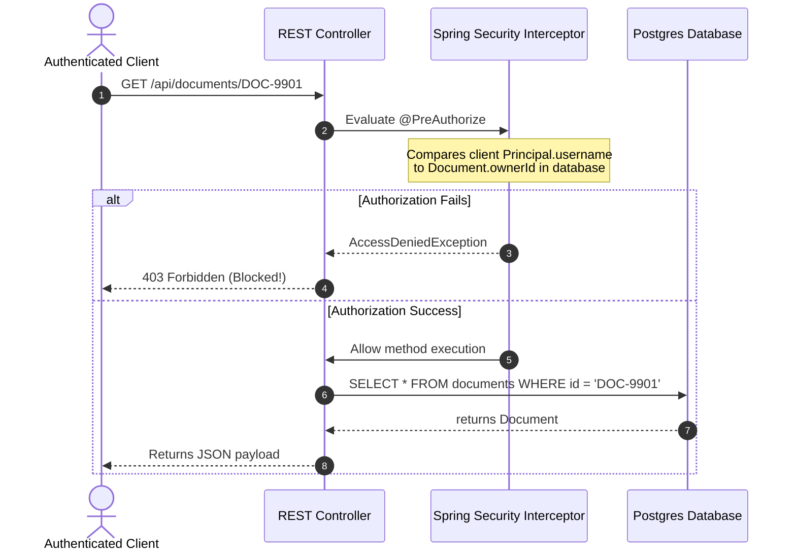

# Module 01: Broken Access Control — IDOR, Privilege Escalation, and Method-Level Authorization

Welcome, students. Today we analyze the most prevalent security vulnerability in modern web applications: **Broken Access Control (A01:2021)**.

Access control guarantees that users cannot act outside of their intended permissions. When access boundaries are broken, attackers can execute **Horizontal Privilege Escalation** (accessing records belonging to other users at the same privilege level) or **Vertical Privilege Escalation** (accessing administrative functions from a standard user account). We will study the mechanics of **Insecure Direct Object References (IDOR)**, contrast declarative permissions, and implement secure Method-Level Authorization in Spring Security.

---

## 1. Academic Lecture: The Mechanics of Access Failure

In web application architecture, **Authentication** verifies *who* you are (commonly verified via JWT or Session cookies). **Authorization** verifies *what* you are allowed to do. Access control failures occur when authorization checks are missing, bypassed, or poorly configured.

### Insecure Direct Object References (IDOR)

An IDOR vulnerability occurs when an application exposes a reference to an internal database descriptor (such as a database primary key) in a URL or query parameter, and fails to verify if the authenticated user has permissions to access that specific record.

```
Vulnerable IDOR Path:
[ Attacker (Authenticated as User 101) ] ---> GET /api/orders/5009 
                                                   |
                                            (Attacker changes URL ID to 5010)
                                                   v
[ Spring Backend Service ] --------------> SELECT * FROM orders WHERE id = 5010;
[ DB Engine ] ---------------------------> Returns Order 5010 (Belongs to User 102!)
```

Because the backend service queried the database using the raw ID without checking if the user ID matches the order's owner ID, the attacker successfully accessed another customer's private invoice data.

### Hardening Access Boundaries

To mitigate access control failures, we must decouple resource loading from resource authorization. 

We intercept requests prior to executing database queries:



---

## 2. Theory vs. Production Trade-offs

### Aspect-Level Checks vs. Repository-Level Filter Joins
*   **Aspect-Level Check (`@PreAuthorize`)**: Evaluates permissions inside Java code using aspect annotations. It keeps security logic clean and separate from database code, but can require two queries: one to load the entity to check ownership, and one to perform the business operation.
*   **Repository-Level Filter Join**: Modifies the SQL query directly: `SELECT * FROM orders WHERE id = :orderId AND owner_id = :authenticatedUserId`.
    *   *Trade-off*: Highly efficient (single SQL execution), but scatters security rules across database queries throughout the codebase, increasing the risk of developers forgetting to add the owner join constraint on new endpoints.

---

## 3. How to Use: Hardening Object References in Spring

Let's write a compile-grade Java 21 comparison illustrating:
1.  **Vulnerable Code**: A REST controller fetching records directly via ID parameters, enabling IDOR.
2.  **Secured Code**: Implementing method-level checks using Spring Security's `@PreAuthorize` and a custom ownership security component.

First, let's define our domain Record models:

```java
package com.capstone.security.access;

public record DocumentRecord(
    String id,
    String ownerUsername,
    String content
) {}
```

### The Vulnerable Implementation:

```java
package com.capstone.security.access;

import org.springframework.web.bind.annotation.GetMapping;
import org.springframework.web.bind.annotation.PathVariable;
import org.springframework.web.bind.annotation.RestController;

import java.util.Map;
import java.util.concurrent.ConcurrentHashMap;

@RestController
public class VulnerableDocumentController {

    private final Map<String, DocumentRecord> documentDb = new ConcurrentHashMap<>();

    public VulnerableDocumentController() {
        documentDb.put("DOC-1", new DocumentRecord("DOC-1", "alice", "Confidential Alice Project Details"));
        documentDb.put("DOC-2", new DocumentRecord("DOC-2", "bob", "Confidential Bob Salary Report"));
    }

    /**
     * VULNERABLE IDOR ENDPOINT.
     * Any authenticated user can modify the documentId path parameter to read
     * documents belonging to other users.
     */
    @GetMapping("/vulnerable/documents/{documentId}")
    public DocumentRecord getDocument(@PathVariable String documentId) {
        return documentDb.get(documentId);
    }
}
```

### The Secured Implementation:

To secure our API, we first create a custom Spring Security evaluation bean:

```java
package com.capstone.security.access;

import org.springframework.security.core.context.SecurityContextHolder;
import org.springframework.stereotype.Component;

import java.util.Map;
import java.util.Objects;
import java.util.concurrent.ConcurrentHashMap;

/**
 * Custom Authorization evaluator checking resource ownership.
 */
@Component("documentSecurity")
public class DocumentSecurityEvaluator {

    private final Map<String, DocumentRecord> documentDb = new ConcurrentHashMap<>();

    public DocumentSecurityEvaluator() {
        documentDb.put("DOC-1", new DocumentRecord("DOC-1", "alice", "Confidential Alice Project Details"));
        documentDb.put("DOC-2", new DocumentRecord("DOC-2", "bob", "Confidential Bob Salary Report"));
    }

    /**
     * Returns true if the authenticated user owns the requested document.
     */
    public boolean canAccess(String documentId) {
        Objects.requireNonNull(documentId, "Document ID cannot be null");
        
        // Retrieve the current authenticated user principal from Spring Security Context
        String currentPrincipalName = SecurityContextHolder.getContext().getAuthentication().getName();
        
        DocumentRecord document = documentDb.get(documentId);
        if (document == null) {
            return false; // Fail secure if object does not exist
        }

        // Enforce ownership contract
        return document.ownerUsername().equalsIgnoreCase(currentPrincipalName);
    }

    public DocumentRecord fetchDocument(String id) {
        return documentDb.get(id);
    }
}
```

Now let us write the secured REST Controller using method security:

```java
package com.capstone.security.access;

import org.springframework.security.access.prepost.PreAuthorize;
import org.springframework.web.bind.annotation.GetMapping;
import org.springframework.web.bind.annotation.PathVariable;
import org.springframework.web.bind.annotation.RestController;

@RestController
public class SecuredDocumentController {

    private final DocumentSecurityEvaluator securityEvaluator;

    public SecuredDocumentController(DocumentSecurityEvaluator securityEvaluator) {
        this.securityEvaluator = securityEvaluator;
    }

    /**
     * SECURED ENDPOINT.
     * Evaluates ownership using @PreAuthorize before executing the method body.
     */
    @GetMapping("/secured/documents/{documentId}")
    @PreAuthorize("@documentSecurity.canAccess(#documentId)")
    public DocumentRecord getDocumentSecurely(@PathVariable String documentId) {
        return securityEvaluator.fetchDocument(documentId);
    }
}
```

---

## 4. Common Errors & Pitfalls

### Pitfall 1: Sequential Database Identifiers (Auto-Increment)
Using sequential integer keys (`1`, `2`, `3`, ...) in URLs.
*   **Why it fails**: Attackers can easily script automated HTTP crawlers to iterate through all IDs (e.g., from 1000 to 9999) in minutes, scraping your database.
*   **Mitigation**: Use cryptographically secure random identifiers (**UUIDv4**) for all public-facing resource references. This prevents attackers from guessing adjacent database entries.

### Pitfall 2: Locking Down Controllers but Missing Service Methods
Applying access controls exclusively at the `@Controller` endpoint layer.
*   **Symptom**: Internal message consumers, asynchronous schedulers, or other internal APIs invoke the database layer without verifying authorization, leading to privilege leakage.
*   **Mitigation**: Enforce authorization checks at the `@Service` layer or repository layer to defend your application layers in depth.

---

## 5. Socratic Review Questions

### Question 1
Explain the difference between **Horizontal Privilege Escalation** and **Vertical Privilege Escalation**. Provide an example of each.

#### Answer
*   **Horizontal Privilege Escalation**: Occurs when a user accesses resources belonging to another user who possesses the *same* privilege level.
    *   *Example*: User A (account number `ACC-123`) modifies their profile update API payload to change the target account ID to `ACC-124` (belonging to User B). If the system permits the update, User A has performed horizontal escalation.
*   **Vertical Privilege Escalation**: Occurs when a low-privilege user accesses functionalities or data restricted to high-privilege users (such as administrators).
    *   *Example*: Standard User A accesses `/api/admin/deleteUser?id=101`. If the server executes the delete command without verifying if the caller possesses `ROLE_ADMIN` permissions, User A has executed vertical escalation.

### Question 2
How does Spring Security's `@PreAuthorize` annotation evaluate expressions like `@documentSecurity.canAccess(#documentId)`? Under what context does this execute?

#### Answer
Spring Security uses Aspect-Oriented Programming (AOP). During application boot, Spring creates a proxy object around the controller class. 

When a method annotated with `@PreAuthorize` is called:
1.  The call is intercepted by the security proxy.
2.  The proxy parses the expression using Spring Expression Language (SpEL).
3.  The SpEL engine resolves the bean name `documentSecurity` in the Spring Application Context, retrieves the evaluator instance, and invokes `canAccess()`, passing the parameter mapped to `#documentId`.
4.  If the method returns `true`, the proxy invokes the real controller method. If it returns `false`, the proxy aborts the execution and throws an `AccessDeniedException`.

---

## 6. Hands-on Challenge: Building a Custom Permission Evaluator

### The Challenge
In this challenge, you will implement the validation logic for a custom Spring Security validator. 

Given an authenticated user's profile containing their role and a resource object, you must verify if they are authorized to edit the resource.

An edit is permitted if:
1.  The user has the role `"ROLE_ADMIN"`.
2.  The user's username matches the resource owner's username AND the resource is not marked as `"LOCKED"`.

Complete the verification logic inside the class below:

```java
package com.capstone.security.access.challenge;

public class AccessControlEvaluator {

    public record UserProfile(String username, String role) {}
    public record SystemResource(String id, String ownerUsername, String status) {}

    /**
     * Determines if the user is permitted to edit the resource.
     * 
     * @param user the authenticated user profile
     * @param resource the target resource to update
     * @return true if access is granted, false if rejected.
     */
    public boolean isAccessGranted(UserProfile user, SystemResource resource) {
        if (user == null || resource == null) {
            return false;
        }

        // TODO: Complete this implementation.
        // 1. If user.role() equals "ROLE_ADMIN", return true.
        // 2. If user.username() matches resource.ownerUsername():
        //    - Check if resource.status() equals "LOCKED". If locked, return false.
        //    - If not locked, return true.
        return false;
    }
}
```

Write your code and verify the permission evaluation boundaries. Save your solution notes inside `modules/01-broken-access-control.md`.
