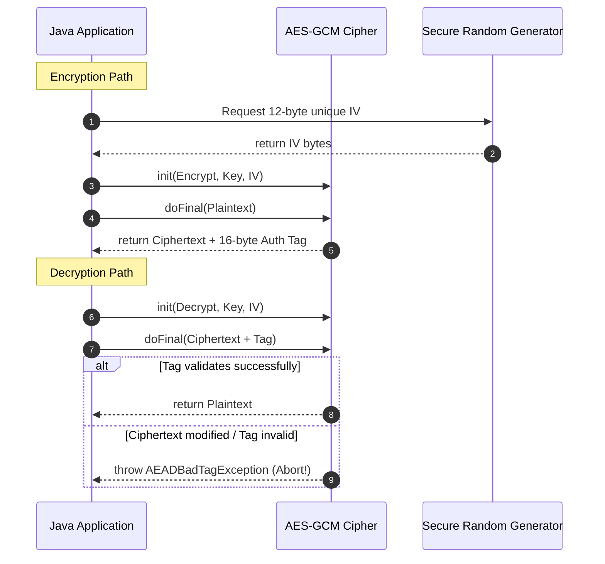

# Module 02: Cryptographic Failures — Hashing Algorithms and Authenticated Encryption

Welcome back, students. Today we analyze **Cryptographic Failures (A02:2021)**, previously known as Sensitive Data Exposure.

Cryptography is the cornerstone of data protection. However, implementing cryptography incorrectly is often more dangerous than not using it at all, as it creates a false sense of security. We will study the difference between hashing and encryption, analyze why weak algorithms (like MD5) fail, configure adaptive hashing functions (**Argon2id**), explore authenticated symmetric encryption (**AES-GCM**), and write secure encryption utilities in Java.

---

## 1. Academic Lecture: The Mathematics of Secure Storage

Data states are divided into: **Data-in-Transit** (secured using TLS/SSL protocols) and **Data-at-Rest** (secured using hashing and encryption).

### Hashing vs. Encryption

*   **Hashing**: A unidirectional mathematical transformation. It maps an arbitrary size input to a fixed-size signature. You cannot "decrypt" a hash. Used for password storage.
*   **Encryption**: A bidirectional mathematical transformation. It converts plaintext into ciphertext using a key, and can be reversed back to plaintext using the corresponding decryption key. Used for sensitive data (e.g., credit card numbers, billing addresses).

### Password Hashing: The Adaptive Salted Standard

A common mistake is storing passwords using raw MD5 or SHA-256:
```
Vulnerable Hashing:
Password: "password123" ---> SHA-256 ---> 5e8837cd... (Static Hash)
```
Because these algorithms are fast, an attacker who steals the database can execute billions of hashes per second to guess passwords, or use pre-computed index tables (**Rainbow Tables**) to retrieve original passwords instantly.

To protect passwords, we must enforce:
1.  **Unique Salts**: A random sequence of bytes generated per user and appended to the password before hashing. This prevents identical passwords from producing the exact same hash, neutralizing Rainbow Tables.
2.  **Adaptive Hashing (Argon2id)**: Unlike SHA-256, Argon2id is CPU and memory-hard. It forces the CPU to dedicate time and memory blocks during execution, making GPU or ASIC parallel brute-forcing mathematically infeasible.

### Symmetric Encryption: Why AES-GCM is Mandatory

When encrypting data, developers historically used AES in Cipher Block Chaining (CBC) mode. CBC mode is vulnerable to **bit-flipping attacks** because it does not validate data integrity. An attacker can intercept the network payload, flip bits in the ciphertext, and cause predictable changes in the decrypted plaintext.

To prevent this, production systems use **AES-GCM (Galois/Counter Mode)**. GCM is an **Authenticated Encryption with Associated Data (AEAD)** algorithm. It encrypts the data and generates a cryptographic **Authentication Tag**. During decryption, the cipher validates the tag; if a single bit of the ciphertext was modified, the decryption fails, preventing tampering.



---

## 2. Theory vs. Production Trade-offs

### Argon2id CPU Load vs. Authentication Speed
Argon2id is configured using parameters: Memory cost (KB), Iteration count, and Parallelism (threads).
*   *High Security*: Memory = 64MB, Iterations = 4. This makes password cracking extremely difficult.
*   *Production Hazard*: Executing this configuration on a virtual container takes 500ms of CPU time. If 50 users attempt to log in simultaneously, the server CPU hits 100%, causing a denial-of-service block.
*   *Production Standard*: Tune parameters to target an authentication duration of **200ms to 300ms** on target hardware, balancing security against CPU availability.

---

## 3. How to Use: Secure Cryptosystems in Spring Boot

Let's write a complete, compile-grade example demonstrating:
1.  Configuring Spring Security to use `Argon2PasswordEncoder`.
2.  A utility class executing AES-256-GCM encryption and decryption securely using Java's Cryptography Architecture (JCA).

### Password Encoder Configuration:

```java
package com.capstone.security.crypto;

import org.springframework.context.annotation.Bean;
import org.springframework.context.annotation.Configuration;
import org.springframework.security.crypto.argon2.Argon2PasswordEncoder;
import org.springframework.security.crypto.password.PasswordEncoder;

@Configuration
public class SecurityCryptoConfig {

    @Bean
    public PasswordEncoder passwordEncoder() {
        // Configure Argon2id with production-balanced parameters:
        // salt length = 16 bytes, hash length = 32 bytes, parallelism = 1, memory = 16MB (16384KB), iterations = 2
        return new Argon2PasswordEncoder(16, 32, 1, 16384, 2);
    }
}
```

### AES-256-GCM Encryption Utility:

```java
package com.capstone.security.crypto;

import javax.crypto.Cipher;
import javax.crypto.SecretKey;
import javax.crypto.spec.GCMParameterSpec;
import javax.crypto.spec.SecretKeySpec;
import java.security.SecureRandom;
import java.util.Objects;

/**
 * Thread-safe utility executing authenticated AES-GCM symmetric encryption.
 */
public final class AesGcmEncryptor {

    private static final String ALGORITHM = "AES/GCM/NoPadding";
    private static final int GCM_TAG_LENGTH_BITS = 128;
    private static final int IV_LENGTH_BYTES = 12; // Standard GCM IV length

    private AesGcmEncryptor() {}

    /**
     * Encrypts plaintext. Returns a combined byte array: [12-byte IV][Ciphertext + 16-byte Tag].
     */
    public static byte[] encrypt(byte[] plaintext, byte[] rawKey) throws Exception {
        Objects.requireNonNull(plaintext, "Plaintext cannot be null");
        Objects.requireNonNull(rawKey, "Secret key cannot be null");
        if (rawKey.length != 32) {
            throw new IllegalArgumentException("Key must be exactly 256 bits (32 bytes)");
        }

        // Step 1: Generate a unique Initialization Vector (IV) using SecureRandom
        byte[] iv = new byte[IV_LENGTH_BYTES];
        SecureRandom random = new SecureRandom();
        random.nextBytes(iv);

        // Step 2: Initialize Cipher
        SecretKey key = new SecretKeySpec(rawKey, "AES");
        Cipher cipher = Cipher.getInstance(ALGORITHM);
        GCMParameterSpec spec = new GCMParameterSpec(GCM_TAG_LENGTH_BITS, iv);
        cipher.init(Cipher.ENCRYPT_MODE, key, spec);

        // Step 3: Encrypt plaintext
        byte[] ciphertext = cipher.doFinal(plaintext);

        // Step 4: Package IV and Ciphertext together
        byte[] combined = new byte[iv.length + ciphertext.length];
        System.arraycopy(iv, 0, combined, 0, iv.length);
        System.arraycopy(ciphertext, 0, combined, iv.length, ciphertext.length);

        return combined;
    }

    /**
     * Decrypts combined payload. Extracts IV and verifies the Auth Tag automatically.
     */
    public static byte[] decrypt(byte[] combinedPayload, byte[] rawKey) throws Exception {
        Objects.requireNonNull(combinedPayload, "Payload cannot be null");
        Objects.requireNonNull(rawKey, "Secret key cannot be null");
        if (combinedPayload.length <= IV_LENGTH_BYTES) {
            throw new IllegalArgumentException("Invalid payload length");
        }

        // Step 1: Extract IV from the front of the payload
        byte[] iv = new byte[IV_LENGTH_BYTES];
        System.arraycopy(combinedPayload, 0, iv, 0, IV_LENGTH_BYTES);

        // Step 2: Extract Ciphertext + Tag
        int ciphertextLength = combinedPayload.length - IV_LENGTH_BYTES;
        byte[] ciphertext = new byte[ciphertextLength];
        System.arraycopy(combinedPayload, IV_LENGTH_BYTES, ciphertext, 0, ciphertextLength);

        // Step 3: Initialize Cipher for decryption
        SecretKey key = new SecretKeySpec(rawKey, "AES");
        Cipher cipher = Cipher.getInstance(ALGORITHM);
        GCMParameterSpec spec = new GCMParameterSpec(GCM_TAG_LENGTH_BITS, iv);
        cipher.init(Cipher.DECRYPT_MODE, key, spec);

        // Step 4: Decrypt and verify tag
        return cipher.doFinal(ciphertext);
    }
}
```

---

## 4. Common Errors & Pitfalls

### Pitfall 1: Reusing Initialization Vectors (IV Reuse)
Using a static, hardcoded IV array (e.g., `byte[] iv = new byte[12]`) across multiple encryption operations.
*   **Why it fails**: Reusing the same IV with the same key breaks the security of Galois Counter Mode, allowing an attacker to execute mathematical XOR attacks to recover the plaintext without knowing the key.
*   **Mitigation**: Always generate a dynamic, cryptographically secure IV using `SecureRandom` on every single encryption operation.

### Pitfall 2: Storing Keys in Code / Environment Variables
Hardcoding secret keys in class files (`private static final String KEY = "my-secret-key"`).
*   **Why it fails**: Any developer with access to the source repository can read the key, and decompiling class files exposes it.
*   **Mitigation**: Retrieve keys from external key management systems (such as AWS KMS, HashiCorp Vault, or Azure Key Vault) dynamically at runtime.

---

## 5. Socratic Review Questions

### Question 1
Why is a simple fast hashing function (like SHA-256) unsuitable for storing passwords, even if a unique salt is applied?

#### Answer
SHA-256 is designed to be mathematically fast and computationally lightweight (optimized for high-volume message validation). A modern graphics card (GPU) or custom ASIC rig can calculate billions of SHA-256 hashes per second.

If an attacker steals the database containing salted SHA-256 hashes, they can execute offline dictionary attacks at extreme speeds. The salt prevents the use of pre-computed Rainbow Tables, but it does not stop the attacker from brute-forcing the individual user's salt-password combinations. Adaptive hashing functions (like Argon2id or BCrypt) solve this by injecting memory-hard and time-hard computation constraints, limiting the attacker's speed to a fraction of a percent of SHA-256 capacities.

### Question 2
What is the purpose of the 128-bit Authentication Tag generated by AES-GCM mode? How does it protect against active network attackers?

#### Answer
The Authentication Tag (or MAC) acts as a cryptographic checksum confirming the integrity and authenticity of the encrypted payload. 

In non-authenticated modes (like AES-CBC), an attacker can intercept the ciphertext, modify specific bits (e.g., changing a character in a transaction data block), and forward it. The database will decrypt it without errors, processing corrupted instructions.

In AES-GCM mode, the tag is computed during encryption. During decryption, the cipher calculates the expected tag and compares it to the payload tag. If a single bit of the ciphertext, IV, or associated headers was altered, the check fails. The cipher throws a `AEADBadTagException` and discards the decrypted plaintext, neutralizing the attack.

---

## 6. Hands-on Challenge: Authenticated Encryption Wrapper

### The Challenge
In this challenge, you will implement the validation logic for a cryptographic data wrapper. 

You must write a utility method that verifies if an incoming encrypted payload is too short to contain a valid IV and tag, and handles decrypt errors safely to return empty results instead of crashing the system.

Complete the checking and decryption logic inside the class below:

```java
package com.capstone.security.crypto.challenge;

import com.capstone.security.crypto.AesGcmEncryptor;

public class SecureDecryptionWrapper {

    private static final int IV_LENGTH_BYTES = 12;
    private static final int MIN_TAG_LENGTH_BYTES = 16;

    /**
     * Decrypts the payload using the rawKey.
     * Safely catches any cryptography exceptions to return null.
     * 
     * @param combinedPayload combined byte array [IV][Ciphertext + Tag]
     * @param rawKey 256-bit AES key
     * @return decrypted plaintext string, or null if decryption fails/tampered.
     */
    public String decryptPayloadSafely(byte[] combinedPayload, byte[] rawKey) {
        // TODO: Complete this implementation.
        // 1. Verify combinedPayload is not null and has length > (IV_LENGTH_BYTES + MIN_TAG_LENGTH_BYTES).
        // 2. Invoke AesGcmEncryptor.decrypt(combinedPayload, rawKey).
        // 3. Catch Exception and return null on failure.
        // 4. Return new String(decryptedBytes) on success.
        return null;
    }
}
```

Write your code and verify the safety wrappers. Save your solution notes inside `modules/02-cryptographic-failures.md`.
