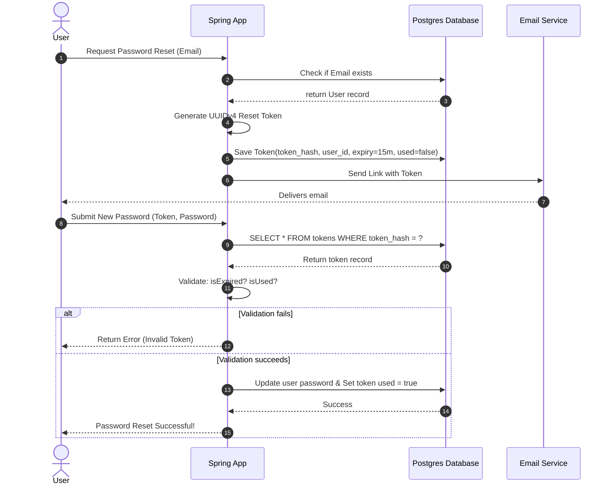

# Module 04: Insecure Design — Rate Limiting and Secure Workflows

Welcome back, students. Today we analyze **Insecure Design (A04:2021)**.

Unlike coding bugs that can be fixed with single-line patches, Insecure Design represents structural flaws in the system's architecture. Even if the code is written perfectly, a flawed design enables attackers to exploit business logic. We will study defensive system design, analyze **Rate Limiting** mechanisms (Token Bucket), design a secure **Password Reset Workflow**, and implement an IP-based rate limiter in Spring Boot using the **Bucket4j** library.

---

## 1. Academic Lecture: Designing for Defensibility

A secure design assumes that parts of the system *will* be attacked, and enforces containment and rate limits at the architectural level.

### The Threat of Unrestricted Resource Consumption (DoS)

If an API endpoint executes expensive operations (such as generating PDF invoices, sending emails, or searching databases) and does not restrict call volume, an attacker can launch automated scripts to query the endpoint thousands of times per second. 
*   **Result**: The server's CPU hits 100%, database connection pools exhaust, and the application crashes for all users, completing a Denial-of-Service (DoS) block.

### The Token Bucket Algorithm for Rate Limiting

To restrict call volumes, we use the **Token Bucket** algorithm:
*   A virtual bucket is created for each client (e.g., mapped by IP or API token).
*   The bucket has a maximum capacity of $C$ tokens.
*   The bucket is refilled at a constant rate of $R$ tokens per second.
*   Each API request consumes 1 token. If the bucket has tokens, the request is allowed. If the bucket is empty, the request is rejected with an HTTP `429 Too Many Requests` status.

```
                    Token Bucket Architecture
                    
                    +-----------------------+
                    | Token Refiller        | ---> Refills R tokens/sec
                    +-----------+-----------+
                                |
                                v
                    +-----------------------+
                    | Bucket Capacity (C)   |
                    | [o] [o] [o] [o] [o]   | (Accumulates tokens)
                    +-----------+-----------+
                                |
                                v (Consumes 1 token per request)
                    [ Client API Request ] ---> [ Success (Forward) ]
                    
    * If bucket is empty ---> Reject with HTTP 429 Too Many Requests.
```

### Case Study: Vulnerable vs. Secure Password Recovery

A classic example of insecure design is the password recovery flow:
*   **Vulnerable Design**: The client enters their username. The system displays a "Security Question" (e.g., "What was the name of your first pet?"). If the client answers correctly, they enter a new password.
    *   *Flaw*: Security questions are easily guessable or scraped via social engineering, enabling account takeover.
*   **Secure Design**: 
    1.  The client requests a password reset.
    2.  The server generates a cryptographically secure, random **Reset Token** (UUIDv4) and saves it to the database with a short-lived expiry timestamp (e.g., 15 minutes) and a `used` status flag set to `false`.
    3.  The server sends an email containing a link: `/reset-password?token=UUID`.
    4.  The user clicks the link and submits a new password. The server verifies the token exists, is not expired, and has not been used. Once validated, it updates the password and marks the token as used.



---

## 2. Theory vs. Production Trade-offs

### Gateway Rate Limiting vs. Application-Level Rate Limiting
*   **Gateway (e.g., Cloudflare, Nginx)**: Blocks traffic at the network edge before it hits your servers, protecting bandwidth.
*   **Application-Level (Bucket4j)**:
    *   *Trade-off*: Consumes JVM memory to store bucket states, but allows complex business logic limits (e.g., permitting higher limits for paid tier API keys and strict limits for guest users).

---

## 3. How to Use: API Rate Limiting in Spring Boot

Let's write a complete, compile-grade Java 21 class implementing an IP-based rate limiting Filter using **Bucket4j** to protect an API endpoint.

First, let's write our Spring Boot Filter:

```java
package com.capstone.security.design;

import io.github.bucket4j.Bandwidth;
import io.github.bucket4j.Bucket;
import io.github.bucket4j.Refill;
import jakarta.servlet.*;
import jakarta.servlet.annotation.WebFilter;
import jakarta.servlet.http.HttpServletRequest;
import jakarta.servlet.http.HttpServletResponse;
import org.springframework.stereotype.Component;

import java.io.IOException;
import java.time.Duration;
import java.util.Map;
import java.util.concurrent.ConcurrentHashMap;
import java.util.logging.Logger;

/**
 * Spring Boot Filter executing IP-based rate limiting using Bucket4j.
 */
@Component
@WebFilter(urlPatterns = "/api/*")
public class RateLimitingFilter implements Filter {
    private static final Logger LOGGER = Logger.getLogger(RateLimitingFilter.class.getName());

    // Map storing active Token Buckets per client IP
    private final Map<String, Bucket> ipBuckets = new ConcurrentHashMap<>();

    @Override
    public void init(FilterConfig filterConfig) throws ServletException {
        LOGGER.info("RateLimitingFilter initialized targeting /api/* endpoints.");
    }

    @Override
    public void doFilter(ServletRequest request, ServletResponse response, FilterChain chain) 
            throws IOException, ServletException {
        
        HttpServletRequest httpRequest = (HttpServletRequest) request;
        HttpServletResponse httpResponse = (HttpServletResponse) response;

        // Retrieve Client IP address
        String clientIp = httpRequest.getRemoteAddr();

        // Retrieve or build the bucket for this IP
        Bucket bucket = ipBuckets.computeIfAbsent(clientIp, this::createNewBucket);

        // Attempt to consume 1 token from the bucket
        if (bucket.tryConsume(1)) {
            // Token consumed. Forward the request to the next filter/controller
            chain.doFilter(request, response);
        } else {
            // Bucket is empty. Block request and return HTTP 429
            LOGGER.warning("Rate limit exceeded for IP: " + clientIp);
            httpResponse.setStatus(429); // Too Many Requests
            httpResponse.setContentType("application/json");
            httpResponse.getWriter().write("{\"error\": \"Rate limit exceeded. Try again later.\"}");
        }
    }

    /**
     * Builds a new Token Bucket for a client.
     * Capacity = 5 tokens. Refills 1 token every 2 seconds.
     */
    private Bucket createNewBucket(String ip) {
        Refill refill = Refill.intervally(1, Duration.ofSeconds(2));
        Bandwidth limit = Bandwidth.classic(5, refill);
        return Bucket.builder()
                .addLimit(limit)
                .build();
    }

    @Override
    public void destroy() {
        ipBuckets.clear();
    }
}
```

---

## 4. Common Errors & Pitfalls

### Pitfall 1: Plaintext Password Recovery Tokens
Storing generated password reset tokens in database tables as raw, unhashed strings.
*   **Why it fails**: If the database is compromised, an attacker reads all active reset tokens, allowing them to hijack accounts before users click their email links.
*   **Mitigation**: Treat reset tokens like passwords. Hash the token using a fast hash (like SHA-256) before storing it in the database. When the user submits the token, hash the input and compare it to the database record.

### Pitfall 2: Memory exhaustion from IP mapping maps
Using standard `HashMap` structures to track IP buckets without cleanup.
*   **Symptom**: Out-of-memory errors over weeks.
*   **Why**: Idle IPs remain in the map forever.
*   **Mitigation**: Use eviction maps or cache frameworks (like Caffeine cache with time-to-idle settings) to automatically remove buckets that have not been updated for an hour.

---

## 5. Socratic Review Questions

### Question 1
Explain why a password reset token must be invalidated immediately after its **first use** or after a short **expiry window** (e.g., 15 minutes).

#### Answer
*   **First Use Invalidation**: If a token is not invalidated after use, it remains active in the database. An attacker who gains access to the user's email history can click the old link to reset the password again.
*   **Short Expiry Window**: A short window limits the **exposure time**. If an email is sent over unencrypted channels or intercepted, a short expiry (like 15 minutes) ensures that by the time the attacker attempts to exploit the token, it has expired, reducing the attack window.

### Question 2
What is the difference between a **Token Bucket** and a **Leaky Bucket** rate limiting algorithm?

#### Answer
*   **Token Bucket**: Accumulates tokens up to a maximum capacity. If the bucket is full, the client can burst traffic (e.g., sending 5 requests in a single millisecond to consume all tokens). Refills occur at a constant interval.
    *   *Usage*: Preferred for standard APIs where occasional traffic bursts are normal.
*   **Leaky Bucket**: Requests enter the bucket and leak out at a constant, uniform rate (like water dripping from a leaky bucket). If the incoming request rate exceeds the drip rate, the bucket overflows, and requests are rejected.
    *   *Usage*: Preferred when you want to enforce a strict, flat output rate to protect downstream systems from any bursts.

---

## 6. Hands-on Challenge: Token Bucket Rate Limiter

### The Challenge
In this challenge, you will implement a basic Token Bucket rate limiting helper class. 

You must write a class that tracks token counts and timestamps. Given an incoming request, the method must:
1.  Calculate how many tokens have been refilled since the last request timestamp based on the refill rate.
2.  Add the refilled tokens to the bucket without exceeding the maximum capacity.
3.  Attempt to consume 1 token. Return true if consumed, false if blocked.

Complete the token consumption logic below:

```java
package com.capstone.security.design.challenge;

public class BasicTokenBucket {

    private final long capacity;
    private final double tokensPerSecond;
    
    private double currentTokens;
    private long lastRefillTimestamp;

    public BasicTokenBucket(long capacity, double tokensPerSecond) {
        this.capacity = capacity;
        this.tokensPerSecond = tokensPerSecond;
        this.currentTokens = capacity;
        this.lastRefillTimestamp = System.currentTimeMillis();
    }

    /**
     * Attempts to consume 1 token. Updates tokens based on elapsed time first.
     * 
     * @return true if token was successfully consumed, false if rate limited.
     */
    public synchronized boolean tryConsume() {
        long now = System.currentTimeMillis();
        double elapsedSeconds = (now - lastRefillTimestamp) / 1000.0;
        
        // TODO: Complete this implementation.
        // 1. Calculate refilled tokens: elapsedSeconds * tokensPerSecond.
        // 2. Update currentTokens = min(capacity, currentTokens + refilled).
        // 3. Update lastRefillTimestamp = now.
        // 4. Check if currentTokens >= 1.0. 
        //    - If yes: currentTokens -= 1.0, return true.
        //    - If no: return false.
        return false;
    }

    public synchronized double getCurrentTokens() {
        return currentTokens;
    }
}
```

Write your code and verify the rate-limiting bounds. Save your solution notes inside `modules/04-insecure-design.md`.
