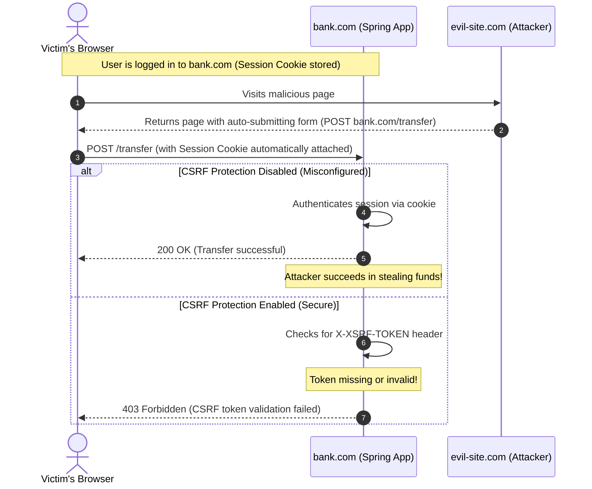

# Module 05: Security Misconfiguration — CORS, CSRF, and Actuator Hardening

Welcome back, class. Today, we turn our attention to **Security Misconfiguration (A05:2021)**. 

In my two decades of auditing enterprise systems, I have found that more than half of all successful breaches do not exploit complex cryptographic vulnerabilities or sophisticated zero-day code bugs. Instead, they exploit simple, human-made config errors: a developer who disabled CSRF to make a REST endpoint "just work," a CORS policy configured with a wildcard origin combined with credentials, a Spring Boot Actuator endpoint left exposed to the public internet, or verbose stack traces returning system-level internals to unauthorized clients.

Today, we will analyze the mechanics of **Cross-Origin Resource Sharing (CORS)**, **Cross-Site Request Forgery (CSRF)**, and **Spring Boot Actuator** path security. We will write compile-grade configurations to lock down our servers against these misconfigurations.

---

## 1. Academic Lecture: The Mechanics of Misconfiguration

Security misconfigurations occur when security settings are defined, implemented, or maintained with defaults that prioritize developer convenience over security. Let us examine the three most critical misconfigurations in Spring Boot applications.

### 1. Cross-Site Request Forgery (CSRF)
CSRF is an attack that forces an end-user to execute unwanted actions on a web application in which they are currently authenticated. 
*   **The Vulnerability**: Web browsers automatically append cookies (including session cookies) to outgoing HTTP requests targeting a domain, regardless of the site initiating the request.
*   **The Attack Scenario**:
    1.  A user logs into `bank.com` and receives a session cookie.
    2.  Without logging out, the user visits `evil-site.com`.
    3.  `evil-site.com` contains an invisible form that submits a POST request to `bank.com/api/transfer?to=attacker&amount=10000`.
    4.  The browser sends the request to `bank.com` and attaches the user's session cookie.
    5.  `bank.com` verifies the session cookie, sees a valid session, and transfers the funds.
*   **The Mitigation**: The **Synchronizer Token Pattern**. The server generates a random, cryptographically secure token associated with the user's current session. When performing state-changing requests (POST, PUT, DELETE), the client must submit this token in a custom header (e.g., `X-XSRF-TOKEN`). Because `evil-site.com` cannot read the token due to the browser's Same-Origin Policy, its forged requests will be rejected by the server.



### 2. Cross-Origin Resource Sharing (CORS) Misconfiguration
CORS is a browser mechanism that allows a web page from one origin to access resources from another origin.
*   **The Vulnerability**: CORS is not a security control to prevent attacks on your server; it is a mechanism to relax the browser's Same-Origin Policy. Configuring `Access-Control-Allow-Origin: *` while setting `Access-Control-Allow-Credentials: true` is a critical misconfiguration.
*   **Why it fails**: When credentials are allowed, a wildcard origin tells the browser that any site on the web can read the responses of your API after sending the user's session cookies. 

### 3. Exposed Spring Boot Actuator Endpoints
Spring Boot Actuator provides production-ready features (health, metrics, heap dumps, env variables) to monitor applications.
*   **The Vulnerability**: Exposing endpoints like `/actuator/env` or `/actuator/heapdump` without authentication.
*   **Why it fails**: An attacker can access `/actuator/env` to extract database credentials, API keys, and internal IP addresses. A heap dump (`/actuator/heapdump`) contains sensitive in-memory string values, including user passwords, decrypted session keys, and database records.

---

## 2. Theory vs. Production Trade-offs

### Stateful CSRF vs. Stateless JWT Architectures
*   **Stateful (Cookie/Session)**: Requires active CSRF protection. Spring Security uses `CookieCsrfTokenRepository` or `HttpSessionCsrfTokenRepository` to validate tokens.
*   **Stateless REST APIs (JWTs in Headers)**:
    *   *Trade-off*: If your REST API uses JWTs sent in the `Authorization: Bearer <token>` header (rather than in cookies), the API is inherently immune to CSRF. Browsers do not automatically attach the `Authorization` header to cross-origin requests.
    *   *Production Rule*: You can disable CSRF protection *only* if your API is strictly stateless and does not resolve credentials from cookies. If you store your JWT in a cookie (e.g., for security reasons like `HttpOnly` and `SameSite` flags), you **must** keep CSRF protection enabled.

---

## 3. How to Use: Secure Configuration Architecture

Let's look at the contrast between a vulnerable configuration and a hardened production configuration in Spring Boot 3.x.

### A. The Vulnerable Configuration (Anti-Pattern)

Avoid this config. It disables CSRF, allows wildcard CORS with credentials, and leaves Actuator open:

```java
package com.capstone.security.config;

import org.springframework.context.annotation.Bean;
import org.springframework.context.annotation.Configuration;
import org.springframework.security.config.annotation.web.builders.HttpSecurity;
import org.springframework.security.config.annotation.web.configuration.EnableWebSecurity;
import org.springframework.security.web.SecurityFilterChain;
import org.springframework.web.cors.CorsConfiguration;
import org.springframework.web.cors.CorsConfigurationSource;
import org.springframework.web.cors.UrlBasedCorsConfigurationSource;

import java.util.List;

@Configuration
@EnableWebSecurity
public class VulnerableSecurityConfig {

    @Bean
    public SecurityFilterChain securityFilterChain(HttpSecurity http) throws Exception {
        http
            // DANGER: Disabling CSRF blindly opens the application to session-hijacking form attacks
            .csrf(csrf -> csrf.disable())
            .authorizeHttpRequests(auth -> auth
                // DANGER: Exposing all paths, including Actuator and console access
                .requestMatchers("/actuator/**").permitAll()
                .anyRequest().permitAll()
            )
            .cors(cors -> cors.configurationSource(vulnerableCorsSource()));
        
        return http.build();
    }

    private CorsConfigurationSource vulnerableCorsSource() {
        CorsConfiguration config = new CorsConfiguration();
        // DANGER: Allowing wildcard origin along with credentials
        config.setAllowedOrigins(List.of("*"));
        config.setAllowedMethods(List.of("GET", "POST", "PUT", "DELETE", "OPTIONS"));
        config.setAllowedHeaders(List.of("*"));
        config.setAllowCredentials(true);

        UrlBasedCorsConfigurationSource source = new UrlBasedCorsConfigurationSource();
        source.registerCorsConfiguration("/**", config);
        return source;
    }
}
```

### B. The Hardened Configuration (Production-Ready)

Here is the hardened config. It restricts CORS to trusted origins, configures secure CSRF handling using double-submit cookies, and restricts Actuator endpoints to administrators on a dedicated port.

```java
package com.capstone.security.config;

import org.springframework.context.annotation.Bean;
import org.springframework.context.annotation.Configuration;
import org.springframework.security.config.annotation.web.builders.HttpSecurity;
import org.springframework.security.config.annotation.web.configuration.EnableWebSecurity;
import org.springframework.security.web.SecurityFilterChain;
import org.springframework.security.web.csrf.CookieCsrfTokenRepository;
import org.springframework.security.web.csrf.CsrfTokenRequestAttributeHandler;
import org.springframework.web.cors.CorsConfiguration;
import org.springframework.web.cors.CorsConfigurationSource;
import org.springframework.web.cors.UrlBasedCorsConfigurationSource;

import java.util.List;

@Configuration
@EnableWebSecurity
public class HardenedSecurityConfig {

    @Bean
    public SecurityFilterChain securityFilterChain(HttpSecurity http) throws Exception {
        // Configure Custom CSRF Token Request Handler for SPA compatibility (Angular, React, Vue)
        CsrfTokenRequestAttributeHandler requestHandler = new CsrfTokenRequestAttributeHandler();
        // Force the CSRF token to be resolved as an attribute of the request
        requestHandler.setCsrfRequestAttributeName("_csrf");

        http
            .cors(cors -> cors.configurationSource(securedCorsSource()))
            // Enable CSRF with a secure cookie repository (HttpOnly = false is required for SPA clients to read it, but SameSite=Strict secures it)
            .csrf(csrf -> csrf
                .csrfTokenRepository(CookieCsrfTokenRepository.withHttpOnlyFalse())
                .csrfTokenRequestHandler(requestHandler)
            )
            .authorizeHttpRequests(auth -> auth
                // Restrict actuator endpoints to ADMIN roles
                .requestMatchers("/actuator/health", "/actuator/info").permitAll()
                .requestMatchers("/actuator/**").hasRole("ADMIN")
                .anyRequest().authenticated()
            );

        return http.build();
    }

    @Bean
    public CorsConfigurationSource securedCorsSource() {
        CorsConfiguration config = new CorsConfiguration();
        
        // SECURE: Allow only specific, verified domains
        config.setAllowedOrigins(List.of("https://trusted-frontend.com", "https://admin.trusted-frontend.com"));
        config.setAllowedMethods(List.of("GET", "POST", "PUT", "DELETE", "OPTIONS"));
        config.setAllowedHeaders(List.of("Authorization", "Cache-Control", "Content-Type", "X-XSRF-TOKEN"));
        config.setExposedHeaders(List.of("X-XSRF-TOKEN"));
        
        // SECURE: Allow sending credentials (cookies, auth headers) under strict origins
        config.setAllowCredentials(true);
        config.setMaxAge(3600L); // Cache preflight response for 1 hour

        UrlBasedCorsConfigurationSource source = new UrlBasedCorsConfigurationSource();
        source.registerCorsConfiguration("/**", config);
        return source;
    }
}
```

### C. Securing Spring Actuators via application.properties

In production, never expose raw actuators. Add these rules to your `application.properties`:

```properties
# 1. Restrict exposed endpoints to health and info only
management.endpoints.web.exposure.include=health,info

# 2. Require authorization to view detailed health checks
management.endpoint.health.show-details=when_authorized
management.endpoint.health.roles=ROLE_ADMIN

# 3. Disable all server header banners (Tomcat, Spring)
server.server-header=SecuredServer
spring.main.banner-mode=off

# 4. Bind Actuator to a separate port (e.g. 8081 for internal admin traffic only)
management.server.port=8081
management.server.address=127.0.0.1
```

---

## 4. Common Errors & Pitfalls

### Pitfall 1: Verbose Rest API Exception Stack Traces
A controller returning raw `Exception.toString()` or the stack trace to the frontend client during failures.
*   **Why it fails**: Stack traces contain database class names, SQL grammar paths, system directories, library versions, and connection details. Attackers use this to identify targets for CVE exploits.
*   **Mitigation**: Implement a `@RestControllerAdvice` to intercept exceptions and return a clean, obfuscated JSON record.

#### Vulnerable Controller Advice:
```java
@RestControllerAdvice
public class VulnerableExceptionHandler {
    @ExceptionHandler(Exception.class)
    public ResponseEntity<String> handleException(Exception e) {
        // DANGER: Leaks entire exception stack trace to public API consumers
        java.io.StringWriter sw = new java.io.StringWriter();
        e.printStackTrace(new java.io.PrintWriter(sw));
        return ResponseEntity.status(500).body(sw.toString());
    }
}
```

#### Hardened Controller Advice:
```java
package com.capstone.security.config;

import org.springframework.http.ResponseEntity;
import org.springframework.web.bind.annotation.ExceptionHandler;
import org.springframework.web.bind.annotation.RestControllerAdvice;

import java.util.Map;
import java.util.UUID;
import java.util.logging.Level;
import java.util.logging.Logger;

@RestControllerAdvice
public class HardenedExceptionHandler {
    private static final Logger LOGGER = Logger.getLogger(HardenedExceptionHandler.class.getName());

    @ExceptionHandler(Exception.class)
    public ResponseEntity<Map<String, String>> handleException(Exception e) {
        String trackingId = UUID.randomUUID().toString();
        // Log the actual error stack trace internally with high severity
        LOGGER.log(Level.SEVERE, "Internal Error ID: " + trackingId, e);

        // SECURE: Return a generic message and a tracking ID to the user
        return ResponseEntity.status(500).body(Map.of(
            "message", "An unexpected system error occurred. Please contact support.",
            "trackingCode", trackingId
        ));
    }
}
```

---

## 5. Socratic Review Questions

### Question 1
Why is it highly dangerous to use CORS wildcard origins `*` in combination with `.setAllowCredentials(true)`? Explain the browser's response when this is attempted.

#### Answer
If you configure CORS to allow credentials (`Access-Control-Allow-Credentials: true`) and specify a wildcard origin (`*`), modern browsers will block the response execution automatically. The browser enforces this because allowing any external site to read authenticated responses containing cookies is an extreme security risk. 
To bypass this restriction, attackers configure servers to echo back the request's dynamic `Origin` header in the `Access-Control-Allow-Origin` response header. If your Spring configuration dynamically reflects origins without a strict whitelist validation, you have effectively recreated the wildcard vulnerability.

### Question 2
Explain why routing Spring Boot Actuator endpoints to a separate port (e.g. `management.server.port=8081`) and binding to localhost (`127.0.0.1`) acts as a critical line of defense in microservice deployments.

#### Answer
In Kubernetes or public-cloud infrastructures, API Gateways or Ingress controllers route public traffic to the application's primary port (typically `8080`). By assigning Actuators to a different port (e.g., `8081`), those management endpoints are physically isolated from public routing rules. If the port is bound exclusively to `127.0.0.1`, it can only be accessed internally within the pod or via local port-forwarding, preventing public web crawlers from scanning `/actuator/heapdump` or `/actuator/env`.

---

## 6. Hands-on Challenge: Hardening the Configuration Sandbox

### The Challenge
In this challenge, you will repair a misconfigured Spring Security filter chain. The current configuration disables CSRF and allows dangerous CORS cross-origin actions.

Your task:
1.  Enable CSRF protection using a double-submit cookie repository (`CookieCsrfTokenRepository`) with `HttpOnly` set to false (allowing SPAs to retrieve it), and custom token handlers.
2.  Restrict CORS mappings: Only allow `https://app.securecorp.local` as a valid origin, permit headers `X-XSRF-TOKEN` and `Authorization`, and set credentials allowed to `true`.
3.  Configure actuator routing: Ensure `/actuator/health` and `/actuator/info` are public, but all other `/actuator/**` endpoints require the `ROLE_ADMIN` authority.

Complete the implementation below:

```java
package com.capstone.security.config.challenge;

import org.springframework.context.annotation.Bean;
import org.springframework.context.annotation.Configuration;
import org.springframework.security.config.annotation.web.builders.HttpSecurity;
import org.springframework.security.config.annotation.web.configuration.EnableWebSecurity;
import org.springframework.security.web.SecurityFilterChain;
import org.springframework.web.cors.CorsConfigurationSource;

@Configuration
@EnableWebSecurity
public class SecurityHardeningChallenge {

    @Bean
    public SecurityFilterChain challengeFilterChain(HttpSecurity http, CorsConfigurationSource corsSource) throws Exception {
        // TODO: Complete this filter chain implementation.
        // 1. Configure HttpSecurity to use the provided corsSource.
        // 2. Configure CSRF with CookieCsrfTokenRepository.withHttpOnlyFalse().
        // 3. Set authorization rules for Actuator paths:
        //    - "/actuator/health" and "/actuator/info" -> permitAll()
        //    - "/actuator/**" -> hasRole("ADMIN")
        //    - All other requests -> authenticated()
        return http.build();
    }
}
```

Write down your solution config class. Save this class and explain the security implications of missing CSRF configurations inside `modules/05-security-misconfiguration.md`.
