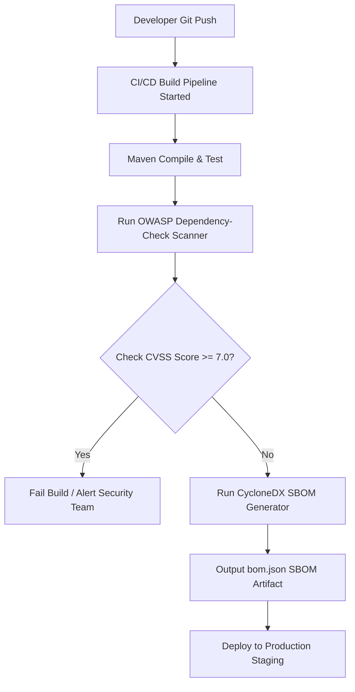

# Module 06: Vulnerable and Outdated Components — Supply Chain Security & SBOMs

Welcome, class. Today we discuss **Vulnerable and Outdated Components (A06:2021)**.

When you build a modern Spring Boot application, you write only a fraction of the code that runs in production. When you compile your source code, Maven fetches hundreds of transitive dependencies—web servers, database drivers, JSON serializers, logging utilities, and encryption helpers. 

If a single library in your dependency graph contains a known vulnerability (a Common Vulnerability and Exposure, or CVE), your entire system becomes vulnerable to attacks. We will study **Software Supply Chain Security**, learn how to audit our systems using the **OWASP Dependency-Check** scanner, generate a **Software Bill of Materials (SBOM)**, and override vulnerable transitive dependencies.

---

## 1. Academic Lecture: The Anatomy of a Supply Chain Attack

Modern software architectures are built on open-source ecosystems. While this speeds up development, it creates a massive attack surface.

### The Transitive Dependency Trap
If your project declares a dependency on Library A, and Library A depends on Library B, your project transitively includes Library B. If Library B contains a critical remote code execution (RCE) vulnerability, your application is exposed, even if you have never heard of Library B.

```
Direct Dependency vs. Transitive Vulnerability Path

Your Application
   |
   +---> Spring Boot Starter Web (Direct)
            |
            +---> Jackson Databind (Transitive)
                     |
                     +---> Vulnerable Sub-library (CVE-xxxx-xxxx) -> [ Exploitation Point ]
```

### Software Bill of Materials (SBOM)
An SBOM is a structured record of all components, libraries, and modules used to build a software product. It acts as an ingredient list for your application.
*   **Formats**: The two dominant standards are **CycloneDX** (lightweight, JSON/XML, highly automation-friendly) and **SPDX** (Linux Foundation standard, robust and expressive).
*   **Purpose**: If a new zero-day vulnerability is announced in a library, security teams query their organization's SBOM repository to instantly locate every microservice containing that library, bypassing the need to run manual code audits or recompile builds.

### Pipeline Scanning & Enforcement
Automated dependency scanning must be integrated directly into the CI/CD pipeline:
1.  **Code Commit**: The developer commits code.
2.  **Security Scan**: The pipeline runs `dependency-check-maven`.
3.  **Threshold Enforcement**: If a dependency contains a CVE with a CVSS score greater than or equal to a defined limit (e.g., `7.0` High/Critical), the build is failed automatically.
4.  **SBOM Generation**: The pipeline runs the CycloneDX plugin to output a production inventory file (`bom.json`).



---

## 2. Theory vs. Production Trade-offs

### High Build Break Limits vs. Build Stability
*   **Strict Blocking (e.g. Fail on any CVE)**:
    *   *Pro*: Total safety; no known vulnerabilities make it to production.
    *   *Con*: High false-positive rates and dependency blocks. Minor vulnerabilities in development tools (like Javadoc plugins) will block deployment pipelines, slowing business delivery.
*   **Production Rule**: Configure scanners to ignore non-runtime scopes (like `<scope>test</scope>`) and enforce build failure flags (`failBuildOnCVSS`) only on **High or Critical** vulnerabilities (CVSS $\ge 7.0$). Use a suppression file (`suppression.xml`) to document and bypass false positives or mitigated risks.

---

## 3. How to Use: Hardening the Maven Build Lifecycle

Let us write a secure, compile-grade Maven `pom.xml` build configuration demonstrating how to audit code dependencies, override vulnerable transitive packages, and export an SBOM.

### A. Overriding Vulnerable Transitive Dependencies
Imagine your application imports a library `cool-utility-sdk:1.0.0` which internally pulls an outdated, vulnerable version of `jackson-databind:2.13.0`. You cannot modify `cool-utility-sdk`, but you can force Maven to resolve a newer, patched version of `jackson-databind` using the `<dependencyManagement>` block.

```xml
<project xmlns="http://maven.apache.org/POM/4.0.0"
         xmlns:xsi="http://www.w3.org/2001/XMLSchema-instance"
         xsi:schemaLocation="http://maven.apache.org/POM/4.0.0 http://maven.apache.org/xsd/maven-4.0.0.xsd">
    <modelVersion>4.0.0</modelVersion>
    <groupId>com.capstone.security</groupId>
    <artifactId>supply-chain-demo</artifactId>
    <version>1.0.0-SNAPSHOT</version>

    <properties>
        <maven.compiler.source>21</maven.compiler.source>
        <maven.compiler.target>21</maven.compiler.target>
        <jackson.version>2.17.1</jackson.version> <!-- Hardened, patched version -->
    </properties>

    <!-- SECURE: Override transitives within dependencyManagement -->
    <dependencyManagement>
        <dependencies>
            <dependency>
                <groupId>com.fasterxml.jackson.core</groupId>
                <artifactId>jackson-databind</artifactId>
                <version>${jackson.version}</version>
            </dependency>
            <dependency>
                <groupId>com.fasterxml.jackson.core</groupId>
                <artifactId>jackson-core</artifactId>
                <version>${jackson.version}</version>
            </dependency>
        </dependencies>
    </dependencyManagement>

    <dependencies>
        <!-- Vulnerable library imported here -->
        <dependency>
            <groupId>org.json</groupId>
            <artifactId>json</artifactId>
            <version>20231013</version>
        </dependency>
    </dependencies>

    <build>
        <plugins>
            <!-- 1. OWASP Dependency-Check Plugin: Scans classpath for CVEs -->
            <plugin>
                <groupId>org.owasp</groupId>
                <artifactId>dependency-check-maven</artifactId>
                <version>9.1.0</version>
                <configuration>
                    <!-- Fail the build if any vulnerability has a CVSS score >= 7.0 (High/Critical) -->
                    <failBuildOnCVSS>7.0</failBuildOnCVSS>
                    <!-- Exclude test dependencies from scanner to reduce noise -->
                    <skipTestScope>true</skipTestScope>
                    <!-- Path to suppression XML file for false positives -->
                    <suppressionFile>${project.basedir}/security/dependency-check-suppressions.xml</suppressionFile>
                </configuration>
                <executions>
                    <execution>
                        <goals>
                            <goal>check</goal>
                        </goals>
                    </execution>
                </executions>
            </plugin>

            <!-- 2. CycloneDX Plugin: Generates standardized SBOM in JSON/XML formats -->
            <plugin>
                <groupId>org.cyclonedx</groupId>
                <artifactId>cyclonedx-maven-plugin</artifactId>
                <version>2.7.10</version>
                <executions>
                    <execution>
                        <phase>package</phase>
                        <goals>
                            <goal>makeAggregateBom</goal>
                        </goals>
                    </execution>
                </executions>
                <configuration>
                    <projectType>library</projectType>
                    <schemaVersion>1.4</schemaVersion>
                    <includeBomSerialNumber>true</includeBomSerialNumber>
                    <includeLicenseText>true</includeLicenseText>
                    <outputFormat>all</outputFormat> <!-- Generates XML and JSON files -->
                    <outputName>bom</outputName>
                </configuration>
            </plugin>
        </plugins>
    </build>
</project>
```

---

## 4. Common Errors & Pitfalls

### Pitfall 1: Blindly Ignoring Test Dependencies containing Remote Vulnerabilities
Developers assume that dependencies declared in `<scope>test</scope>` (e.g., test frameworks, mock libraries) do not deploy to production and thus require no security scanning.
*   **Why it fails**: Attackers target development/build environments. If a build server (Jenkins, GitLab runner) compiles and runs tests on code containing vulnerable test-scoped libraries, an attacker can exploit the test execution phase to steal repository secrets or compromise CI/CD runner environments.
*   **Mitigation**: Include test dependencies in scheduled offline scans, but run separate fast-pass scans on production targets to prevent deployment blocks.

### Pitfall 2: Neglecting Database/Schema Migration Scripts
Using libraries like Liquibase or Flyway that bundle outdated JDBC drivers or YAML parsers.
*   **Why**: These tools run with elevated privileges (often DB Owner/Administrator) to modify databases.
*   **Mitigation**: Use dependency management to isolate migration tools from the primary runtime classpath, and enforce strict, limited privileges for their execution database users.

---

## 5. Socratic Review Questions

### Question 1
Explain the difference between CVSS v2 and CVSS v3 score metrics, and why a vulnerability scored `7.2` might block a build while a `6.8` does not.

#### Answer
The Common Vulnerability Scoring System (CVSS) evaluates the severity of software vulnerabilities. 
*   **CVSS v2**: Evaluates base impact metrics (Confidentiality, Integrity, Availability) but does not account for modern network attack complexities.
*   **CVSS v3**: Adds refined metrics like **User Interaction (UI)**, **Scope (S)** (whether a vulnerability in one component can impact another, e.g. virtualization sandbox bypass), and **Privileges Required (PR)**.
A score of `7.2` falls under the **High** severity range (7.0 - 8.9), automatically triggering failure rules set to `failBuildOnCVSS = 7.0`. A score of `6.8` is classified as **Medium** (4.0 - 6.9) and is allowed through the pipeline, though it is flagged for future resolution.

### Question 2
What is a transitive dependency clash in Maven, and how does Maven resolve it by default? How can we guarantee the secure version wins?

#### Answer
A transitive dependency clash occurs when your project references multiple libraries that depend on different versions of the same dependency (e.g., Library X pulls Log4j 2.12, while Library Y pulls Log4j 2.15).
By default, Maven resolves this using the **"Nearest Wins"** strategy: it selects the version that is closest to the root of the dependency tree. If the vulnerable version is imported closer to the project root, it wins.
To guarantee that the secure version wins, we use the `<dependencyManagement>` section. Any version defined in `<dependencyManagement>` acts as a global lock, overriding the "nearest wins" rule and forcing all transitive declarations to resolve to that specific version.

---

## 6. Hands-on Challenge: Transitive Dependency Mitigation

### The Challenge
In this challenge, you will patch a vulnerable Maven project file. The configuration depends on a library containing a known security risk, and it lacks the proper scanning settings.

Your task:
1.  Identify the vulnerable dependency `commons-collections` version `3.2.1` (contains an arbitrary code execution vulnerability).
2.  Add a `<dependencyManagement>` block to lock the version to `3.2.2` (the secured patch release).
3.  Add the `dependency-check-maven` plugin to run during the build verify phase, set to fail the build if a vulnerability with a score of `8.0` or higher is found.

Modify the `pom.xml` template below:

```xml
<!-- TODO: Correct and secure this Maven POM file -->
<project>
    <modelVersion>4.0.0</modelVersion>
    <groupId>com.challenge.security</groupId>
    <artifactId>dependency-mitigation-challenge</artifactId>
    <version>1.0.0</version>

    <!-- 1. TODO: Implement dependencyManagement block to lock commons-collections to 3.2.2 -->
    
    <dependencies>
        <!-- This library imports vulnerable commons-collections transitively -->
        <dependency>
            <groupId>org.apache.velocity</groupId>
            <artifactId>velocity</artifactId>
            <version>1.7</version>
        </dependency>
    </dependencies>

    <build>
        <plugins>
            <!-- 2. TODO: Configure dependency-check-maven to fail build on CVSS score >= 8.0 -->
        </plugins>
    </build>
</project>
```

Write down the patched configuration blocks. Save the solution and describe how you verified the dependency versions in `modules/06-vulnerable-outdated-components.md`.
