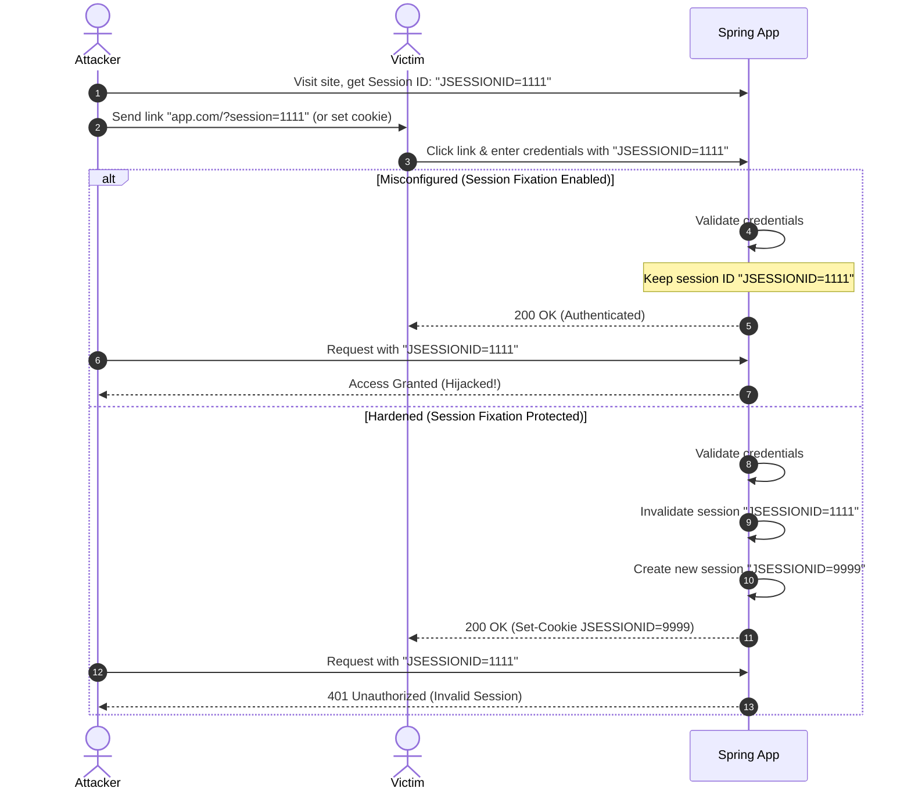

# Module 07: Identification and Authentication Failures — Session Fixation, Brute-Force, and MFA

Welcome back, class. Today we analyze **Identification and Authentication Failures (A07:2021)**.

Authentication is the gateway to your system. If an attacker can impersonate your users or hijack their sessions, all other application controls (such as authorization checks and audit logs) are undermined. Today, we will study the mechanics of **Session Fixation** attacks, implement defense-in-depth against **Brute-Force Credential Stuffing** by tracking login failures in Spring Security, and review Multi-Factor Authentication (MFA) validation flows.

---

## 1. Academic Lecture: The Mechanics of Session Hijacking

Identification and authentication failures occur when applications fail to protect sessions or validate user identities correctly.

### 1. Session Fixation Attack
In a session fixation attack, the attacker establishes a valid session with the target application and obtains a session ID. The attacker then forces the victim's browser to use this pre-allocated session ID (e.g., via query parameters or cross-site scripting). When the victim logs in, the application associates their newly authenticated identity with the *existing* session ID. The attacker, who already knows the session ID, can now hijack the authenticated session.

```
Session Fixation Attack Flow

[Attacker] ---> Obtains Session ID (e.g., JSESSIONID=XYZ123) from application
   |
   +---> Lures Victim to use JSESSIONID=XYZ123 (via link or script)
            |
            v
[Victim Browser] ---> Logs in successfully using JSESSIONID=XYZ123
            |
            v
[Attacker Browser] ---> Sends requests containing JSESSIONID=XYZ123 ---> [ Access Granted! ]
```

### 2. Session Fixation Mitigation
To prevent session fixation, the application must invalidate the current session ID and issue a completely **new session ID** immediately upon successful authentication. Spring Security enforces this by default using its `SessionFixationProtectionStrategy` during login.



### 3. Credential Stuffing and Brute-Force Protection
If your login endpoints do not limit failed attempts, automated scripts will test lists of stolen usernames and passwords (credential stuffing) or cycle through passwords for a single username (brute-force).
*   **Defense**: Implement an authentication listener that captures login failure events. Upon reaching a threshold of consecutive failures (e.g., 5 failures within 15 minutes), the account or originating IP is temporarily locked out.

---

## 2. Theory vs. Production Trade-offs

### Account Lockout vs. Denial of Service (DoS)
*   **Strict Account Lockout (e.g., lock account after 3 failures)**:
    *   *Pro*: Prevents brute-force guessing of the password.
    *   *Con*: Enables an attacker to launch a DoS attack against your users. If the attacker knows the usernames of your customers, they can intentionally submit three incorrect passwords for every account, locking out all legitimate users.
*   **Production Rule**: Never lock accounts indefinitely on username-only failures. Use **IP-based login throttling** (e.g. block the originating IP using bucket rate limiters) or implement **temporary lockouts** (e.g., 15 minutes) paired with a CAPTCHA or Multi-Factor Authentication prompt rather than absolute lockout.

---

## 3. How to Use: Hardening Authentication in Spring Security

Let's look at how to secure sessions and implement brute-force tracking using compile-grade Java 21 classes.

### A. Securing the Filter Chain & Session Fixation Policy

This security config establishes strict session controls, secure cookie attributes, and session fixation protection.

```java
package com.capstone.security.auth;

import org.springframework.context.annotation.Bean;
import org.springframework.context.annotation.Configuration;
import org.springframework.security.config.annotation.web.builders.HttpSecurity;
import org.springframework.security.config.annotation.web.configuration.EnableWebSecurity;
import org.springframework.security.config.http.SessionCreationPolicy;
import org.springframework.security.web.SecurityFilterChain;

@Configuration
@EnableWebSecurity
public class SecureSessionConfig {

    @Bean
    public SecurityFilterChain filterChain(HttpSecurity http) throws Exception {
        http
            .csrf(csrf -> csrf.disable()) // Only if stateless APIs with headers. If cookies, keep enabled!
            .sessionManagement(session -> session
                // Create sessions only when required by authentication state
                .sessionCreationPolicy(SessionCreationPolicy.IF_REQUIRED)
                // SECURE: Invalidate old session and create a new one on login
                .sessionFixation(fixation -> fixation.changeSessionId())
                // Limit maximum sessions per user
                .maximumSessions(2)
                .maxSessionsPreventsLogin(true)
            )
            .authorizeHttpRequests(auth -> auth
                .requestMatchers("/api/auth/login", "/api/auth/register").permitAll()
                .anyRequest().authenticated()
            );

        return http.build();
    }
}
```

Add these session parameters to `application.properties` to secure cookies:
```properties
# Force cookie visibility to browser HTTP scripts only (prevents XSS reading JSESSIONID)
server.servlet.session.cookie.http-only=true

# Force cookies to be sent over HTTPS connections only
server.servlet.session.cookie.secure=true

# Limit cookie domain visibility to strict origin matches
server.servlet.session.cookie.same-site=strict

# Auto-expire idle sessions after 15 minutes
server.servlet.session.timeout=15m
```

### B. Implementing Brute-Force Protection in Spring Security

To track authentication failures and mitigate credential stuffing, we listen to Spring Security's `AuthenticationFailureBadCredentialsEvent`.

```java
package com.capstone.security.auth;

import org.springframework.context.ApplicationListener;
import org.springframework.security.authentication.event.AuthenticationFailureBadCredentialsEvent;
import org.springframework.stereotype.Component;

import java.util.Map;
import java.util.concurrent.ConcurrentHashMap;
import java.util.concurrent.atomic.AtomicInteger;
import java.util.logging.Logger;

/**
 * Listener to intercept failed login attempts and track potential brute-force actions.
 */
@Component
public class LoginBruteForceProtector implements ApplicationListener<AuthenticationFailureBadCredentialsEvent> {
    private static final Logger LOGGER = Logger.getLogger(LoginBruteForceProtector.class.getName());

    private static final int MAX_FAILED_ATTEMPTS = 5;
    
    // Map tracking failed attempts per username (Use a cache with TTL in production!)
    private final Map<String, AtomicInteger> failureTracker = new ConcurrentHashMap<>();

    @Override
    public void onApplicationEvent(AuthenticationFailureBadCredentialsEvent event) {
        String username = event.getAuthentication().getName();
        
        AtomicInteger attempts = failureTracker.computeIfAbsent(username, k -> new AtomicInteger(0));
        int totalAttempts = attempts.incrementAndGet();

        LOGGER.warning("Failed login attempt for username: " + username + ". Total failures: " + totalAttempts);

        if (totalAttempts >= MAX_FAILED_ATTEMPTS) {
            lockAccount(username);
        }
    }

    private void lockAccount(String username) {
        // SECURE: Execute database update or service call to lock user account
        LOGGER.severe("CRITICAL: Username '" + username + "' exceeded maximum authentication failures. Account locked.");
    }

    public void recordSuccess(String username) {
        failureTracker.remove(username);
    }
}
```

---

## 4. Common Errors & Pitfalls

### Pitfall 1: Blindly relying on default Spring Security context storage inside async threads
If you pass the security context to asynchronous threads (`@Async`), the child threads will lose access to the current authentication object. Developers bypass this by using vulnerable static thread-local variables.
*   **Mitigation**: Configure the Security Context Holder to propagate authentication contexts across spawned execution blocks:
    ```java
    SecurityContextHolder.setStrategyName(SecurityContextHolder.MODE_INHERITABLETHREADLOCAL);
    ```

### Pitfall 2: Reusing the same security question answers as password recovery factors
If you allow users to reset their passwords by answering fixed security questions (e.g. "Favorite color?").
*   **Why it fails**: These answers have low entropy and can easily be guessed or found on social networks, leading to authorization bypass.
*   **Mitigation**: Use Time-Based One-Time Passwords (TOTP) or email/SMS verification channels instead.

---

## 5. Socratic Review Questions

### Question 1
What is the difference between `sessionFixation().newSession()` and `sessionFixation().changeSessionId()` in Spring Security? Which is safer for preserving custom session attributes?

#### Answer
*   `changeSessionId()`: Modifies only the browser session identifier (e.g., `JSESSIONID`). It retains all existing session attributes and objects stored in memory. This is the **default and recommended** setting because it prevents session fixation without breaking cart/session objects in user workspaces.
*   `newSession()`: Creates a completely new session object. It invalidates the old session entirely and destroys all associated session attributes, forcing a fresh environment. It is safer if you want to ensure that no unauthenticated configurations carry over to the authenticated state, but it requires developers to manually copy necessary transient data.

### Question 2
Why should authentication failure logs contain the username but **never** the password input submitted during the failure?

#### Answer
Logging password inputs is a major security violation. Users frequently typo their actual password, typing a slightly modified variant, or mistakenly enter their password in the username field. If passwords are logged on failure, those plaintext secrets are stored in diagnostic log files, which are visible to system administrators, DevOps engineers, and log aggregator systems, exposing the credentials.

---

## 6. Hands-on Challenge: Implementing TOTP MFA Verification

### The Challenge
In this challenge, you will implement a helper method to validate Time-Based One-Time Password (TOTP) tokens generated by Google Authenticator.

TOTP is calculated using the HMAC-SHA1 algorithm over the shared secret key and the current Unix epoch time interval (usually 30-second steps).

Your task is to write a verification method that takes a user's shared secret key and a 6-digit TOTP code, generates the local expected code, and verifies that they match.

Complete the TOTP verification method below using standard Java Cryptography Architecture (JCA):

```java
package com.capstone.security.auth.challenge;

import javax.crypto.Mac;
import javax.crypto.spec.SecretKeySpec;
import java.nio.ByteBuffer;
import java.security.GeneralSecurityException;

public class TotpVerifier {

    /**
     * Verifies the submitted TOTP code against a shared secret key.
     * 
     * @param secretKey The base32 decoded secret key bytes
     * @param totpCode The 6-digit code submitted by the user
     * @return true if the code is valid, false otherwise.
     */
    public static boolean verify(byte[] secretKey, int totpCode) {
        long currentInterval = System.currentTimeMillis() / 1000L / 30L;
        
        try {
            // Generate local TOTP code for the current time interval
            long generatedCode = generateTotp(secretKey, currentInterval);
            return generatedCode == totpCode;
        } catch (GeneralSecurityException e) {
            return false;
        }
    }

    private static long generateTotp(byte[] key, long timeStep) throws GeneralSecurityException {
        // Convert time step to 8-byte array
        byte[] data = ByteBuffer.allocate(8).putLong(timeStep).array();
        
        // Compute HMAC-SHA1 hash
        SecretKeySpec signKey = new SecretKeySpec(key, "HmacSHA1");
        Mac mac = Mac.getInstance("HmacSHA1");
        mac.init(signKey);
        byte[] hash = mac.doFinal(data);
        
        // TODO: Complete the dynamic truncation step.
        // 1. Get the last 4 bits of the hash as an offset: int offset = hash[hash.length - 1] & 0xf;
        // 2. Extract 4 bytes starting from the offset:
        //    int binary = ((hash[offset] & 0x7f) << 24) |
        //                 ((hash[offset + 1] & 0xff) << 16) |
        //                 ((hash[offset + 2] & 0xff) << 8) |
        //                 (hash[offset + 3] & 0xff);
        // 3. Return the 6-digit remainder: binary % 1_000_000;
        return 0;
    }
}
```

Write out the dynamic truncation code. Save the completed challenge class and document the importance of time synchronization in TOTP security inside `modules/07-authentication-identification-failures.md`.
