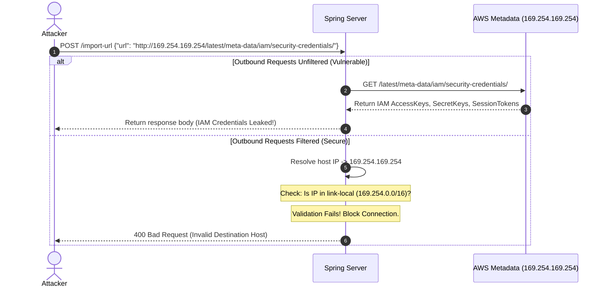

# Module 10: Server-Side Request Forgery — SSRF and Outbound Connection Filters

Welcome back, class. Today we study **Server-Side Request Forgery (SSRF) (A10:2021)**.

SSRF occurs when a web application fetches a remote resource from a user-supplied URL without validating the target destination. By forcing the server to send requests on their behalf, an attacker can use the server as a proxy to scan internal networks, access private databases, bypass perimeter firewalls, and extract credentials from cloud metadata services (e.g., AWS IMDSv1).

Today, we will analyze the mechanics of SSRF, study DNS Rebinding bypass techniques, and build a secure outbound connection filter for Spring's **RestTemplate** using socket-level IP validation.

---

## 1. Academic Lecture: The Mechanics of SSRF

To understand SSRF, we must recognize the trust boundary of internal networks.

### 1. The Outbound Fetch Vulnerability
Many applications allow users to upload profile pictures from a URL, import RSS feeds, or query webhooks.
*   **The Vulnerability**: If the server resolves and fetches these URLs directly, it behaves as an open request forwarder.
*   **The Targets**:
    *   **Loopback Interfaces**: `http://localhost:8080/actuator/env` or `http://127.0.0.1:8080/` (accessing admin configurations).
    *   **Private IP Space (RFC 1918)**: `http://10.0.0.25/internal-api` or `http://192.168.1.50/`.
    *   **Cloud Instance Metadata Services**: 
        *   AWS / OpenStack: `http://169.254.169.254/latest/meta-data/` (leaks IAM execution credentials).
        *   Google Cloud: `http://metadata.google.internal/computeMetadata/v1/` (requires custom headers, but vulnerable if headers can be manipulated).



### 2. The DNS Rebinding Bypass
A common SSRF mitigation is the **Resolve-and-Check** approach: the application resolves the URL host to an IP address, verifies it is a public IP, and then fetches the URL.
*   **The Bypass**: An attacker registers a malicious domain (e.g., `ssrf.attacker.com`) and configures a custom DNS server.
    *   When the Spring application performs the validation check, the DNS server returns a safe public IP (e.g., `8.8.8.8`). The check passes.
    *   When the Spring application performs the actual HTTP fetch, the DNS TTL expires immediately, forcing a second resolution. The DNS server now returns `127.0.0.1`.
    *   The application fetches from localhost, bypassing the validation filter.
*   **The Solution**: You must resolve the DNS host **exactly once** before validation. The HTTP request must then be made directly to the resolved IP address, while preserving the original host name in the HTTP `Host` header. Alternatively, you can intercept connections at the JVM socket level to validate target IPs *after* the socket connection is initiated.

---

## 2. Theory vs. Production Trade-offs

### Whitelisting Domains vs. Blacklisting IP Ranges
*   **Domain Whitelisting**:
    *   *Pro*: Most secure option. The application only fetches resources from a small, trusted list of APIs (e.g., `https://api.stripe.com`).
    *   *Con*: Cannot be used if the core business logic requires fetching arbitrary user-provided links (e.g., URL checkers, web crawler tools).
*   **IP Blacklisting (blocking RFC 1918 & link-local ranges)**:
    *   *Pro*: Allows fetching from arbitrary external sites while protecting internal infrastructure.
    *   *Con*: Complex to maintain. If IPv6 is enabled, you must also block IPv6 local scopes (`::1`, `fe80::/10`, `fc00::/7`).

---

## 3. How to Use: Secure RestTemplate Integration

Let us write a compile-grade Java 21 implementation using a custom **SocketFactory** to intercept and validate outbound IP connections in Spring Boot. This is the most secure mitigation because it validates the IP at the connection phase, preventing DNS Rebinding.

### A. The Custom SSRF-Preventing Socket Factory

We override standard socket connections to verify the destination IP before binding.

```java
package com.capstone.security.ssrf;

import java.io.IOException;
import java.net.InetAddress;
import java.net.InetSocketAddress;
import java.net.Socket;
import java.net.SocketAddress;
import java.util.logging.Logger;
import javax.net.SocketFactory;

/**
 * Socket Factory that blocks outbound connections targeting local or private IP spaces.
 */
public class SsrfBlockerSocketFactory extends SocketFactory {
    private static final Logger LOGGER = Logger.getLogger(SsrfBlockerSocketFactory.class.getName());

    private final SocketFactory delegate = SocketFactory.getDefault();

    @Override
    public Socket createSocket() throws IOException {
        return new FilteredSocket();
    }

    @Override
    public Socket createSocket(String host, int port) throws IOException {
        validateDestination(host);
        return delegate.createSocket(host, port);
    }

    @Override
    public Socket createSocket(InetAddress host, int port) throws IOException {
        validateDestination(host);
        return delegate.createSocket(host, port);
    }

    @Override
    public Socket createSocket(String host, int port, InetAddress localHost, int localPort) throws IOException {
        validateDestination(host);
        return delegate.createSocket(host, port, localHost, localPort);
    }

    @Override
    public Socket createSocket(InetAddress address, int port, InetAddress localAddress, int localPort) throws IOException {
        validateDestination(address);
        return delegate.createSocket(address, port, localAddress, localPort);
    }

    private void validateDestination(String host) throws IOException {
        InetAddress address = InetAddress.getByName(host);
        validateDestination(address);
    }

    private void validateDestination(InetAddress address) throws IOException {
        byte[] ip = address.getAddress();
        
        // 1. Check for Loopback: 127.0.0.0/8 and ::1
        if (address.isLoopbackAddress()) {
            throw new IOException("Blocked connection target: Loopback IP addresses are forbidden.");
        }

        // 2. Check for Link-Local: 169.254.0.0/16 (Cloud Metadata)
        if (address.isLinkLocalAddress()) {
            throw new IOException("Blocked connection target: Link-local addresses are forbidden.");
        }

        // 3. Check for Site-Local / Private networks (RFC 1918): 10.0.0.0/8, 172.16.0.0/12, 192.168.0.0/16
        if (address.isSiteLocalAddress()) {
            throw new IOException("Blocked connection target: Private internal IP addresses are forbidden.");
        }

        LOGGER.info("Connection allowed to secure remote address: " + address.getHostAddress());
    }

    /**
     * Custom Socket implementation that intercepts connection bindings.
     */
    private class FilteredSocket extends Socket {
        @Override
        public void connect(SocketAddress endpoint) throws IOException {
            if (endpoint instanceof InetSocketAddress inetSocketAddress) {
                validateDestination(inetSocketAddress.getAddress());
            }
            super.connect(endpoint);
        }

        @Override
        public void connect(SocketAddress endpoint, int timeout) throws IOException {
            if (endpoint instanceof InetSocketAddress inetSocketAddress) {
                validateDestination(inetSocketAddress.getAddress());
            }
            super.connect(endpoint, timeout);
        }
    }
}
```

### B. Configuring RestTemplate to use the Safe Socket Factory

Next, configure your Spring Boot `RestTemplate` bean to use the safe socket factory:

```java
package com.capstone.security.ssrf;

import org.apache.hc.client5.http.impl.classic.CloseableHttpClient;
import org.apache.hc.client5.http.impl.classic.HttpClients;
import org.apache.hc.client5.http.impl.io.PoolingHttpClientConnectionManager;
import org.apache.hc.client5.http.socket.ConnectionSocketFactory;
import org.apache.hc.client5.http.socket.PlainConnectionSocketFactory;
import org.apache.hc.client5.http.ssl.SSLConnectionSocketFactory;
import org.apache.hc.core5.http.config.Registry;
import org.apache.hc.core5.http.config.RegistryBuilder;
import org.springframework.context.annotation.Bean;
import org.springframework.context.annotation.Configuration;
import org.springframework.http.client.HttpComponentsClientHttpRequestFactory;
import org.springframework.web.client.RestTemplate;

@Configuration
public class RestTemplateSsrfConfig {

    @Bean
    public RestTemplate secureRestTemplate() {
        // Build Registry mapping schemas to our SSRF-preventing socket factory
        Registry<ConnectionSocketFactory> socketFactoryRegistry = RegistryBuilder.<ConnectionSocketFactory>create()
                .register("http", new CustomPlainConnectionSocketFactory())
                .register("https", SSLConnectionSocketFactory.getSocketFactory())
                .build();

        PoolingHttpClientConnectionManager connectionManager = new PoolingHttpClientConnectionManager(socketFactoryRegistry);
        
        CloseableHttpClient httpClient = HttpClients.custom()
                .setConnectionManager(connectionManager)
                .build();

        HttpComponentsClientHttpRequestFactory requestFactory = new HttpComponentsClientHttpRequestFactory(httpClient);
        requestFactory.setConnectTimeout(5000); // Set strict timeouts
        requestFactory.setConnectionRequestTimeout(5000);

        return new RestTemplate(requestFactory);
    }

    private static class CustomPlainConnectionSocketFactory extends PlainConnectionSocketFactory {
        public CustomPlainConnectionSocketFactory() {
            // Force Plain Connection Socket Factory to use our SSRF-blocking Socket Factory
            super(new SsrfBlockerSocketFactory());
        }
    }
}
```

---

## 4. Common Errors & Pitfalls

### Pitfall 1: Relying on String Regex to Parse URLs
Using regular expressions to check host names (e.g. `url.contains("google.com")`).
*   **Why it fails**: Attackers exploit URL parsing inconsistencies. The URL `http://google.com@10.0.0.1` contains `google.com` as user authentication metadata, but resolves the connection to `10.0.0.1`.
*   **Mitigation**: Always parse URLs using `java.net.URI` instead of string matching, and validate the actual resolved IP address.

### Pitfall 2: Following HTTP Redirects Unchecked
Allowing RestTemplate to automatically follow 3xx HTTP redirect responses.
*   **Why**: The client submits a safe URL (e.g. `http://safe-public-api.com/image.jpg`). The remote server redirects the request to `http://169.254.169.254/latest/meta-data`.
*   **Mitigation**: Disable automatic redirects on your HTTP clients, or execute the validation filter on every redirect in the chain.

---

## 5. Socratic Review Questions

### Question 1
Explain how an attacker can leverage an SSRF vulnerability to gain access to an AWS ECS or Kubernetes container's IAM execution credentials.

#### Answer
Cloud hosting providers expose instance metadata endpoints at the link-local IP address `169.254.169.254`. When an application runs on AWS (e.g., EC2 or ECS), it can fetch IAM credentials from `http://169.254.169.254/latest/meta-data/iam/security-credentials/<role-name>`.
If the application contains an SSRF vulnerability, the attacker can submit a request instructing the application to fetch this metadata URL. The application resolves the target, routes the request internally (since it is running on AWS), and returns the JSON payload containing the IAM `AccessKeyId`, `SecretAccessKey`, and `Token` to the attacker, giving them control of the cloud environment.

### Question 2
Why does resolving the IP using `InetAddress.getByName(host)` and then creating a connection to the host string still leave the application vulnerable to DNS Rebinding?

#### Answer
If you resolve the host name, check the IP, and then call `restTemplate.getForObject("http://" + host, ...)` using the original host name, the HTTP client will perform its own DNS resolution to establish the TCP connection. 
During this gap (between your validation resolution and the connection resolution), an attacker can update the DNS record to point to localhost. Since the connection is established to the host name, the client queries DNS again, resolves the malicious IP, and completes the connection to the internal resource.

---

## 6. Hands-on Challenge: Outbound IP Whitelist Filter

### The Challenge
In this challenge, you will implement an IP verification filter.

Your task:
1.  Complete the validator method to verify that an resolved IP address does not belong to loopback, private ranges, or link-local domains.
2.  Also block the multicast range `224.0.0.0/4` and broadcast addresses.

Complete the validator class below:

```java
package com.capstone.security.ssrf.challenge;

import java.net.InetAddress;

public class IpAddressValidator {

    /**
     * Verifies that the IP address is safe to query (strictly public internet target).
     * 
     * @param address The resolved InetAddress of the target host
     * @return true if the address is safe, false if it is a private or local address.
     */
    public static boolean isSafeAddress(InetAddress address) {
        if (address == null) {
            return false;
        }

        // TODO: Complete the validation rules.
        // 1. Check if address is loopback (isLoopbackAddress).
        // 2. Check if address is link-local (isLinkLocalAddress).
        // 3. Check if address is site-local (isSiteLocalAddress).
        // 4. Check if address is multicast (isMulticastAddress).
        // 5. If any of the above checks are true, return false.
        
        return true;
    }
}
```

Write out the validation checks. Save the completed challenge class and explain why disabling IPv6 connection protocols is a common SSRF defense strategy in pure IPv4 environments inside `modules/10-ssrf-mitigation.md`.
