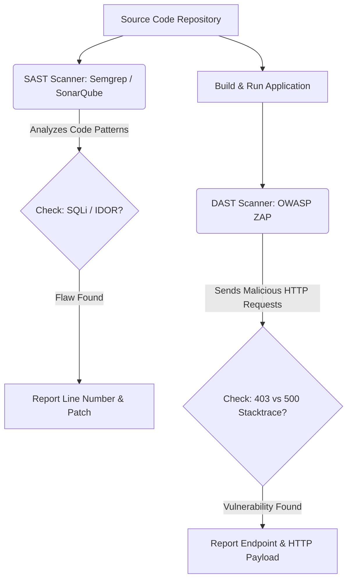

# Module 11: Capstone — Hardening the Sandbox E-Commerce Application

Welcome to your **Final Capstone Project**, class. 

You have studied access control bypasses, cryptosystems, query injections, insecure designs, security misconfigurations, supply chain threats, authentication failures, object deserialization, logging vulnerabilities, and SSRF mitigations. Now, it is time to synthesize these concepts to secure a production e-commerce application.

In this capstone, we will review threat modeling methodologies, contrast static and dynamic analysis workflows, examine the components of a hardened Spring Boot web application, and complete a hands-on security audit to patch vulnerable code.

---

## 1. Academic Lecture: Threat Modeling and Audit Methodologies

Before writing a single line of security code, an architect must establish a threat model of the system.

### 1. The STRIDE Threat Modeling Framework
Developed by Microsoft, STRIDE is an acronym used to identify security threats across application boundaries:
*   **S**poofing (Authentication): Can an attacker pretend to be someone else?
*   **T**ampering (Integrity): Can an attacker modify data in transit or at rest?
*   **R**epudiation (Non-repudiability): Can a user deny performing an action? (Mitigated by secure logs).
*   **I**nformation Disclosure (Confidentiality): Can secrets or private data leak?
*   **D**enial of Service (Availability): Can an attacker exhaust resources and crash the app?
*   **E**levation of Privilege (Authorization): Can a user execute admin commands?

### 2. Static (SAST) vs. Dynamic (DAST) Security Testing
*   **Static Application Security Testing (SAST)**: Scans source code, configuration files, and compile dependencies for patterns of vulnerabilities (e.g., SonarQube, Semgrep, FindSecBugs).
    *   *Pro*: Identifies the exact line of code containing the flaw before execution.
    *   *Con*: Cannot easily trace complex runtime data flows or contextual business logic rules, leading to false positives.
*   **Dynamic Application Security Testing (DAST)**: Tests the running application from the outside, injecting payloads into API endpoints and analyzing HTTP responses (e.g., OWASP ZAP, Burp Suite).
    *   *Pro*: Evaluates real runtime behavior and environmental configs.
    *   *Con*: Difficult to map a flagged vulnerability back to a specific Java class or file line.



---

## 2. Theory vs. Production Trade-offs

### Defense-in-Depth vs. Execution Performance
*   **Defense-in-Depth**: Implementing checks at every layer (e.g., checking user roles at the API gateway, in Spring Security filters, inside `@PreAuthorize` method annotations, and using SQL query filters).
    *   *Pro*: If an attacker bypasses one layer (e.g., a misconfigured API gateway rule), downstream defenses prevent the exploit.
    *   *Con*: Adds processing latency. Every security check consumes CPU cycles, database connections, and memory allocation.
*   **Production Rule**: Balance performance and security. Run fast validation checks (like input formats, request structure, and token signatures) at the edge of your network (API gateway/filter chain). Reserve heavy database validation checks (like object ownership verification) for the service layer.

---

## 3. How to Use: The Hardened E-Commerce Architecture

Let us review the architecture of a secure Spring Boot controller layer handling order payments and downloads:

```java
package com.capstone.security.capstone;

import org.springframework.http.ResponseEntity;
import org.springframework.security.access.prepost.PreAuthorize;
import org.springframework.web.bind.annotation.*;

import java.util.Map;
import java.util.UUID;
import java.util.logging.Logger;
import java.util.regex.Pattern;

/**
 * Hardened REST Controller enforcing access controls, input sanitization, and parameterized requests.
 */
@RestController
@RequestMapping("/api/orders")
public class HardenedOrderController {
    private static final Logger LOGGER = Logger.getLogger(HardenedOrderController.class.getName());
    private static final Pattern ORDER_ID_PATTERN = Pattern.compile("^[0-9a-fA-F]{8}-[0-9a-fA-F]{4}-4[0-9a-fA-F]{3}-[89abAB][0-9a-fA-F]{3}-[0-9a-fA-F]{12}$");

    private final OrderService orderService;

    public HardenedOrderController(OrderService orderService) {
        this.orderService = orderService;
    }

    /**
     * Retrieves details for a specific order. Enforces IDOR prevention.
     */
    @GetMapping("/{orderId}")
    @PreAuthorize("hasRole('USER') and @orderPermissionEvaluator.isOwner(authentication, #orderId)")
    public ResponseEntity<OrderResponse> getOrderDetails(@PathVariable String orderId) {
        // 1. Validate parameter format against UUIDv4 regex
        if (!ORDER_ID_PATTERN.matcher(orderId).matches()) {
            LOGGER.warning("Refused malformed orderId path variable: " + orderId);
            return ResponseEntity.badRequest().build();
        }

        // 2. Fetch and return secure order payload
        OrderResponse order = orderService.fetchOrder(UUID.fromString(orderId));
        return ResponseEntity.ok(order);
    }
}
```

---

## 4. Common Errors & Pitfalls

### Pitfall 1: Patching Symptoms Instead of Root Causes
Fixing SQL Injection by building custom string-escaping methods instead of refactoring to parameterized queries.
*   **Why it fails**: Attackers find bypasses for custom string replacement rules (e.g., unicode encoding tricks or nested SQL injection patterns).
*   **Mitigation**: Always refactor to standard, compile-level parameter bindings (like JPA `TypedQuery` parameters).

---

## 5. Socratic Review Questions

### Question 1
Explain the difference between vertical privilege escalation and horizontal privilege escalation. How does an IDOR exploit map to these categories?

#### Answer
*   **Vertical Privilege Escalation**: A standard user accesses functionality reserved for administrator roles (e.g., a guest user calling `/api/admin/delete-users`).
*   **Horizontal Privilege Escalation**: A user accesses resources belonging to another user with the same privilege level (e.g., User A accessing `/api/orders/99` to read User B's order).
*   **IDOR Mapping**: Insecure Direct Object Reference (IDOR) typically results in **horizontal privilege escalation**. Because the application references objects directly by their ID and fails to verify if the requesting user owns the object, users can access other users' data by changing ID parameters.

### Question 2
Why are unit tests insufficient for detecting security vulnerabilities like race conditions or SSRF?

#### Answer
Unit tests mock external dependencies (like databases, DNS, and remote servers) to isolate individual classes. However, security bugs often emerge from **interactions** between components and configurations (e.g., DNS resolution delays or multithreading synchronization). 
Detecting these issues requires integration testing in a staging environment, run-time monitoring under concurrent load, and vulnerability scanning.

---

## 6. Hands-on Challenge: Hardening the E-Commerce Sandbox

### The Challenge
In this final capstone challenge, you will repair a vulnerable order management system. The system contains an SQL Injection vulnerability in its query execution block and is vulnerable to IDOR because it lacks access checks.

Your task:
1.  Refactor `VulnerableOrderService` to use a parameterized JPA query instead of dynamic string concatenation.
2.  Add a check to verify that the requesting user owns the order they are trying to access.

Complete the implementation below:

#### The Vulnerable Code:
```java
// DANGER: Dynamic JPQL query concatenation leads to SQL Injection
String jpql = "SELECT o FROM Order o WHERE o.id = '" + orderId + "'";
TypedQuery<Order> query = em.createQuery(jpql, Order.class);
Order order = query.getSingleResult();
```

#### The Hardened Class to Implement:

```java
package com.capstone.security.capstone.challenge;

import jakarta.persistence.EntityManager;
import jakarta.persistence.PersistenceContext;
import jakarta.persistence.TypedQuery;
import org.springframework.security.core.context.SecurityContextHolder;
import org.springframework.stereotype.Service;
import org.springframework.transaction.annotation.Transactional;

@Service
public class OrderHardeningService {

    @PersistenceContext
    private EntityManager entityManager;

    /**
     * Hardened method to fetch an order.
     * Enforces SQLi prevention and validates owner permissions.
     * 
     * @param orderId The requested order identification
     * @return The Order object if secure and authenticated.
     * @throws SecurityException if the user is unauthorized.
     */
    @Transactional(readOnly = true)
    public Order getSecureOrder(String orderId, String currentUsername) {
        // TODO: Complete this secure method.
        // 1. Write a secure JPQL query using Named Parameters: "SELECT o FROM Order o WHERE o.id = :orderId"
        // 2. Bind the parameter safely: query.setParameter("orderId", orderId)
        // 3. Execute query: Order order = query.getSingleResult()
        // 4. Verify that order.getOwnerUsername() matches currentUsername.
        //    - If yes: return the order.
        //    - If no: throw new SecurityException("Unauthorized access to order.");
        
        return null;
    }
}
```

Write down the parameterized service code. Save the completed class and explain your validation strategy inside `modules/11-final-capstone-application-hardening.md`.
