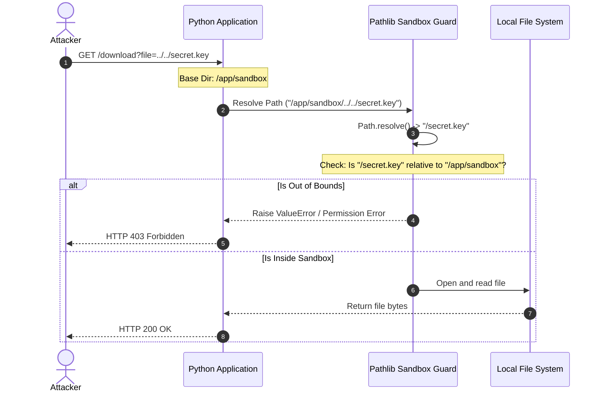

# Module 01: Core File System Operations — pathlib & OS Primitives

Welcome back, class. Today we analyze **Core File System Operations (CS-522)**.

A common task in back-end engineering is interacting with the host operating system's file system: crawling directories to locate files, reading metadata attributes, and validating read/write permissions. Historically, Python developers used raw string operations and the legacy `os.path` module. However, doing so regularly introduces severe cross-platform bugs (due to differing path separators between Windows and POSIX systems) and critical security vulnerabilities, such as **Directory Traversal (Path Traversal)**.

Modern Python solves this via the object-oriented **`pathlib`** standard library. Today, we will study path safety, crawl directory trees securely, and implement robust folder scanners.

---

## 1. Academic Lecture: Path Separators, Traversals, and Metadata

The file system is a hierarchical tree. Interacting with it securely requires understanding OS abstraction layers:

### 1. The Path Separator Problem
Operating systems structure directories differently:
*   **POSIX (Linux/macOS)**: Uses the forward slash `/` (e.g., `/var/log/app.log`).
*   **Windows**: Uses the backslash `\` (e.g., `C:\var\log\app.log`).
*   **The Invariant**: If you concatenate paths using raw string operations (e.g., `path + "/" + filename`), your code will break when moved to a different operating system. Python's `pathlib.Path` resolves this by dynamically handling path separators under the hood based on the execution platform.

### 2. Directory Traversal Vulnerabilities (Path Traversal)
If your application takes user input to load a file from a directory, an attacker can input parent directory sequences:
```text
../../../../etc/passwd
```
If you evaluate this raw input path without verification, the operating system resolves it by escaping the intended sandbox folder, exposing sensitive configurations or keys to the client.

### 3. File System Metadata
Every file has metadata stored in its filesystem inode:
*   **File Size**: Retrieved in bytes.
*   **Modification Time (`mtime`)**: The unix epoch timestamp indicating when the file content was last written.
*   **Access Time (`atime`)**: When the file was last opened.
*   **Permissions (`mode`)**: The octal bitmask (like `0o755` on Unix) defining user, group, and world permissions.



---

## 2. Theory vs. Production Trade-offs

### `pathlib.Path` Object Wrappers vs. Raw `os.path` Strings
*   **`pathlib.Path` Objects**:
    *   *Pro*: Object-oriented, highly readable, cross-platform compatible, and encapsulates file checks (e.g. `path.is_file()`, `path.stat()`) directly within the object.
    *   *Con*: Slightly slower in massive micro-optimization loops. Creating thousands of path objects per second incurs Python heap allocation overhead compared to passing raw string primitives.
*   **`os.path` and `os.walk`**:
    *   *Pro*: Lightweight; faster when scanning millions of files in tight, high-performance batch scripts.
    *   *Con*: Verbose, requires separate imports, and doesn't support the `/` join operator, making it error-prone.
*   **Production Rule**: Always default to **`pathlib`** for application logic, routing endpoints, and normal directory operations. Only revert to legacy `os` primitives if profiling proves that object allocation overhead is a bottleneck in a hot path scanning millions of records.

---

## 3. How to Use: Secure Directory Crawling and Metadata Extraction

Let us write a compile-grade Python 3.11+ implementation demonstrating path traversal mitigations and recursive directory crawling.

### A. The Path Traversal Vulnerability (Anti-Pattern)

Avoid string concatenation and unvalidated resolution of input paths:

```python
import os
from pathlib import Path

# DANGER: Directly combining strings allows attackers to escape the
# intended base directory by passing parent directory selectors.
def read_user_file_vulnerable(user_input_filename: str) -> str:
    base_dir = "/app/sandbox/uploads"
    target_path = os.path.join(base_dir, user_input_filename)
    
    # If user_input_filename is "../../../../etc/passwd", os.path.join resolves
    # to "/etc/passwd", leaking system credentials.
    with open(target_path, "r") as file:
        return file.read()
```

### B. The Hardened Sandbox Path Guard (Production Pattern)

Here is the hardened pattern. We instantiate a base sandbox Path, resolve the final destination path to its canonical absolute path using `.resolve()`, and verify that the destination lies strictly within the base sandbox folder hierarchy.

```python
from pathlib import Path
from datetime import datetime, timezone
from typing import Dict, List, Any

# SECURE: Secure Path Validation Guard
def resolve_secure_path(base_directory: Path, user_provided_path: str) -> Path:
    # 1. Join paths using the / operator (cross-platform safe)
    target_path = base_directory / user_provided_path
    
    # 2. Resolve to absolute path, resolving symlinks and ".." segments
    # Setting strict=True raises FileNotFoundError if path does not exist
    resolved_path = target_path.resolve()
    
    # 3. SECURE: Verify resolved path starts with the base directory path
    # This prevents directory traversal attacks completely
    if not resolved_path.is_relative_to(base_directory.resolve()):
        raise PermissionError(
            f"Security Violation: Path {resolved_path} is outside the allowed sandbox: {base_directory}"
        )
        
    return resolved_path

# SECURE: Recursive Directory Crawler and Metadata Parser
def scan_audio_directory(root_directory: Path) -> List[Dict[str, Any]]:
    if not root_directory.exists() or not root_directory.is_dir():
        raise ValueError("Provided root directory is invalid or inaccessible.")
        
    audio_records = []
    
    # SECURE: Recursively scan directory tree for specific extensions
    # Path.rglob matches files matching pattern in current dir and all subdirs
    for file_path in root_directory.rglob("*.wav"):
        try:
            # Gather file stat metadata
            file_stat = file_path.stat()
            
            record = {
                "filename": file_path.name,
                "absolute_path": str(file_path.resolve()),
                "size_bytes": file_stat.st_size,
                "last_modified": datetime.fromtimestamp(file_stat.st_mtime, tz=timezone.utc).isoformat(),
                "is_readable": os.access(file_path, os.R_OK) if 'os' in globals() else True
            }
            audio_records.append(record)
        except (PermissionError, FileNotFoundError):
            # Gracefully bypass files that are deleted or lack permissions during crawl
            continue
            
    return audio_records
```

---

## 4. Common Errors & Pitfalls

### Pitfall 1: Failing to Call `.resolve()` before checking paths
Comparing relative paths directly (e.g. `base_path in target_path`) without converting them to absolute representations.
*   **Why it fails**: If the input path contains `..` segments, the string comparison might look correct, but the operating system will resolve the path to a completely different location, bypassing your verification check.
*   **Mitigation**: Always call `.resolve()` to get the true canonical path before running validation checks.

### Pitfall 2: Using the wrong casing on Case-Insensitive systems
Assuming paths are case-sensitive across all environments.
*   **Why it fails**: Windows is case-insensitive, while Linux is case-sensitive. Code checking `Path("file.WAV").exists()` will return `True` on Windows if a file named `file.wav` exists, but will return `False` on Linux, causing runtime errors.
*   **Mitigation**: Normalize file extensions using `.lower()` during searches or pattern matches.

---

## 5. Socratic Review Questions

### Question 1
How does calling `Path.resolve(strict=True)` differ from `Path.resolve(strict=False)`?

#### Answer
*   `strict=True`: Python validates that the target file actually exists on disk. If the path does not exist, a `FileNotFoundError` is immediately raised.
*   `strict=False`: Python resolves the path parts as far as possible without validating the file's existence on disk, returning an absolute path target even if the file is missing.

### Question 2
What is the difference between `Path.glob("*")` and `Path.rglob("*")`?

#### Answer
*   `Path.glob("*")` searches for files and directories matching the pattern *only* in the immediate directory directory. It does not recurse.
*   `Path.rglob("*")` (Recursive Glob) searches the target directory and recursively enters all subdirectories, matching files throughout the entire folder tree.

---

## 6. Hands-on Challenge: Building a Secure Directory Sandbox Scanner

### The Challenge
In this challenge, you will implement a directory file scanner that filters audio files securely within a sandbox.

Your task:
1.  Complete the function `scan_sandbox_files`.
2.  Securely resolve the input `target_rel_path` relative to `sandbox_root`. If the resolved path is outside the sandbox, raise a `PermissionError`.
3.  Ensure the target directory exists and is indeed a directory.
4.  Crawl the directory, listing all files matching the extension filter (e.g. `*.wav`), and return their resolved paths as a list of strings.

Complete the implementation below:

```python
from pathlib import Path

def scan_sandbox_files(sandbox_root: Path, target_rel_path: str, extension: str) -> list[str]:
    # TODO: Complete the secure folder scanner.
    # 1. Join sandbox_root and target_rel_path.
    # 2. Resolve to absolute path: target_abs = path.resolve()
    # 3. Check if target_abs is relative to sandbox_root.resolve(). If not, raise PermissionError.
    # 4. If target_abs does not exist or is not a directory, return an empty list.
    # 5. Use target_abs.rglob(f"*{extension}") to find matching files.
    # 6. Return list of resolved path strings.
    
    return []
```

Write the directory traversal guards and search logic. Save the completed file and verify the sandbox enforcement works inside `modules/01-pathlib-filesystem.md`.
