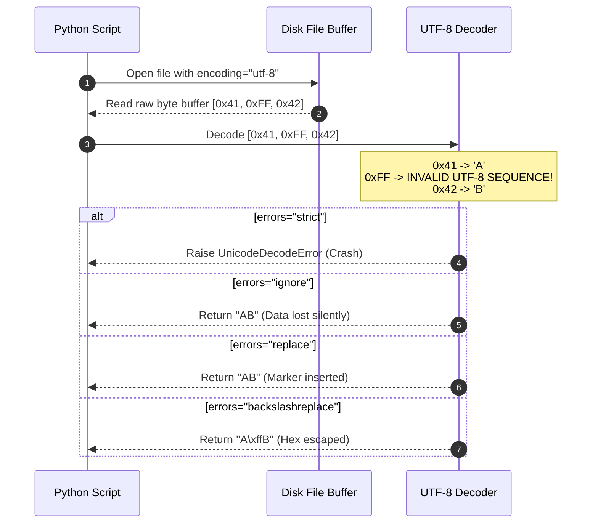

# Module 02: Structured Text & Encodings — UTF Standards & Error Handling

Welcome back, class. Today we analyze **Structured Text & Encodings (CS-522)**.

All files are binary bytes under the hood. For a computer to display text, it must map those raw bytes to characters using a character encoding dictionary. Many developers treat text files as a single native type, calling `open("file.txt")` without specifying an encoding parameter. This introduces silent bugs: the program uses the host machine's default system locale (e.g., `cp1252` on Windows, `UTF-8` on Linux), causing the application to crash or corrupt data when deployed across platforms.

Today, we will study **Unicode standards (UTF-8, UTF-16, ASCII)**, analyze text context manager lifetimes, and implement robust decoding error handlers to salvage corrupted data safely.

---

## 1. Academic Lecture: Code Points, Encodings, and Error Recovery

To read text files reliably, we must understand the boundary between byte arrays and character strings:

### 1. The Character vs. Byte Boundary
*   **Characters (Strings)**: Abstract symbols (like 'A', 'é', or 'µ') mapped to integer index IDs called **Unicode Code Points**.
*   **Bytes**: 8-bit binary units stored on disk.
*   **The Encoding**: The algorithm that converts Unicode Code Points into byte sequences.

### 2. Encoding Standards
*   **ASCII**: An ancient 7-bit standard mapping 128 characters. It cannot represent non-English symbols.
*   **ISO-8859-1 (Latin-1)**: An 8-bit standard that extends ASCII to support Western European characters. It maps every byte (0-255) to a character, meaning it can decode *any* binary file without crashing, even if the result is unreadable gibberish.
*   **UTF-8**: The modern web standard. It is a variable-width encoding (1 to 4 bytes per character) that is fully backward-compatible with ASCII. It represents all global languages but raises crashes if a byte sequence does not conform to its structural rules.
*   **UTF-16**: Uses 2 or 4 bytes per character. Commonly used inside Windows APIs and Java runtimes.

### 3. Decode Error Recovery Strategies
When Python encounters a byte sequence that is invalid for the specified encoding, it raises a `UnicodeDecodeError`. We manage this using error strategies:
*   **`strict`**: Raises an exception instantly, terminating processing.
*   **`ignore`**: Silently drops the invalid bytes and continues. This is dangerous because it alters the text length and data payload silently.
*   **`replace`**: Inserts a replacement character `\ufffd` (represented as a black diamond question mark ) at the site of the corruption.
*   **`backslashreplace`**: Replaces the byte with its hexadecimal string representation (e.g. `\xbf`).



---

## 2. Theory vs. Production Trade-offs

### Crash Early (`strict`) vs. Graceful Degradation (`replace`)
*   **Strict Error Validation (`errors='strict'`)**:
    *   *Pro*: Absolute data integrity. Guarantees that corrupted or malicious data payloads are never saved to database models.
    *   *Con*: High crash rates. A single invalid character in a 100,000-line CSV log import will terminate the entire transaction, causing operation downtime.
*   **Replacement Degradation (`errors='replace'`)**:
    *   *Pro*: Resilient execution. The system processes the document fully and flags problematic segments for human audit without stopping.
    *   *Con*: Data loss. The original invalid byte sequence is discarded, meaning the data cannot be reconstructed from the saved output.
*   **Production Rule**: Use **Strict** for critical database records, bank transfers, and credentials. Use **Replacement/Fallback** for telemetry logs, user comment processing, or third-party analytical pipelines where partial data recovery is preferred over crashes.

---

## 3. How to Use: Secure Encodings and Structured Text processing

Let us write a compile-grade Python 3.11+ application that handles encoding fallbacks and structured JSON writes.

### A. The Silent Windows Local Default (Anti-Pattern)

Avoid reading text files without specifying the encoding parameters:

```python
# DANGER: Omitting the encoding argument.
# If this file contains UTF-8 characters like "é", this line works fine on
# Linux (which defaults to UTF-8) but crashes on a Windows server (which
# defaults to cp1252) with a UnicodeDecodeError.
def parse_logs_vulnerable(filepath: str) -> str:
    with open(filepath, "r") as file:
        return file.read()
```

### B. Secure Encoding Resolution and Fallbacks (Production Pattern)

Here is the hardened pattern. We create a utility that attempts to decode a file using a list of candidate encodings, falls back to replacement strategies if all fail, and closes buffers securely.

```python
import json
import csv
from pathlib import Path
from typing import List, Tuple

# SECURE: Multi-Encoding Resilient Loader
def load_text_with_fallback(file_path: Path, candidate_encodings: List[str] = None) -> Tuple[str, str]:
    if candidate_encodings is None:
        candidate_encodings = ["utf-8", "latin-1", "utf-16"]
        
    if not file_path.is_file():
        raise FileNotFoundError(f"Target file does not exist: {file_path}")

    # Try each encoding strictly
    for encoding in candidate_encodings:
        try:
            # SECURE: Open with explicit encoding and strict checking
            with open(file_path, "r", encoding=encoding, errors="strict") as file:
                content = file.read()
                return content, encoding
        except UnicodeDecodeError:
            # Try the next candidate encoding if this one fails
            continue

    # SECURE: Fallback to UTF-8 with replacement to guarantee execution without crashing
    with open(file_path, "r", encoding="utf-8", errors="replace") as file:
        content = file.read()
        return content, "utf-8-fallback(replaced)"

# SECURE: Structured JSON Writer
def write_manifest_json(file_path: Path, data: dict):
    # SECURE: Always write JSON using UTF-8 explicitly, and prevent ASCII escaping
    with open(file_path, "w", encoding="utf-8") as file:
        json.dump(data, file, ensure_ascii=False, indent=4)

# SECURE: Resilient CSV Reader
def parse_resilient_csv(file_path: Path) -> List[List[str]]:
    rows = []
    # Open with explicit encoding and replace error handling
    with open(file_path, "r", encoding="utf-8", errors="backslashreplace") as file:
        reader = csv.reader(file)
        for row in reader:
            rows.append(row)
    return rows
```

---

## 4. Common Errors & Pitfalls

### Pitfall 1: Double-Encoding Files
Saving a file that has already been encoded, resulting in corrupted characters (e.g. `é` instead of `é`).
*   **Why it fails**: This happens when a UTF-8 byte stream is read using Latin-1, modified, and saved back as UTF-8, resulting in double-encoded text (mojibake).
*   **Mitigation**: Always align your encoding settings across your entire read-write pipeline.

### Pitfall 2: Forgetting to close file objects
Opening files using `file = open(path)` without wrapping them in context managers.
*   **Why it fails**: If an exception occurs before `file.close()` is called, the file handle remains locked in OS memory, which can eventually exhaust system resource limits.
*   **Mitigation**: Always use the python `with` statement context manager.

---

## 5. Socratic Review Questions

### Question 1
Why can the ISO-8859-1 (Latin-1) encoding decode *any* arbitrary binary file (even an MP3 file) without raising a `UnicodeDecodeError`?

#### Answer
Latin-1 is a single-byte encoding where every single byte value from `0x00` to `0xFF` (0 to 255) is defined as a valid character. Because there are no "invalid" byte combinations in Latin-1, the decoder accepts any stream of bytes and decodes it without exceptions, though the output text may be unreadable garbage.

### Question 2
What is the purpose of the `ensure_ascii=False` parameter in `json.dump()`?

#### Answer
By default, `json.dump` encodes non-ASCII characters as Unicode escapes (e.g. `\u00e9` for `é`). Setting `ensure_ascii=False` writes the actual Unicode characters directly to the file as UTF-8 bytes. This reduces file size and makes the raw output readable in text editors.

---

## 6. Hands-on Challenge: Building an Encoding Detector

### The Challenge
In this challenge, you will implement a resilient loader that checks for common encoding markers and reads text securely.

Your task:
1.  Complete the function `smart_text_reader`.
2.  If the file has a Byte Order Mark (BOM) for UTF-8 (first bytes are `\xef\xbb\xbf`), read it using `utf-8-sig`.
3.  Otherwise, attempt to read the file using `utf-8`. If a `UnicodeDecodeError` is raised, catch it and retry using `latin-1`.

Complete the implementation below:

```python
from pathlib import Path

def smart_text_reader(filepath: Path) -> str:
    # TODO: Complete this resilient text loader.
    # 1. Read the first 3 bytes of the file in binary mode: with open(filepath, 'rb') as f: header = f.read(3)
    # 2. Check if header == b'\xef\xbb\xbf'. If so, open with encoding="utf-8-sig" and return content.
    # 3. Else, open with encoding="utf-8", errors="strict".
    # 4. If UnicodeDecodeError is raised, fall back to opening with encoding="latin-1".
    
    return ""
```

Write the BOM validation and fallback logic. Save the completed file and verify it handles mixed files safely inside `modules/02-text-files-encodings.md`.
