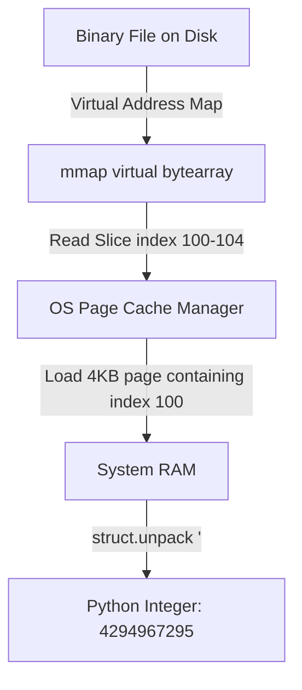

# Module 03: Binary Files & Buffers — Raw Streams, struct & mmap

Welcome back, class. Today we analyze **Binary Files & Buffers (CS-522)**.

Unlike text files, which contain characters decoded using encoding maps, binary files are raw sequences of bytes. Multimedia files (images, audio), compressed archives (ZIP), and execution binaries use specific byte layouts to represent integers, floats, strings, and structures. If you parse these layouts using manual byte slicing without accounting for processor architectures (Endianness), or load multi-gigabyte binary files directly into RAM, you will cause data corruption and Out-of-Memory crashes.

Today, we will study **raw binary buffer management**, learn how to parse structured binary layouts using Python's **`struct`** module, and implement high-performance file indexing using **`mmap` (Memory-Mapped Files)**.

---

## 1. Academic Lecture: Endianness, Struct Layouts, and Memory Mapping

Binary data processing requires low-level bit and byte management:

### 1. The Endianness Problem (Byte Ordering)
When an integer exceeds 8 bits, it spans multiple bytes. Computer architectures store these bytes in two ways:
*   **Little-Endian (`<`)**: The least significant byte is stored first (at the lowest memory address). Used by x86 and ARM processors.
*   **Big-Endian (`>`)**: The most significant byte is stored first. Standard for network protocols and legacy file formats.
*   **The Hazard**: If you parse a little-endian integer using big-endian rules, the value is corrupted. For example, the 16-bit integer `258` is `0x0102` in hex.
    *   Big-Endian: `01 02`
    *   Little-Endian: `02 01`

### 2. The `struct` Parsing Contract
Python's standard `struct` library converts between Python values and C structs represented as Python bytes. We use format strings to define formatting contracts:
*   `h` / `H`: Signed / Unsigned 16-bit Short Integer
*   `i` / `I`: Signed / Unsigned 32-bit Integer
*   `f` / `d`: 32-bit Float / 64-bit Double
*   `s`: Raw char array (string bytes)

### 3. Memory Mapping (`mmap`)
Loading large files (like 10GB audio logs) using `.read()` consumes massive RAM.
*   **The Abstraction**: `mmap` creates a virtual memory mapping of a file directly inside the OS page cache.
*   **The Benefit**: The file behaves like a giant Python `bytearray`. The OS automatically loads chunks of the file from disk only when you query specific slices, and drops them from memory when no longer needed, maintaining a constant, low RAM overhead.



---

## 2. Theory vs. Production Trade-offs

### Stream Chunk Loops vs. Memory Mapping (`mmap`)
*   **Sequential Chunk Iteration (`file.read(chunk_size)`)**:
    *   *Pro*: Predictable memory footprints; works on any file stream (including sockets and piped outputs where random access is impossible).
    *   *Con*: Slow for random-access lookups. To read the last 10 bytes of a 1GB file, the loop must read through the entire file sequentially.
*   **Memory-Mapped Random Access (`mmap`)**:
    *   *Pro*: Near-instantaneous random access. You can slice indices directly (e.g. `mapped_file[-10:]`) and let the operating system optimize disk reads.
    *   *Con*: Limits platform portability. Mapped files require local disk-level random access and can raise OS segment faults if the underlying file is truncated by another process.
*   **Production Rule**: Use **Chunk Loops** for sequential file copy operations, uploads/downloads, and network streams. Use **`mmap`** for indexing, custom databases, and parsing massive files where you need random-access lookups.

---

## 3. How to Use: Binary Struct Parsing and Memory-Mapped Indexing

Let us write a compile-grade Python 3.11+ application that parses binary structures and indexes files using `mmap`.

### A. Hand-Rolled Byte Slicing (Anti-Pattern)

Avoid converting bytes manually using arithmetic, which ignores architecture and endianness:

```python
# DANGER: Hand-rolled integer conversion.
# This code assumes big-endian architecture. If the file is written in little-endian
# or if you run this on a processor with different alignment rules, the parsed
# values will be completely corrupted.
def parse_header_vulnerable(byte_data: bytes) -> int:
    # Attempting to read a 4-byte integer from slices manually
    val = (byte_data[0] << 24) + (byte_data[1] << 16) + (byte_data[2] << 8) + byte_data[3]
    return val
```

### B. Hardened Struct and Memory-Mapped Architectures (Production Pattern)

Here is the hardened pattern. We write a binary structure parser using the `struct` module and implement a fast search indexing scanner using `mmap`.

```python
import struct
import mmap
from pathlib import Path
from typing import Tuple, Dict, Any

# SECURE: Structured Binary Header Parser
# Layout: 4 bytes magic signature, 2 bytes version (BE), 4 bytes length (LE)
HEADER_FORMAT = "<4s>H<I" # Invalid mix! Format must specify a single endianness prefix

# Correct approach: Specify endianness prefix first, then layout keys
# Prefix: < (Little-Endian)
# Format: 4s (magic string), H (2-byte unsigned short), I (4-byte unsigned int)
SECURE_HEADER_FORMAT = "<4sHI" 
HEADER_SIZE = struct.calcsize(SECURE_HEADER_FORMAT)

def parse_secure_binary_header(file_path: Path) -> Dict[str, Any]:
    if not file_path.is_file():
        raise FileNotFoundError(f"Target file missing: {file_path}")
        
    with open(file_path, "rb") as file:
        # SECURE: Read exactly the size of the header layout contract
        header_bytes = file.read(HEADER_SIZE)
        if len(header_bytes) < HEADER_SIZE:
            raise ValueError("File corrupt: Incomplete header structure.")
            
        # SECURE: Unpack bytes directly matching the schema format safely
        magic, version, payload_size = struct.unpack(SECURE_HEADER_FORMAT, header_bytes)
        
        return {
            "magic": magic.decode("ascii", errors="ignore"),
            "version": version,
            "payload_size": payload_size
        }

# SECURE: Memory-Mapped Scanner
def find_signature_offset_mmap(file_path: Path, signature: bytes) -> int:
    if not file_path.is_file():
        raise FileNotFoundError(f"Target file missing: {file_path}")

    # SECURE: Open in read-binary mode
    with open(file_path, "rb") as file:
        file_size = file_path.stat().st_size
        if file_size == 0:
            return -1
            
        # SECURE: Map the entire file descriptor into virtual memory
        # fileno retrieves the raw OS file descriptor
        # length=0 maps the entire file
        # access=mmap.ACCESS_READ maps it read-only, preventing edits
        with mmap.mmap(file.fileno(), length=0, access=mmap.ACCESS_READ) as mapped_file:
            # The mapped file supports fast byte searches (find)
            offset = mapped_file.find(signature)
            return offset
```

---

## 4. Common Errors & Pitfalls

### Pitfall 1: Format Padding and Alignment
Unpacking structs without matching CPU architecture alignments.
*   **Why it fails**: By default, Python's `struct` aligns fields to the host CPU's word boundary (injecting padding bytes). A structure matching `struct.pack('ci', b'a', 1)` might occupy 8 bytes instead of 5.
*   **Mitigation**: Always prefix your format strings with `<` (little-endian standard) or `>` (big-endian) to disable automatic padding alignment and force strict byte sizing.

### Pitfall 2: Modifying Memory-Mapped Files on Windows
Attempting to delete or write to a mapped file on disk while the `mmap` object is open.
*   **Why it fails**: Windows locks mapped files strictly. Any attempt to write to or rename the file raises a `PermissionError`.
*   **Mitigation**: Always use `mmap` as a context manager (`with`) to ensure the virtual memory handles are released before subsequent disk edits.

---

## 5. Socratic Review Questions

### Question 1
Why does setting the endianness prefix to `<` or `>` inside format strings disable Python's automated byte-alignment padding?

#### Answer
Standard C structures add padding bytes to align fields to 4-byte or 8-byte CPU register targets to optimize memory performance. However, file formats are packed packed tightly without padding. Specifying `<` or `>` forces Python to use raw standard alignment, meaning fields are placed side-by-side with no padding, matching standard serialization specifications.

### Question 2
What occurs under the hood when you search a 5GB file mapped via `mmap`? Does the operating system read the entire file into RAM?

#### Answer
No. The operating system only loads the file page-by-page (usually 4KB blocks) from disk into virtual memory as the search scans the indexes. If the target pattern is found in the first megabyte, the remaining 4.99GB is never read from disk, keeping resource usage extremely low.

---

## 6. Hands-on Challenge: Building a Binary Header Parser

### The Challenge
In this challenge, you will implement a binary parser that reads a mock wave file parameter block.

Your task:
1.  Complete the function `parse_mock_wav_params`.
2.  The input binary `header_bytes` contains a 12-byte header:
    *   First 4 bytes: ASCII format identifier (e.g. `b"RIFF"`).
    *   Next 4 bytes: File size as a little-endian unsigned integer.
    *   Last 4 bytes: MIME ID (e.g. `b"WAVE"`).
3.  Unpack the values using `struct.unpack`.
4.  Return a dictionary containing `"format"`, `"size"`, and `"mime"`.

Complete the implementation below:

```python
import struct

def parse_mock_wav_params(header_bytes: bytes) -> dict:
    # Target format string:
    # 4s -> 4-byte char array
    # I  -> 4-byte unsigned int (little-endian)
    # 4s -> 4-byte char array
    # Format prefix should be '<'
    
    # TODO: Complete this parser.
    # 1. Define layout format string: fmt = "<4sI4s"
    # 2. Check if length of header_bytes matches the calculated size of the format.
    # 3. If not, raise ValueError.
    # 4. Unpack the bytes: format_sig, size, mime_sig = struct.unpack(fmt, header_bytes)
    # 5. Return dict: {"format": format_sig.decode("ascii"), "size": size, "mime": mime_sig.decode("ascii")}
    
    return {}
```

Write the format specification and parsing logic. Save the completed file and verify the parser outputs correct dictionary elements inside `modules/03-binary-files-buffers.md`.
