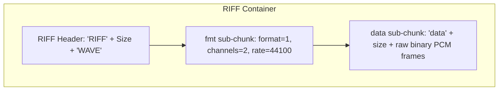

# Module 04: WAVE Audio Containers — RIFF Structure & wave Library

Welcome back, class. Today we analyze **WAVE Audio Containers (CS-522)**.

The WAV file format is the standard container for storing uncompressed, high-fidelity digital audio. It is a subclass of the **RIFF (Resource Interchange File Format)** specification. Underneath its surface, a WAV file has a strict structured binary header defining metadata like channel configurations, sample widths, and sample rates, followed by a raw data block containing digitized audio voltage measurements (Pulse Code Modulation - PCM).

Many developers make fatal mistakes when writing WAV files: omitting header specifications, writing frames out of alignment, or attempting to load compressed formats (like MP3) using the standard library. Today, we will study the **RIFF header layout**, parse WAV parameters programmatically using Python's standard **`wave`** library, and calculate audio metrics.

---

## 1. Academic Lecture: RIFF headers, PCM Channels, and Sizing Metrics

To manipulate audio containers programmatically, we must map their binary headers:

### 1. The RIFF/WAVE File Structure
A WAV file is structured as a tree of binary chunks:
*   **The RIFF Header (first 12 bytes)**: Contains the magic identifier `b"RIFF"`, followed by the 4-byte little-endian total file size, and the format identifier `b"WAVE"`.
*   **The "fmt " Sub-chunk (24 bytes)**: Defines the audio specifications:
    *   **Audio Format**: `1` indicates uncompressed Linear PCM. Other values indicate compression (e.g., A-Law, Mu-Law).
    *   **Num Channels**: `1` for Mono (single channel), `2` for Stereo.
    *   **Sample Rate**: Number of samples digitized per second (e.g. 44100 Hz).
    *   **Byte Rate**: Number of bytes processed per second:
        $$\text{Byte Rate} = \text{Sample Rate} \times \text{Num Channels} \times \left(\frac{\text{Bits per Sample}}{8}\right)$$
    *   **Block Align**: Sizing in bytes for a single complete frame:
        $$\text{Block Align} = \text{Num Channels} \times \left(\frac{\text{Bits per Sample}}{8}\right)$$
    *   **Bits per Sample (Sample Width)**: Resolution precision (e.g. 16-bit = 2 bytes, 24-bit = 3 bytes).
*   **The "data" Sub-chunk**: Contains the raw audio samples.

### 2. Standard `wave` Library
Python's standard `wave` module provides a pure-Python library to parse uncompressed PCM WAV files:
*   `wave.open(file, 'rb')`: Opens a wave file interface.
*   `getparams()`: Returns a namedtuple containing: `nchannels`, `sampwidth` (in bytes), `framerate`, `nframes`, `comptype`, `compname`.
*   `readframes(n)`: Reads and returns up to `n` frames of raw audio bytes.



---

## 2. Theory vs. Production Trade-offs

### Standard Library `wave` vs. Third-Party Decoders (libsndfile/FFmpeg)
*   **Python Standard `wave` Module**:
    *   *Pro*: Lightweight, part of the standard library, requires no external compile dependencies, and is extremely fast at extracting basic headers.
    *   *Con*: Only supports uncompressed PCM WAV files. It cannot parse compressed files (MP3, AAC, FLAC, OGG) or handle multi-chunk metadata tags (like ID3).
*   **Third-Party Decoders (`libsndfile` / `soundfile` / FFmpeg)**:
    *   *Pro*: Highly versatile. Supports almost every modern audio format, handles compression natively, and returns decoded NumPy arrays directly.
    *   *Con*: Heavy dependencies. Requires installing system binaries (like `libsndfile` or `ffmpeg` compilers), complicating cloud deployments.
*   **Production Rule**: If your pipeline strictly processes raw audio data (such as direct microphone captures or API WAV streams), use the standard **`wave`** library to avoid runtime dependency issues. If you must process user-generated uploads containing mixed formats, implement **libsndfile** and include setup validation scripts.

---

## 3. How to Use: Parsing WAV Parameters and Calculating Bitrates

Let us write a compile-grade Python 3.11+ application that extracts metadata parameters and calculates playback duration.

### A. Raw Binary Slicing & Ignoring Header Markers (Anti-Pattern)

Avoid reading raw file bytes directly and guessing properties based on file size:

```python
# DANGER: Reading raw bytes and guessing values.
# If the file contains ID3 tag chunks at the beginning, or uses custom chunk headers,
# hardcoded offsets (like file_bytes[24:28]) will return garbage values, leading
# to incorrect metrics and audio playback corruption.
def get_audio_duration_vulnerable(filepath: str) -> float:
    with open(filepath, "rb") as file:
        file_bytes = file.read()
    
    # Guessing sample rate at byte 24 and assuming 16-bit stereo
    sample_rate = int.from_bytes(file_bytes[24:28], "little")
    file_size = len(file_bytes)
    
    # Incorrect math: fails to subtract the header chunk sizes
    return file_size / (sample_rate * 2 * 2)
```

### B. The Hardened WAV Parameter Analyzer (Production Pattern)

Here is the hardened pattern. We open the WAV file using the standard `wave` library, validate that it uses uncompressed PCM formatting, extract the exact parameters, and calculate the duration and bitrates programmatically.

```python
import wave
from pathlib import Path
from typing import Dict, Any

def analyze_wav_file(file_path: Path) -> Dict[str, Any]:
    if not file_path.is_file():
        raise FileNotFoundError(f"Target audio file missing: {file_path}")

    # SECURE: Wrap open in try-except to catch format violations
    try:
        with wave.open(str(file_path), "rb") as wav_file:
            # Extract parameters
            params = wav_file.getparams()
            
            # SECURE: Validate that the compression type is PCM (uncompressed)
            if params.comptype != "NONE":
                raise ValueError(
                    f"Unsupported compression type: {params.comptype}. Only uncompressed PCM WAV is allowed."
                )
                
            # Compute play metrics
            num_channels = params.nchannels
            sample_width_bytes = params.sampwidth  # e.g., 2 for 16-bit
            sample_rate = params.framerate         # e.g., 44100
            total_frames = params.nframes
            
            # Formula: Duration = Total Frames / Sample Rate
            duration_seconds = total_frames / sample_rate
            
            # Formula: Bitrate (bps) = Sample Rate * Sample Width (bits) * Channels
            bitrate_bps = sample_rate * (sample_width_bytes * 8) * num_channels
            
            return {
                "channels": num_channels,
                "sample_width_bytes": sample_width_bytes,
                "bits_per_sample": sample_width_bytes * 8,
                "sample_rate_hz": sample_rate,
                "total_frames": total_frames,
                "duration_seconds": round(duration_seconds, 3),
                "bitrate_kbps": round(bitrate_bps / 1000, 1)
            }
            
    except wave.Error as e:
        # wave.Error is raised if the file is not a valid WAV or is compressed (e.g. MP3)
        raise ValueError(f"Invalid WAV file format or container corrupt. Details: {str(e)}")
```

---

## 4. Common Errors & Pitfalls

### Pitfall 1: Forgetting to close WAV write files
Failing to call `.close()` on a `wave.open(..., 'wb')` instance.
*   **Why it fails**: The `wave` write utility writes a dummy placeholder size inside the header at the start. It only calculates and writes the true total file and data chunk sizes when `.close()` is called. If close is skipped, the file size fields remain at zero, rendering the output file unplayable in media players.
*   **Mitigation**: Always open the file using a `with` context manager, which handles calling `.close()` automatically when the block exits.

### Pitfall 2: Confusing frames with raw bytes
Passing byte sizes instead of frame counts to `readframes()`.
*   **Why it fails**: A single audio frame contains samples for all channels. In a 16-bit stereo WAV, one frame is equal to 4 bytes (2 channels * 2 bytes). Calling `.readframes(100)` reads 400 bytes. If you pass byte limits directly, you will over-read the buffers and run out of frames.
*   **Mitigation**: Always convert your byte limits to frames:
    $$\text{Frames} = \frac{\text{Bytes}}{\text{Block Align}}$$

---

## 5. Socratic Review Questions

### Question 1
Why does calling `.readframes(10)` on a stereo 16-bit WAV file return exactly 40 bytes of data?

#### Answer
In a 16-bit stereo WAV file, each channel sample requires 2 bytes (16 bits / 8). Since there are 2 channels (Stereo), a single frame (which contains one sample for each channel) requires $2 \times 2 = 4$ bytes. Therefore, reading 10 frames returns $10 \times 4 = 40$ bytes.

### Question 2
Why does the standard `wave` library fail when opening an MP3 file, raising `wave.Error: unknown format`?

#### Answer
The standard `wave` library is a simple uncompressed parser that expects the sub-chunk format tag to equal `1` (Linear PCM). An MP3 file uses a completely different binary container structure (MPEG frames) and compression algorithms. Because the file lacks the required `RIFF` and `WAVE` headers, `wave.open` fails.

---

## 6. Hands-on Challenge: Building a WAV Frame Validator

### The Challenge
In this challenge, you will implement a validation method that parses metadata parameters and validates WAV audio standards.

Your task:
1.  Complete the function `validate_wav_spec`.
2.  Open the file at `file_path` using `wave.open`.
3.  Ensure the file is Mono (1 channel) or Stereo (2 channels) and has a sample width of exactly 2 bytes (16-bit).
4.  Calculate the total duration in seconds. If the duration exceeds `max_duration_seconds`, raise a `ValueError`.
5.  Return the calculated duration.

Complete the implementation below:

```python
import wave
from pathlib import Path

def validate_wav_spec(file_path: Path, max_duration_seconds: float) -> float:
    # TODO: Complete this WAV checker.
    # 1. Open file using wave.open(str(file_path), "rb").
    # 2. Extract parameters: params = wav.getparams()
    # 3. Check: if params.nchannels not in [1, 2], raise ValueError.
    # 4. Check: if params.sampwidth != 2, raise ValueError.
    # 5. Compute duration: duration = params.nframes / params.framerate.
    # 6. Check: if duration > max_duration_seconds, raise ValueError.
    # 7. Return duration.
    
    return 0.0
```

Write the audio specifications validation and duration calculations. Save the completed file and verify it correctly blocks invalid wave files inside `modules/04-wave-audio-headers.md`.
