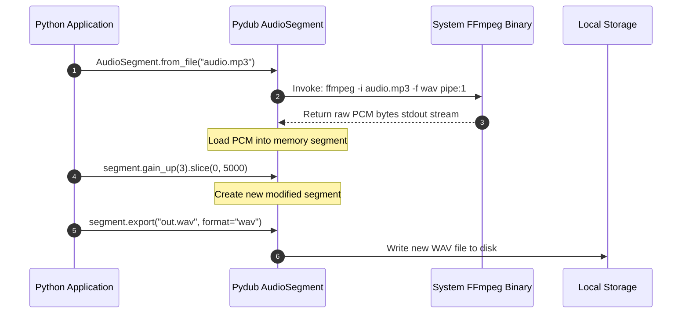

# Module 05: Audio Manipulation Libraries — pydub & librosa Pipelines

Welcome back, class. Today we analyze **Audio Manipulation Libraries (CS-522)**.

While the standard library is sufficient for reading raw headers of uncompressed WAV files, modern applications must handle diverse compressed audio container formats (like MP3, AAC, or OGG) and perform operations like volume normalization, slicing, resampling, and feature extraction (e.g. for AI transcription models). Implementing these manipulations by writing raw binary byte operations is highly complex.

Instead, we use dedicated Python audio libraries: **`pydub`** for high-level editing and format transcoding, and **`librosa`** for numerical analysis and machine learning pipeline ingestion. Today, we will study **audio pipeline design**, build format transcoder utilities, and extract normalized audio arrays.

---

## 1. Academic Lecture: AudioSegments, FFmpeg Pipelines, and Spectrogram Floats

To build audio processing systems, we utilize two separate programming paradigms:

### 1. High-Level Editing and Splicing (`pydub`)
`pydub` models audio files as **`AudioSegment`** objects. It wraps standard audio actions (slicing, reversing, concatenating, fading) in a human-friendly API.
*   **The FFmpeg Dependency**: Python itself cannot decode compressed codecs like MP3 or AAC. Under the hood, `pydub` invokes the system's **FFmpeg** command-line utility via subprocesses to read and write compressed file formats, translating them into raw PCM arrays in memory.
*   **Immutability**: `AudioSegment` objects are immutable. Any action returns a new segment object, keeping states isolated.

### 2. Numerical Machine Learning Ingestion (`librosa`)
`librosa` is the standard library for audio feature engineering.
*   **Floating-Point Normalization**: Standard 16-bit PCM audio represents voltage values as integers between `-32768` and `32767`. `librosa` automatically rescales these integers into 32-bit floating-point numbers normalized strictly between **`-1.0` and `1.0`**.
*   **Automated Resampling**: AI speech models (like Whisper) require a specific sample rate (typically 16000 Hz). `librosa` resamples the audio array automatically during loading, regardless of the input file's original sample rate.



---

## 2. Theory vs. Production Trade-offs

### pydub (FFmpeg Subprocesses) vs. librosa (Soundfile / Libsndfile Wrappers)
*   **`pydub` (FFmpeg-driven)**:
    *   *Pro*: Support for almost any audio format (MP3, WAV, OGG, FLAC, M4A). Highly robust for general file edits and format transcodes.
    *   *Con*: High process management cost. Invoking the external `ffmpeg` binary creates a new operating system process for each read/write, adding CPU overhead.
*   **`librosa` (Soundfile / Libsndfile-driven)**:
    *   *Pro*: Numerical efficiency. Read operations bypass process spawns, loading raw audio samples directly into memory as C-optimized NumPy arrays.
    *   *Con*: Limited format scope. Standard `soundfile` backends cannot decode MP3s natively on many platforms without custom plugins, throwing decoding crashes.
*   **Production Rule**: Use **`pydub`** for format conversions and editing pipelines (e.g. slicing clips, converting MP3 to WAV). Use **`librosa`** strictly for feature extraction, machine learning pipelines, and scientific analysis of raw WAV arrays.

---

## 3. How to Use: Splicing, Gain Scaling, and Resampling

Let us write a compile-grade Python 3.11+ application that processes audio using both libraries.

### A. Subprocess Command Injection (Anti-Pattern)

Avoid writing custom command line wrappers to call external conversion tools manually:

```python
import subprocess

# DANGER: Manually executing shell subprocesses to convert files.
# If filepath contains shell control characters (like spaces or semicolons),
# this triggers command injection vulnerabilities, allowing attackers to execute
# arbitrary commands on the host system.
def convert_to_wav_vulnerable(filepath: str, outputpath: str):
    cmd = f"ffmpeg -i {filepath} {outputpath}"
    subprocess.run(cmd, shell=True) # DANGER: shell=True exposes script to injection
```

### B. Secure Audio Processing Pipelines (Production Pattern)

Here is the hardened pattern. We use `pydub`'s secure wrapper classes to transcode and edit files safely, and use `librosa` to extract normalized float arrays.

```python
from pathlib import Path
import librosa
import soundfile as sf
from pydub import AudioSegment
from pydub.exceptions import CouldntDecodeError

# SECURE: Format Transcoder and Slicer via Pydub
def transcode_and_crop_audio(
    input_path: Path,
    output_path: Path,
    gain_db: float = 3.0,
    crop_duration_ms: int = 10000
) -> Path:
    if not input_path.is_file():
        raise FileNotFoundError(f"Input file not found: {input_path}")
        
    try:
        # SECURE: AudioSegment internally calls FFmpeg securely via list-based subprocess
        audio = AudioSegment.from_file(str(input_path))
        
        # Apply edits
        modified_audio = audio + gain_db  # Increase volume by gain_db decibels
        cropped_audio = modified_audio[:crop_duration_ms]  # Crop to first N milliseconds
        
        # Enforce mono 16000Hz output specs
        final_audio = cropped_audio.set_channels(1).set_frame_rate(16000)
        
        # Export securely
        final_audio.export(str(output_path), format="wav")
        return output_path
        
    except CouldntDecodeError as e:
        raise ValueError(f"Codec Error: Could not decode file format. Details: {str(e)}")

# SECURE: Numerical Feature Extractor via Librosa
def extract_audio_numpy_features(wav_path: Path) -> dict:
    if not wav_path.is_file():
        raise FileNotFoundError(f"WAV file missing: {wav_path}")
        
    # SECURE: Load audio file as a float array resampled to exactly 16000Hz
    # sr=16000 enforces target sample rate
    # mono=True mixes multi-channel files down to mono
    audio_array, sample_rate = librosa.load(str(wav_path), sr=16000, mono=True)
    
    # Calculate simple features
    duration_seconds = len(audio_array) / sample_rate
    rms_energy = float(librosa.feature.rms(y=audio_array).mean())
    
    return {
        "sample_rate": sample_rate,
        "data_length": len(audio_array),
        "duration_seconds": duration_seconds,
        "rms_energy": rms_energy,
        "max_amplitude": float(audio_array.max())
    }
```

---

## 4. Common Errors & Pitfalls

### Pitfall 1: Missing System FFmpeg Binary
Pydub throwing `RuntimeWarning: Couldn't find ffmpeg or avprobe - visiting website to install`.
*   **Why it fails**: `pydub` is a Python library wrapper. It does not compile binary codecs. If FFmpeg is not installed on the system path, it cannot decode compressed formats (MP3/OGG).
*   **Mitigation**: Always ensure that FFmpeg is installed at the system level and added to the PATH variables.

### Pitfall 2: Memory Exhaustion during Librosa loading
Attempting to load large files (e.g. 2-hour podcasts) directly using `librosa.load()`.
*   **Why it fails**: `librosa` converts the audio into 32-bit floats. A 2-hour stereo WAV file at 44.1kHz requires over 1.2GB of memory. Converting it to floats increases memory consumption to 2.4GB+, potentially crashing the application.
*   **Mitigation**: Never use `librosa.load` on large files. Use `librosa.stream` to load and process files in small chunks.

---

## 5. Socratic Review Questions

### Question 1
Why does increasing an audio file's volume gain too much (e.g., calling `audio + 20` in pydub) cause audio clipping and distortion?

#### Answer
Audio signals in digital containers have a maximum limit (called 0 dBFS). In 16-bit PCM, the maximum value is 32767. If you add too much gain, the volume calculations exceed this limit. The values are capped (clipped) at the maximum limits, turning smooth audio waves into flat, square waves, which results in distortion.

### Question 2
What occurs when `librosa.load` resamples an audio file from 44.1kHz to 16.0kHz?

#### Answer
`librosa` runs a mathematical interpolation algorithm to calculate new voltage values at the target rate of 16000 times per second. It also applies a low-pass filter to prevent aliasing (artifacts introduced by high-frequency signals).

---

## 6. Hands-on Challenge: Building a Volume Normalizer Pipeline

### The Challenge
In this challenge, you will implement an audio processing function using `pydub` to normalize the volume of a WAV file to a target decibel level.

Your task:
1.  Complete the function `normalize_audio_volume`.
2.  Open the file at `input_path` using `AudioSegment.from_file`.
3.  Calculate the difference between the target dBFS level (`target_dbfs`) and the audio segment's current average dBFS (`audio.dbfs`).
4.  Apply this difference as a gain increase or decrease.
5.  Export the normalized audio as a WAV file to `output_path`.

Complete the implementation below:

```python
from pathlib import Path
from pydub import AudioSegment

def normalize_audio_volume(input_path: Path, output_path: Path, target_dbfs: float = -20.0) -> Path:
    # TODO: Complete the volume normalizer.
    # 1. Load the segment: audio = AudioSegment.from_file(str(input_path))
    # 2. Compute the difference: diff = target_dbfs - audio.dbfs
    # 3. Apply the gain: normalized_audio = audio.apply_gain(diff)
    # 4. Export the file: normalized_audio.export(str(output_path), format="wav")
    
    return output_path
```

Write the normalizer logic. Save the completed file and verify it handles volume scaling correctly inside `modules/05-audio-processing-libraries.md`.
