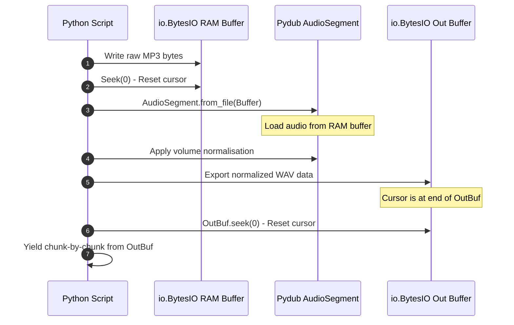

# Module 06: Chunk-by-Chunk Audio Streaming — io.BytesIO & Stream Generators

Welcome back, class. Today we analyze **Chunk-by-Chunk Audio Streaming (CS-522)**.

In high-concurrency environments, processing audio files entirely on disk introduces severe latency. For example, if your web application decodes, transcodes, and normalizes a user's audio upload by writing temporary files to disk, the server experiences heavy disk I/O wait times and SSD wear. Furthermore, in stateless cloud environments, local disk space is ephemeral.

We resolve this by processing audio streams entirely in memory using **`io.BytesIO`** (which wraps raw byte buffers in file-like interfaces) and utilizing **stream generators** to yield data chunk-by-chunk. Today, we will study **in-memory audio processing** and build dynamic chunked streaming pipelines.

---

## 1. Academic Lecture: Virtual File Buffers and Generative Streams

To avoid disk reads and RAM saturation, we treat memory buffers as file descriptors:

### 1. In-Memory Virtual Streams (`io.BytesIO`)
Python's standard `io` library provides classes to interact with memory buffers using file APIs:
*   **`io.BytesIO`**: Behaves like an opened binary file (`rb`/`wb`), but reads and writes to a private RAM buffer. You can pass a `BytesIO` instance to any function that expects a file-like object (such as `pydub` importers or standard file readers).
*   **The Cursor Pointer**: Just like a physical file, a `BytesIO` stream maintains a cursor. Writing 100 bytes advances the cursor to index `100`. If you attempt to read from the buffer immediately, the engine returns empty bytes because the cursor is at the end. You must manually call **`.seek(0)`** to reset the cursor to the beginning.

### 2. Stream Generators
Generators yield data dynamically using the `yield` keyword:
*   Instead of loading a 500MB WAV file into memory and returning it, a generator reads the file in small, fixed-size blocks (e.g. 64KB) and yields each block one at a time.
*   This allows client connections to receive and process the audio stream in real-time, keeping the server's memory usage constant and low regardless of file size.



---

## 2. Theory vs. Production Trade-offs

### Temporary Disk Files vs. In-Memory `BytesIO` Buffers
*   **Temporary Disk Files (`tempfile.NamedTemporaryFile`)**:
    *   *Pro*: Safer for massive files. Prevents memory exhaustion when processing extremely large audio files (e.g. 2-hour recordings).
    *   *Con*: High disk latency and risk of resource leaks if temporary files are not deleted on exceptions.
*   **In-Memory `BytesIO` Buffers**:
    *   *Pro*: Blazing fast. Audio processing occurs entirely in-memory, avoiding disk I/O bottlenecks.
    *   *Con*: High RAM consumption. Concurrent processing of multiple files can quickly exhaust server memory.
*   **Production Rule**: Use **`BytesIO`** for small audio clips, short voice messages, and rapid API transactions. If files exceed **50MB**, stream them to disk or process them using chunk-by-chunk disk spooling to protect against memory exhaustion.

---

## 3. How to Use: In-Memory Transcoding and Chunked Streaming

Let us write a compile-grade Python 3.11+ application that transcodes audio in-memory and streams the output in chunks.

### A. Disk Caching for Transient Tasks (Anti-Pattern)

Avoid writing files to disk for simple in-memory transcodes:

```python
import os
from pydub import AudioSegment

# DANGER: Writing temporary files to disk for every request.
# Under high concurrency, this fills up the disk, causes I/O locks,
# and leaks temporary files if the program crashes before cleanup.
def transcode_to_wav_vulnerable(mp3_bytes: bytes) -> bytes:
    temp_mp3 = "temp_input.mp3"
    temp_wav = "temp_output.wav"
    
    with open(temp_mp3, "wb") as f:
        f.write(mp3_bytes)
        
    audio = AudioSegment.from_file(temp_mp3)
    audio.export(temp_wav, format="wav")
    
    with open(temp_wav, "rb") as f:
        wav_bytes = f.read()
        
    # Attempting to clean up (Error-prone!)
    os.remove(temp_mp3)
    os.remove(temp_wav)
    return wav_bytes
```

### B. Secure In-Memory Transcoding and Streaming (Production Pattern)

Here is the hardened pattern. We load, transcode, and normalize audio entirely in memory using `io.BytesIO`, reset buffer cursors safely, and stream the output in 64KB chunks.

```python
import io
from typing import Generator
from pydub import AudioSegment
from pydub.exceptions import CouldntDecodeError

# SECURE: In-Memory Format Transcoder
def transcode_mp3_to_wav_in_memory(mp3_data: bytes) -> io.BytesIO:
    # 1. Load raw bytes into an in-memory input buffer
    input_buffer = io.BytesIO(mp3_data)
    
    # 2. Instantiate an in-memory output buffer
    output_buffer = io.BytesIO()
    
    try:
        # SECURE: Load pydub segment directly from the input memory buffer
        audio = AudioSegment.from_file(input_buffer, format="mp3")
        
        # Apply edits (e.g. convert to mono 16kHz)
        processed_audio = audio.set_channels(1).set_frame_rate(16000)
        
        # SECURE: Export normalized audio directly into the output memory buffer
        processed_audio.export(output_buffer, format="wav")
        
        # SECURE: Reset the output buffer cursor to the beginning
        # If seek(0) is omitted, reading from the buffer returns empty bytes
        output_buffer.seek(0)
        return output_buffer
        
    except CouldntDecodeError as e:
        raise ValueError(f"Codec Error: Could not decode MP3 stream. Details: {str(e)}")

# SECURE: Chunked Memory Buffer Stream Generator
def stream_memory_buffer(buffer: io.BytesIO, chunk_size: int = 64 * 1024) -> Generator[bytes, None, None]:
    # Yields file chunks sequentially to conserve memory
    while True:
        chunk = buffer.read(chunk_size)
        if not chunk:
            break
        yield chunk
```

---

## 4. Common Errors & Pitfalls

### Pitfall 1: Forgetting to call `.seek(0)`
Writing to a `BytesIO` buffer and attempting to read it immediately without resetting the cursor.
*   **Why it fails**: The read pointer is at the end of the written data, so the read operation returns empty bytes (`b""`), causing dependent libraries to crash with EOF exceptions.
*   **Mitigation**: Always call `.seek(0)` after writing data and before reading from a `BytesIO` stream.

### Pitfall 2: Memory leak from unreleased `BytesIO` buffers
Leaving `BytesIO` instances active in global scopes or long-lived structures.
*   **Why it fails**: `BytesIO` buffers exist entirely in RAM. If they are not garbage-collected, the server will experience memory leaks.
*   **Mitigation**: Use local scopes or clean the buffer explicitly using `.close()` when finished to release the memory.

---

## 5. Socratic Review Questions

### Question 1
Why does calling `buffer.write(data)` followed by `buffer.read()` on an `io.BytesIO` instance return empty bytes `b""`?

#### Answer
A `BytesIO` stream maintains an internal cursor indicating the current read/write index. Calling `write` appends the data and advances the cursor to the end of the buffer. Calling `read` attempts to read bytes from the current cursor position to the end of the stream, which is empty. You must call `buffer.seek(0)` to move the cursor back to the beginning of the buffer before reading.

### Question 2
In high-throughput environments, why is writing temporary files to disk a major bottleneck?

#### Answer
Writing to disk involves operating system system calls, file system locks, and physical disk writes (I/O). Even with SSDs, disk access is thousands of times slower than writing directly to system RAM. Furthermore, high write frequency degrades SSD life and risks disk space exhaustion.

---

## 6. Hands-on Challenge: Building an In-Memory Audio Splicer

### The Challenge
In this challenge, you will implement an in-memory audio splicer that cuts a segment and yields it in chunks.

Your task:
1.  Complete the function `splice_audio_in_memory`.
2.  Load the audio from `input_wav_bytes` using `io.BytesIO` and `AudioSegment.from_file`.
3.  Slice the audio to include only the range between `start_ms` and `end_ms`.
4.  Export the sliced audio as a WAV file into a new `BytesIO` buffer.
5.  Return the output `BytesIO` buffer.

Complete the implementation below:

```python
import io
from pydub import AudioSegment

def splice_audio_in_memory(
    input_wav_bytes: bytes,
    start_ms: int,
    end_ms: int
) -> io.BytesIO:
    # TODO: Complete this splicer.
    # 1. Create a BytesIO input stream wrapping input_wav_bytes.
    # 2. Load the audio: audio = AudioSegment.from_file(in_stream, format="wav")
    # 3. Slice the audio: sliced = audio[start_ms:end_ms]
    # 4. Create a BytesIO output stream: out_stream = io.BytesIO()
    # 5. Export sliced to out_stream: sliced.export(out_stream, format="wav")
    # 6. Reset output stream cursor: out_stream.seek(0)
    # 7. Return out_stream.
    
    return io.BytesIO()
```

Write the slicing and buffer cursor reset logic. Save the completed file and verify it returns correct chunked data inside `modules/06-chunked-audio-streaming.md`.
