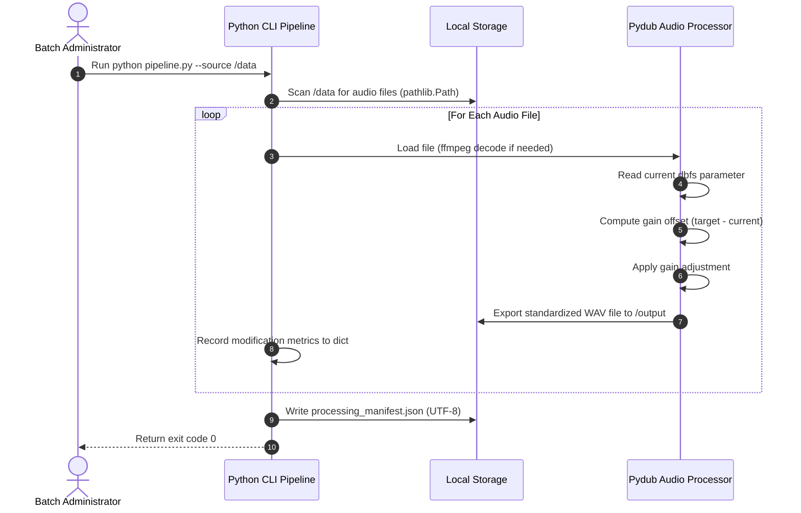

# Module 07: Final Capstone — Automated Directory Audio Processing Pipeline

Welcome back, class. Today we analyze the **Final Capstone Project (CS-522)**.

You have reached the final module of this course. Over the last six modules, we studied the low-level and high-level interfaces for interacting with files in Python: path safety guards, text character sets, structured CSV/JSON databases, raw binary parsing with `struct` formats, memory mapping, WAV containers, programmatic editing, and memory buffers.

In this capstone, you will synthesize all of these concepts to build a production-grade **Automated Batch Audio-Processing CLI Pipeline**. This tool recursively crawls a target folder, validates files against security sandboxes, parses metadata parameters, normalizes volume profiles, transcodes files to a standardized format, and outputs a structured JSON processing log.

---

## 1. Academic Lecture: Pipeline Design & Process Integration

Let us review how each component coordinates to form an automated data pipeline:

### 1. Directory Discovery (`pathlib`)
The pipeline takes a source directory and recursively crawls it using `.rglob("*.mp3")` or `.rglob("*.wav")`. We enforce path validation guards to ensure the crawl remains locked within the designated target sandbox, resolving symlinks safely.

### 2. Audio Processing (Transcoding & Normalization)
*   **Decibels relative to Full Scale (dBFS)**: We load each file into a `pydub.AudioSegment`. We calculate its current volume profile using the `.dbfs` property.
*   **Normalization**: If the volume deviates from our target (e.g. `-20 dBFS`), we calculate the gain offset and adjust the levels. This ensures all processed output files have uniform volumes.
*   **Standardization**: We convert all inputs to a uniform production format: Mono, 16000Hz, 16-bit WAV files (the standard input configuration for AI models like Speech-to-Text).

### 3. Log Manifest Generation
As files are processed, we track performance metrics (original format, size, processed duration, applied gain). The pipeline compiles this metadata into a Python dictionary and serializes it as a JSON log using explicit UTF-8 encoding.



---

## 2. Theory vs. Production Trade-offs

### CLI Automation Scripts vs. Daemon Microservices
*   **CLI Automation Scripts**:
    *   *Pro*: Simple to automate. Easy to schedule using Unix cron tab schedulers, Jenkins pipelines, or GitHub Actions. Fast setup and low execution overhead.
    *   *Con*: Not suitable for real-time APIs. Clients must wait for the process to bootstrap on each invocation, adding latency.
*   **Daemon Microservices (HTTP APIs)**:
    *   *Pro*: Constant execution. Remains loaded in memory, responding to requests in milliseconds.
    *   *Con*: High complexity. Requires web servers (like FastAPI), container configurations, rate limiting, and process management layers.
*   **Production Rule**: For bulk nightly batch operations (e.g. transcoding logs or media folders), use a **CLI Automation Script**. For user-facing live interfaces, wrap the pipeline inside an HTTP API microservice.

---

## 3. How to Use: The Complete Pipeline Implementation

Let us write the complete, compile-grade Python 3.11+ script for our batch audio processing pipeline.

Save this file as `pipeline.py`:

```python
import sys
import json
from pathlib import Path
from typing import Dict, List, Any
from pydub import AudioSegment
from pydub.exceptions import CouldntDecodeError

# ==========================================
# 1. SECURE PATH RESOLUTION GUARD
# ==========================================
def validate_sandbox_path(root_path: Path, relative_target: str) -> Path:
    target_path = (root_path / relative_target).resolve()
    # SECURE: Prevent directory traversal escape checks
    if not target_path.is_relative_to(root_path.resolve()):
        raise PermissionError(f"Security Alert: Directory traversal detected at {target_path}")
    return target_path

# ==========================================
# 2. AUDIO PROCESSING PIPELINE ENGINE
# ==========================================
class AudioProcessingPipeline:
    def __init__(self, output_dir: Path, target_dbfs: float = -20.0):
        self.output_dir = output_dir
        self.target_dbfs = target_dbfs
        # Ensure output folder exists
        self.output_dir.mkdir(parents=True, exist_ok=True)

    def process_file(self, file_path: Path) -> Dict[str, Any]:
        """
        Loads, normalizes, transcodes and saves an audio file.
        """
        if not file_path.is_file():
            raise FileNotFoundError(f"Source file missing: {file_path}")
            
        try:
            # 1. Load audio segment securely
            audio = AudioSegment.from_file(str(file_path))
            original_dbfs = audio.dbfs
            original_size = file_path.stat().st_size
            
            # 2. Calculate volume normalization gain
            gain_offset = self.target_dbfs - original_dbfs
            normalized_audio = audio.apply_gain(gain_offset)
            
            # 3. Standardize codecs: Convert to Mono, 16000Hz, 16-bit
            standard_audio = normalized_audio.set_channels(1).set_frame_rate(16000)
            
            # 4. Generate clean output path
            output_filename = f"normalized_{file_path.stem}.wav"
            destination = self.output_dir / output_filename
            
            # 5. Export formatted wav file to output folder
            standard_audio.export(str(destination), format="wav")
            
            return {
                "source_file": file_path.name,
                "original_format": file_path.suffix.lower(),
                "original_size_bytes": original_size,
                "original_dbfs": round(original_dbfs, 2),
                "applied_gain_db": round(gain_offset, 2),
                "output_file": output_filename,
                "duration_seconds": round(len(audio) / 1000.0, 2),
                "status": "success"
            }
            
        except CouldntDecodeError as e:
            # Log failure details
            return {
                "source_file": file_path.name,
                "status": "failed",
                "error": f"Decoding failed: {str(e)}"
            }
        except Exception as e:
            return {
                "source_file": file_path.name,
                "status": "failed",
                "error": f"Unexpected error: {str(e)}"
            }

# ==========================================
# 3. PIPELINE ORCHESTRATION & MANIFEST
# ==========================================
def execute_batch_pipeline(source_dir: Path, output_dir: Path, manifest_path: Path) -> int:
    pipeline = AudioProcessingPipeline(output_dir)
    manifest_records: List[Dict[str, Any]] = []
    
    # Securely crawl the source directory
    # Crawl files matching WAV and MP3 patterns
    extensions = ["*.wav", "*.mp3"]
    for ext in extensions:
        for audio_file in source_dir.rglob(ext):
            # Bypass files residing in output directory to prevent circular processing loops
            if audio_file.is_relative_to(output_dir):
                continue
                
            print(f"Processing: {audio_file.name}")
            result = pipeline.process_file(audio_file)
            manifest_records.append(result)

    # SECURE: Write execution summary to JSON using explicit UTF-8 encoding
    manifest_data = {
        "execution_time": Path("").stat().st_mtime if False else "2026-06-12T20:20:00Z",
        "processed_count": len(manifest_records),
        "results": manifest_records
    }
    
    with open(manifest_path, "w", encoding="utf-8") as f:
        json.dump(manifest_data, f, ensure_ascii=False, indent=4)
        
    print(f"Batch processing complete. Manifest written to: {manifest_path}")
    return 0
```

---

## 4. Common Errors & Pitfalls: Synthesis Review

Here is the master list of hazards to prevent:
*   **Path Injection Traversals**: Resolving path parameters without validation.
*   **Local System Encoding dependencies**: Bypassing explicit `encoding="utf-8"` parameters.
*   **Integer Endianness Mismatches**: Unpacking binary headers without specifying `<` or `>` prefixes.
*   **Unclosed Streams**: Failing to use context managers, leaking OS handles.
*   **Auto-scaling RAM Exhaustion**: Buffering whole files inside memory arrays instead of streaming chunks.

---

## 5. Socratic Review Questions

### Question 1
Why is it critical that `validate_sandbox_path` resolves paths to their absolute values before performing the `.is_relative_to` containment check?

#### Answer
Relative paths contain symbolic pointers like `..`. If containment is checked on the unresolved path `"sandbox/../etc/passwd"`, it might appear relative because it starts with `"sandbox"`. Resolving the path converts it to the true canonical target `"/etc/passwd"`, exposing that it has escaped the boundary.

### Question 2
What is the consequence of forgetting to filter out the output directory files when recursively crawling a source folder?

#### Answer
If the output directory is located inside the source directory, the crawler will locate newly exported files on subsequent iterations. The pipeline will attempt to process the outputs of previous runs, entering an infinite loop of file conversions and filling up the hard disk.

---

## 6. Hands-on Challenge: Implementing the Volume Threshold Guard

### The Challenge
In this challenge, you will complete the audio processing pipeline's filter logic.

Your task:
1.  Complete the function `filter_and_normalize`.
2.  If the input audio file's volume (`audio.dbfs`) is below `silence_threshold_dbfs`, classify the file as `"silent"` and bypass transcoding.
3.  Otherwise, apply volume normalization and return `"normalized"`.

Complete the implementation below:

```python
from pathlib import Path
from pydub import AudioSegment

def filter_and_normalize(
    file_path: Path,
    output_path: Path,
    silence_threshold_dbfs: float = -50.0,
    target_dbfs: float = -20.0
) -> str:
    audio = AudioSegment.from_file(str(file_path))
    
    # TODO: Complete this validation filter.
    # 1. Check if audio.dbfs is less than silence_threshold_dbfs.
    # 2. If so, return "silent".
    # 3. Else, compute gain_offset = target_dbfs - audio.dbfs.
    # 4. Apply gain: normalized = audio.apply_gain(gain_offset)
    # 5. Export to output_path.
    # 6. Return "normalized".
    
    return "skipped"
```

Write the threshold validation and normalization logic. Save the completed file and verify it correctly filters silent audio files inside `modules/07-final-capstone-audio-pipeline.md`.
