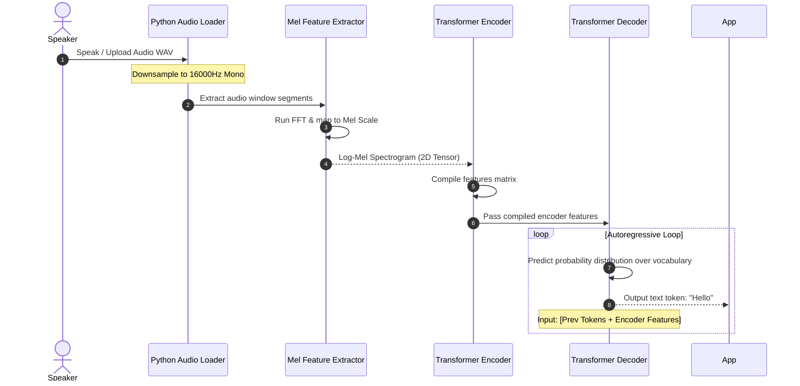

# Module 01: ASR Pipeline Foundations — Mel Spectrograms & Seq2Seq Models

Welcome back, class. Today we analyze **ASR Pipeline Foundations (CS-524)**.

Converting spoken voice recordings (such as candidate interview audio files) into clean text requires an **Automatic Speech Recognition (ASR)** pipeline. Sound waves are continuous physical vibrations. To transcribe them programmatically, we must digitize the audio signal, extract visual representation features of the frequencies, and process them through a sequence-to-sequence neural network. 

Many software applications make fatal mistakes: sending raw audio records directly to external API servers without checking data compliance, or passing incorrect sample rates to decoders, resulting in garbled text output. Today, we will study the **ASR data flow**, analyze **log-Mel spectrogram extraction**, and explore the Whisper encoder-decoder architecture.

---

## 1. Academic Lecture: Digits, Spectrograms, and Token Generation

An ASR pipeline converts raw pressure waves into text through three distinct stages:

### 1. Audio Digitization and Downsampling
Sound is recorded as a sequence of numbers (voltages) at a specific sample rate.
*   **The standard**: Professional audio is recorded at 44.1kHz or 48kHz.
*   **ASR Requirements**: Modern models (like Whisper) are trained on a standardized sample rate of **16000 Hz (16kHz) Mono**. If you pass a 48kHz file to the model, it will read it three times slower than normal, corrupting the feature extraction. We must downsample all audio beforehand.

### 2. Feature Extraction: Log-Mel Spectrograms
Neural networks cannot easily identify patterns in raw amplitude waves.
*   **The Fourier Transform**: We split the continuous audio wave into short overlapping blocks (e.g. 25ms windows) and run a Fast Fourier Transform (FFT) to convert them from the time-domain (amplitude over time) to the frequency-domain (volume of specific frequencies).
*   **The Mel Scale**: Humans do not hear frequencies linearly; we are more sensitive to differences in low pitches than high pitches. We map the frequency volumes to the **Mel Scale**, a log-spaced scale that matches human auditory perception.
*   **The Output**: The log-Mel spectrogram is a 2D image where the X-axis represents time, the Y-axis represents frequency pitch, and color intensity represents loudness.

### 3. The Sequence-to-Sequence (Seq2Seq) Model
Whisper uses an Encoder-Decoder Transformer model:
*   **The Encoder**: Reads the 2D log-Mel spectrogram image and compresses it into high-dimensional semantic feature representations.
*   **The Decoder**: Takes the encoder features and predicts the output text **token-by-token (autoregressively)**. It uses the previously generated words to predict the next word, handling language grammar and context.



---

## 2. Theory vs. Production Trade-offs

### Cloud API ASR vs. Local Self-Hosted Inference
*   **Cloud API ASR (e.g. OpenAI Whisper API)**:
    *   *Pro*: Zero GPU infrastructure overhead. High concurrency is handled automatically by the SaaS provider.
    *   *Con*: High network latency and recurring costs. Sending a 30-minute interview recording requires uploading tens of megabytes, adding bandwidth delays. Leaks private user voice data outside the enterprise boundary.
*   **Local Self-Hosted Inference (e.g. CTranslate2 / faster-whisper)**:
    *   *Pro*: Maximum security and data privacy. Zero data leaves your firewall. Zero token billing costs. Low latency because audio files are read directly from local disks or memory loops.
    *   *Con*: High hardware cost. Local models require servers configured with GPUs to transcribe files faster than real-time speed.
*   **Production Rule**: For prototypes or low-frequency workflows, use **Cloud APIs** to minimize setup time. For enterprise HR applications or systems transcribing thousands of minutes of private user conversations daily, deploy **Local ASR Engines** on secure internal nodes.

---

## 3. How to Use: Basic ASR Feature Extraction

Let us write a compile-grade Python 3.11+ application that demonstrates how to load raw audio features and validate input parameters before passing them to model layers.

### A. The Direct API Leak (Anti-Pattern)

Avoid uploading raw voice recordings containing PII directly to third-party endpoints:

```python
import httpx

# DANGER: Transmitting raw audio files containing candidate voice prints,
# names, and details to a public API. This violates standard enterprise security
# and compliance standards.
async def transcribe_cloud_vulnerable(audio_file_path: str):
    api_url = "https://api.external-speech-to-text.com/transcribe"
    
    with open(audio_file_path, "rb") as f:
        files = {"file": f}
        async with httpx.AsyncClient() as client:
            # Direct raw file leak to the cloud
            response = await client.post(api_url, files=files)
            return response.json()
```

### B. Local Input Verification & Feature Scaffolding (Production Pattern)

Here is the hardened pattern. We write a validation class that checks audio specifications (sample rate, channel structure) before processing, preventing model execution crashes.

```python
import numpy as np
from typing import Dict, Any

class ASRInputValidator:
    def __init__(self, target_sample_rate: int = 16000):
        self.target_sample_rate = target_sample_rate

    def validate_audio_data(self, audio_array: np.ndarray, sample_rate: int) -> bool:
        """
        Verify that the input audio meets ASR model specs.
        """
        # 1. SECURE: Verify correct sample rate
        if sample_rate != self.target_sample_rate:
            raise ValueError(
                f"Invalid Sample Rate: {sample_rate}Hz. Whisper requires exactly {self.target_sample_rate}Hz."
            )
            
        # 2. SECURE: Verify audio is mono (1D array)
        # If the array has 2 dimensions, it is stereo and must be downmixed
        if len(audio_array.shape) > 1 and audio_array.shape[1] > 1:
            raise ValueError(
                "Invalid Channel Count: Audio is Stereo. Please mix down to Mono (1 channel) first."
            )
            
        return True

class MockMelSpectrogramExtractor:
    def __init__(self, n_mels: int = 80):
        self.n_mels = n_mels

    def extract_features(self, audio_array: np.ndarray) -> np.ndarray:
        """
        Simulate converting raw time-domain audio samples into a log-Mel spectrogram.
        """
        # A real system calls librosa.feature.melspectrogram or torch equivalent
        # Here we mock the shape: (n_mels, time_frames)
        time_frames = len(audio_array) // 160  # Mock 10ms hop length at 16kHz
        mock_spectrogram = np.random.randn(self.n_mels, time_frames).astype(np.float32)
        
        # Apply log scaling to simulate decibel compression
        log_mel = np.log(np.maximum(mock_spectrogram, 1e-5))
        return log_mel
```

---

## 4. Common Errors & Pitfalls

### Pitfall 1: Bypassing Audio Resampling
Passing a standard 44.1kHz smartphone microphone recording directly to a model without downsampling.
*   **Why it fails**: The feature extractor maps frequencies assuming 16,000 samples per second. If the audio has 44,100 samples per second, the pitches will appear much lower than they are, causing the model to output gibberish or fail completely.
*   **Mitigation**: Always implement a resampling step (e.g., using `ffmpeg` or `libsndfile` / `pydub` filters) before feeding audio to the ASR validator.

### Pitfall 2: Silent Audio Generation Loops
The transcription decoder getting stuck repeating the same phrase (e.g. `"Thank you. Thank you. Thank you."`) on recordings containing silent background noise.
*   **Why it fails**: When audio contains only static or silent pauses, the decoder's probability distribution is flat, and it can enter a recursive loop repeating the last generated tokens.
*   **Mitigation**: Configure a Voice Activity Detector (VAD) to strip silent segments before sending audio to the ASR engine.

---

## 5. Socratic Review Questions

### Question 1
Why is the "Mel Scale" spacing log-based rather than linear? How does it align with human biological hearing?

#### Answer
The human ear is not linear. We can easily distinguish between a 100Hz tone and a 200Hz tone, but we cannot easily distinguish between a 10000Hz tone and a 10100Hz tone, even though the physical frequency difference (100Hz) is the exact same. The logarithmic Mel Scale compresses higher frequencies to match our biology, filtering out unnecessary details for speech recognition.

### Question 2
What occurs in the decoder loop during autoregressive token generation? Why is it called "autoregressive"?

#### Answer
In each iteration of the loop, the decoder predicts the probability of the *next* token. It is called "autoregressive" because the input to the decoder in step $T$ includes all the tokens generated in steps $1$ to $T-1$. The model regresses (makes predictions) on its own past outputs.

---

## 6. Hands-on Challenge: Building an Audio Channel Downmixer

### The Challenge
In this challenge, you will implement an audio channel downmixer that converts multi-channel stereo numpy arrays to mono 1D arrays, and validates sample rates.

Your task:
1.  Complete the function `prepare_asr_audio`.
2.  Ensure the `sample_rate` is exactly `16000`. If not, raise a `ValueError`.
3.  If the input `audio_array` is 2D (Stereo), average the channels along the second axis to create a 1D Mono array: `mono = audio_array.mean(axis=1)`.
4.  Return the normalized mono array.

Complete the implementation below:

```python
import numpy as np

def prepare_asr_audio(audio_array: np.ndarray, sample_rate: int) -> np.ndarray:
    # TODO: Complete this audio preparation function.
    # 1. Check if sample_rate != 16000. If so, raise ValueError.
    # 2. Check dimensions of audio_array:
    #      if len(audio_array.shape) == 2:
    #        # Average the channels (axis=1 or axis=0 depending on array layout)
    #        # Assume columns represent channels: audio_array.shape = (samples, channels)
    #        audio_array = audio_array.mean(axis=1)
    # 3. If the array is 3D or invalid, raise ValueError.
    # 4. Return the 1D numpy array.
    
    return audio_array
```

Write the channel averaging and dimensions checks. Save the completed file and verify the downmixer formats coordinates correctly inside `modules/01-asr-pipelines.md`.
