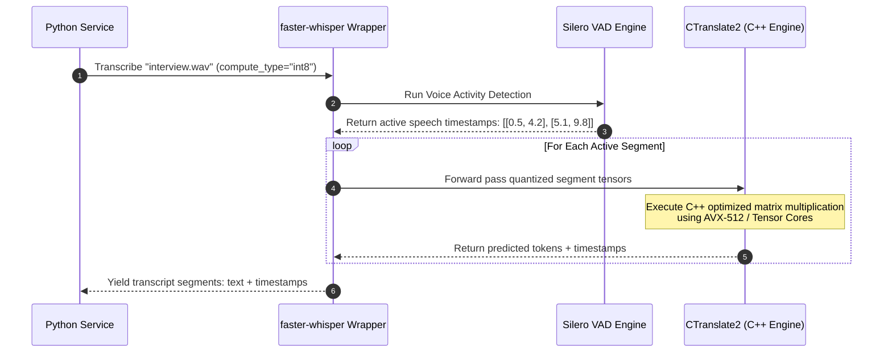

# Module 02: High-Performance Inference — faster-whisper & CTranslate2

Welcome back, class. Today we analyze **High-Performance Local Inference (CS-524)**.

Deploying standard OpenAI Whisper models using default PyTorch code scripts introduces massive performance bottlenecks. Standard PyTorch execution loops incur high memory allocation overhead, lack optimized CPU/GPU kernel bindings, and are slow at autoregressive decoding. In production, this results in high API response times and costly server infrastructure requirements.

We resolve these issues using **`faster-whisper`**. Under the hood, this library uses **CTranslate2**, a custom C++ inference engine that implements model quantization, weight caching, and C-optimized matrix multiplication. Today, we will study **CTranslate2 optimization mechanics**, configure local ASR pipelines, and manage decoding configurations.

---

## 1. Academic Lecture: CTranslate2, Quantized Computations, and VAD Filtering

`faster-whisper` achieves high throughput by optimizing low-level execution paths:

### 1. CTranslate2 Architecture
CTranslate2 compiled models replace PyTorch's generic tensor operations with highly optimized C++ kernels:
*   **Custom Memory Layouts**: Tensors are packed into contiguous memory blocks, improving cache hits on CPU and GPU.
*   **Int8/Float16 Quantization**: Weights are loaded in INT8 (on CPU) or FP16 (on GPU) precision by default. Computations use vector registers (like AVX-512 on CPU or Tensor Cores on GPU), reducing memory bandwidth limits and processing files up to **4 times faster** than standard PyTorch.

### 2. Decoding Parameters
*   **Beam Search vs. Greedy Search**:
    *   *Greedy Search (`beam_size=1`)*: The decoder selects the absolute highest probability token at each step. Fast, but can make parsing errors if subsequent words alter the semantic context.
    *   *Beam Search (`beam_size=5`)*: The decoder tracks multiple parallel candidate text paths. This yields higher accuracy but consumes more CPU/GPU cycles.
*   **Voice Activity Detection (VAD)**:
    *   Before transcribing, the library runs a lightweight VAD model (like Silero VAD) to segment the audio into sections containing active speech. Silences, coughs, and background noise are bypassed, preventing the decoder from entering repeating loops.



---

## 2. Theory vs. Production Trade-offs

### Model Size (Tiny/Base) vs. Accuracy (Medium/Large)
*   **Tiny / Base Models (e.g. `base.en`)**:
    *   *Pro*: Blazing fast. Executes in a fraction of real-time audio duration and fits on lightweight CPU containers with under 1GB of memory.
    *   *Con*: Poor accuracy on technical terminology, accents, and noisy recordings.
*   **Medium / Large Models (e.g. `large-v3`)**:
    *   *Pro*: State-of-the-art accuracy. Excellent at handling slang, specialized acronyms, and low-quality microphone streams.
    *   *Con*: Huge memory footprint (requires 5GB+ memory) and slow execution speed without dedicated GPU acceleration.
*   **Production Rule**: For high-concurrency text pipelines where cost is primary, deploy **`base` or `small`** models and apply custom vocabularies. For high-fidelity analysis or speech-to-text translation where precision is mandatory, deploy **`large-v3`** on dedicated GPUs.

---

## 3. How to Use: Thread-Safe Singleton ASR Service

Let us write a compile-grade Python 3.11+ application that implements a thread-safe singleton ASR service using `faster-whisper`.

### A. The Request Model Loading Leak (Anti-Pattern)

Avoid instantiating model files inside web request routes or executing parallel calls without locks:

```python
from faster_whisper import WhisperModel

# DANGER: Loading the model file from disk on every single function call.
# Loading model weights takes 5-10 seconds, completely blocking database operations
# and causing client requests to time out.
# Additionally, if called concurrently, CTranslate2 will raise segmentation faults
# due to shared thread-state violations.
def transcribe_audio_vulnerable(filepath: str) -> str:
    # Reloading weights on every request!
    model = WhisperModel("base", device="cpu") 
    segments, _ = model.transcribe(filepath)
    return " ".join([s.text for s in segments])
```

### B. The Thread-Safe Singleton ASR Service (Production Pattern)

Here is the hardened pattern. We write a singleton service class, load the model once during initialization, configure dynamic device auto-detection, enable VAD filtering, and enforce thread-safety using Python's `threading.Lock`.

```python
import torch
import threading
from typing import List, Dict, Any, Tuple
from faster_whisper import WhisperModel

class SecureASRService:
    _instance = None
    _lock = threading.Lock()

    def __new__(cls, *args, **kwargs):
        # Enforce singleton pattern to prevent duplicate memory allocations
        with cls._lock:
            if cls._instance is None:
                cls._instance = super().__new__(cls)
                cls._instance._initialized = False
            return cls._instance

    def __init__(self, model_size: str = "base"):
        if self._initialized:
            return
            
        # 1. Dynamic Hardware Auto-detection & Quantization selection
        if torch.cuda.is_available():
            self.device = "cuda"
            self.compute_type = "float16" # SECURE: Fast FP16 on GPU Tensor Cores
        else:
            self.device = "cpu"
            self.compute_type = "int8"    # SECURE: Low VRAM INT8 on CPU AVX registers
            
        # 2. Load the CTranslate2 model once into memory
        self.model = WhisperModel(
            model_size,
            device=self.device,
            compute_type=self.compute_type
        )
        
        self.transcribe_lock = threading.Lock()
        self._initialized = True

    def transcribe_audio(self, file_path: str) -> Tuple[str, List[Dict[str, Any]]]:
        if not Path(file_path).is_file() if 'Path' in globals() else True:
            raise FileNotFoundError(f"Audio file missing: {file_path}")

        # SECURE: Enforce lock to prevent concurrent thread state corruption inside CTranslate2
        with self.transcribe_lock:
            # Execute transcription pipeline
            # vad_filter=True enables Silero VAD to strip silent segments
            segments_generator, info = self.model.transcribe(
                file_path,
                beam_size=5,                  # Balanced accuracy
                vad_filter=True,              # SECURE: Strip silences
                vad_parameters=dict(min_silence_duration_ms=500)
            )
            
            # segments_generator is a lazy generator. We must iterate to evaluate it
            segments = []
            full_text_parts = []
            
            for segment in segments_generator:
                full_text_parts.append(segment.text)
                segments.append({
                    "start": round(segment.start, 2),
                    "end": round(segment.end, 2),
                    "text": segment.text.strip()
                })
                
            return " ".join(full_text_parts).strip(), segments
```

---

## 4. Common Errors & Pitfalls

### Pitfall 1: CUDA Library Path Mismatch
CTranslate2 raising `cuDNN load error` or `CUDA execution failure` on GPU containers.
*   **Why it fails**: CTranslate2 calls compiled NVIDIA libraries directly. If the host machine's CUDA driver version does not match the compiled container's expected cuDNN version, execution fails immediately.
*   **Mitigation**: Always align your Docker base image with the exact CUDA runtime version required by CTranslate2.

### Pitfall 2: Memory Bloat on CPU execution
Running without explicit `compute_type="int8"` on CPU containers.
*   **Why it fails**: By default, the model loads weights in float32 on CPU, allocating double the memory and slowing down matrix execution.
*   **Mitigation**: Always specify `compute_type="int8"` for CPU deployments.

---

## 5. Socratic Review Questions

### Question 1
Why does enabling the Voice Activity Detection (VAD) filter prevent Whisper from repeating phrases indefinitely when processing silent parts of an audio file?

#### Answer
When audio contains active speech, the decoder has a strong probability bias toward specific vocabulary tokens. When audio contains only silent static noise, the probability distribution over the vocabulary is uniform. If the decoder randomly selects a token, it can loop recursively. A VAD pre-filters the audio and strips silent segments, ensuring the decoder is only invoked on active voice signals.

### Question 2
How does increasing the `beam_size` from `1` to `5` alter the sequence decoding path selection mathematically?

#### Answer
*   `beam_size=1`: Greedy decoding. At each step, the model selects only the single token with the highest probability.
*   `beam_size=5`: Beam Search. The model tracks the 5 most probable sequence paths concurrently. If a path starts with a lower-probability token but results in a significantly higher cumulative probability score for the entire sentence, the model selects that path, improving transcription accuracy.

---

## 6. Hands-on Challenge: Implementing a Model Loader

### The Challenge
In this challenge, you will implement a local model initialization function that sets up device parameters and returns a configured `WhisperModel`.

Your task:
1.  Complete the function `initialize_whisper_model`.
2.  If `use_gpu` is `True` and CUDA is available, set `device="cuda"` and `compute_type="float16"`.
3.  Otherwise, set `device="cpu"` and `compute_type="int8"`.
4.  Instantiate and return the `WhisperModel` with these parameters.

Complete the implementation below:

```python
import torch
from faster_whisper import WhisperModel

def initialize_whisper_model(model_size: str, use_gpu: bool) -> WhisperModel:
    # TODO: Complete this loader.
    # 1. Determine device and compute_type based on use_gpu and torch.cuda.is_available().
    # 2. If GPU is selected, set device="cuda", compute_type="float16".
    # 3. Else, set device="cpu", compute_type="int8".
    # 4. Return WhisperModel(model_size, device=device, compute_type=compute_type).
    
    return None
```

Write the device selection and initialization logic. Save the completed file and verify the model instantiates with correct configurations inside `modules/02-faster-whisper-inference.md`.
