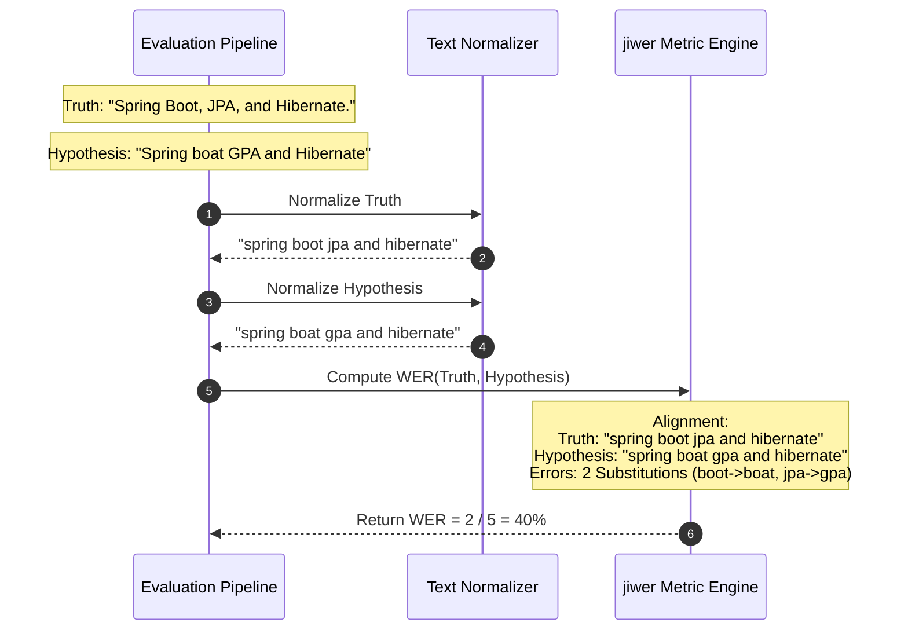

# Module 03: Transcription Evaluation — WER/CER Metrics & Normalization

Welcome back, class. Today we analyze **Transcription Evaluation Metrics (CS-524)**.

Once your ASR pipeline produces text transcriptions, you must evaluate its accuracy. In software engineering, we cannot determine transcription quality using simple string matches (e.g. `transcript == ground_truth`), because minor differences in punctuation, capitalization, or filler words will flag a high-quality transcription as incorrect.

To evaluate ASR systems objectively, we use **Word Error Rate (WER)** and **Character Error Rate (CER)**. These metrics calculate the mathematical edit distance between the model's output and a human-verified ground-truth reference. Today, we will study **Levenshtein alignment algorithms**, write a custom text normalizer, and compute error rates in Python.

---

## 1. Academic Lecture: Edit Distance, Substitutions, and Normalization

Evaluating text transcriptions requires aligning word sequences mathematically:

### 1. Levenshtein Edit Distance
To compare the model's hypothesis text ($H$) with a reference ground-truth text ($R$), we calculate the minimum number of single-word edits required to convert $R$ into $H$:
*   **Substitutions ($S$)**: A word is replaced by a different word (e.g., transcribing `"Spring Boot"` as `"Spring Boat"` = 1 Substitution).
*   **Deletions ($D$)**: A word present in the reference is omitted in the transcript (e.g. skipping `"the"` = 1 Deletion).
*   **Insertions ($I$)**: An extra word is inserted in the transcript (e.g. parsing static as `"um"` = 1 Insertion).

### 2. The Word Error Rate (WER) Formula
Word Error Rate calculates the ratio of errors to the total number of words in the reference ($N$):
$$\text{WER} = \frac{S + D + I}{N}$$
*   *Note*: Because insertions add extra words, the error count $(S+D+I)$ can exceed $N$, meaning WER can be greater than `1.0` (100%).
*   *Interpretation*: A WER of `0.0` is a perfect match. A WER of `0.1` means a 10% error rate (90% accuracy). Production systems target a WER below **`10% to 15%`**.

### 3. Text Normalization (Standardization)
If the reference contains `"We met at 10 AM."` and the model transcribes `"we met at ten am"`, a raw WER calculation flags two errors due to capitalization, punctuation, and numeric formatting.
*   **The Solution**: Before calculating metrics, we run both strings through a **Normalizer** to strip punctuation, convert to lowercase, and standardize numbers, ensuring we measure true audio transcription accuracy.



---

## 2. Theory vs. Production Trade-offs

### Word Error Rate (WER) vs. Character Error Rate (CER)
*   **Word Error Rate (WER)**:
    *   *Pro*: Matches human perception of reading errors. If a candidate says `"database"` and the transcript outputs `"data base"`, it is flagged as an error, indicating the word boundary failed.
    *   *Con*: Highly sensitive to compound words and spelling variations. Fails on non-spaced character-based languages (like Chinese or Japanese) where word boundaries are not marked by spaces.
*   **Character Error Rate (CER)**:
    *   *Pro*: Granular. Measures edit distances at the character level. In the `"database"` vs `"data base"` example, the CER is low (only 1 space inserted), reflecting that the transcription was nearly correct. Works on all languages.
    *   *Con*: Can hide critical semantic failures. If the model transcribes `"cat"` instead of `"car"`, the CER is only 33% (1 character substituted), but the word meaning is completely changed.
*   **Production Rule**: For English speech recognition systems, evaluate using **WER** as your primary business metric. Use **CER** as a secondary diagnostic to determine if errors are minor spelling mismatches or complete word failures.

---

## 3. How to Use: The ASR Evaluation Pipeline

Let us write a compile-grade Python 3.11+ application that normalizes text and calculates metrics using the `jiwer` library.

### A. Raw String Mismatch (Anti-Pattern)

Avoid calculating error rates directly on raw, un-normalized text strings:

```python
# DANGER: Directly comparing raw transcripts.
# Capitalization differences (e.g. "REST" vs "rest") and punctuation
# will artificially inflate your error metrics, making a high-quality
# transcription pipeline appear inaccurate.
def evaluate_raw_accuracy_vulnerable(truth: str, hypothesis: str) -> float:
    truth_words = truth.split()
    hypothesis_words = hypothesis.split()
    
    # Simple element match fails to align insertions or deletions
    errors = sum(1 for t, h in zip(truth_words, hypothesis_words) if t != h)
    return errors / len(truth_words)
```

### B. The Hardened ASR Evaluation Pipeline (Production Pattern)

Here is the hardened pattern. We write a robust text normalizer using regular expressions, check for zero-word reference boundaries, and calculate metrics using `jiwer`.

```python
import re
from typing import Dict
import jiwer

class ASRTextNormalizer:
    @staticmethod
    def normalize(text: str) -> str:
        """
        Standardizes text by stripping punctuation, extra spaces, and casing.
        """
        # Convert to lowercase
        normalized = text.lower()
        
        # Remove punctuation characters
        normalized = re.sub(r'[^\w\s]', ' ', normalized)
        
        # Standardize whitespace (replace multiple spaces/newlines with a single space)
        normalized = re.sub(r'\s+', ' ', normalized).strip()
        
        # Basic acronym standardization (e.g., "j.p.a." -> "jpa")
        normalized = re.sub(r'\b([a-z])\s+(?=[a-z]\b)', r'\1', normalized)
        
        return normalized

class ASREvaluator:
    def __init__(self):
        self.normalizer = ASRTextNormalizer()

    def compute_accuracy_metrics(self, reference: str, hypothesis: str) -> Dict[str, float]:
        # 1. Normalize both text streams
        clean_ref = self.normalizer.normalize(reference)
        clean_hyp = self.normalizer.normalize(hypothesis)
        
        # 2. SECURE: Check reference word count boundaries to prevent ZeroDivisionError
        if not clean_ref:
            raise ValueError("Evaluation Error: Ground-truth reference cannot be empty.")
            
        # 3. Calculate metrics using jiwer
        # WER = (Substitutions + Deletions + Insertions) / Reference_Words
        word_error_rate = jiwer.wer(clean_ref, clean_hyp)
        
        # CER = (Substitutions + Deletions + Insertions) / Reference_Characters
        char_error_rate = jiwer.cer(clean_ref, clean_hyp)
        
        return {
            "wer": word_error_rate,
            "cer": char_error_rate,
            "word_accuracy": max(0.0, 1.0 - word_error_rate),
            "reference_word_count": len(clean_ref.split())
        }
```

---

## 4. Common Errors & Pitfalls

### Pitfall 1: ZeroDivisionError on Silent Files
Attempting to calculate WER when the ground-truth reference is empty.
*   **Why it fails**: If a recording contains only silence, the reference string is `""`. Dividing by $N=0$ raises a python `ZeroDivisionError` and crashes the evaluation loop.
*   **Mitigation**: Always validate that the normalized reference contains at least one word before calling the metric engine.

### Pitfall 2: Over-Normalization of technical jargon
Using standard English text normalizers that convert technical terms incorrectly (e.g. converting `"SQL"` to `"sequel"`).
*   **Why it fails**: If the candidate says `"SQL"` and the reference transcript lists `"SQL"`, but your normalizer converts it to `"sequel"`, it will artificially flag a mismatch error against the raw transcript.
*   **Mitigation**: Customize normalizers to preserve domain-specific technical acronyms and terminology.

---

## 5. Socratic Review Questions

### Question 1
How can the Word Error Rate (WER) exceed `1.0` (100%)? Provide a concrete example.

#### Answer
WER exceeds `1.0` when the number of insertions is greater than the total number of words in the reference.
*   *Example*:
    *   Reference: `"hello"` ($N=1$)
    *   Transcript: `"hello there world check"` (1 match, 3 Insertions)
    *   $\text{WER} = \frac{0 + 0 + 3}{1} = 3.0$ (300% Error Rate)

### Question 2
Why does Levenshtein Distance use dynamic programming under the hood to align sequences?

#### Answer
Comparing all possible alignments of insertions, deletions, and substitutions between two long text sequences has exponential time complexity. Dynamic programming resolves this by building a distance matrix, caching intermediate calculations, and finding the optimal path in $O(M \times N)$ time.

---

## 6. Hands-on Challenge: Building a WER Calculator

### The Challenge
In this challenge, you will implement a WER calculator in Python without using external libraries.

Your task:
1.  Complete the function `calculate_manual_wer`.
2.  Input `ref_words` and `hyp_words` are lists of strings.
3.  Compute the Levenshtein distance at the word level.
4.  For simplicity, you are provided with a helper function `get_word_edits(ref, hyp)` which returns a tuple `(substitutions, deletions, insertions)`.
5.  Return the calculated Word Error Rate.

Complete the implementation below:

```python
def get_word_edits(ref: list[str], hyp: list[str]) -> tuple[int, int, int]:
    # Dummy editor returns edits mapping: (sub, del, ins)
    # Assumes simple sequential index comparison for simplicity of test
    subs, dels, ins = 0, 0, 0
    min_len = min(len(ref), len(hyp))
    for r, h in zip(ref[:min_len], hyp[:min_len]):
        if r != h:
            subs += 1
    if len(ref) > len(hyp):
        dels = len(ref) - len(hyp)
    elif len(hyp) > len(ref):
        ins = len(hyp) - len(ref)
    return subs, dels, ins

def calculate_manual_wer(reference_text: str, hypothesis_text: str) -> float:
    # 1. Split strings into words lists
    ref_words = reference_text.lower().split()
    hyp_words = hypothesis_text.lower().split()
    
    # TODO: Complete this calculator.
    # 1. Check if ref_words is empty. If so, raise ValueError.
    # 2. Call edits: s, d, i = get_word_edits(ref_words, hyp_words)
    # 3. Calculate: wer = (s + d + i) / len(ref_words)
    # 4. Return wer.
    
    return 0.0
```

Write the empty checks and calculation logic. Save the completed file and verify the error values match your tests inside `modules/03-transcription-evaluation-wer-cer.md`.
