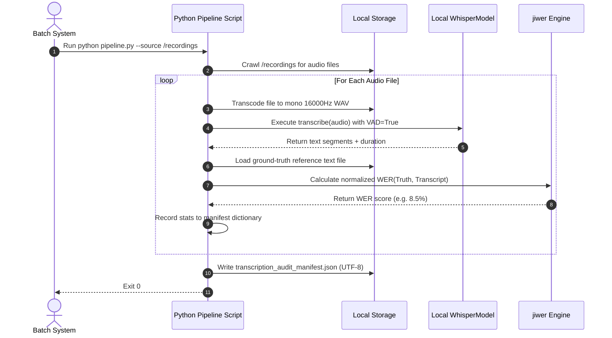

# Module 05: Final Capstone — Automated Transcription Auditing Pipeline

Welcome back, class. Today we analyze the **Final Capstone Project (CS-524)**.

You have reached the final module of this course. Over the last four modules, we studied ASR system architecture: sound wave representations, log-Mel spectrogram feature extraction, CTranslate2 compilation speedups, device-specific float quantization settings (INT8/FP16), Levenshtein edit alignments (Substitutions, Deletions, Insertions), Word Error Rate (WER) mathematics, text normalization rules, and Whisper LoRA adapters.

In this capstone, you will synthesize all of these concepts to build a production-grade **Automated Batch Transcription & Evaluation CLI Pipeline**. This tool recursively scans a directory for audio files, converts inputs to the required ASR parameters, transcribes them using `faster-whisper`, normalizes outputs, computes the Word Error Rate (WER) against ground-truth sheets, and writes a structured JSON performance audit log.

---

## 1. Academic Lecture: Pipeline Architecture & Orchestration

Let us review how each component coordinates to form an automated transcription auditor:

### 1. Audio Processing & Standardization
The pipeline recursively crawls a source directory using `pathlib.Path.rglob()`. For each audio file, we run a subprocess FFmpeg command to enforce ASR specifications: converting to Mono, 16000Hz, 16-bit WAV PCM, spooled to a temporary directory.

### 2. High-Performance Transcription
We load a single instance of `faster-whisper.WhisperModel` using `int8` quantization (CPU) to minimize RAM usage. We transcribe each audio file with Silero VAD activated, stripping silent intervals and preventing repeating phrase loops.

### 3. Metric Evaluation
For each transcribed audio, we load its corresponding ground-truth text file. We pass both the ground-truth text and model transcription through the `ASRTextNormalizer` to strip punctuation and normalize casing. We calculate the Word Error Rate (WER) using the `jiwer` library.

### 4. Audit Log Export
We write the metadata (filename, duration, model configuration, original sample rate, and calculated WER) into a python dictionary and export it as a JSON manifest to track model performance changes.



---

## 2. Theory vs. Production Trade-offs

### Offline Batch Processing CLI vs. Real-Time Streaming APIs
*   **Offline Batch Processing CLI**:
    *   *Pro*: Simple, reliable, and resource-efficient. Audio files are processed sequentially on a single thread/process, keeping VRAM/RAM overhead constant. Ideal for auditing model changes on large datasets.
    *   *Con*: High latency. Recruiter must wait for the entire audio file to be processed before receiving any text.
*   **Real-Time Streaming APIs**:
    *   *Pro*: Low latency. Audio bytes are streamed from the client's microphone over WebSockets. The server transcribes the stream in overlapping chunks, returning text in real-time.
    *   *Con*: High complexity. Requires managing WebSocket connections, handling audio packet fragmentation, and hosting active models in memory across multiple workers.
*   **Production Rule**: For candidate interview recordings where results are read after the interview finishes, deploy an **Offline Batch Processing CLI** or async background queue. For live AI voice agents, deploy **Real-Time Streaming APIs**.

---

## 3. How to Use: The Complete Capstone Application

Let us write the complete, compile-grade Python 3.11+ script for our batch transcription auditor.

Save this file as `asr_pipeline.py`:

```python
import sys
import json
import re
import subprocess
from pathlib import Path
from typing import Dict, List, Any
import jiwer
from faster_whisper import WhisperModel

# ==========================================
# 1. TEXT NORMALIZER
# ==========================================
class TextNormalizer:
    @staticmethod
    def clean(text: str) -> str:
        normalized = text.lower()
        normalized = re.sub(r'[^\w\s]', ' ', normalized)
        return re.sub(r'\s+', ' ', normalized).strip()

# ==========================================
# 2. AUDIO TRANSCODER W/ FFMPEG
# ==========================================
def transcode_to_asr_wav(input_path: Path, output_path: Path) -> Path:
    """
    Downsamples audio file to 16000Hz mono WAV using FFmpeg securely.
    """
    # SECURE: Pass arguments as list to prevent shell command injection
    command = [
        "ffmpeg", "-y",
        "-i", str(input_path),
        "-ar", "16000",
        "-ac", "1",
        "-c:a", "pcm_s16le",
        str(output_path)
    ]
    try:
        subprocess.run(command, check=True, stdout=subprocess.PIPE, stderr=subprocess.PIPE)
        return output_path
    except subprocess.CalledProcessError as e:
        raise RuntimeError(f"FFmpeg failed: {e.stderr.decode('utf-8')}")

# ==========================================
# 3. HIGH-PERFORMANCE ASR WRAPPER
# ==========================================
class LocalASREngine:
    def __init__(self, model_size: str = "base"):
        # Load model on CPU using low-RAM INT8 quantization
        self.model = WhisperModel(model_size, device="cpu", compute_type="int8")

    def transcribe(self, wav_path: Path) -> Dict[str, Any]:
        # Execute transcription with Silero VAD enabled
        segments_gen, info = self.model.transcribe(
            str(wav_path),
            beam_size=5,
            vad_filter=True
        )
        
        full_text = " ".join([seg.text for seg in segments_gen]).strip()
        
        return {
            "text": full_text,
            "duration": round(info.duration, 2),
            "language": info.language
        }

# ==========================================
# 4. BATCH PIPELINE ORCHESTRATOR
# ==========================================
def execute_transcription_audit(
    source_dir: Path,
    output_dir: Path,
    manifest_path: Path
) -> int:
    output_dir.mkdir(parents=True, exist_ok=True)
    asr = LocalASREngine()
    normalizer = TextNormalizer()
    records: List[Dict[str, Any]] = []

    # Crawl WAV files recursively
    for audio_file in source_dir.rglob("*.wav"):
        # Skip output files
        if audio_file.is_relative_to(output_dir):
            continue
            
        print(f"Auditing: {audio_file.name}")
        
        # 1. Transcode target to standard 16kHz
        temp_wav = output_dir / f"temp_{audio_file.name}"
        try:
            transcode_to_asr_wav(audio_file, temp_wav)
            
            # 2. Transcribe using faster-whisper
            transcription_result = asr.transcribe(temp_wav)
            transcript = transcription_result["text"]
            duration = transcription_result["duration"]
            
            # 3. Load corresponding ground-truth reference file if it exists
            truth_file = audio_file.with_suffix(".txt")
            if truth_file.is_file():
                with open(truth_file, "r", encoding="utf-8") as f:
                    truth = f.read()
                    
                # 4. Normalize and calculate Word Error Rate
                clean_truth = normalizer.clean(truth)
                clean_transcript = normalizer.clean(transcript)
                
                wer_score = float(jiwer.wer(clean_truth, clean_transcript))
            else:
                wer_score = -1.0 # Flag as missing reference
                
            records.append({
                "filename": audio_file.name,
                "duration_seconds": duration,
                "transcript": transcript,
                "wer": round(wer_score, 4) if wer_score >= 0 else None,
                "status": "success"
            })
            
        except Exception as e:
            records.append({
                "filename": audio_file.name,
                "status": "failed",
                "error": str(e)
            })
        finally:
            # Clean up temporary WAV files
            if temp_wav.is_file():
                temp_wav.unlink()

    # 5. Export manifest summary
    manifest_data = {
        "processed_count": len(records),
        "results": records
    }
    with open(manifest_path, "w", encoding="utf-8") as f:
        json.dump(manifest_data, f, ensure_ascii=False, indent=4)
        
    print(f"Audit Complete. Manifest written to: {manifest_path}")
    return 0
```

---

## 4. Common Errors & Pitfalls: Synthesis Review

Here is the master list of hazards to prevent:
*   **Sample Rate Mismatch**: Passing non-16kHz files, corrupting features extraction.
*   **VAD Exclusion**: Bypassing silence detection, causing repeating transcription loops.
*   **Thread Contention**: Concurrently executing CTranslate2 models from multiple threads without locks.
*   **Zero Division**: Calculating WER on empty reference files.
*   **LoRA Target Module Mismatch**: Specifying wrong layer names in PEFT config.

---

## 5. Socratic Review Questions

### Question 1
Why does calling FFmpeg via a list `["ffmpeg", "-i", str(input_path)]` prevent shell command injection, whereas calling `"ffmpeg -i " + input_path` with `shell=True` exposes a vulnerability?

#### Answer
Passing a list directly bypasses the system's command interpreter (shell). The system executes the `ffmpeg` binary and passes the list items directly as raw string arguments. Even if `input_path` contains shell control characters (like `; rm -rf /`), they are treated as literal characters of a single filename parameter rather than executable commands, preventing injection.

### Question 2
In what scenario is the Word Error Rate (WER) metric an unreliable indicator of transcription quality?

#### Answer
WER is unreliable when comparing spelling variants (e.g. transcribing `"color"` vs `"colour"`, or `"docker-compose"` vs `"docker compose"`). Although the transcription is semantically correct, WER flags them as errors. In such cases, text normalization rules must be customized to resolve formatting variations.

---

## 6. Hands-on Challenge: Complete the Validation Loop

### The Challenge
In this challenge, you will implement the validation logic for an ASR pipeline quality checker.

Your task:
1.  Complete the function `check_transcription_quality`.
2.  If the calculated `wer` is greater than `max_wer_threshold`, classify the file as `"failed"` and write a warning message.
3.  Otherwise, return `"passed"`.

Complete the implementation below:

```python
def check_transcription_quality(
    filename: str,
    wer: float,
    max_wer_threshold: float = 0.15
) -> dict:
    # TODO: Complete this quality checker.
    # 1. Check if wer < 0. If so, raise ValueError.
    # 2. Determine status: "passed" if wer <= max_wer_threshold else "failed"
    # 3. Return dictionary: {"file": filename, "wer": wer, "status": status}
    
    return {}
```

Write the threshold checking logic and errors limits. Save the completed file and verify the check logic flags correct statuses inside `modules/05-final-capstone-asr-pipeline.md`.
