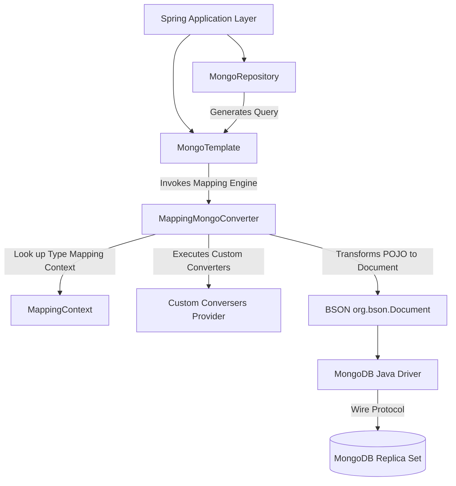

# Module 01: Spring Data MongoDB Fundamentals

This module establishes the core structural foundation of Spring Data MongoDB, exploring mapping abstractions, lifecycle events, custom type conversions, auditing, and Spring's internal serialization mechanisms.

---

## 1. What Problem It Solves

When building Java applications on top of a document-oriented database like MongoDB, developers encounter the impedance mismatch between the Java object model and MongoDB's BSON (Binary JSON) format. 

Spring Data MongoDB solves this problem by providing:
1. **Unified Mapping Context**: Maps Java classes directly to BSON documents using declarative metadata annotations (`@Document`, `@Id`, `@Field`).
2. **Standardized Query Abstractions**: Offers both declarative high-level access (`MongoRepository`, `ReactiveMongoRepository`) and low-level template operations (`MongoTemplate`, `ReactiveMongoTemplate`).
3. **Automatic Auditing**: Auto-injects creation and modification metadata (`@CreatedDate`, `@LastModifiedDate`, `@CreatedBy`, `@LastModifiedBy`).
4. **Flexible Converter Engine**: Plugs custom type converters directly into the BSON serialization pipeline, ensuring complex Java structures are cleanly persisted.
5. **Polymorphic Type Mapping**: Manages class inheritance trees seamlessly through metadata tagging (`_class`).

---

## 2. Why MongoDB Instead of Relational Databases (RDBMS)

Relational database mapping frameworks (like Hibernate/JPA) map objects to a rigid tabular structure of rows, columns, and foreign keys. This requires complex join operations, schema migrations, and object-relational mapping (ORM) setups.

MongoDB is chosen for specific high-scale and unstructured use cases because:
* **Flexible/Dynamic Schema**: Document schemas are self-describing. Different documents within the same collection can have varying structures, which is ideal for catalogs, logs, and polymorphic domain structures.
* **Hierarchical/Embedded Data Structures**: Instead of joining multiple tables (e.g., `Order`, `OrderItems`, `ShippingAddress`), MongoDB represents the entire domain aggregate as a single, nested BSON document. This guarantees single-document atomic writes and localized reads without overhead from joins.
* **Horizontal Scalability**: MongoDB was built from the ground up to scale horizontally via sharding, distributing data across partitions without complex application-side routing.

---

## 3. Trade-offs and Limitations

| Architectural Attribute | Relational (JPA / RDBMS) | Spring Data MongoDB |
| :--- | :--- | :--- |
| **Object Relationships** | Strictly enforced foreign keys and constraints. Joins are first-class citizens. | Handled via embedding (denormalization) or loose references. Database-level joins (`$lookup`) exist but are costly. |
| **Transaction Boundaries** | Multi-table transactions are the standard default. High locking overhead. | Single-document writes are atomic by default. Multi-document transactions require a Replica Set and carry throughput penalties. |
| **Storage Efficiency** | Normalized tables reduce duplication; low storage footprint. | BSON duplicates keys in every document, and Spring Data adds `_class` metadata. High storage footprint. |
| **Write Latency** | Higher due to ACID checks, locking, and index maintenance across multiple tables. | Extremely low when using single-document atomic updates and tunable write concerns. |

---

## 4. Common Mistakes & Anti-patterns

### Overusing DBRefs
Developers migrating from Hibernate often map relationships using `@DBRef`. A `@DBRef` tells Spring Data to fetch another document in a separate network call or use a lazy proxy. 
* *Why it's bad*: This leads to the classic $N+1$ select query problem, defeating MongoDB's localized read benefits.
* *Production Fix*: Denormalize child structures directly inside the parent document, or use manual `$id` fields (ObjectId) and perform application-side batch loading or aggregation pipelines.

### Relying on Lifecycle Events for Business Logic
Spring Data MongoDB provides lifecycle interceptors like `BeforeSaveCallback` and `AfterSaveCallback`. 
* *Why it's bad*: These events run within the main persistence thread. Blocking operations inside them (like calling external APIs or other databases) will crash application throughput.
* *Production Fix*: Keep lifecycle callbacks strictly focused on data formatting or lightweight auditing. Move complex business logic to service layers or publish domain events asynchronously.

### Ignoring the `_class` Field Storage Overhead
By default, Spring Data MongoDB persists the fully qualified class name of the entity in a field called `_class` to handle polymorphic conversion.
* *Why it's bad*: For millions of small documents, storing `"company.project.module.model.User"` in every document wastes megabytes of RAM and disk space, and increases indexing size.
* *Production Fix*: Override the default type mapper to use aliases or remove the field entirely if polymorphism is not required.

---

## 5. When NOT to Use MongoDB

* **Strict Normalized Relational Schemes**: If your core business requires complex, ad-hoc, multi-entity joins that change frequently, RDBMS is superior.
* **Deep Dynamic Graph Models**: When your data involves highly interconnected entities (like social graphs or pathfinding), a dedicated Graph Database (like Neo4j) is more appropriate.
* **Append-Only Analytical Workloads**: For processing terabytes of immutable events with raw column aggregation, Columnar/OLAP databases (like ClickHouse or Snowflake) outperform MongoDB.

---

## 6. Spring Boot & Spring Data Implementation

### Core Dependencies (`pom.xml`)
```xml
<dependencies>
    <dependency>
        <groupId>org.springframework.boot</groupId>
        <artifactId>spring-boot-starter-data-mongodb</artifactId>
    </dependency>
    <dependency>
        <groupId>org.springframework.boot</groupId>
        <artifactId>spring-boot-starter-validation</artifactId>
    </dependency>
</dependencies>
```

### Application Configuration (`application.yml`)
```yaml
spring:
  data:
    mongodb:
      uri: mongodb://localhost:27017,localhost:27018,localhost:27019/retail_db?replicaSet=rs0
      # Configure connection pool settings for high throughput
      option:
        min-connection-per-host: 10
        max-connection-per-host: 100
        connect-timeout: 5000
        socket-timeout: 10000
```

### Domain Document Mapping
```java
package com.masterclass.mongodb.domain;

import org.springframework.data.annotation.Id;
import org.springframework.data.annotation.CreatedDate;
import org.springframework.data.annotation.LastModifiedDate;
import org.springframework.data.annotation.Version;
import org.springframework.data.mongodb.core.index.CompoundIndex;
import org.springframework.data.mongodb.core.index.Indexed;
import org.springframework.data.mongodb.core.mapping.Document;
import org.springframework.data.mongodb.core.mapping.Field;
import org.springframework.data.mongodb.core.mapping.FieldType;

import java.time.Instant;
import java.util.List;

@Document(collection = "customers")
@CompoundIndex(name = "idx_status_email", def = "{'status': 1, 'email': 1}", unique = true)
public class Customer {

    @Id
    private String id;

    @Field("first_name")
    private String firstName;

    @Field("last_name")
    private String lastName;

    @Indexed(unique = true)
    private String email;

    @Field("status")
    private String status;

    @Field("metadata")
    private List<Attribute> attributes;

    @CreatedDate
    @Field("created_at")
    private Instant createdAt;

    @LastModifiedDate
    @Field("updated_at")
    private Instant updatedAt;

    @Version
    private Long version;

    // Getters, Setters, Constructors
    public String getId() { return id; }
    public void setId(String id) { this.id = id; }
    public String getFirstName() { return firstName; }
    public void setFirstName(String firstName) { this.firstName = firstName; }
    public String getLastName() { return lastName; }
    public void setLastName(String lastName) { this.lastName = lastName; }
    public String getEmail() { return email; }
    public void setEmail(String email) { this.email = email; }
    public String getStatus() { return status; }
    public void setStatus(String status) { this.status = status; }
    public List<Attribute> getAttributes() { return attributes; }
    public void setAttributes(List<Attribute> attributes) { this.attributes = attributes; }
    public Instant getCreatedAt() { return createdAt; }
    public Instant getUpdatedAt() { return updatedAt; }
    public Long getVersion() { return version; }
}
```

```java
package com.masterclass.mongodb.domain;

import org.springframework.data.mongodb.core.mapping.Field;

public class Attribute {
    @Field("key")
    private String key;
    @Field("val")
    private String value;

    public Attribute() {}
    public Attribute(String key, String value) {
        this.key = key;
        this.value = value;
    }
    public String getKey() { return key; }
    public String getValue() { return value; }
}
```

---

## 7. Production Architecture Examples

### 1. Architectural Flow of Spring Data MongoDB Internals
The diagram below shows how operations move from the Repository/Template abstractions down to MongoDB's wire protocol via the `MappingMongoConverter` and the BSON drivers:



### 2. High-Performance Configuration mapping (`_class` optimization)
To remove the `_class` field or map custom types natively, write a custom `MongoDatabaseFactory` and `MappingMongoConverter` configuration:

```java
package com.masterclass.mongodb.config;

import com.masterclass.mongodb.converter.ZonedDateTimeWriteConverter;
import com.masterclass.mongodb.converter.ZonedDateTimeReadConverter;
import org.springframework.context.annotation.Bean;
import org.springframework.context.annotation.Configuration;
import org.springframework.data.mongodb.config.EnableMongoAuditing;
import org.springframework.data.mongodb.core.convert.DbRefResolver;
import org.springframework.data.mongodb.core.convert.DefaultDbRefResolver;
import org.springframework.data.mongodb.core.convert.DefaultMongoTypeMapper;
import org.springframework.data.mongodb.core.convert.MappingMongoConverter;
import org.springframework.data.mongodb.core.convert.MongoCustomConversions;
import org.springframework.data.mongodb.core.mapping.MongoMappingContext;
import org.springframework.data.mongodb.MongoDatabaseFactory;

import java.util.Arrays;

@Configuration
@EnableMongoAuditing
public class MongoConfig {

    private final MongoDatabaseFactory mongoDbFactory;

    public MongoConfig(MongoDatabaseFactory mongoDbFactory) {
        this.mongoDbFactory = mongoDbFactory;
    }

    @Bean
    public MongoCustomConversions customConversions() {
        return new MongoCustomConversions(Arrays.asList(
            new ZonedDateTimeWriteConverter(),
            new ZonedDateTimeReadConverter()
        ));
    }

    @Bean
    public MappingMongoConverter mappingMongoConverter(MongoMappingContext context, 
                                                       MongoCustomConversions conversions) {
        DbRefResolver dbRefResolver = new DefaultDbRefResolver(mongoDbFactory);
        MappingMongoConverter converter = new MappingMongoConverter(dbRefResolver, context);
        converter.setCustomConversions(conversions);
        
        // Remove the "_class" field entirely to optimize storage
        converter.setTypeMapper(new DefaultMongoTypeMapper(null));
        
        return converter;
    }
}
```

### 3. Custom Converters Implementation
MongoDB doesn't store native Java `ZonedDateTime` timezone information—it only stores UTC timestamps. These converters store `ZonedDateTime` as a compound document holding both the Instant date and the Zone string.

```java
package com.masterclass.mongodb.converter;

import org.bson.Document;
import org.springframework.core.convert.converter.Converter;
import org.springframework.data.convert.WritingConverter;
import java.time.ZonedDateTime;
import java.util.Date;

@WritingConverter
public class ZonedDateTimeWriteConverter implements Converter<ZonedDateTime, Document> {
    @Override
    public Document convert(ZonedDateTime source) {
        Document document = new Document();
        document.put("date", Date.from(source.toInstant()));
        document.put("zone", source.getZone().getId());
        return document;
    }
}
```

```java
package com.masterclass.mongodb.converter;

import org.bson.Document;
import org.springframework.core.convert.converter.Converter;
import org.springframework.data.convert.ReadingConverter;
import java.time.ZoneId;
import java.time.ZonedDateTime;
import java.util.Date;

@ReadingConverter
public class ZonedDateTimeReadConverter implements Converter<Document, ZonedDateTime> {
    @Override
    public ZonedDateTime convert(Document source) {
        Date date = source.getDate("date");
        String zone = source.getString("zone");
        return ZonedDateTime.ofInstant(date.toInstant(), ZoneId.of(zone));
    }
}
```

---

## 8. Interview-Level Questions

### Q1: Explain how `MappingMongoConverter` resolves object mappings under the hood. How does it track relationships?
**Answer**: `MappingMongoConverter` relies on the `MappingContext` metadata (populated scanning annotations like `@Document`, `@Id`, and `@Field`). When converting a POJO to BSON:
1. It registers the POJO with the metadata context.
2. It processes fields recursively: primitive types are mapped to BSON structures directly; nested POJOs are mapped as nested BSON documents.
3. If it encounters a `@DBRef` annotated field, it initiates a proxy or lazy resolver (`DbRefResolver`), which points to a reference container in the target collection. Manual references (storing raw ObjectIds) do not trigger relationships and must be fetched via application code or `$lookup` stages.

### Q2: What is the risk of keeping the default `_class` field in high-frequency production write paths? How do you disable it, and what features do you lose?
**Answer**: 
* **Risk**: High disk/RAM usage overhead. A fully qualified class name can consume up to 60+ bytes per document. In a collection containing 100 million documents, this wastes 6GB+ of storage, bloated indexes, and memory cache space.
* **Disabling**: Provide a custom `MappingMongoConverter` Bean configured with `DefaultMongoTypeMapper(null)`.
* **Lost Features**: You lose the ability to query polymorphically. If you have an abstract class `Vehicle` with subclasses `Car` and `Bike` stored in the same collection, disabling `_class` prevents Spring from auto-instantiating the correct subclass upon retrieval.

### Q3: How does Spring Data MongoDB Auditing work under the hood? Does it use database-side triggers?
**Answer**: No, Spring Data Auditing is purely application-side. It listens to Spring Application context lifecycle events (specifically matching `BeforeConvertCallback`). When Spring converts a Java object into a BSON document, the interceptor checks for the presence of `@CreatedDate`, `@LastModifiedDate`, `@CreatedBy`, and `@LastModifiedBy`. It then injects the current timestamp (or retrieves the auditor from a registered `AuditorAware` bean) into the entity properties before serialization.

---

## 9. Hands-on Exercises

### Exercise 1: Inspecting the BSON payload
1. Spin up the MongoDB environment using the Docker Compose file in the root `README.md`.
2. Bootstrap a simple Spring Boot app with the `Customer` document mapped above.
3. Save a customer object.
4. Open the MongoDB shell (`mongosh`) and query:
   ```javascript
   use retail_db;
   db.customers.find().pretty();
   ```
5. Observe the presence of `_class` in the document structure. Note its storage size compared to the actual domain fields.

### Exercise 2: Implementing Class-level Aliases
Instead of removing `_class` entirely, map subclass aliases to maintain polymorphism without the storage overhead:
1. Annotate a class with `@TypeAlias("cust_alias")` or configure it programmatically.
2. Verify in `mongosh` that the value of `_class` has changed from the package class path to `"cust_alias"`.

---

## 10. Mini-Project: Audit Log Converter Service

### Scenario
You are building an append-only Audit Log system for a payment processing gateway. The system must record financial transactions. The transaction currency must be stored as a custom Java `Money` value object containing an amount (BigDecimal) and currency (String). However, because MongoDB BSON lacks decimal-preserving precision outside high-spec formats, you must write a custom converter that serializes the `Money` object into a flat BSON string representation like `USD:150.50` and deserializes it back. Additionally, auditing metadata must record the system operator executing the change.

### Step 1: Implement the Domain Objects & Converter
```java
package com.masterclass.mongodb.miniproject.model;

import java.math.BigDecimal;

public class Money {
    private final BigDecimal amount;
    private final String currency;

    public Money(BigDecimal amount, String currency) {
        this.amount = amount;
        this.currency = currency;
    }

    public BigDecimal getAmount() { return amount; }
    public String getCurrency() { return currency; }

    @Override
    public String toString() {
        return currency + ":" + amount.toPlainString();
    }
}
```

```java
package com.masterclass.mongodb.miniproject.converter;

import com.masterclass.mongodb.miniproject.model.Money;
import org.springframework.core.convert.converter.Converter;
import org.springframework.data.convert.ReadingConverter;
import org.springframework.data.convert.WritingConverter;
import java.math.BigDecimal;

public class MoneyConverters {

    @WritingConverter
    public static class MoneyWriteConverter implements Converter<Money, String> {
        @Override
        public String convert(Money source) {
            return source.toString();
        }
    }

    @ReadingConverter
    public static class MoneyReadConverter implements Converter<String, Money> {
        @Override
        public Money convert(String source) {
            if (source == null || !source.contains(":")) {
                return null;
            }
            String[] parts = source.split(":");
            return new Money(new BigDecimal(parts[1]), parts[0]);
        }
    }
}
```

### Step 2: Implement Audit Document with Auditing Annotations
```java
package com.masterclass.mongodb.miniproject.model;

import org.springframework.data.annotation.CreatedBy;
import org.springframework.data.annotation.CreatedDate;
import org.springframework.data.annotation.Id;
import org.springframework.data.mongodb.core.mapping.Document;
import org.springframework.data.mongodb.core.mapping.Field;
import java.time.Instant;

@Document(collection = "transaction_logs")
public class TransactionLog {

    @Id
    private String id;

    @Field("action")
    private String action;

    @Field("value")
    private Money transactionValue;

    @CreatedDate
    @Field("created_at")
    private Instant createdAt;

    @CreatedBy
    @Field("operator")
    private String operator;

    public TransactionLog() {}

    public TransactionLog(String action, Money transactionValue) {
        this.action = action;
        this.transactionValue = transactionValue;
    }

    public String getId() { return id; }
    public String getAction() { return action; }
    public Money getTransactionValue() { return transactionValue; }
    public Instant getCreatedAt() { return createdAt; }
    public String getOperator() { return operator; }
}
```

### Step 3: Implement Auditor Resolver
```java
package com.masterclass.mongodb.miniproject.config;

import org.springframework.data.domain.AuditorAware;
import org.springframework.stereotype.Component;
import java.util.Optional;

@Component
public class SecurityAuditorAware implements AuditorAware<String> {
    @Override
    public Optional<String> resolveCurrentAuditor() {
        // In real production, pull from Spring Security context
        // SecurityContextHolder.getContext().getAuthentication().getName()
        return Optional.of("SYSTEM_SCHEDULER_SVC");
    }
}
```

### Step 4: Register Custom Config
```java
package com.masterclass.mongodb.miniproject.config;

import com.masterclass.mongodb.miniproject.converter.MoneyConverters;
import org.springframework.context.annotation.Bean;
import org.springframework.context.annotation.Configuration;
import org.springframework.data.mongodb.config.EnableMongoAuditing;
import org.springframework.data.mongodb.core.convert.MongoCustomConversions;
import java.util.Arrays;

@Configuration
@EnableMongoAuditing
public class MiniProjectMongoConfig {

    @Bean
    public MongoCustomConversions customConversions() {
        return new MongoCustomConversions(Arrays.asList(
            new MoneyConverters.MoneyWriteConverter(),
            new MoneyConverters.MoneyReadConverter()
        ));
    }
}
```

### Step 5: Test Execution Verification
```java
package com.masterclass.mongodb.miniproject.repository;

import com.masterclass.mongodb.miniproject.model.Money;
import com.masterclass.mongodb.miniproject.model.TransactionLog;
import org.springframework.data.mongodb.repository.MongoRepository;
import org.springframework.stereotype.Repository;

@Repository
public interface TransactionLogRepository extends MongoRepository<TransactionLog, String> {
}
```
If you invoke `repository.save(new TransactionLog("DEPOSIT", new Money(new BigDecimal("1500.00"), "USD")))`, Spring will automatically convert the nested value class to `value: "USD:1500.00"` inside MongoDB, inject `created_at` matching the current Instant, and assign `operator` as `"SYSTEM_SCHEDULER_SVC"`.
