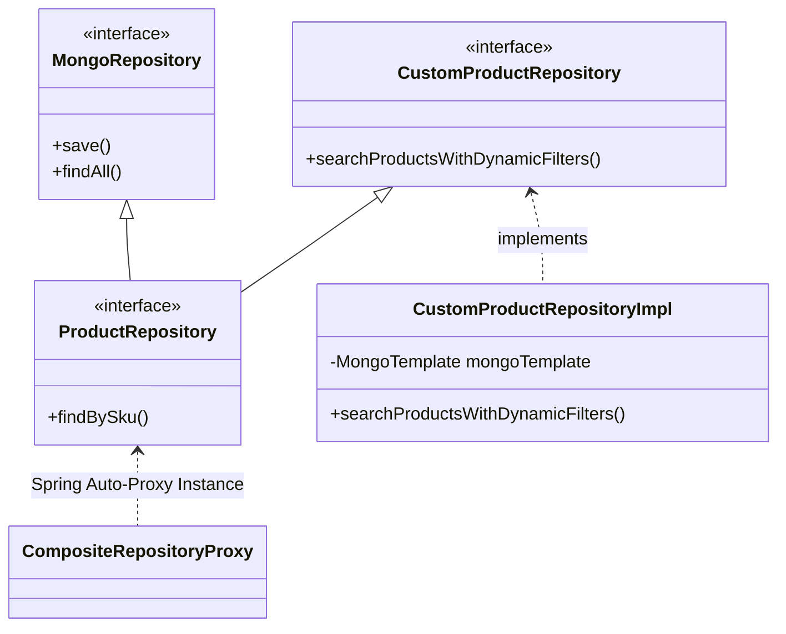
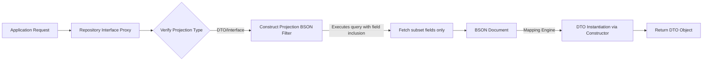

# Module 02: Repository Deep Dive

This module dives deep into Spring Data MongoDB's repository abstractions. It analyzes how queries are parsed, how to write clean dynamic criteria, projection mechanics, and when the repository pattern hits limitations, necessitating a transition to `MongoTemplate`.

---

## 1. What Problem It Solves

As a codebase grows, writing boilerplate database access queries leads to code duplication, testing difficulties, and maintenance headaches. 

The Spring Data Repository abstraction solves this by:
* **Reducing Boilerplate**: Derived query methods automatically translate method signatures (e.g., `findByEmailAndStatus`) into BSON queries at runtime.
* **Declarative Queries**: The `@Query` annotation allows engineers to write raw BSON query strings directly on interface methods, bypassing Java string building.
* **Declarative Pagination and Sorting**: Unifies pagination and sorting across the persistence layer using `Pageable` and `Sort` abstractions.
* **Composition via Fragments**: Allows custom repository implementations to be composed together with standard Mongo repositories, keeping data access logic encapsulated.

---

## 2. Why MongoDB Instead of Relational Databases (RDBMS)

In relational repositories (like Spring Data JPA), queries are validated against static table metadata. 

For MongoDB:
* **Nested Field Querying**: MongoDB repositories allow querying deep within document trees using dot-notation (e.g., `findByAddress_City`), which is impossible or extremely complex in standard JPA without joining tables.
* **JSON-Like Query Flexibility**: The `@Query` annotation accepts BSON queries that closely mirror the raw syntax used in `mongosh`, allowing copy-pasting of optimized queries straight from administrative shells.
* **Ad-Hoc Schemas**: Projections can easily retrieve dynamic, partial objects from a document without mapping them to a rigid column schema or managing complex JPQL constructors.

---

## 3. Trade-offs and Limitations

| Feature | MongoRepository | MongoTemplate |
| :--- | :--- | :--- |
| **Ease of Use** | Extremely High (declarative interfaces) | Moderate (imperative Java builder API) |
| **Dynamic Query Construction** | Low (hard to build dynamic `IF/ELSE` conditions) | High (fully dynamic Java builder queries) |
| **Aggregation Pipelines** | Not Supported directly (requires custom fragments) | Fully Supported (`AggregateIterable` integration) |
| **Performance (Deep Pagination)** | Poor if using standard `Pageable` offset pages | High (manages low-level cursor queries easily) |
| **Startup Overhead** | High (Spring parses method names on bootstrap) | Minimal (lazy invocation) |

---

## 4. Common Mistakes & Anti-patterns

### Offsets for Large Datasets
Using standard offset pagination (`Pageable.ofSize(10).withPage(10000)`) on collections with millions of documents.
* *Why it's bad*: MongoDB does not support index-based offsets. A query with a skip value of $100,000$ requires the database to load $100,010$ documents into memory, sort them, and then discard the first $100,000$. This leads to high disk I/O, CPU consumption, and eventual OOMs.
* *Production Fix*: Use keyset/cursor-based pagination by sorting on a unique, indexed key (like `_id` or a timestamp) and query relative to the last seen value (`id > lastId`).

### Exposing Full Documents when Projections Suffice
Fetching a complete 5MB document containing historical details when only a single name field is required for a list view.
* *Why it's bad*: Wastes database I/O, network bandwidth, and memory allocation in the application JVM.
* *Production Fix*: Use interface-based or DTO-based projections to only pull required fields.

### Creating Gigantic Derived Query Method Names
Writing methods like `findByStatusAndEmailAndAgeGreaterThanAndRolesContainsOrderByCreatedAtDesc`.
* *Why it's bad*: Extremely hard to read, prone to typos, and difficult to modify without breaking application boot.
* *Production Fix*: Use `@Query` with a readable BSON filter, or encapsulate the logic inside a custom repository fragment using `Criteria`.

---

## 5. When NOT to Use Repositories

* **Highly Dynamic Multi-Parameter Search**: When building a search screen with 15 optional filters where any combination can be active, using `MongoRepository` derived methods leads to combinatorial method explosion. Use `MongoTemplate` and `Criteria` instead.
* **Complex Data Aggregation and Analytics**: Any query requiring `$group`, `$unwind`, `$lookup`, or pipeline transformations cannot be expressed in derived interfaces. Use `MongoTemplate` or the custom repository fragment pattern.
* **High-Volume Bulk Writes**: Repositories operate document-by-document. For bulk insert/update scripts (thousands of operations per second), repositories are slow. Use `MongoTemplate` bulk operations.

---

## 6. Spring Boot & Spring Data Implementation

### Domain Object: Product
```java
package com.masterclass.mongodb.domain;

import org.springframework.data.annotation.Id;
import org.springframework.data.mongodb.core.index.Indexed;
import org.springframework.data.mongodb.core.mapping.Document;
import org.springframework.data.mongodb.core.mapping.Field;
import java.math.BigDecimal;
import java.util.List;

@Document(collection = "products")
public class Product {
    @Id
    private String id;
    
    @Indexed
    private String sku;
    
    private String name;
    private String category;
    private BigDecimal price;
    private List<String> tags;
    
    @Field("inventory_count")
    private int inventoryCount;

    // Getters, Setters, Constructors
    public String getId() { return id; }
    public void setId(String id) { this.id = id; }
    public String getSku() { return sku; }
    public void setSku(String sku) { this.sku = sku; }
    public String getName() { return name; }
    public void setName(String name) { this.name = name; }
    public String getCategory() { return category; }
    public void setCategory(String category) { this.category = category; }
    public BigDecimal getPrice() { return price; }
    public void setPrice(BigDecimal price) { this.price = price; }
    public List<String> getTags() { return tags; }
    public void setTags(List<String> tags) { this.tags = tags; }
    public int getInventoryCount() { return inventoryCount; }
    public void setInventoryCount(int inventoryCount) { this.inventoryCount = inventoryCount; }
}
```

### Dynamic Search DTO & Projection
```java
package com.masterclass.mongodb.dto;

import java.math.BigDecimal;

// Close-ended DTO projection for thin transfer payload
public class ProductSummary {
    private final String sku;
    private final String name;
    private final BigDecimal price;

    public ProductSummary(String sku, String name, BigDecimal price) {
        this.sku = sku;
        this.name = name;
        this.price = price;
    }

    public String getSku() { return sku; }
    public String getName() { return name; }
    public BigDecimal getPrice() { return price; }
}
```

### Custom Repository Fragment Interface
```java
package com.masterclass.mongodb.repository;

import com.masterclass.mongodb.domain.Product;
import com.masterclass.mongodb.dto.ProductSummary;
import java.math.BigDecimal;
import java.util.List;

public interface CustomProductRepository {
    List<ProductSummary> searchProductsWithDynamicFilters(
            String category, 
            BigDecimal maxPrice, 
            List<String> tags, 
            int limit
    );
}
```

### Custom Repository Fragment Implementation
```java
package com.masterclass.mongodb.repository;

import com.masterclass.mongodb.domain.Product;
import com.masterclass.mongodb.dto.ProductSummary;
import org.springframework.data.domain.Sort;
import org.springframework.data.mongodb.core.MongoTemplate;
import org.springframework.data.mongodb.core.query.Criteria;
import org.springframework.data.mongodb.core.query.Query;
import java.math.BigDecimal;
import java.util.ArrayList;
import java.util.List;

public class CustomProductRepositoryImpl implements CustomProductRepository {

    private final MongoTemplate mongoTemplate;

    // Direct injection of MongoTemplate in the fragment implementation
    public CustomProductRepositoryImpl(MongoTemplate mongoTemplate) {
        this.mongoTemplate = mongoTemplate;
    }

    @Override
    public List<ProductSummary> searchProductsWithDynamicFilters(
            String category, 
            BigDecimal maxPrice, 
            List<String> tags, 
            int limit) {
        
        Query query = new Query();
        List<Criteria> criteriaList = new ArrayList<>();

        if (category != null && !category.isBlank()) {
            criteriaList.add(Criteria.where("category").is(category));
        }
        
        if (maxPrice != null) {
            criteriaList.add(Criteria.where("price").lte(maxPrice));
        }
        
        if (tags != null && !tags.isEmpty()) {
            criteriaList.add(Criteria.where("tags").all(tags));
        }

        if (!criteriaList.isEmpty()) {
            query.addCriteria(new Criteria().andOperator(criteriaList.toArray(new Criteria[0])));
        }

        // Apply Projection to fetch only required fields (mapping to ProductSummary)
        query.fields().include("sku").include("name").include("price");
        
        // Apply Sort and Limit
        query.with(Sort.by(Sort.Direction.ASC, "price"));
        query.limit(limit);

        return mongoTemplate.find(query, ProductSummary.class, "products");
    }
}
```

### Main MongoRepository composing Fragment
```java
package com.masterclass.mongodb.repository;

import com.masterclass.mongodb.domain.Product;
import org.springframework.data.mongodb.repository.MongoRepository;
import org.springframework.data.mongodb.repository.Query;
import org.springframework.stereotype.Repository;
import java.util.List;
import java.util.Optional;

@Repository
public interface ProductRepository extends MongoRepository<Product, String>, CustomProductRepository {

    // Derived Query Method
    Optional<Product> findBySku(String sku);

    // BSON JSON Query with field projection
    // Retrieves SKU, Name, and Price; excludes _id
    @Query(value = "{ 'category' : ?0 }", fields = "{ 'sku' : 1, 'name' : 1, 'price' : 1, '_id' : 0 }")
    List<Product> findByCategoryCustomProjection(String category);

    // Derived containing query
    List<Product> findByTagsContaining(String tag);
}
```

---

## 7. Production Architecture Examples

### 1. Spring Data Fragment Inheritance & Composition
Spring Data dynamically scans interfaces, finding classes matching the suffix `Impl` to merge behaviors at runtime:



### 2. Projections Internal Routing
When an application calls `findByCategoryCustomProjection()`, Spring Data MongoDB avoids full BSON-to-POJO instantiation using the following pipeline:



---

## 8. Interview-Level Questions

### Q1: What is the naming convention for Custom Repository implementation fragments? Can we change it?
**Answer**: By default, Spring Data MongoDB searches for a class named `<InterfaceName>Impl`. For instance, if the interface is `CustomProductRepository`, the implementation class must be `CustomProductRepositoryImpl`. 
This suffix can be customized in Spring Boot configuration using `@EnableMongoRepositories(repositoryImplementationPostfix = "YourCustomSuffix")`.

### Q2: Explain the difference between "Closed Projections" and "Open Projections" in Spring Data. Which one has better performance?
**Answer**:
* **Closed Projections**: The projection interface defines getter methods that match the document property names exactly. Because the required fields are known statically, Spring Data optimizes the query by retrieving only those fields from MongoDB (generating an internal projection filter). This has superior performance and avoids unnecessary network/memory payload overhead.
* **Open Projections**: The projection interface uses Spring EL expressions (e.g. `@Value("#{target.firstName} #{target.lastName}")`). Because the execution of the SPEL expression is dynamic and can refer to arbitrary fields, Spring Data cannot optimize the query. It must fetch the full document and evaluate the expression in the JVM. This degrades performance on large documents.

### Q3: What happens behind the scenes when Spring Boot starts up regarding Derived Queries?
**Answer**: During application startup, the Spring container parses the method names of all interfaces extending `MongoRepository` (and other Spring Data interfaces). It uses regular expressions to tokenize keywords (`findBy`, `And`, `Or`, `GreaterThan`, etc.). 
If a token does not correspond to a property in the target entity class, or if the signature is syntactically invalid, Spring throws a `PropertyReferenceException` or `QueryCreationException` and halts the application context initialization. This acts as a compile-time/start-time safety check.

---

## 9. Hands-on Exercises

### Exercise 1: Building a Dynamic Query Sandbox
1. Create a REST Controller mapping `/products/search`.
2. Accept optional request parameters: `category`, `maxPrice`, `tags`.
3. Invoke the `searchProductsWithDynamicFilters` custom repository method.
4. Verify using your local MongoDB profiler or console logging (`logging.level.org.springframework.data.mongodb.core.MongoTemplate=DEBUG`) that the query BSON structure matches exactly the populated criteria without sending empty fields.

### Exercise 2: Implementing a Keyset (Cursor) Pagination Endpoint
Standard offset-based pagination is dangerous at scale. 
1. Build a custom query method in your repository that returns products where `id > lastSeenId` and limits the output to `pageSize`.
2. Compare the query speed in a collection filled with 500,000 mock products against standard `PageRequest.of(20000, 10)`.

---

## 10. Mini-Project: Multi-Criteria Product Engine

### Scenario
You are building the search and catalog indexing backend for a retail warehouse application. The system needs to query products dynamically based on several optional parameters (SKU, categories, tag elements, price bounds). It must also return a simplified inventory status DTO instead of the full database model. The product domain document also includes a nested warehouse location structure.

### Step 1: Implement Domain Mappings with Nested Values
```java
package com.masterclass.mongodb.miniproject.model;

import org.springframework.data.annotation.Id;
import org.springframework.data.mongodb.core.mapping.Document;
import org.springframework.data.mongodb.core.mapping.Field;
import java.math.BigDecimal;
import java.util.List;

@Document(collection = "inventory_items")
public class InventoryItem {

    @Id
    private String id;
    private String sku;
    private String name;
    private BigDecimal price;
    private String category;
    private List<String> locations; // e.g. ["Aisle-10", "Shelf-B"]

    public InventoryItem() {}

    public InventoryItem(String sku, String name, BigDecimal price, String category, List<String> locations) {
        this.sku = sku;
        this.name = name;
        this.price = price;
        this.category = category;
        this.locations = locations;
    }

    // Getters and Setters
    public String getId() { return id; }
    public String getSku() { return sku; }
    public String getName() { return name; }
    public BigDecimal getPrice() { return price; }
    public String getCategory() { return category; }
    public List<String> getLocations() { return locations; }
}
```

### Step 2: Create Custom Repository Fragment for Advanced Filtering
```java
package com.masterclass.mongodb.miniproject.repository;

import com.masterclass.mongodb.miniproject.dto.InventorySummary;
import java.math.BigDecimal;
import java.util.List;

public interface CustomInventoryRepository {
    List<InventorySummary> findItemsByCriteria(
            String searchName,
            BigDecimal minPrice,
            BigDecimal maxPrice,
            String locationMatch
    );
}
```

### Step 3: Implement Dynamic Fragment using Criteria and DTO Projection
```java
package com.masterclass.mongodb.miniproject.repository;

import com.masterclass.mongodb.miniproject.dto.InventorySummary;
import org.springframework.data.mongodb.core.MongoTemplate;
import org.springframework.data.mongodb.core.query.Criteria;
import org.springframework.data.mongodb.core.query.Query;
import java.math.BigDecimal;
import java.util.ArrayList;
import java.util.List;

public class CustomInventoryRepositoryImpl implements CustomInventoryRepository {

    private final MongoTemplate mongoTemplate;

    public CustomInventoryRepositoryImpl(MongoTemplate mongoTemplate) {
        this.mongoTemplate = mongoTemplate;
    }

    @Override
    public List<InventorySummary> findItemsByCriteria(
            String searchName,
            BigDecimal minPrice,
            BigDecimal maxPrice,
            String locationMatch) {

        Query query = new Query();
        List<Criteria> conditions = new ArrayList<>();

        if (searchName != null && !searchName.isBlank()) {
            // Case-insensitive regex search
            conditions.add(Criteria.where("name").regex(searchName, "i"));
        }

        if (minPrice != null || maxPrice != null) {
            Criteria priceCriteria = Criteria.where("price");
            if (minPrice != null) {
                priceCriteria.gte(minPrice);
            }
            if (maxPrice != null) {
                priceCriteria.lte(maxPrice);
            }
            conditions.add(priceCriteria);
        }

        if (locationMatch != null && !locationMatch.isBlank()) {
            // Matches if the string exists in the array
            conditions.add(Criteria.where("locations").is(locationMatch));
        }

        if (!conditions.isEmpty()) {
            query.addCriteria(new Criteria().andOperator(conditions.toArray(new Criteria[0])));
        }

        // Project only matching DTO fields
        query.fields().include("sku").include("name").include("price");
        
        // Execute and bind to target DTO class
        return mongoTemplate.find(query, InventorySummary.class, "inventory_items");
    }
}
```

### Step 4: Implement DTO Projection
```java
package com.masterclass.mongodb.miniproject.dto;

import java.math.BigDecimal;

public class InventorySummary {
    private final String sku;
    private final String name;
    private final BigDecimal price;

    public InventorySummary(String sku, String name, BigDecimal price) {
        this.sku = sku;
        this.name = name;
        this.price = price;
    }

    public String getSku() { return sku; }
    public String getName() { return name; }
    public BigDecimal getPrice() { return price; }
}
```

### Step 5: Compose into Core Repository Interface
```java
package com.masterclass.mongodb.miniproject.repository;

import com.masterclass.mongodb.miniproject.model.InventoryItem;
import org.springframework.data.mongodb.repository.MongoRepository;
import org.springframework.stereotype.Repository;

@Repository
public interface InventoryRepository extends MongoRepository<InventoryItem, String>, CustomInventoryRepository {
}
```
This mini-project demonstrates how to implement a clean architecture separating the auto-generated derived methods from custom dynamic query builders.
