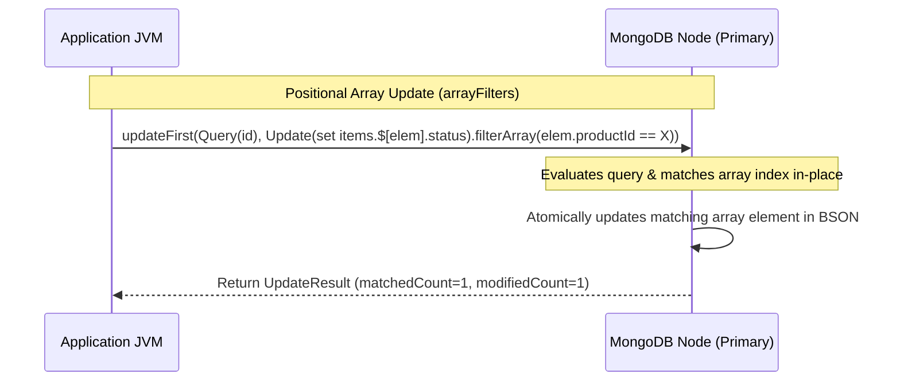
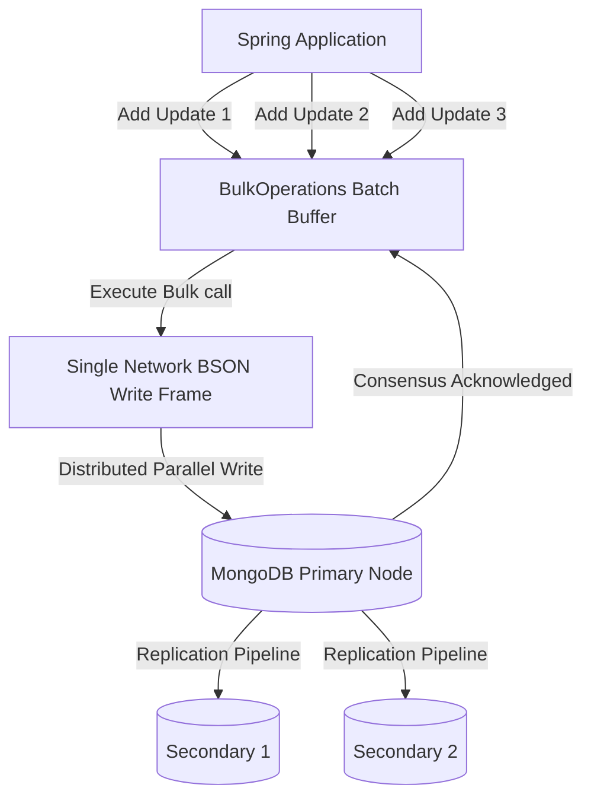

# Module 03: MongoTemplate Deep Dive

This module covers the low-level, imperative data access engine of Spring Data MongoDB: `MongoTemplate`. It explores atomic updates, complex array transformations using positional filters, high-throughput bulk operations, optimistic concurrency locking, and distributed consistency configurations.

---

## 1. What Problem It Solves

While `MongoRepository` is ideal for simple query execution, it is not flexible enough for complex, high-throughput write paths or atomic updates.

`MongoTemplate` solves these problems by providing:
* **Fine-Grained Atomic Updates**: Enables modifying specific fields (or elements inside nested arrays) without retrieving the entire document and writing it back, eliminating race conditions.
* **Bulk Operation Pipeline**: Groups multiple write operations (inserts, updates, deletes) into a single database round-trip, maximizing ingestion performance.
* **Complex Positional Array Updates**: Modifies nested arrays dynamically using MongoDB's advanced positional operators (`$`, `$[]`, and `$[<identifier>]`).
* **Tunable Distributed Consistency**: Allows setting `ReadPreference`, `ReadConcern`, and `WriteConcern` dynamically on a per-query or per-operation basis.
* **Optimistic Concurrency Control**: Uses `@Version` fields to automatically detect and reject concurrent, overlapping updates.

---

## 2. Why MongoDB Instead of Relational Databases (RDBMS)

In relational databases, updating nested items requires separate tables, foreign keys, and multi-row locks.

MongoDB provides distinct advantages for atomic nested updates:
* **Atomic Subdocument Manipulation**: You can insert, modify, or delete elements in a nested list in a single network trip without locking separate tables.
* **In-Place Arithmetic Modification**: Operators like `$inc` and `$mul` modify values directly on the database node, avoiding the overhead of loading values into the JVM, modifying them, and persisting them back.
* **Tunable Consensus Latency**: Unlike relational databases with fixed ACID consistency models, MongoDB allows tuning the write concern per operation—permitting speed over durability for telemetry logs, or requiring full consensus for transactions.

---

## 3. Trade-offs and Limitations

| Metric / Feature | Spring Data JPA / RDBMS Updates | MongoTemplate Atomic Updates |
| :--- | :--- | :--- |
| **Concurrency Lock Range** | Row or Table lock (standard transactional lock) | Single Document lock (highly localized) |
| **In-Memory overhead** | Requires loading entity state first (Hibernate Dirty Check) | No load required. Updates can execute directly in the database. |
| **Array/Collection Size** | Unlimited rows in joined tables | Bound by the maximum BSON document size limit ($16\text{MB}$) |
| **Network Round-trips** | Often multiple statements (insert parent, select, insert child) | Single statement with nested atomic update |

---

## 4. Common Mistakes & Anti-patterns

### Read-Modify-Write for Simple Field Increments
Loading a document, modifying a count field inside Java, and saving the document back via `MongoRepository.save()`.
* *Why it's bad*: Introduces a race condition. If two threads fetch the same entity concurrently, both will calculate the same new value, and one thread will overwrite the other's change.
* *Production Fix*: Use `MongoTemplate` with `Update.update().inc("counter", value)` to update the field atomically on the database server.

### Unbounded Nested Arrays Growth
Pushing objects into a nested array indefinitely (e.g. logging user activity logs inside the User document).
* *Why it's bad*: Eventually, the document will hit the $16\text{MB}$ BSON size limit, causing database errors, slow deserialization times, and memory cache thrashing.
* *Production Fix*: Use the `$slice` modifier with `$push` to limit array size, or model logs as separate documents in an append-only collection.

### Missing Version Increments in Raw Updates
Using `MongoTemplate.updateFirst()` or `updateMulti()` without manually managing the `@Version` field if the entity relies on optimistic locking.
* *Why it's bad*: Raw update operations bypass the lifecycle event handlers that automatically increment `@Version` fields, rendering optimistic locking checks useless.
* *Production Fix*: Manually include `update.inc("version", 1)` in your raw update query, or ensure the query criteria contains the expected version value: `Criteria.where("version").is(currentVersion)`.

---

## 5. When NOT to Use MongoTemplate

* **Simple Key-Value Retrieval**: For simple CRUD lookups by ID or unique keys, `MongoRepository` is cleaner and requires less boilerplate.
* **Heavy Read-Only Queries**: When you don't need updates or complex builder API calls, declarative interface methods are easier to read and test.

---

## 6. Spring Boot & Spring Data Implementation

### Domain Object: Order Document with Nested Items
```java
package com.masterclass.mongodb.domain;

import org.springframework.data.annotation.Id;
import org.springframework.data.annotation.Version;
import org.springframework.data.mongodb.core.mapping.Document;
import org.springframework.data.mongodb.core.mapping.Field;
import java.util.List;

@Document(collection = "orders")
public class Order {
    @Id
    private String id;
    
    @Field("customer_id")
    private String customerId;
    
    private List<OrderItem> items;
    
    @Field("status")
    private String status;

    @Version
    private Long version;

    public Order() {}

    public Order(String id, String customerId, List<OrderItem> items, String status) {
        this.id = id;
        this.customerId = customerId;
        this.items = items;
        this.status = status;
    }

    public String getId() { return id; }
    public String getCustomerId() { return customerId; }
    public List<OrderItem> getItems() { return items; }
    public void setItems(List<OrderItem> items) { this.items = items; }
    public String getStatus() { return status; }
    public void setStatus(String status) { this.status = status; }
    public Long getVersion() { return version; }
}
```

```java
package com.masterclass.mongodb.domain;

public class OrderItem {
    private String productId;
    private int quantity;
    private String fulfillmentStatus; // e.g. "PENDING", "SHIPPED"

    public OrderItem() {}

    public OrderItem(String productId, int quantity, String fulfillmentStatus) {
        this.productId = productId;
        this.quantity = quantity;
        this.fulfillmentStatus = fulfillmentStatus;
    }

    public String getProductId() { return productId; }
    public int getQuantity() { return quantity; }
    public String getFulfillmentStatus() { return fulfillmentStatus; }
    public void setFulfillmentStatus(String fulfillmentStatus) { this.fulfillmentStatus = fulfillmentStatus; }
}
```

### High-Performance Update Service using MongoTemplate
This service demonstrates atomic increments, positional array updates with filters, bulk operations, and custom read/write concerns.

```java
package com.masterclass.mongodb.service;

import com.masterclass.mongodb.domain.Order;
import com.masterclass.mongodb.domain.OrderItem;
import com.mongodb.WriteConcern;
import com.mongodb.client.result.UpdateResult;
import org.bson.Document;
import org.springframework.data.mongodb.core.BulkOperations;
import org.springframework.data.mongodb.core.MongoTemplate;
import org.springframework.data.mongodb.core.query.ArrayFilter;
import org.springframework.data.mongodb.core.query.Criteria;
import org.springframework.data.mongodb.core.query.Query;
import org.springframework.data.mongodb.core.query.Update;
import org.springframework.stereotype.Service;
import java.util.List;

@Service
public class OrderUpdateService {

    private final MongoTemplate mongoTemplate;

    public OrderUpdateService(MongoTemplate mongoTemplate) {
        this.mongoTemplate = mongoTemplate;
    }

    /**
     * Atomically adds a new item to an existing order, or increments its quantity if it already exists.
     * Prevents race conditions without using full multi-document transactions.
     */
    public void addOrIncrementItem(String orderId, String productId, int quantity) {
        // Query to check if the product is already in the order
        Query query = new Query(Criteria.where("id").is(orderId)
                .and("items.productId").is(productId));

        // Atomically increment the quantity of the matching array element ($ operator)
        Update update = new Update().inc("items.$.quantity", quantity);

        UpdateResult result = mongoTemplate.updateFirst(query, update, Order.class);

        // If no document matched (meaning the product is not yet in the array), push a new item
        if (result.getMatchedCount() == 0) {
            Query pushQuery = new Query(Criteria.where("id").is(orderId));
            Update pushUpdate = new Update().push("items", new OrderItem(productId, quantity, "PENDING"));
            mongoTemplate.updateFirst(pushQuery, pushUpdate, Order.class);
        }
    }

    /**
     * Updates the fulfillment status of all order items matching a specific productId.
     * Demonstrates filtered positional array updates ($[elem] and arrayFilters).
     */
    public boolean updateItemFulfillmentStatus(String orderId, String productId, String newStatus) {
        Query query = new Query(Criteria.where("id").is(orderId));
        
        Update update = new Update()
                .set("items.$[elem].fulfillmentStatus", newStatus)
                .inc("version", 1); // Manually increment version to preserve optimistic locking

        // Apply array filter targeting elements where productId matches the request
        update.filterArray(ArrayFilter.of(Criteria.where("elem.productId").is(productId)));

        UpdateResult result = mongoTemplate.updateFirst(query, update, Order.class);
        return result.getModifiedCount() > 0;
    }

    /**
     * Executes bulk updates across multiple orders under a strict Majority write concern.
     */
    public void processBulkFulfillment(List<String> orderIds, String targetStatus) {
        // Temporarily configure MongoTemplate with a strict Write Concern for this operation
        MongoTemplate strictTemplate = new MongoTemplate(mongoTemplate.getMongoDatabaseFactory());
        strictTemplate.setWriteConcern(WriteConcern.MAJORITY);

        BulkOperations bulkOps = strictTemplate.bulkOps(BulkOperations.BulkMode.UNORDERED, Order.class);

        for (String id : orderIds) {
            Query query = new Query(Criteria.where("id").is(id));
            Update update = new Update().set("status", targetStatus).inc("version", 1);
            bulkOps.updateOne(query, update);
        }

        bulkOps.execute();
    }
}
```

---

## 7. Production Architecture Examples

### 1. Atomic Positional Updates Processing Flow
Instead of loading the document, mutating it, and saving it, `MongoTemplate` updates the target document directly on the database node:



### 2. High-Throughput Bulk Operations Pipeline
This diagram illustrates the batching mechanism of `BulkOperations` using `UNORDERED` mode. By batching multiple updates into a single database call, it maximizes network efficiency:



---

## 8. Interview-Level Questions

### Q1: Explain the differences between `$`, `$[]`, and `$[elem]` array update operators in MongoDB, and how they are used in `MongoTemplate`.
**Answer**:
* **`$` (First Match Positional Operator)**: Updates only the *first* array element that matches the query filter. The query must explicitly filter on the array field. In `MongoTemplate`, this is written as `Update.update("items.$.quantity", value)`.
* **`$[]` (All Positional Operator)**: Updates *all* elements in the array, regardless of matching filters. In `MongoTemplate`, this is written as `Update.update("items.$[].status", value)`.
* **`$[elem]` (Filtered Positional Operator)**: Updates only the elements that match custom conditions specified in the `arrayFilters` parameter. This is the most flexible operator. In `MongoTemplate`, this is configured via `update.set("items.$[elem].status", value).filterArray(ArrayFilter.of(Criteria.where("elem.productId").is(productId)))`.

### Q2: What is the difference between an `ORDERED` and `UNORDERED` Bulk Operation in Spring Data MongoDB? How does it handle failures?
**Answer**:
* **`ORDERED`**: MongoDB executes the write operations sequentially. If any operation fails (e.g., due to a duplicate key or validation error), MongoDB immediately halts execution and returns a failure result. Operations queueing after the failure are *not* executed.
* **`UNORDERED`**: MongoDB executes the write operations in parallel (or optimized chunks). If one operation fails, the engine continues processing the remaining operations in the batch. The driver returns a consolidated list of errors containing details for all failed writes.

### Q3: If you configure a custom WriteConcern at the template level, how does that affect replica set confirmation latency?
**Answer**:
Configuring a WriteConcern like `WriteConcern.MAJORITY` requires the primary node to wait for a majority of replica set nodes to write the BSON data to their journals before acknowledging the operation to the client driver. 
* This provides strong durability and protects against rollback events during a primary failover.
* However, it increases write latency. The application thread must wait for network acknowledgments across nodes, which can decrease write throughput.

---

## 9. Hands-on Exercises

### Exercise 1: Positional Updates Playground
1. Write a test case that inserts an order with three nested items:
   ```json
   {
     "id": "ord-100",
     "items": [
       {"productId": "prod-A", "quantity": 1, "fulfillmentStatus": "PENDING"},
       {"productId": "prod-B", "quantity": 2, "fulfillmentStatus": "PENDING"},
       {"productId": "prod-C", "quantity": 3, "fulfillmentStatus": "PENDING"}
     ]
   }
   ```
2. Write a `MongoTemplate` query that sets `fulfillmentStatus` to `"SHIPPED"` *only* for `"prod-B"` using `filterArray`.
3. Query the collection using `mongosh` to verify that `"prod-A"` and `"prod-C"` remain `"PENDING"`.

### Exercise 2: Simulating Optimistic Locking Failure
1. Write a multi-threaded service method that retrieves the same order document concurrently using two separate threads.
2. Thread A sleeps for 2 seconds, then updates the status to `"PROCESSED"`.
3. Thread B immediately updates the status to `"CANCELLED"`.
4. Run the code and verify that Thread A throws an `OptimisticLockingFailureException` when it attempts to save, and handle this error gracefully.

---

## 10. Mini-Project: Real-time Inventory Reservation Engine

### Scenario
You are building the reservation engine for a warehouse inventory service. To prevent double bookings, the system must atomically reserve stock. 
The database stores product documents containing a nested array of inventory bins. Each bin has a unique `binId` and a `quantity` of stock. 
When a reservation request arrives, the service must:
1. Atomically deduct the reserved quantity from a specific bin *only if* that bin has sufficient inventory.
2. Prevent concurrency conflicts.
3. Log the reservation details in a transaction log.

### Step 1: Implement the Domain Entities
```java
package com.masterclass.mongodb.miniproject.model;

import org.springframework.data.annotation.Id;
import org.springframework.data.annotation.Version;
import org.springframework.data.mongodb.core.mapping.Document;
import java.util.List;

@Document(collection = "warehouse_inventory")
public class WarehouseInventory {

    @Id
    private String id;
    private String sku;
    private List<InventoryBin> bins;
    
    @Version
    private Long version;

    public WarehouseInventory() {}

    public WarehouseInventory(String id, String sku, List<InventoryBin> bins) {
        this.id = id;
        this.sku = sku;
        this.bins = bins;
    }

    public String getId() { return id; }
    public String getSku() { return sku; }
    public List<InventoryBin> getBins() { return bins; }
    public void setBins(List<InventoryBin> bins) { this.bins = bins; }
    public Long getVersion() { return version; }
}
```

```java
package com.masterclass.mongodb.miniproject.model;

public class InventoryBin {
    private String binId;
    private int quantity;

    public InventoryBin() {}

    public InventoryBin(String binId, int quantity) {
        this.binId = binId;
        this.quantity = quantity;
    }

    public String getBinId() { return binId; }
    public int getQuantity() { return quantity; }
    public void setQuantity(int quantity) { this.quantity = quantity; }
}
```

### Step 2: Implement the Reservation Logic
```java
package com.masterclass.mongodb.miniproject.service;

import com.masterclass.mongodb.miniproject.model.WarehouseInventory;
import com.mongodb.client.result.UpdateResult;
import org.springframework.data.mongodb.core.MongoTemplate;
import org.springframework.data.mongodb.core.query.ArrayFilter;
import org.springframework.data.mongodb.core.query.Criteria;
import org.springframework.data.mongodb.core.query.Query;
import org.springframework.data.mongodb.core.query.Update;
import org.springframework.stereotype.Service;

@Service
public class ReservationService {

    private final MongoTemplate mongoTemplate;

    public ReservationService(MongoTemplate mongoTemplate) {
        this.mongoTemplate = mongoTemplate;
    }

    /**
     * Deducts stock from a specific bin in a single atomic database operation.
     * Ensures that bin quantity never drops below zero.
     *
     * @param sku The product SKU
     * @param binId The specific inventory bin ID
     * @param qtyToReserve The quantity to deduct
     * @return true if reservation was successful, false if insufficient stock
     */
    public boolean reserveStock(String sku, String binId, int qtyToReserve) {
        // Query targets the SKU and checks if the specific bin has enough quantity
        Query query = new Query(
                Criteria.where("sku").is(sku)
                        .and("bins").elemMatch(
                                Criteria.where("binId").is(binId)
                                        .and("quantity").gte(qtyToReserve)
                        )
        );

        // Atomically decrement the quantity using the filtered positional operator
        Update update = new Update()
                .inc("bins.$[bin].quantity", -qtyToReserve)
                .inc("version", 1); // Manually increment version to preserve optimistic locking

        // Apply array filter targeting the binId
        update.filterArray(ArrayFilter.of(Criteria.where("bin.binId").is(binId)));

        UpdateResult result = mongoTemplate.updateFirst(query, update, WarehouseInventory.class);
        
        // If modifiedCount is 1, the reservation was successful and stock was deducted
        return result.getModifiedCount() > 0;
    }
}
```

### Step 3: Implement Verification Logic
```java
package com.masterclass.mongodb.miniproject.test;

import com.masterclass.mongodb.miniproject.model.InventoryBin;
import com.masterclass.mongodb.miniproject.model.WarehouseInventory;
import com.masterclass.mongodb.miniproject.service.ReservationService;
import org.springframework.boot.CommandLineRunner;
import org.springframework.data.mongodb.core.MongoTemplate;
import org.springframework.stereotype.Component;
import java.util.Arrays;

@Component
public class MiniProjectVerificationRunner implements CommandLineRunner {

    private final MongoTemplate mongoTemplate;
    private final ReservationService reservationService;

    public MiniProjectVerificationRunner(MongoTemplate mongoTemplate, ReservationService reservationService) {
        this.mongoTemplate = mongoTemplate;
        this.reservationService = reservationService;
    }

    @Override
    public void run(String... args) throws Exception {
        // Clean and Seed Data
        mongoTemplate.dropCollection(WarehouseInventory.class);

        WarehouseInventory inventory = new WarehouseInventory("inv-001", "SKU-IPHONE15", Arrays.asList(
                new InventoryBin("BIN-NORTH-01", 10),
                new InventoryBin("BIN-EAST-02", 2)
        ));
        mongoTemplate.save(inventory);

        // Test Case 1: Valid Reservation
        boolean success1 = reservationService.reserveStock("SKU-IPHONE15", "BIN-NORTH-01", 4);
        System.out.println("Reservation 1 (Expected: true): " + success1);

        // Test Case 2: Insufficient Stock
        boolean success2 = reservationService.reserveStock("SKU-IPHONE15", "BIN-EAST-02", 5);
        System.out.println("Reservation 2 (Expected: false): " + success2);

        // Verify state in database
        WarehouseInventory updated = mongoTemplate.findById("inv-001", WarehouseInventory.class);
        System.out.println("Updated Inventory Stock in BIN-NORTH-01 (Expected: 6): " 
                + updated.getBins().stream()
                        .filter(b -> b.getBinId().equals("BIN-NORTH-01"))
                        .findFirst()
                        .get().getQuantity());
    }
}
```
This mini-project demonstrates how to design a high-concurrency reservation system using raw `MongoTemplate` query/update filters, guaranteeing that inventory values cannot drop below zero.
