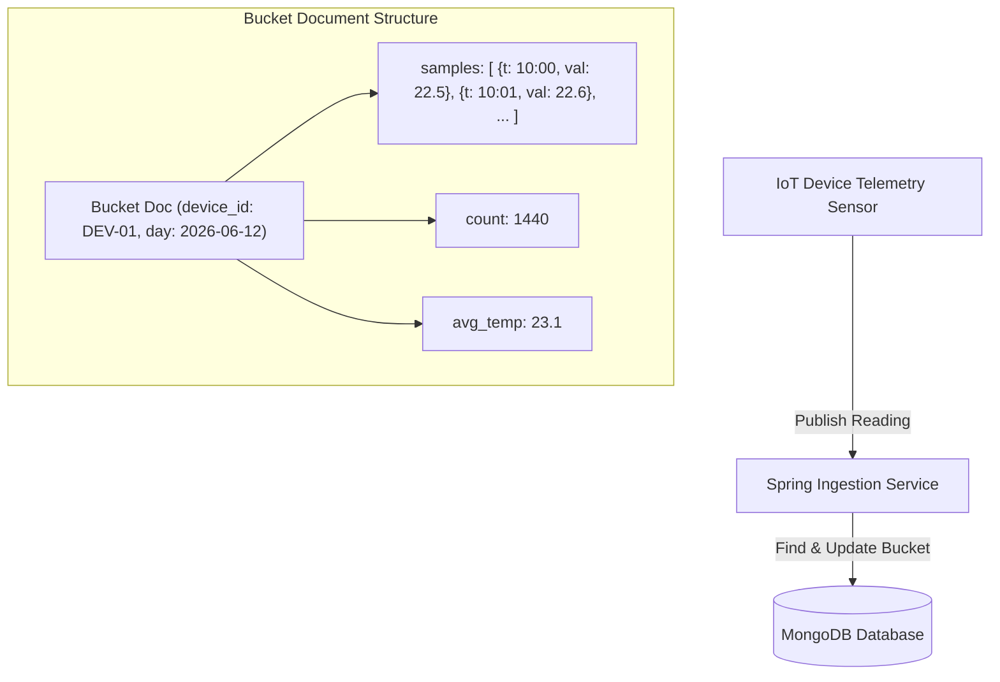

# Module 04: MongoDB Data Modeling

This module covers the core concepts of document-oriented data modeling. It explores the principles of Aggregate Design, embedding vs referencing trade-offs, handling polymorphic hierarchies, schema versioning patterns, and time-series bucketing.

---

## 1. What Problem It Solves

Relational database designs normalize data to eliminate redundancy, dividing domain entities into separate tables. While this protects data integrity, it forces applications to execute multiple SQL joins to reconstruct a single business aggregate.

MongoDB data modeling solves this by aligning the physical database schema with the logical **Domain Aggregate** boundary:
* **Localized Read/Write Performance**: Stores related data together inside a single document, allowing the database to read or write the entire aggregate in a single I/O operation.
* **Schema Flexibility**: Adapt schemas quickly without executing costly `ALTER TABLE` statements on production databases.
* **Polymorphic Storage**: Store different structures (e.g., credit card payments vs PayPal payments) inside the same collection, simplifying inheritance hierarchies.

---

## 2. Why MongoDB Instead of Relational Databases (RDBMS)

Relational modeling enforces strict normalization (3NF). 

MongoDB modeling allows engineers to use denormalization strategically:
* **Match Domain Boundaries**: In Domain-Driven Design (DDD), an Aggregate root should be written and read as a unit. MongoDB documents fit this model perfectly, whereas relational mapping splits an aggregate across multiple tables.
* **Avoid Joins**: Database joins are expensive because they require index matching and merging rows across multiple disk pages. Denormalized documents store nested items in-place, eliminating join overhead.
* **Dynamic Attribute Support**: Fields like product specifications or user settings can be modeled as nested dynamic documents without requiring EAV (Entity-Attribute-Value) table anti-patterns.

---

## 3. Trade-offs and Limitations

| Modeling Strategy | Embed (Denormalization) | Reference (Normalization) |
| :--- | :--- | :--- |
| **Write Performance** | Fast (single document atomic write) | Slow (requires writing to multiple collections/documents) |
| **Read Latency** | Low (single disk read fetches all data) | High (requires multiple round-trips or `$lookup` joins) |
| **Document Size Limit** | Subject to $16\text{MB}$ BSON size limit | Unlimited (split across multiple documents) |
| **Data Consistency** | High (in-place atomic updates) | Complex (requires transactions to sync duplicate data) |
| **Index Efficiency** | High (indexes can cover nested fields) | Lower (requires indexing multiple collections) |

---

## 4. Common Mistakes & Anti-patterns

### The Unbounded Array Leak
Modeling a 1:N relationship where $N$ can grow infinitely (e.g., nesting user activity logs inside the User document, or comments inside a Blog Post document).
* *Why it's bad*: The document size will eventually exceed the $16\text{MB}$ BSON limit. Even before hitting this limit, loading large documents into memory degrades performance and causes high serialization latency.
* *Production Fix*: If $N$ can grow larger than a few hundred items, model the child entities as separate documents in their own collection, referencing the parent ID.

### Overusing DBRefs instead of Manual ObjectIds
Annotating referenced classes with Spring Data's `@DBRef` annotation.
* *Why it's bad*: `@DBRef` stores the collection name and database namespace along with the target ID. This consumes unnecessary space and can trigger automatic, eager loading of referenced documents, causing $N+1$ query performance issues.
* *Production Fix*: Store the target document's `ObjectId` or `String` ID directly, and fetch references manually or in batches when needed.

### Blind Denormalization without Sync Strategy
Duplicating a frequently updated field (like `customerName`) inside millions of transaction documents without a strategy to sync updates.
* *Why it's bad*: When a customer changes their name, the system must execute millions of updates or leave the database in an inconsistent state.
* *Production Fix*: Only denormalize fields that are **read-heavy** and **rarely updated** (like product SKUs or currency symbols). If the field changes frequently, store it as a reference instead.

---

## 5. When NOT to Use MongoDB

* **Many-to-Many Relationships**: If your domain is highly interconnected and requires traversing complex relationships (e.g., social graphs, recommendation engines), a Graph Database (like Neo4j) is superior.
* **Ad-hoc Query-heavy Normalized Reporting**: When business intelligence tools need to run complex, arbitrary SQL joins across dozens of entities, relational systems are much easier to query.

---

## 6. Spring Boot & Spring Data Implementation

This example demonstrates polymorphic document mapping, schema versioning, and denormalization.

### Base Polymorphic Document: Payment
```java
package com.masterclass.mongodb.domain;

import org.springframework.data.annotation.Id;
import org.springframework.data.annotation.TypeAlias;
import org.springframework.data.mongodb.core.mapping.Document;
import org.springframework.data.mongodb.core.mapping.Field;
import java.math.BigDecimal;
import java.time.Instant;

@Document(collection = "payments")
// Maps class names to short aliases to minimize _class storage overhead
@TypeAlias("payment_base")
public abstract class Payment {

    @Id
    private String id;
    
    @Field("transaction_id")
    private String transactionId;
    
    private BigDecimal amount;
    
    @Field("payment_time")
    private Instant paymentTime;

    @Field("schema_version")
    private int schemaVersion = 1; // Default to version 1

    public Payment() {}

    public Payment(String transactionId, BigDecimal amount, Instant paymentTime) {
        this.transactionId = transactionId;
        this.amount = amount;
        this.paymentTime = paymentTime;
    }

    public String getId() { return id; }
    public String getTransactionId() { return transactionId; }
    public BigDecimal getAmount() { return amount; }
    public Instant getPaymentTime() { return paymentTime; }
    public int getSchemaVersion() { return schemaVersion; }
    public void setSchemaVersion(int schemaVersion) { this.schemaVersion = schemaVersion; }
}
```

### Subclasses (Polymorphism)
```java
package com.masterclass.mongodb.domain;

import org.springframework.data.annotation.TypeAlias;
import org.springframework.data.mongodb.core.mapping.Field;
import java.math.BigDecimal;
import java.time.Instant;

@TypeAlias("payment_cc")
public class CreditCardPayment extends Payment {

    @Field("card_type")
    private String cardType;
    
    @Field("masked_pan")
    private String maskedPan;

    public CreditCardPayment() {}

    public CreditCardPayment(String transactionId, BigDecimal amount, Instant paymentTime, 
                             String cardType, String maskedPan) {
        super(transactionId, amount, paymentTime);
        this.cardType = cardType;
        this.maskedPan = maskedPan;
    }

    public String getCardType() { return cardType; }
    public String getMaskedPan() { return maskedPan; }
}
```

```java
package com.masterclass.mongodb.domain;

import org.springframework.data.annotation.TypeAlias;
import org.springframework.data.mongodb.core.mapping.Field;
import java.math.BigDecimal;
import java.time.Instant;

@TypeAlias("payment_paypal")
public class PayPalPayment extends Payment {

    @Field("payer_email")
    private String payerEmail;

    public PayPalPayment() {}

    public PayPalPayment(String transactionId, BigDecimal amount, Instant paymentTime, String payerEmail) {
        super(transactionId, amount, paymentTime);
        this.payerEmail = payerEmail;
    }

    public String getPayerEmail() { return payerEmail; }
}
```

### Schema Migration Fallback Handler (Version Management)
If the database contains legacy documents, you can intercept them during deserialization to transform old schemas on the fly:

```java
package com.masterclass.mongodb.listener;

import com.masterclass.mongodb.domain.Payment;
import org.bson.Document;
import org.springframework.data.mongodb.core.mapping.event.BeforeConvertEvent;
import org.springframework.data.mongodb.core.mapping.event.BeforeSaveCallback;
import org.springframework.data.mongodb.core.mapping.event.MongoMappingEvent;
import org.springframework.data.mongodb.core.mapping.event.AfterLoadEvent;
import org.springframework.context.ApplicationListener;
import org.springframework.stereotype.Component;

@Component
public class PaymentSchemaMigrationListener implements ApplicationListener<AfterLoadEvent<Payment>> {

    @Override
    public void onApplicationEvent(AfterLoadEvent<Payment> event) {
        Document document = event.getDocument();
        if (document == null) return;

        Integer schemaVersion = document.getInteger("schema_version");
        
        // Handle legacy documents that lack a schemaVersion field (implicit version 0)
        if (schemaVersion == null) {
            // Transform legacy fields
            // For example, if we split an old "name" field into "firstName" and "lastName"
            String oldName = document.getString("payer_name");
            if (oldName != null && !oldName.isBlank()) {
                String[] parts = oldName.split(" ", 2);
                document.put("payer_first_name", parts[0]);
                document.put("payer_last_name", parts.length > 1 ? parts[1] : "");
            }
            // Mark the document with the current schema version
            document.put("schema_version", 1);
        }
    }
}
```

---

## 7. Production Architecture Examples

### 1. Polymorphic Collection Storage Model
With `@TypeAlias` configured, subclasses are persisted in the same collection. This optimization keeps documents clean and compact:

```json
[
  {
    "_id": ObjectId("647a8f114c0a5e2f1837bc21"),
    "_class": "payment_cc",
    "transaction_id": "tx_1001",
    "amount": NumberDecimal("150.00"),
    "card_type": "VISA",
    "masked_pan": "4111-XXXX-XXXX-1111",
    "schema_version": 1
  },
  {
    "_id": ObjectId("647a8f114c0a5e2f1837bc22"),
    "_class": "payment_paypal",
    "transaction_id": "tx_1002",
    "amount": NumberDecimal("45.50"),
    "payer_email": "engineer@masterclass.com",
    "schema_version": 1
  }
]
```

### 2. Time-Series Bucketing Pattern
Instead of writing millions of small documents for IoT or telemetry metrics (which bloats indexes and increases memory usage), group readings into hourly or daily bucket documents:



---

## 8. Interview-Level Questions

### Q1: What is the Time-Series Bucket Pattern, and how does it optimize storage in MongoDB?
**Answer**:
The Time-Series Bucket Pattern groups multiple sequential data points (like sensor metrics, stock ticks, or server stats) into a single document representing a specific time window (e.g., an hour or a day).
* **Storage Optimization**: Instead of storing metadata (like device ID, location, and IP) in every metric write, this metadata is stored once in the bucket document.
* **Index Compression**: The database indexes one bucket document instead of thousands of individual readings, keeping index sizes small and fits inside the system's RAM.
* **Writes**: Updates use atomic operators like `$push` to append data points, and `$inc` to update running counts or aggregations.

### Q2: How does `@TypeAlias` prevent production storage bloating compared to default polymorphism configuration?
**Answer**:
By default, Spring Data MongoDB stores the fully qualified Java class name (e.g. `com.masterclass.mongodb.domain.CreditCardPayment`) in the `_class` field.
* This metadata tells the mapping engine which subclass to instantiate when retrieving documents.
* In a collection with millions of documents, storing this long string in every document wastes disk space and degrades performance.
* Using `@TypeAlias("payment_cc")` overrides this behavior. Spring will write the short alias name (`"payment_cc"`) instead of the full package path, saving significant storage.

### Q3: How do you design schema versioning for zero-downtime microservice deployments?
**Answer**:
1. Add a `schemaVersion` integer field to your document model.
2. When the application writes a document, it defaults to the latest schema version (e.g. `schemaVersion = 2`).
3. For reads, implement a listener (like `AfterLoadEvent` or a custom converter) that checks the `schemaVersion`.
4. If the version is older, transform the legacy document structure in-memory before mapping it to the Java object. This handles older document structures dynamically, removing the need for offline migration scripts.

---

## 9. Hands-on Exercises

### Exercise 1: Implement a 1:N Unbounded Array Split
1. Design a forum application model.
2. Instead of nesting comments directly inside the `Post` document (which can grow infinitely), create a separate `Comment` document containing a `postId` reference field.
3. Write a query that fetches a post and its first 20 comments sorted by time using standard pagination.

### Exercise 2: Implementing Subclass Discriminator Mapping
1. Create a `PaymentRepository` that queries the polymorphic payments collection.
2. Seed the database with both `CreditCardPayment` and `PayPalPayment` documents.
3. Query `paymentRepository.findAll()` and verify that Spring Data automatically instantiates the correct subclasses in the returned list.

---

## 10. Mini-Project: Time-Series IoT Telemetry Engine

### Scenario
You are building the database engine for a fleet monitoring system. IoT trackers send CPU temperature readings every minute. 
To optimize queries and storage, you must implement the **Bucket Pattern**. 
Metrics should be grouped into hourly documents containing a nested array of readings. 
Each bucket document represents a specific device and hour, storing the min, max, and running count of readings.

### Step 1: Implement the Hourly Metric Bucket Model
```java
package com.masterclass.mongodb.miniproject.model;

import org.springframework.data.annotation.Id;
import org.springframework.data.mongodb.core.mapping.Document;
import org.springframework.data.mongodb.core.mapping.Field;
import java.time.Instant;
import java.util.List;

@Document(collection = "telemetry_hourly_buckets")
public class TelemetryHourlyBucket {

    @Id
    private String id; // format: deviceId_YYYYMMDD_HH

    @Field("device_id")
    private String deviceId;

    @Field("hour_start")
    private Instant hourStart;

    @Field("readings")
    private List<TelemetryReading> readings;

    @Field("min_temp")
    private double minTemperature;

    @Field("max_temp")
    private double maxTemperature;

    @Field("reading_count")
    private int readingCount;

    public TelemetryHourlyBucket() {}

    public TelemetryHourlyBucket(String id, String deviceId, Instant hourStart) {
        this.id = id;
        this.deviceId = deviceId;
        this.hourStart = hourStart;
        this.minTemperature = Double.MAX_VALUE;
        this.maxTemperature = Double.MIN_VALUE;
    }

    // Getters and Setters
    public String getId() { return id; }
    public String getDeviceId() { return deviceId; }
    public Instant getHourStart() { return hourStart; }
    public List<TelemetryReading> getReadings() { return readings; }
    public double getMinTemperature() { return minTemperature; }
    public double getMaxTemperature() { return maxTemperature; }
    public int getReadingCount() { return readingCount; }
}
```

```java
package com.masterclass.mongodb.miniproject.model;

import java.time.Instant;

public class TelemetryReading {
    private Instant timestamp;
    private double temperature;

    public TelemetryReading() {}

    public TelemetryReading(Instant timestamp, double temperature) {
        this.timestamp = timestamp;
        this.temperature = temperature;
    }

    public Instant getTimestamp() { return timestamp; }
    public double getTemperature() { return temperature; }
}
```

### Step 2: Implement Ingestion Logic using Upserts
Using upserts ensures that if the bucket document for the current hour does not exist, it is created automatically. If it does exist, the new reading is appended to the array.

```java
package com.masterclass.mongodb.miniproject.service;

import com.masterclass.mongodb.miniproject.model.TelemetryHourlyBucket;
import com.masterclass.mongodb.miniproject.model.TelemetryReading;
import org.springframework.data.mongodb.core.MongoTemplate;
import org.springframework.data.mongodb.core.query.Criteria;
import org.springframework.data.mongodb.core.query.Query;
import org.springframework.data.mongodb.core.query.Update;
import org.springframework.stereotype.Service;
import java.time.Instant;
import java.time.temporal.ChronoUnit;

@Service
public class TelemetryIngestionService {

    private final MongoTemplate mongoTemplate;

    public TelemetryIngestionService(MongoTemplate mongoTemplate) {
        this.mongoTemplate = mongoTemplate;
    }

    /**
     * Ingests a sensor reading, automatically bucketing it by hour.
     */
    public void ingestReading(String deviceId, Instant timestamp, double temp) {
        // Calculate the start of the hour
        Instant hourStart = timestamp.truncatedTo(ChronoUnit.HOURS);
        
        // Generate a deterministic bucket ID: deviceId_epochHour
        long epochHour = hourStart.getEpochSecond() / 3600;
        String bucketId = deviceId + "_" + epochHour;

        // Query to match the bucket document by ID
        Query query = new Query(Criteria.where("id").is(bucketId));

        // Build the update operation:
        // 1. Append the reading to the array
        // 2. Increment the reading count
        // 3. Set the min/max temperature values using helper calculations
        Update update = new Update()
                .setOnInsert("device_id", deviceId)
                .setOnInsert("hour_start", hourStart)
                .push("readings", new TelemetryReading(timestamp, temp))
                .inc("reading_count", 1)
                .min("min_temp", temp)
                .max("max_temp", temp);

        // Perform an upsert: inserts the document if it doesn't exist, otherwise updates it
        mongoTemplate.upsert(query, update, TelemetryHourlyBucket.class);
    }
}
```

### Step 3: Implement Verification Logic
```java
package com.masterclass.mongodb.miniproject.test;

import com.masterclass.mongodb.miniproject.model.TelemetryHourlyBucket;
import com.masterclass.mongodb.miniproject.service.TelemetryIngestionService;
import org.springframework.boot.CommandLineRunner;
import org.springframework.data.mongodb.core.MongoTemplate;
import org.springframework.stereotype.Component;
import java.time.Instant;

@Component
public class TelemetryVerificationRunner implements CommandLineRunner {

    private final MongoTemplate mongoTemplate;
    private final TelemetryIngestionService ingestionService;

    public TelemetryVerificationRunner(MongoTemplate mongoTemplate, TelemetryIngestionService ingestionService) {
        this.mongoTemplate = mongoTemplate;
        this.ingestionService = ingestionService;
    }

    @Override
    public void run(String... args) throws Exception {
        // Clear old test data
        mongoTemplate.dropCollection(TelemetryHourlyBucket.class);

        Instant baseTime = Instant.parse("2026-06-12T10:00:00Z");

        // Simulating incoming readings for the same hour
        ingestionService.ingestReading("DEV-ALPHA", baseTime.plusSeconds(30), 22.4);
        ingestionService.ingestReading("DEV-ALPHA", baseTime.plusSeconds(90), 24.1);
        ingestionService.ingestReading("DEV-ALPHA", baseTime.plusSeconds(180), 21.8);

        // Retrieve and print the bucket
        long epochHour = baseTime.truncatedTo(java.time.temporal.ChronoUnit.HOURS).getEpochSecond() / 3600;
        String expectedId = "DEV-ALPHA_" + epochHour;

        TelemetryHourlyBucket bucket = mongoTemplate.findById(expectedId, TelemetryHourlyBucket.class);
        if (bucket != null) {
            System.out.println("Telemetry Ingested Successfully.");
            System.out.println("Reading Count: " + bucket.getReadingCount());
            System.out.println("Min Temp: " + bucket.getMinTemperature());
            System.out.println("Max Temp: " + bucket.getMaxTemperature());
        }
    }
}
```
This telemetry application illustrates how to optimize high-frequency writes in MongoDB, reducing the overhead of indexing individual documents by grouping readings into hourly buckets.
