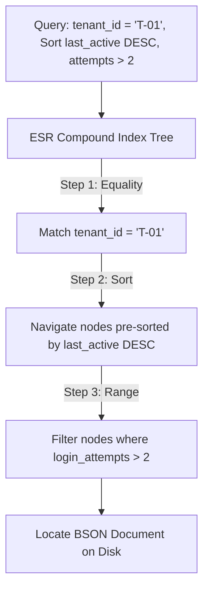
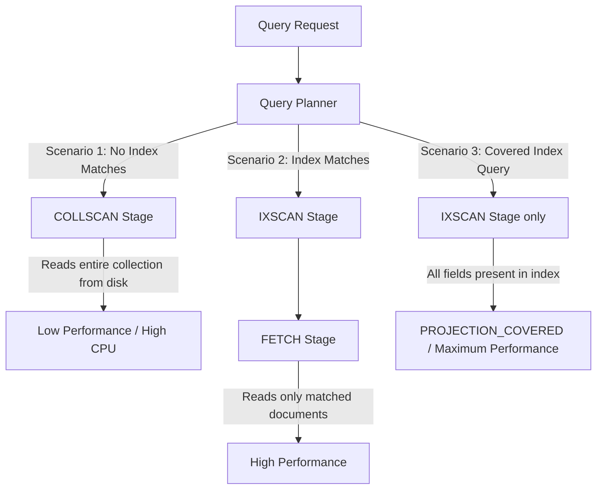

# Module 05: Indexing and Query Performance

This module covers the mechanics of indexing and query performance in MongoDB. It details index types, explains the ESR (Equality, Sort, Range) rule, demystifies execution explain plans, and provides strategies to eliminate database collection scans (`COLLSCAN`).

---

## 1. What Problem It Solves

As collection sizes grow into millions of documents, scanning every BSON document on disk to satisfy a query becomes too slow.

MongoDB indexes solve this by:
* **Reducing Disk I/O**: B-tree index structures allow the database to locate matching documents with $O(\log N)$ complexity rather than $O(N)$ scans.
* **Avoiding In-Memory Sorts**: Compound indexes pre-sort values in order, eliminating CPU-heavy in-memory sorting operations (`SORT` stage in explain plans).
* **Automating Data Lifecycle**: TTL (Time-To-Live) indexes automatically remove expired documents on a background thread.
* **Optimizing Index Storage**: Partial and sparse indexes allow engineers to index only a subset of documents, reducing RAM overhead.

---

## 2. Why MongoDB Instead of Relational Databases (RDBMS)

While both systems use B-trees, MongoDB has unique indexing capabilities for nested structures:
* **Multikey Indexes**: MongoDB natively indexes values inside nested arrays. For example, if a document contains an array of `tags: ["shoes", "sale"]`, a multikey index indexes each value in the array individually.
* **Partial Index Filter Expressions**: Unlike standard relational databases where columns are either indexed or not, MongoDB partial indexes support complex JSON filters (`partialFilterExpression: { status: "ACTIVE" }`), which is ideal for sparse or polymorphic collections.
* **Geospatial Indexes**: MongoDB natively supports $2d$ and $2dsphere$ indexes to calculate distance query logic on spherical systems (like mapping distances).

---

## 3. Trade-offs and Limitations

### Index Overhead
Each index must be updated during every write, update, and delete operation. Over-indexing a collection slows down write throughput and consumes significant RAM (since active indexes must fit in memory).

### Multikey Index Limits
You cannot create a compound index that includes more than one array field. For example, if a document has arrays `locations` and `categories`, a compound index `{ locations: 1, categories: 1 }` is forbidden because the database would have to generate a Cartesian product of all array elements, degrading performance.

---

## 4. Common Mistakes & Anti-patterns

### Violating the ESR Rule (Equality, Sort, Range)
Creating a compound index with range fields before sort fields (e.g., query status: `ACTIVE`, age > 30, sort by name, with index: `{ status: 1, age: 1, name: 1 }`).
* *Why it's bad*: Placing the range field (`age`) before the sort field (`name`) prevents the database from using the index for sorting. The query planner will perform a CPU-heavy in-memory sort.
* *Production Fix*: Always order compound index fields using the **ESR Rule**:
  1. **E**quality fields first (fields checked with exact matches, like `status: "ACTIVE"`).
  2. **S**ort fields second (fields defined in the query sort, like `name: 1`).
  3. **R**ange fields last (fields checked with inequality filters, like `age: { $gt: 30 }`).

### Offset-Based Pagination on Large Collections
Using `.skip(100000).limit(20)` to paginate deep into a collection.
* *Why it's bad*: The query planner must scan all 100,020 documents to discard the first 100,000, causing a slow collection scan (`COLLSCAN`) even if an index is present.
* *Production Fix*: Use keyset/cursor-based pagination. Sort by a unique index field (such as `_id` or `createdAt`), and query relative to the last seen document: `{ createdAt: { $lt: lastSeenTime } }`.

### Relying on Index Intersection instead of Compound Indexes
Creating separate single-field indexes on `status` and `email` instead of a compound index `{ status: 1, email: 1 }`.
* *Why it's bad*: While MongoDB can merge two single indexes at runtime (`AND_SORT` or `SUBPLAN` stages), this is significantly slower than using a dedicated compound index designed for the query.

---

## 5. When NOT to Use Indexes

* **Small Collections**: Collections with fewer than a few thousand documents do not benefit from indexes. Loading and scanning the index B-tree can add more latency than a direct collection scan.
* **Write-Heavy, Read-Rare Collections**: If you are writing high-frequency audit logs that are rarely read (except for disaster recovery), keep indexes to a minimum (ideally only the default `_id` index) to maximize write throughput.

---

## 6. Spring Boot & Spring Data Implementation

This configuration showcases compound index definitions, partial indexes, and cursor-based pagination.

### Domain Object: User Session
```java
package com.masterclass.mongodb.domain;

import org.springframework.data.annotation.Id;
import org.springframework.data.mongodb.core.index.CompoundIndex;
import org.springframework.data.mongodb.core.index.Indexed;
import org.springframework.data.mongodb.core.mapping.Document;
import org.springframework.data.mongodb.core.mapping.Field;
import java.time.Instant;

@Document(collection = "user_sessions")
// Compound Index following the ESR Rule:
// Equality (tenantId), Sort (lastActive), Range (loginAttempts)
@CompoundIndex(
    name = "idx_tenant_active_attempts", 
    def = "{'tenant_id': 1, 'last_active': -1, 'login_attempts': 1}"
)
public class UserSession {

    @Id
    private String id;

    @Field("tenant_id")
    private String tenantId;

    @Field("username")
    private String username;

    @Field("login_attempts")
    private int loginAttempts;

    @Field("last_active")
    private Instant lastActive;

    // TTL index: Spring instructs MongoDB to delete documents 24 hours (86400 seconds) after lastActive
    @Indexed(expireAfterSeconds = 86400)
    @Field("created_at")
    private Instant createdAt;

    public UserSession() {}

    public UserSession(String id, String tenantId, String username, int loginAttempts, Instant lastActive, Instant createdAt) {
        this.id = id;
        this.tenantId = tenantId;
        this.username = username;
        this.loginAttempts = loginAttempts;
        this.lastActive = lastActive;
        this.createdAt = createdAt;
    }

    public String getId() { return id; }
    public String getTenantId() { return tenantId; }
    public String getUsername() { return username; }
    public int getLoginAttempts() { return loginAttempts; }
    public Instant getLastActive() { return lastActive; }
    public Instant getCreatedAt() { return createdAt; }
}
```

### High-Performance Keyset (Cursor) Pagination Service
```java
package com.masterclass.mongodb.service;

import com.masterclass.mongodb.domain.UserSession;
import org.springframework.data.domain.Sort;
import org.springframework.data.mongodb.core.MongoTemplate;
import org.springframework.data.mongodb.core.query.Criteria;
import org.springframework.data.mongodb.core.query.Query;
import org.springframework.stereotype.Service;
import java.time.Instant;
import java.util.List;

@Service
public class SessionPaginationService {

    private final MongoTemplate mongoTemplate;

    public SessionPaginationService(MongoTemplate mongoTemplate) {
        this.mongoTemplate = mongoTemplate;
    }

    /**
     * Retrieves a page of active sessions using keyset/cursor pagination.
     * Avoids skip/offset performance degradation at scale.
     *
     * @param tenantId The company tenant ID
     * @param lastSeenTime Cursor value representing the lastActive timestamp of the last document in the previous page
     * @param limit Number of items to return per page
     */
    public List<UserSession> getActiveSessionsCursor(String tenantId, Instant lastSeenTime, int limit) {
        Query query = new Query();
        
        Criteria criteria = Criteria.where("tenant_id").is(tenantId);
        
        // If lastSeenTime cursor is provided, query only documents older than the cursor
        if (lastSeenTime != null) {
            criteria.and("last_active").lt(lastSeenTime);
        }
        
        query.addCriteria(criteria);

        // Sort by the indexed key in descending order to match the compound index definition
        query.with(Sort.by(Sort.Direction.DESC, "last_active"));
        query.limit(limit);

        return mongoTemplate.find(query, UserSession.class);
    }
}
```

---

## 7. Production Architecture Examples

### 1. ESR Compound Index Traversing
Compound index `{ tenant_id: 1, last_active: -1, login_attempts: 1 }` allows MongoDB to satisfy equality checks, sorting, and range filters in a single pass:



### 2. Execution Plan Flow: Explain Mechanics
When executing a query, the MongoDB Query Planner runs the query through several execution stages. The output of an explain plan indicates whether the query is optimized:



---

## 8. Interview-Level Questions

### Q1: Explain the ESR rule. What happens to the query performance if you define an index as `{ age: 1, name: 1, status: 1 }` but query `status = "ACTIVE"` and sort by `name`?
**Answer**:
The ESR (Equality, Sort, Range) rule states that a compound index must order fields as: **Equality** fields first, **Sort** fields second, and **Range** fields last.
* If the index is defined as `{ age: 1, name: 1, status: 1 }` (where `age` is a range field, `name` is a sort field, and `status` is an equality field), querying `status = "ACTIVE"` and sorting by `name` renders the index ineffective.
* Because the index key starts with `age` (which is not in the query), the engine cannot navigate the index tree directly. It will perform a full scan of the index or collection, followed by a slow in-memory sort.

### Q2: What is a "Covered Query" in MongoDB, and what stage will you see in the execution explain plan?
**Answer**:
A **Covered Query** is a query that can be satisfied entirely by index keys without reading any documents from disk. For a query to be covered:
1. All fields in the query filter must be part of the index.
2. All fields returned in the projection must be part of the index.
3. The `_id` field must be explicitly excluded from the projection (unless `_id` is part of the index).
* **Explain Plan Stage**: In the explain output, you will see `IXSCAN` but *no* `FETCH` stage. The `totalDocsExamined` will be `0`.

### Q3: How do TTL indexes work under the hood? What are the limitations regarding replication and compound keys?
**Answer**:
* **Under the Hood**: MongoDB background threads run once every 60 seconds to find and delete expired documents. Expired documents are not deleted immediately at the exact second they expire.
* **Replication**: The TTL deletion task runs only on the primary node. The primary writes deletes to the oplog, which replica secondaries replicate.
* **Limitations**: 
  1. You cannot build a TTL index on a compound index (it must target a single date field).
  2. You cannot build a TTL index on capped collections.
  3. If a field contains an array of dates, the document expires when the *earliest* date in the array passes.

---

## 9. Hands-on Exercises

### Exercise 1: Evaluating Explain Plans via Mongo Shell
1. Seed your local `user_sessions` collection with 50,000 documents.
2. Run a query in `mongosh` without an index and call `.explain("executionStats")`:
   ```javascript
   db.user_sessions.find({ username: "engineer-01" }).explain("executionStats")
   ```
3. Verify that the execution stage is `COLLSCAN` and check the `executionTimeMillis`.
4. Create an index:
   ```javascript
   db.user_sessions.createIndex({ username: 1 })
   ```
5. Rerun the explain plan and verify that the stage changes to `IXSCAN` and `FETCH`.

### Exercise 2: Testing Covered Queries
1. Create a compound index:
   ```javascript
   db.user_sessions.createIndex({ tenant_id: 1, username: 1 })
   ```
2. Run a query that filters by `tenant_id` and projects only `username` and excludes `_id`:
   ```javascript
   db.user_sessions.find({ tenant_id: "T-01" }, { username: 1, _id: 0 }).explain("executionStats")
   ```
3. Confirm that `totalDocsExamined` is `0` and that the execution stage contains no `FETCH` node.

---

## 10. Mini-Project: Geo-Spatial Log Search Engine

### Scenario
You are building the backend for a food delivery platform. The system processes delivery updates from couriers, storing their latitude and longitude coordinates. 
To optimize queries, you must build a geo-spatial search API that retrieves all active couriers within a 5-kilometer radius of a customer's location. 
The API must use a geospatial `$2dsphere` index, filter by courier status, and support keyset pagination.

### Step 1: Implement the Domain Document with Geospatial Mappings
MongoDB stores geographical locations using the GeoJSON format: `{ type: "Point", coordinates: [longitude, latitude] }`.

```java
package com.masterclass.mongodb.miniproject.model;

import org.springframework.data.annotation.Id;
import org.springframework.data.mongodb.core.index.GeoSpatialIndexType;
import org.springframework.data.mongodb.core.index.GeoSpatialIndexed;
import org.springframework.data.mongodb.core.index.CompoundIndex;
import org.springframework.data.mongodb.core.mapping.Document;
import org.springframework.data.mongodb.core.mapping.Field;
import org.springframework.data.mongodb.core.geo.GeoJsonPoint;

@Document(collection = "courier_locations")
// Compound index combining courier status and geolocation to optimize distance queries
@CompoundIndex(name = "idx_status_location", def = "{'status': 1, 'location': '2dsphere'}")
public class CourierLocation {

    @Id
    private String id;

    @Field("courier_id")
    private String courierId;

    private String status; // e.g. "ACTIVE", "BUSY"

    // GeoJsonPoint represents a longitude/latitude coordinate pair
    private GeoJsonPoint location;

    public CourierLocation() {}

    public CourierLocation(String id, String courierId, String status, GeoJsonPoint location) {
        this.id = id;
        this.courierId = courierId;
        this.status = status;
        this.location = location;
    }

    public String getId() { return id; }
    public String getCourierId() { return courierId; }
    public String getStatus() { return status; }
    public GeoJsonPoint getLocation() { return location; }
}
```

### Step 2: Implement Geo-Spatial Search Service
```java
package com.masterclass.mongodb.miniproject.service;

import com.masterclass.mongodb.miniproject.model.CourierLocation;
import org.springframework.data.geo.Distance;
import org.springframework.data.geo.Metrics;
import org.springframework.data.geo.Point;
import org.springframework.data.mongodb.core.MongoTemplate;
import org.springframework.data.mongodb.core.query.Criteria;
import org.springframework.data.mongodb.core.query.Query;
import org.springframework.stereotype.Service;
import java.util.List;

@Service
public class CourierSearchService {

    private final MongoTemplate mongoTemplate;

    public CourierSearchService(MongoTemplate mongoTemplate) {
        this.mongoTemplate = mongoTemplate;
    }

    /**
     * Locates all active couriers within a specific radius of a customer's location.
     * Uses the 2dsphere index to perform an optimized distance search.
     *
     * @param longitude Customer longitude
     * @param latitude Customer latitude
     * @param radiusKm Search radius in kilometers
     * @param limit Limit the output results
     */
    public List<CourierLocation> findNearCouriers(double longitude, double latitude, double radiusKm, int limit) {
        Point customerPoint = new Point(longitude, latitude);
        Distance searchDistance = new Distance(radiusKm, Metrics.KILOMETERS);

        Query query = new Query();
        
        // Apply geospatial nearSphere search combined with status equality filter
        query.addCriteria(
                Criteria.where("status").is("ACTIVE")
                        .and("location").nearSphere(customerPoint).maxDistance(searchDistance.getValue() / 6378.1) // Convert radius to radians
        );
        
        query.limit(limit);

        return mongoTemplate.find(query, CourierLocation.class);
    }
}
```

### Step 3: Implement Verification Logic
```java
package com.masterclass.mongodb.miniproject.test;

import com.masterclass.mongodb.miniproject.model.CourierLocation;
import com.masterclass.mongodb.miniproject.service.CourierSearchService;
import org.springframework.boot.CommandLineRunner;
import org.springframework.data.mongodb.core.MongoTemplate;
import org.springframework.data.mongodb.core.geo.GeoJsonPoint;
import org.springframework.stereotype.Component;
import java.util.List;

@Component
public class GeoVerificationRunner implements CommandLineRunner {

    private final MongoTemplate mongoTemplate;
    private final CourierSearchService searchService;

    public GeoVerificationRunner(MongoTemplate mongoTemplate, CourierSearchService searchService) {
        this.mongoTemplate = mongoTemplate;
        this.searchService = searchService;
    }

    @Override
    public void run(String... args) throws Exception {
        // Clear collections
        mongoTemplate.dropCollection(CourierLocation.class);

        // Seed Courier Locations (Downtown Saigon area)
        // coordinates parameter format: [longitude, latitude]
        mongoTemplate.save(new CourierLocation("c-001", "C_EXPRESS_1", "ACTIVE", new GeoJsonPoint(106.7018, 10.7760))); // Downtown
        mongoTemplate.save(new CourierLocation("c-002", "C_EXPRESS_2", "ACTIVE", new GeoJsonPoint(106.7118, 10.7860))); // 1.8km away
        mongoTemplate.save(new CourierLocation("c-003", "C_EXPRESS_3", "BUSY",   new GeoJsonPoint(106.7018, 10.7760))); // Match distance, mismatch status
        mongoTemplate.save(new CourierLocation("c-004", "C_EXPRESS_4", "ACTIVE", new GeoJsonPoint(106.8500, 10.9000))); // Far out (20km+)

        // Query active couriers within a 5km radius of downtown (106.7018, 10.7760)
        List<CourierLocation> results = searchService.findNearCouriers(106.7018, 10.7760, 5.0, 10);

        System.out.println("Geospatial Search Results:");
        System.out.println("Expected Match Count: 2");
        System.out.println("Actual Match Count: " + results.size());
        for (CourierLocation loc : results) {
            System.out.println(" - Courier ID: " + loc.getCourierId() + ", Status: " + loc.getStatus());
        }
    }
}
```
This mini-project demonstrates how to combine geospatial query mechanics with equality checks into a single compound geospatial index, optimizing search performance for real-time applications.
