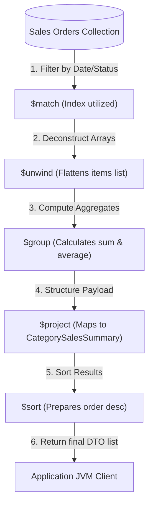
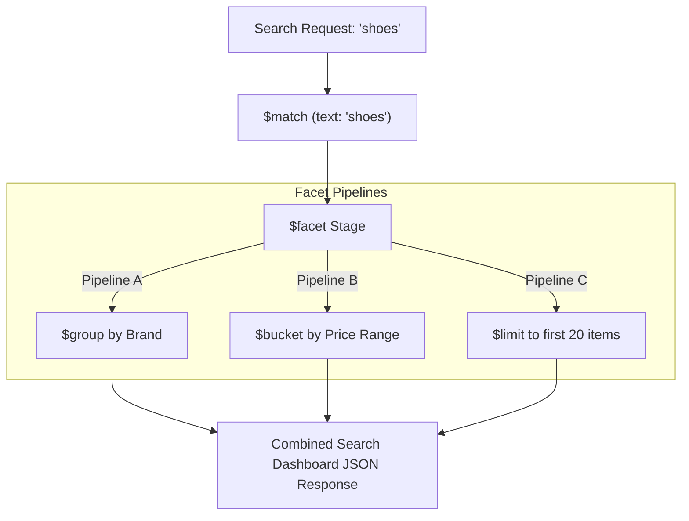

# Module 06: Aggregation Framework with Spring

This module explores the MongoDB Aggregation Framework using Spring Data's aggregation API. It details pipeline stages, explains optimization rules for index utilization, addresses memory limit constraints, and demonstrates how to build reporting pipelines.

---

## 1. What Problem It Solves

While basic CRUD queries retrieve or update specific documents, business intelligence, reporting, and real-time dashboard analytics require processing, grouping, and transforming large volumes of data.

MongoDB's Aggregation Framework solves these problems by providing:
* **In-Database Data Processing**: Allows grouping, filtering, unwinding, and restructuring documents directly on the database node, reducing network traffic and client-side processing.
* **Pipeline-Based Architecture**: Transforms data through a series of stages (like an assembly line) where the output of one stage becomes the input of the next.
* **Parallel Querying via Facets**: Executes multiple independent analytical sub-pipelines in parallel over the same input document set (e.g., calculating brand counts and price ranges simultaneously).
* **Hierarchical Traversals**: Performs recursive graph search operations (like employee hierarchies or bill-of-materials trees) using `$graphLookup`.

---

## 2. Why MongoDB Instead of Relational Databases (RDBMS)

Relational databases use SQL statements with joins and window functions. 

MongoDB's pipeline framework provides unique advantages:
* **Flexible Transformations**: Relational aggregations are limited to table schemas. MongoDB can reshape, nesting, or unwinding document structures dynamically during the pipeline.
* **Efficient Nested Array Processing**: Operators like `$unwind` deconstruct arrays into separate stream documents, allowing flat group-by operations on nested list items.
* **Horizontal Scalability**: Aggregation pipelines scale across sharded clusters, executing matching and grouping stages in parallel on each shard before assembling the final result.

---

## 3. Trade-offs and Limitations

### Memory Constraints
By default, an individual pipeline stage is limited to **$100\text{MB}$ of RAM**. If a stage (like `$group` or `$sort`) exceeds this limit, MongoDB returns an error.
* *Production Fix*: Configure `.allowDiskUse(true)` on the aggregation options, allowing MongoDB to write temporary files to disk, though this carries a performance penalty.

### Lack of Dynamic Optimization
Unlike relational query optimizers, MongoDB does not aggressively reorder stages. If you place a `$match` stage after a `$project` stage, the database will scan all documents instead of using an index.

---

## 4. Common Mistakes & Anti-patterns

### Misplaced Match or Sort Stages
Placing a `$match` or `$sort` stage after transforming operations like `$project`, `$unwind`, or `$group`.
* *Why it's bad*: Once the pipeline changes document fields or deconstructs arrays, MongoDB can no longer use indexes on those fields. This forces the engine to scan every intermediate document in memory, degrading performance.
* *Production Fix*: Always place `$match` and `$sort` stages at the **beginning** of the pipeline, using indexes to filter and sort the input dataset first.

### Fetching raw data and aggregating in JVM memory
Loading millions of raw document entities using `Repository.findAll()` and then calculating sums, averages, or counts inside Java stream code.
* *Why it's bad*: Pulls massive volumes of BSON data over the network, flooding the application JVM heap, causing garbage collection spikes and eventual OOM crashes.
* *Production Fix*: Let the database do the heavy lifting. Run the aggregation pipeline on the MongoDB node and return only the final, aggregated result DTO.

### Overusing `$unwind` without filtering
Executing a `$unwind` stage on a large collection without applying a `$match` stage first.
* *Why it's bad*: `$unwind` generates a duplicate document for every element in the target array. Unwinding arrays of size 100 on 1 million documents creates 100 million intermediate documents, leading to high disk and memory usage.
* *Production Fix*: Always filter documents first using a `$match` stage before calling `$unwind`.

---

## 5. When NOT to Use Aggregations

* **High-Concurrency Operational Writes**: Do not use complex aggregation pipelines in write loops. Aggregations are read-heavy, CPU-intensive operations designed for analytical queries.
* **Complex Multi-Database Joins**: If you need to join data across multiple separate systems (e.g., correlating MongoDB orders with customer profiles in Postgres), perform the join using an event broker (like Kafka) or an orchestration service.

---

## 6. Spring Boot & Spring Data Implementation

This project implements a Sales Analytics Dashboard that aggregates order items, calculates total revenue, groups them by product category, and computes average prices.

### Domain Objects
```java
package com.masterclass.mongodb.domain;

import org.springframework.data.annotation.Id;
import org.springframework.data.mongodb.core.mapping.Document;
import org.springframework.data.mongodb.core.mapping.Field;
import java.time.Instant;
import java.util.List;

@Document(collection = "sales_orders")
public class SalesOrder {
    @Id
    private String id;
    
    @Field("customer_id")
    private String customerId;
    
    @Field("order_date")
    private Instant orderDate;
    
    private List<SalesItem> items;
    
    private String status; // "COMPLETED", "CANCELLED"

    public SalesOrder() {}

    public SalesOrder(String id, String customerId, Instant orderDate, List<SalesItem> items, String status) {
        this.id = id;
        this.customerId = customerId;
        this.orderDate = orderDate;
        this.items = items;
        this.status = status;
    }

    public String getId() { return id; }
    public String getCustomerId() { return customerId; }
    public Instant getOrderDate() { return orderDate; }
    public List<SalesItem> getItems() { return items; }
    public String getStatus() { return status; }
}
```

```java
package com.masterclass.mongodb.domain;

import java.math.BigDecimal;

public class SalesItem {
    private String productId;
    private String category;
    private int quantity;
    private BigDecimal unitPrice;

    public SalesItem() {}

    public SalesItem(String productId, String category, int quantity, BigDecimal unitPrice) {
        this.productId = productId;
        this.category = category;
        this.quantity = quantity;
        this.unitPrice = unitPrice;
    }

    public String getProductId() { return productId; }
    public String getCategory() { return category; }
    public int getQuantity() { return quantity; }
    public BigDecimal getUnitPrice() { return unitPrice; }
}
```

### Response DTO: Category Sales Summary
```java
package com.masterclass.mongodb.dto;

import java.math.BigDecimal;

public class CategorySalesSummary {
    private String id; // Represents the grouped Category
    private long totalQuantitySold;
    private BigDecimal totalRevenue;
    private double averageUnitPrice;

    public CategorySalesSummary(String id, long totalQuantitySold, BigDecimal totalRevenue, double averageUnitPrice) {
        this.id = id;
        this.totalQuantitySold = totalQuantitySold;
        this.totalRevenue = totalRevenue;
        this.averageUnitPrice = averageUnitPrice;
    }

    public String getId() { return id; }
    public long getTotalQuantitySold() { return totalQuantitySold; }
    public BigDecimal getTotalRevenue() { return totalRevenue; }
    public double getAverageUnitPrice() { return averageUnitPrice; }
}
```

### Sales Aggregation Service
```java
package com.masterclass.mongodb.service;

import com.masterclass.mongodb.domain.SalesOrder;
import com.masterclass.mongodb.dto.CategorySalesSummary;
import org.springframework.data.domain.Sort;
import org.springframework.data.mongodb.core.MongoTemplate;
import org.springframework.data.mongodb.core.aggregation.Aggregation;
import org.springframework.data.mongodb.core.aggregation.AggregationOptions;
import org.springframework.data.mongodb.core.aggregation.AggregationResults;
import org.springframework.data.mongodb.core.aggregation.TypedAggregation;
import org.springframework.data.mongodb.core.query.Criteria;
import org.springframework.stereotype.Service;
import java.time.Instant;
import java.util.List;

@Service
public class SalesAnalyticsService {

    private final MongoTemplate mongoTemplate;

    public SalesAnalyticsService(MongoTemplate mongoTemplate) {
        this.mongoTemplate = mongoTemplate;
    }

    /**
     * Aggregates completed sales orders within a date range, grouping by category.
     * Demonstrates `$match`, `$unwind`, `$group`, `$project`, and `$sort` stages.
     */
    public List<CategorySalesSummary> getSalesSummaryByCategory(Instant startDate, Instant endDate) {
        
        // Define the pipeline stages:
        // Stage 1: Filter by date range and status using index
        var matchStage = Aggregation.match(
                Criteria.where("status").is("COMPLETED")
                        .and("order_date").gte(startDate).lte(endDate)
        );

        // Stage 2: Deconstruct items array into separate documents
        var unwindStage = Aggregation.unwind("items");

        // Stage 3: Group by item category and calculate aggregates
        var groupStage = Aggregation.group("items.category")
                .sum("items.quantity").as("totalQuantitySold")
                // Multiply quantity by unitPrice to get revenue per item
                .sum(Aggregation.expressions().andExpression("items.quantity * items.unitPrice"))
                .as("totalRevenue")
                .avg("items.unitPrice").as("averageUnitPrice");

        // Stage 4: Project fields into the DTO structure
        var projectStage = Aggregation.project("totalQuantitySold", "totalRevenue", "averageUnitPrice");

        // Stage 5: Sort by total revenue descending
        var sortStage = Aggregation.sort(Sort.Direction.DESC, "totalRevenue");

        // Set Aggregation Options (e.g. allowDiskUse)
        AggregationOptions options = Aggregation.newAggregationOptions()
                .allowDiskUse(true)
                .build();

        // Assemble pipeline
        TypedAggregation<SalesOrder> aggregation = Aggregation.newAggregation(
                SalesOrder.class,
                matchStage,
                unwindStage,
                groupStage,
                projectStage,
                sortStage
        ).withOptions(options);

        // Execute aggregation
        AggregationResults<CategorySalesSummary> results = mongoTemplate.aggregate(
                aggregation, 
                CategorySalesSummary.class
        );

        return results.getMappedResults();
    }
}
```

---

## 7. Production Architecture Examples

### 1. Sales Aggregation Pipeline flow
The diagram below shows how data transforms as it moves through each stage of the aggregation pipeline, reducing the payload size before returning the final DTO:



### 2. Multi-Faceted Product Filtering Flow (Faceted Search)
Using `$facet` allows executing multiple aggregation sub-pipelines in parallel on the same document stream, which is ideal for e-commerce search filters:



---

## 8. Interview-Level Questions

### Q1: Why is the order of `$match` and `$sort` stages critical when designing aggregation pipelines?
**Answer**:
* **Index Utilization**: MongoDB can only use indexes to filter and sort documents if the `$match` and `$sort` stages occur at the *very beginning* of the pipeline.
* **Stage Sequence**: If you place a `$project`, `$unwind`, or `$group` stage before `$match` or `$sort`, the index is discarded. The pipeline must then perform an in-memory collection scan and sort, which degrades performance and can trigger the $100\text{MB}$ RAM limit.

### Q2: What is the $100\text{MB}$ RAM limit in MongoDB pipeline stages? How do you bypass it, and what are the operational consequences?
**Answer**:
* **Limit**: To prevent slow queries from consuming all system RAM, MongoDB limits each pipeline stage to a maximum of $100\text{MB}$ of memory.
* **Bypassing**: You can set `allowDiskUse(true)` on the query. This allows stages to write temporary BSON files to the disk if they exceed the memory limit.
* **Consequences**: spiling data to disk introduces high I/O latency. While the query will complete without crashing, execution times can increase significantly.

### Q3: Explain the difference between `$lookup` and `$graphLookup`.
**Answer**:
* **`$lookup`**: Performs a left outer join to retrieve documents from another collection. It matches local keys to foreign keys, or executes custom subqueries.
* **`$graphLookup`**: Performs a recursive search across a collection to map hierarchical relationships (like reporting chains, network graphs, or category trees). It recursively follows links between documents until a maximum depth is reached or no more matches are found.

---

## 9. Hands-on Exercises

### Exercise 1: Profiling Aggregation Memory Usage
1. Set up your local replica set.
2. Ingest 50,000 mock sales orders with multiple items per order.
3. Write an aggregation in `mongosh` that groups all items without a preceding `$match` filter, and run it with explain details:
   ```javascript
   db.sales_orders.explain("executionStats").aggregate([
     { $unwind: "$items" },
     { $group: { _id: "$items.category", count: { $sum: 1 } } }
   ])
   ```
4. Verify the memory footprint in the explain statistics and locate the `usedDisk` metric.

### Exercise 2: Implementing a Correlated `$lookup` Join
1. Create a `customers` collection containing name and account status, and a `sales_orders` collection.
2. Write a Spring Data aggregation pipeline that joins orders with their customer details using `$lookup`, returning only orders from customers with status `"ACTIVE"`.

---

## 10. Mini-Project: Real-time Analytics Reporting Engine

### Scenario
You are building the reporting dashboard for a SaaS company. The system tracks user interactions (clicks, page views, logins) in an `activity_logs` collection. 
The dashboard must generate an hourly activity report for a specific tenant, calculating:
1. Total events processed.
2. Unique users active.
3. Event counts grouped by action type (e.g., `"CLICK"`, `"PAGE_VIEW"`).
The pipeline must run efficiently, utilize indexes, and support pagination.

### Step 1: Implement the Activity Log Document
```java
package com.masterclass.mongodb.miniproject.model;

import org.springframework.data.annotation.Id;
import org.springframework.data.mongodb.core.index.CompoundIndex;
import org.springframework.data.mongodb.core.mapping.Document;
import org.springframework.data.mongodb.core.mapping.Field;
import java.time.Instant;

@Document(collection = "activity_logs")
// Compound index to support rapid tenant filtering on date bounds
@CompoundIndex(name = "idx_tenant_time_action", def = "{'tenant_id': 1, 'timestamp': -1, 'action': 1}")
public class ActivityLog {

    @Id
    private String id;

    @Field("tenant_id")
    private String tenantId;

    @Field("user_id")
    private String userId;

    private String action; // e.g. "CLICK", "PAGE_VIEW", "LOGIN"

    private Instant timestamp;

    public ActivityLog() {}

    public ActivityLog(String id, String tenantId, String userId, String action, Instant timestamp) {
        this.id = id;
        this.tenantId = tenantId;
        this.userId = userId;
        this.action = action;
        this.timestamp = timestamp;
    }

    public String getId() { return id; }
    public String getTenantId() { return tenantId; }
    public String getUserId() { return userId; }
    public String getAction() { return action; }
    public Instant getTimestamp() { return timestamp; }
}
```

### Step 2: Implement Reporting DTOs
```java
package com.masterclass.mongodb.miniproject.dto;

import java.util.List;

public class TenantActivityReport {
    private String tenantId;
    private long totalEvents;
    private long uniqueUsersCount;
    private List<ActionMetric> actionBreakdown;

    public TenantActivityReport(String tenantId, long totalEvents, long uniqueUsersCount, List<ActionMetric> actionBreakdown) {
        this.tenantId = tenantId;
        this.totalEvents = totalEvents;
        this.uniqueUsersCount = uniqueUsersCount;
        this.actionBreakdown = actionBreakdown;
    }

    public String getTenantId() { return tenantId; }
    public long getTotalEvents() { return totalEvents; }
    public long getUniqueUsersCount() { return uniqueUsersCount; }
    public List<ActionMetric> getActionBreakdown() { return actionBreakdown; }
}
```

```java
package com.masterclass.mongodb.miniproject.dto;

public class ActionMetric {
    private String action;
    private long count;

    public ActionMetric() {}

    public ActionMetric(String action, long count) {
        this.action = action;
        this.count = count;
    }

    public String getAction() { return action; }
    public long getCount() { return count; }
}
```

### Step 3: Implement Dashboard Aggregation Service
This service uses `$facet` to execute two independent analysis pipelines in parallel:
1. Pipeline 1: Calculates total events and unique active user counts.
2. Pipeline 2: Groups event counts by action type.

```java
package com.masterclass.mongodb.miniproject.service;

import com.masterclass.mongodb.miniproject.dto.ActionMetric;
import com.masterclass.mongodb.miniproject.dto.TenantActivityReport;
import com.masterclass.mongodb.miniproject.model.ActivityLog;
import org.bson.Document;
import org.springframework.data.mongodb.core.MongoTemplate;
import org.springframework.data.mongodb.core.aggregation.Aggregation;
import org.springframework.data.mongodb.core.aggregation.AggregationResults;
import org.springframework.data.mongodb.core.query.Criteria;
import org.springframework.stereotype.Service;
import java.time.Instant;
import java.util.ArrayList;
import java.util.List;

@Service
public class ActivityReportingService {

    private final MongoTemplate mongoTemplate;

    public ActivityReportingService(MongoTemplate mongoTemplate) {
        this.mongoTemplate = mongoTemplate;
    }

    /**
     * Generates a dashboard summary report for a tenant within a specific time window.
     */
    public TenantActivityReport generateReport(String tenantId, Instant start, Instant end) {
        // Stage 1: Filter by tenant and date bounds (utilizes the compound index)
        var matchStage = Aggregation.match(
                Criteria.where("tenant_id").is(tenantId)
                        .and("timestamp").gte(start).lte(end)
        );

        // Stage 2: Build the parallel facet pipelines
        var facetStage = Aggregation.facet(
                // Sub-pipeline 1: Compute counts and unique active users
                Aggregation.group()
                        .count().as("totalEvents")
                        .addToSet("user_id").as("uniqueUsers"),
                Aggregation.project("totalEvents")
                        .and("uniqueUsers").size().as("uniqueUsersCount")
        ).as("metricsSubPipeline")
        .and(
                // Sub-pipeline 2: Group by action type and count occurrences
                Aggregation.group("action").count().as("count"),
                Aggregation.project("count").and("_id").as("action")
        ).as("breakdownSubPipeline");

        // Assemble aggregation
        Aggregation aggregation = Aggregation.newAggregation(
                matchStage,
                facetStage
        );

        // Execute raw aggregation targeting the BSON output directly
        AggregationResults<Document> results = mongoTemplate.aggregate(aggregation, ActivityLog.class, Document.class);
        Document resultDoc = results.getUniqueMappedResult();

        if (resultDoc == null) {
            return new TenantActivityReport(tenantId, 0, 0, List.of());
        }

        // Parse metrics sub-pipeline output
        List<Document> metricsList = (List<Document>) resultDoc.get("metricsSubPipeline");
        long totalEvents = 0;
        long uniqueUsersCount = 0;
        if (metricsList != null && !metricsList.isEmpty()) {
            Document metrics = metricsList.get(0);
            totalEvents = metrics.getInteger("totalEvents", 0);
            uniqueUsersCount = metrics.getInteger("uniqueUsersCount", 0);
        }

        // Parse breakdown sub-pipeline output
        List<Document> breakdownList = (List<Document>) resultDoc.get("breakdownSubPipeline");
        List<ActionMetric> breakdown = new ArrayList<>();
        if (breakdownList != null) {
            for (Document doc : breakdownList) {
                breakdown.add(new ActionMetric(doc.getString("action"), doc.getInteger("count", 0)));
            }
        }

        return new TenantActivityReport(tenantId, totalEvents, uniqueUsersCount, breakdown);
    }
}
```

### Step 4: Verification Command Line Runner
```java
package com.masterclass.mongodb.miniproject.test;

import com.masterclass.mongodb.miniproject.dto.TenantActivityReport;
import com.masterclass.mongodb.miniproject.model.ActivityLog;
import com.masterclass.mongodb.miniproject.service.ActivityReportingService;
import org.springframework.boot.CommandLineRunner;
import org.springframework.data.mongodb.core.MongoTemplate;
import org.springframework.stereotype.Component;
import java.time.Instant;

@Component
public class ReportVerificationRunner implements CommandLineRunner {

    private final MongoTemplate mongoTemplate;
    private final ActivityReportingService reportingService;

    public ReportVerificationRunner(MongoTemplate mongoTemplate, ActivityReportingService reportingService) {
        this.mongoTemplate = mongoTemplate;
        this.reportingService = reportingService;
    }

    @Override
    public void run(String... args) throws Exception {
        // Clear collections
        mongoTemplate.dropCollection(ActivityLog.class);

        Instant now = Instant.now();

        // Seed click and page view events for Tenant A
        mongoTemplate.save(new ActivityLog("1", "TENANT-A", "user-1", "LOGIN",     now.minusSeconds(600)));
        mongoTemplate.save(new ActivityLog("2", "TENANT-A", "user-2", "PAGE_VIEW", now.minusSeconds(400)));
        mongoTemplate.save(new ActivityLog("3", "TENANT-A", "user-1", "PAGE_VIEW", now.minusSeconds(300)));
        mongoTemplate.save(new ActivityLog("4", "TENANT-A", "user-3", "CLICK",     now.minusSeconds(100)));
        // Seed event for Tenant B (should be ignored)
        mongoTemplate.save(new ActivityLog("5", "TENANT-B", "user-4", "CLICK",     now.minusSeconds(50)));

        // Generate report for Tenant A
        TenantActivityReport report = reportingService.generateReport("TENANT-A", now.minusSeconds(3600), now);

        System.out.println("Activity Reporting Execution Verified:");
        System.out.println("Tenant ID: " + report.getTenantId());
        System.out.println("Total Events (Expected: 4): " + report.getTotalEvents());
        System.out.println("Unique Active Users (Expected: 3): " + report.getUniqueUsersCount());
        System.out.println("Actions Count:");
        report.getActionBreakdown().forEach(action -> 
            System.out.println(" - " + action.getAction() + ": " + action.getCount())
        );
    }
}
```
This mini-project demonstrates how to design a real-time analytics engine in Spring using `$facet` to perform parallel aggregation pipelines in a single database query.
