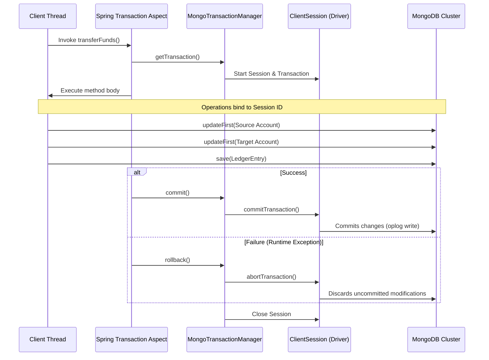
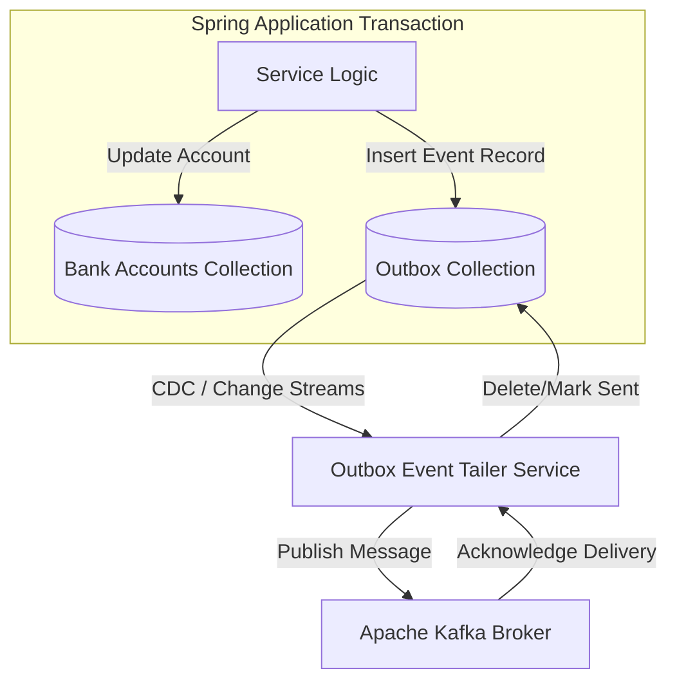

# Module 07: Transactions and Consistency

This module covers transaction management and consistency models in MongoDB. It explores multi-document transactions using `MongoTransactionManager`, analyzes read and write concerns, and details distributed consistency patterns like the Transactional Outbox.

---

## 1. What Problem It Solves

By default, write operations in MongoDB are atomic only at the single-document level. If a business workflow requires updating multiple documents across different collections (e.g., deducting customer account balance and creating an order log), a failure mid-process can leave the database in an inconsistent, partially updated state.

Spring Data MongoDB transaction management solves this by:
* **Providing ACID Multi-Document Transactions**: Combines multiple operations across collections into a single atomic block using Spring's standard `@Transactional` annotation.
* **Enforcing Read/Write Isolation**: Ensures that intermediate, uncommitted writes inside a transaction are invisible to other concurrent threads (read isolation).
* **Guarantees Atomicity**: Automatically rolls back all modifications across collections if any operation fails or throws an exception.
* **Supporting Transactional Outbox**: Guarantees that business state changes and outgoing messaging events are saved atomically in the same database transaction.

---

## 2. Why MongoDB Instead of Relational Databases (RDBMS)

Relational databases use transactions by default for almost all multi-table modifications.

MongoDB handles transactions differently:
* **Single-Document Atomicity as Default**: Because MongoDB documents can nest related structures (order items, addresses) within a single document, most operations do not need multi-document transactions. Relational systems require joins and multiple tables, forcing transaction usage.
* **Tunable Consistency Controls**: Unlike relational databases with fixed transaction isolation, MongoDB allows applications to configure consistency on the fly. You can request fast, local reads for non-critical pages, and snapshot-isolated majority-validated transactions for checkout paths.
* **Non-Blocking Read Operations**: Under MongoDB's MVCC (Multi-Version Concurrency Control) engine, readers do not block writers, and writers do not block readers, maintaining high read throughput even during active transactions.

---

## 3. Trade-offs and Limitations

### Replica Set Requirement
Multi-document transactions **strictly require** a replica set or sharded cluster configuration. Standalone MongoDB instances do not support multi-document transactions because they lack the oplog (operations log) infrastructure used to coordinate rollbacks.

### Latency and Locking
Transactions introduce significant latency overhead. MongoDB must acquire locks on modified documents, create a transaction session, write session metadata, and verify replication consensus.
* Keep transactions short (MongoDB defaults to a **$60\text{-second}$ transaction execution limit** to prevent resources from being locked indefinitely).

---

## 4. Common Mistakes & Anti-patterns

### Using Multi-Document Transactions for Standard Embedded Data
Wrapping simple updates to a single document in a transaction.
* *Why it's bad*: Single-document updates are already atomic by design. Wrapping them in a transaction adds session setup and network round-trip overhead for no functional benefit.
* *Production Fix*: Use nested document updates or atomic operators (`$set`, `$inc`, `$push`) rather than transactions for single-document modifications.

### Missing the `MongoTransactionManager` Bean Config
Adding the `@Transactional` annotation to a service method without registering a `MongoTransactionManager` bean in the Spring configuration.
* *Why it's bad*: Spring will silently ignore the transaction boundary, running the repository calls as separate, non-transactional database operations. If an error occurs, no rollback will happen.
* *Production Fix*: Register a `MongoTransactionManager` bean.

### High-Frequency Writes under Strict Write Concerns
Setting write concern to `w: "majority"` with `j: true` on high-throughput, low-criticality loggers.
* *Why it's bad*: The database is forced to wait for network round-trips and physical disk commits across multiple nodes for every single write, which degrades ingestion performance.
* *Production Fix*: Use weaker write concerns (like `w: 1`) for non-critical logging, reserving strict concerns for core financial transactions.

---

## 5. When NOT to Use Transactions

* **High-Throughput Analytics Logging**: If you are logging telemetry data, clickstreams, or page views, transaction overhead is unacceptable. Use atomic single-document updates.
* **Cross-Microservice State Coordination**: Do not attempt to run database-level transactions that span multiple microservices. Use event-driven Saga orchestration patterns instead.

---

## 6. Spring Boot & Spring Data Implementation

This project implements a Bank Transfer Service that transfers funds between accounts and writes a ledger entry atomically inside a transaction.

### Domain Models
```java
package com.masterclass.mongodb.domain;

import org.springframework.data.annotation.Id;
import org.springframework.data.mongodb.core.mapping.Document;
import org.springframework.data.mongodb.core.mapping.Field;
import java.math.BigDecimal;

@Document(collection = "bank_accounts")
public class BankAccount {
    @Id
    private String id;
    
    @Field("account_number")
    private String accountNumber;
    
    private BigDecimal balance;

    public BankAccount() {}

    public BankAccount(String id, String accountNumber, BigDecimal balance) {
        this.id = id;
        this.accountNumber = accountNumber;
        this.balance = balance;
    }

    public String getId() { return id; }
    public String getAccountNumber() { return accountNumber; }
    public BigDecimal getBalance() { return balance; }
    public void setBalance(BigDecimal balance) { this.balance = balance; }
}
```

```java
package com.masterclass.mongodb.domain;

import org.springframework.data.annotation.Id;
import org.springframework.data.mongodb.core.mapping.Document;
import org.springframework.data.mongodb.core.mapping.Field;
import java.math.BigDecimal;
import java.time.Instant;

@Document(collection = "ledger_entries")
public class LedgerEntry {
    @Id
    private String id;
    
    @Field("source_account")
    private String sourceAccount;
    
    @Field("target_account")
    private String targetAccount;
    
    private BigDecimal amount;
    
    private Instant timestamp;

    public LedgerEntry() {}

    public LedgerEntry(String sourceAccount, String targetAccount, BigDecimal amount, Instant timestamp) {
        this.sourceAccount = sourceAccount;
        this.targetAccount = targetAccount;
        this.amount = amount;
        this.timestamp = timestamp;
    }

    public String getId() { return id; }
    public String getSourceAccount() { return sourceAccount; }
    public String getTargetAccount() { return targetAccount; }
    public BigDecimal getAmount() { return amount; }
    public Instant getTimestamp() { return timestamp; }
}
```

### Transaction Configuration
```java
package com.masterclass.mongodb.config;

import org.springframework.context.annotation.Bean;
import org.springframework.context.annotation.Configuration;
import org.springframework.data.mongodb.MongoDatabaseFactory;
import org.springframework.data.mongodb.MongoTransactionManager;

@Configuration
public class TransactionConfig {

    /**
     * Registers the MongoTransactionManager bean.
     * This bean enables Spring to intercept methods annotated with @Transactional
     * and bind them to MongoDB client sessions.
     */
    @Bean
    public MongoTransactionManager transactionManager(MongoDatabaseFactory dbFactory) {
        return new MongoTransactionManager(dbFactory);
    }
}
```

### Bank Transfer Service
```java
package com.masterclass.mongodb.service;

import com.masterclass.mongodb.domain.BankAccount;
import com.masterclass.mongodb.domain.LedgerEntry;
import org.springframework.data.mongodb.core.MongoTemplate;
import org.springframework.data.mongodb.core.query.Criteria;
import org.springframework.data.mongodb.core.query.Query;
import org.springframework.data.mongodb.core.query.Update;
import org.springframework.stereotype.Service;
import org.springframework.transaction.annotation.Transactional;
import java.math.BigDecimal;
import java.time.Instant;

@Service
public class BankTransferService {

    private final MongoTemplate mongoTemplate;

    public BankTransferService(MongoTemplate mongoTemplate) {
        this.mongoTemplate = mongoTemplate;
    }

    /**
     * Executes a fund transfer between two accounts and logs the transaction.
     * Running inside a transaction ensures that money is not deducted without being credited.
     */
    @Transactional
    public void transferFunds(String sourceNo, String targetNo, BigDecimal amount) {
        // Query check: Verify source account has sufficient balance
        Query sourceQuery = new Query(Criteria.where("account_number").is(sourceNo));
        BankAccount source = mongoTemplate.findOne(sourceQuery, BankAccount.class);
        
        if (source == null) {
            throw new IllegalArgumentException("Source account " + sourceNo + " not found");
        }
        if (source.getBalance().compareTo(amount) < 0) {
            throw new IllegalStateException("Insufficient balance in account: " + sourceNo);
        }

        // Deduct from source
        Update deductUpdate = new Update().inc("balance", amount.negate());
        mongoTemplate.updateFirst(sourceQuery, deductUpdate, BankAccount.class);

        // Credit target
        Query targetQuery = new Query(Criteria.where("account_number").is(targetNo));
        Update creditUpdate = new Update().inc("balance", amount);
        var updateResult = mongoTemplate.updateFirst(targetQuery, creditUpdate, BankAccount.class);

        if (updateResult.getMatchedCount() == 0) {
            // Force transaction rollback by throwing an exception
            throw new IllegalArgumentException("Target account " + targetNo + " does not exist");
        }

        // Write ledger audit record
        LedgerEntry ledger = new LedgerEntry(sourceNo, targetNo, amount, Instant.now());
        mongoTemplate.save(ledger);
    }
}
```

---

## 7. Production Architecture Examples

### 1. Spring Transaction Management Interceptors
This diagram shows how Spring manages a MongoDB transaction lifecycle using sessions under the hood:



### 2. Transactional Outbox Pattern Architecture
To ensure reliable event delivery in microservices, write the business entity update and an outbox event document within the same transaction. A separate publisher process then reads the outbox collection and sends events to Kafka:



---

## 8. Interview-Level Questions

### Q1: Why can you NOT run transactions on a standalone MongoDB server?
**Answer**:
MongoDB transactions rely on the **Oplog (Operations Log)** to track intermediate changes and coordinate rollbacks. 
* Standalone MongoDB servers do not maintain an oplog because replication is disabled.
* Consequently, MongoDB cannot create transactional sessions or rollback data on standalone nodes. A Replica Set or Sharded Cluster configuration is required.

### Q2: Detail the differences between `majority` and `linearizable` read concern configurations.
**Answer**:
* **`majority`**: Returns data that has been acknowledged by a majority of replica set nodes, ensuring it is durable and cannot be rolled back if the primary fails. However, it can return stale data if another node has committed newer changes that haven't reached the majority.
* **`linearizable`**: Guarantees that a read operation returns the most recent write acknowledged by a majority of nodes. To achieve this, the primary node must perform a round-trip check to confirm it is still the leader before answering the query. This prevents stale reads but adds latency.

### Q3: What is a "TransientTransactionError" label, and how does Spring Boot handle it?
**Answer**:
* **TransientTransactionError**: Indicates that a transaction failed due to a transient network glitch, primary election, or write conflict. The operation is safe to retry.
* **Spring Handling**: If using raw template transaction callbacks (like `withSession()`), the MongoDB driver automatically retries the transaction. However, if you use Spring's `@Transactional` annotation, it does not retry by default. You must configure Spring's `@Retryable` annotation or implement a retry interceptor.

---

## 9. Hands-on Exercises

### Exercise 1: Verification of Transaction Rollbacks
1. Set up the local 3-node replica set.
2. Seed the database with a single account:
   ```json
   { "account_number": "ACC-01", "balance": 1000.00 }
   ```
3. Invoke `bankTransferService.transferFunds("ACC-01", "NON-EXISTENT", 100.00)`.
4. The target account lookup will fail, throwing an exception.
5. Query the database using `mongosh` to verify that `ACC-01`'s balance was rolled back to `1000.00` and no ledger entry was created.

### Exercise 2: Implementing Read Concerns in Queries
1. Write a query using `MongoTemplate` that configures `ReadConcern.MAJORITY` and `ReadPreference.secondary()` to read only from secondary replica set nodes.
2. Confirm the configuration by enabling client driver logging.

---

## 10. Mini-Project: Transactional Order Outbox Service

### Scenario
You are building an e-commerce order ingestion system. When an order is placed, the service must:
1. Deduct stock from the inventory collection.
2. Save the order document.
3. Write an event document to the `outbox` collection.
All three operations must execute atomically within a transaction. 
If inventory is insufficient, the entire transaction must roll back, ensuring no order is created and no event is published.

### Step 1: Implement Domain Mappings
```java
package com.masterclass.mongodb.miniproject.model;

import org.springframework.data.annotation.Id;
import org.springframework.data.mongodb.core.mapping.Document;
import org.springframework.data.mongodb.core.mapping.Field;

@Document(collection = "outbox_events")
public class OutboxEvent {
    @Id
    private String id;
    private String aggregateId;
    private String eventType;
    private String payload;
    private String status; // "PENDING", "SENT"

    public OutboxEvent() {}

    public OutboxEvent(String aggregateId, String eventType, String payload) {
        this.aggregateId = aggregateId;
        this.eventType = eventType;
        this.payload = payload;
        this.status = "PENDING";
    }

    public String getId() { return id; }
    public String getAggregateId() { return aggregateId; }
    public String getEventType() { return eventType; }
    public String getPayload() { return payload; }
    public String getStatus() { return status; }
}
```

```java
package com.masterclass.mongodb.miniproject.model;

import org.springframework.data.annotation.Id;
import org.springframework.data.mongodb.core.mapping.Document;

@Document(collection = "inventory_items")
public class ProductStock {
    @Id
    private String id;
    private String sku;
    private int stockCount;

    public ProductStock() {}

    public ProductStock(String id, String sku, int stockCount) {
        this.id = id;
        this.sku = sku;
        this.stockCount = stockCount;
    }

    public String getId() { return id; }
    public String getSku() { return sku; }
    public int getStockCount() { return stockCount; }
    public void setStockCount(int stockCount) { this.stockCount = stockCount; }
}
```

```java
package com.masterclass.mongodb.miniproject.model;

import org.springframework.data.annotation.Id;
import org.springframework.data.mongodb.core.mapping.Document;

@Document(collection = "orders")
public class ClientOrder {
    @Id
    private String id;
    private String sku;
    private int quantity;

    public ClientOrder() {}

    public ClientOrder(String sku, int quantity) {
        this.sku = sku;
        this.quantity = quantity;
    }

    public String getId() { return id; }
    public String getSku() { return sku; }
    public int getQuantity() { return quantity; }
}
```

### Step 2: Implement Transactional Order Service
```java
package com.masterclass.mongodb.miniproject.service;

import com.masterclass.mongodb.miniproject.model.ClientOrder;
import com.masterclass.mongodb.miniproject.model.OutboxEvent;
import com.masterclass.mongodb.miniproject.model.ProductStock;
import org.springframework.data.mongodb.core.MongoTemplate;
import org.springframework.data.mongodb.core.query.Criteria;
import org.springframework.data.mongodb.core.query.Query;
import org.springframework.data.mongodb.core.query.Update;
import org.springframework.stereotype.Service;
import org.springframework.transaction.annotation.Transactional;

@Service
public class OrderCheckoutService {

    private final MongoTemplate mongoTemplate;

    public OrderCheckoutService(MongoTemplate mongoTemplate) {
        this.mongoTemplate = mongoTemplate;
    }

    /**
     * Deducts inventory, creates an order, and schedules an event in the outbox.
     * Everything runs within a single transaction to guarantee consistency.
     */
    @Transactional
    public void placeOrder(String sku, int qty) {
        // Query to check stock and deduct in a single atomic update
        Query stockQuery = new Query(
                Criteria.where("sku").is(sku)
                        .and("stockCount").gte(qty)
        );
        Update stockDeduct = new Update().inc("stockCount", -qty);

        var result = mongoTemplate.updateFirst(stockQuery, stockDeduct, ProductStock.class);

        // If no stock record matched, stock is insufficient
        if (result.getModifiedCount() == 0) {
            throw new IllegalStateException("Insufficient stock for SKU: " + sku);
        }

        // Create the order document
        ClientOrder order = new ClientOrder(sku, qty);
        mongoTemplate.save(order);

        // Create the outbox event document
        String payload = String.format("{\"orderId\":\"%s\",\"sku\":\"%s\",\"qty\":%d}", order.getId(), sku, qty);
        OutboxEvent outboxEvent = new OutboxEvent(order.getId(), "ORDER_PLACED", payload);
        mongoTemplate.save(outboxEvent);
    }
}
```

### Step 3: Implement Verification Logic
```java
package com.masterclass.mongodb.miniproject.test;

import com.masterclass.mongodb.miniproject.model.ClientOrder;
import com.masterclass.mongodb.miniproject.model.OutboxEvent;
import com.masterclass.mongodb.miniproject.model.ProductStock;
import com.masterclass.mongodb.miniproject.service.OrderCheckoutService;
import org.springframework.boot.CommandLineRunner;
import org.springframework.data.mongodb.core.MongoTemplate;
import org.springframework.stereotype.Component;

@Component
public class TxVerificationRunner implements CommandLineRunner {

    private final MongoTemplate mongoTemplate;
    private final OrderCheckoutService checkoutService;

    public TxVerificationRunner(MongoTemplate mongoTemplate, OrderCheckoutService checkoutService) {
        this.mongoTemplate = mongoTemplate;
        this.checkoutService = checkoutService;
    }

    @Override
    public void run(String... args) throws Exception {
        // Seed database
        mongoTemplate.dropCollection(ProductStock.class);
        mongoTemplate.dropCollection(ClientOrder.class);
        mongoTemplate.dropCollection(OutboxEvent.class);

        mongoTemplate.save(new ProductStock("ps-01", "SKU-MACBOOK", 5));

        // Test 1: Successful Transaction
        try {
            checkoutService.placeOrder("SKU-MACBOOK", 2);
            System.out.println("Tx 1 Succeeded (MacBook Ordered)");
        } catch (Exception e) {
            System.err.println("Tx 1 Failed unexpectedly: " + e.getMessage());
        }

        // Test 2: Failed Transaction (Insufficient Stock)
        try {
            checkoutService.placeOrder("SKU-MACBOOK", 4); // Requests 4, only 3 left
            System.out.println("Tx 2 Succeeded (Expected failure)");
        } catch (Exception e) {
            System.out.println("Tx 2 Failed as expected: " + e.getMessage());
        }

        // Verify database state
        ProductStock stock = mongoTemplate.findById("ps-01", ProductStock.class);
        long totalOrders = mongoTemplate.count(new org.springframework.data.mongodb.core.query.Query(), ClientOrder.class);
        long totalEvents = mongoTemplate.count(new org.springframework.data.mongodb.core.query.Query(), OutboxEvent.class);

        System.out.println("\nFinal Verification Statistics:");
        System.out.println("Remaining Stock (Expected: 3): " + stock.getStockCount());
        System.out.println("Total Orders (Expected: 1): " + totalOrders);
        System.out.println("Total Outbox Events (Expected: 1): " + totalEvents);
    }
}
```
This mini-project demonstrates how to implement a transactional checkout flow using Spring's `@Transactional` annotation to ensure consistency across multiple collections.
