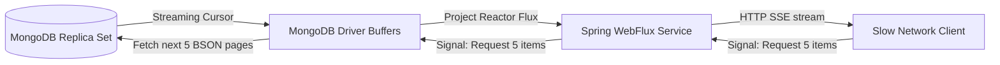

# Module 08: Reactive Spring Data MongoDB

This module explores non-blocking database operations using Reactive Spring Data MongoDB. It covers Project Reactor (`Mono`, `Flux`), backpressure mechanics, the Netty event loop threading model, and non-blocking transactional pipelines.

---

## 1. What Problem It Solves

In traditional imperative frameworks, each incoming HTTP request is bound to a single execution thread (Thread-per-Request model). When the application queries a database, that thread blocks, waiting for the database to return BSON records over the network. At scale, thousands of blocked threads consume massive amounts of JVM memory and trigger heavy CPU context switching.

Reactive Spring Data MongoDB solves this by:
* **Providing End-to-End Non-Blocking I/O**: Releases the execution thread immediately after dispatching a query. The database driver notifies the application via OS socket alerts when data is ready, maximizing hardware utilization.
* **Managing High Concurrency**: Handles thousands of concurrent database connections using a small, fixed pool of event loop threads.
* **Propagating Backpressure**: Allows slow consumers (like a web browser client) to signal the database driver to slow down BSON retrieval, preventing memory overflow in the JVM.
* **Streaming Real-time Data**: Streams live data feeds to clients using SSE (Server-Sent Events) or WebSockets directly from MongoDB cursors.

---

## 2. Why MongoDB Instead of Relational Databases (RDBMS)

While reactive relational databases exist (via R2DBC), MongoDB was designed from the ground up for asynchronous communication:
* **Native Asynchronous Wire Protocol**: MongoDB's internal network protocol uses non-blocking sockets. The official MongoDB Java driver features a native Reactive Streams implementation.
* **Change Stream Streaming**: Applications can subscribe to live collection updates using Reactive Change Streams, piping writes directly to clients as reactive streams (`Flux`).
* **GridFS Support**: Large files can be written or retrieved in non-blocking streams, avoiding the need to load complete binary payloads into JVM memory.

---

## 3. Trade-offs and Limitations

| Metric / Attribute | Imperative Spring Data | Reactive Spring Data |
| :--- | :--- | :--- |
| **Concurrency Model** | Blocked Threads (e.g. 200 threads in Tomcat) | Non-Blocking Event Loops (e.g. 1 thread per CPU core in Netty) |
| **API Complexity** | Low (standard sequential Java code) | High (functional pipelines, Mono/Flux wrappers) |
| **Debugging & Profiling** | Simple (stack traces indicate sequential execution) | Complex (stack traces are segmented across threads) |
| **Context Leaks** | Safe (ThreadLocal-based security/transaction contexts) | Vulnerable (requires Reactor Context mapping) |
| **Throughput under Load** | Constrained by connection pool bounds | High (scaled by non-blocking resource multiplexing) |

---

## 4. Common Mistakes & Anti-patterns

### Blocking the Reactive Event Loop
Executing blocking Java code (like `Thread.sleep()`, synchronous REST template calls, or legacy JDBC queries) inside a reactive stream pipeline.
* *Why it's bad*: Reactive runtimes (like Netty) use a small number of event loop threads (typically equal to CPU cores). If you block one event loop thread, you block thousands of concurrent requests assigned to that thread, causing connection timeouts and freezing the application.
* *Production Fix*: Run blocking tasks on a separate, dedicated thread pool using `.subscribeOn(Schedulers.boundedElastic())`.

```java
// ANTI-PATTERN: Blocking the Netty thread
Mono.just(id)
    .map(i -> blockingMethodCall(i)) // FREEZES the event loop
    .subscribe();

// PRODUCTION FIX: Offload blocking tasks
Mono.just(id)
    .publishOn(Schedulers.boundedElastic())
    .map(i -> blockingMethodCall(i))
    .subscribe();
```

### Forgetting to Subscribe
Declaring a reactive stream pipeline but failing to trigger its execution.
* *Why it's bad*: Reactive streams are lazy by design. Nothing happens until a subscriber subscribes (`.subscribe()`, `.block()`, or returning it to Spring WebFlux).
* *Production Fix*: Ensure all reactive flows are subscribed to, typically by returning the `Mono` or `Flux` back to the WebFlux router or controller.

---

## 5. When NOT to Use Reactive MongoDB

* **Simple Low-Throughput Applications**: If your application handles fewer than 100 requests per second, standard imperative Spring Boot is easier to build, debug, and maintain.
* **Heavy Dependency on Blocking Libraries**: If your service depends on synchronous libraries (like Spring Security's thread-local contexts, Hibernate, or blocking SOAP clients), using reactive programming adds unnecessary complexity.

---

## 6. Spring Boot & Spring Data Implementation

This project implements a non-blocking Customer Service using WebFlux, `ReactiveMongoRepository`, and `ReactiveMongoTemplate`.

### Domain Document
```java
package com.masterclass.mongodb.domain;

import org.springframework.data.annotation.Id;
import org.springframework.data.mongodb.core.mapping.Document;

@Document(collection = "reactive_customers")
public class ReactiveCustomer {
    @Id
    private String id;
    private String name;
    private String email;
    private int loyaltyPoints;

    public ReactiveCustomer() {}

    public ReactiveCustomer(String id, String name, String email, int loyaltyPoints) {
        this.id = id;
        this.name = name;
        this.email = email;
        this.loyaltyPoints = loyaltyPoints;
    }

    public String getId() { return id; }
    public String getName() { return name; }
    public String getEmail() { return email; }
    public int getLoyaltyPoints() { return loyaltyPoints; }
}
```

### Reactive Mongo Repository
```java
package com.masterclass.mongodb.repository;

import com.masterclass.mongodb.domain.ReactiveCustomer;
import org.springframework.data.mongodb.repository.ReactiveMongoRepository;
import org.springframework.stereotype.Repository;
import reactor.core.publisher.Flux;
import reactor.core.publisher.Mono;

@Repository
public interface ReactiveCustomerRepository extends ReactiveMongoRepository<ReactiveCustomer, String> {
    Mono<ReactiveCustomer> findByEmail(String email);
    Flux<ReactiveCustomer> findByLoyaltyPointsGreaterThan(int points);
}
```

### Reactive Service with Reactive Transactions
```java
package com.masterclass.mongodb.service;

import com.masterclass.mongodb.domain.ReactiveCustomer;
import com.masterclass.mongodb.repository.ReactiveCustomerRepository;
import org.springframework.data.mongodb.core.ReactiveMongoTemplate;
import org.springframework.data.mongodb.core.query.Criteria;
import org.springframework.data.mongodb.core.query.Query;
import org.springframework.data.mongodb.core.query.Update;
import org.springframework.stereotype.Service;
import org.springframework.transaction.reactive.TransactionalOperator;
import reactor.core.publisher.Flux;
import reactor.core.publisher.Mono;

@Service
public class ReactiveCustomerService {

    private final ReactiveCustomerRepository repository;
    private final ReactiveMongoTemplate reactiveMongoTemplate;
    private final TransactionalOperator transactionalOperator;

    public ReactiveCustomerService(ReactiveCustomerRepository repository, 
                                   ReactiveMongoTemplate reactiveMongoTemplate,
                                   TransactionalOperator transactionalOperator) {
        this.repository = repository;
        this.reactiveMongoTemplate = reactiveMongoTemplate;
        this.transactionalOperator = transactionalOperator;
    }

    /**
     * Retrieves all active customers as a non-blocking stream.
     */
    public Flux<ReactiveCustomer> getHighLoyaltyCustomers(int threshold) {
        return repository.findByLoyaltyPointsGreaterThan(threshold);
    }

    /**
     * Atomically adds points to a customer and saves details in a transactional block.
     * Demonstrates reactive transaction processing.
     */
    public Mono<ReactiveCustomer> rewardCustomer(String customerId, int bonusPoints) {
        Query query = new Query(Criteria.where("id").is(customerId));
        Update update = new Update().inc("loyaltyPoints", bonusPoints);

        // Define reactive update operation
        Mono<ReactiveCustomer> updateFlow = reactiveMongoTemplate.findAndModify(
                query, 
                update, 
                ReactiveCustomer.class
        ).switchIfEmpty(Mono.error(new IllegalArgumentException("Customer not found: " + customerId)));

        // Apply transactional boundary using WebFlux operators
        return updateFlow.as(transactionalOperator::transactional);
    }
}
```

### Reactive Transaction Manager Configuration
```java
package com.masterclass.mongodb.config;

import org.springframework.context.annotation.Bean;
import org.springframework.context.annotation.Configuration;
import org.springframework.data.mongodb.ReactiveMongoDatabaseFactory;
import org.springframework.data.mongodb.ReactiveMongoTransactionManager;
import org.springframework.transaction.reactive.TransactionalOperator;

@Configuration
public class ReactiveMongoConfig {

    @Bean
    public ReactiveMongoTransactionManager reactiveTransactionManager(ReactiveMongoDatabaseFactory dbFactory) {
        return new ReactiveMongoTransactionManager(dbFactory);
    }

    @Bean
    public TransactionalOperator transactionalOperator(ReactiveMongoTransactionManager transactionManager) {
        return TransactionalOperator.create(transactionManager);
    }
}
```

---

## 7. Production Architecture Examples

### 1. Threading Model Comparison
Traditional Spring applications block request threads during database queries. Reactive Spring uses an event loop, releasing threads to handle other incoming requests:

```mermaid
graph TD
    subgraph Thread-Per-Request (Tomcat)
        A1[HTTP Request 1] -->|Binds thread 1| B1[Execute Query]
        B1 -->|Thread BLOCKED| C1[Wait for Database Network]
        C1 -->|Return BSON| D1[Thread Released]
    end
    
    subgraph Non-Blocking Event Loop (Netty)
        A2[HTTP Request 1] -->|Register on Event Loop| B2[Dispatch Query Async]
        B2 -->|Event Loop Free| C2[Handle HTTP Request 2]
        D2[Database Returns Data] -->|OS Socket Alert| E2[Assign Event Loop to process response]
    end
```

### 2. Backpressure Flow: Database to Client Socket
Backpressure allows slow consumers (like a browser client over a slow connection) to signal the database driver to slow down BSON retrieval, protecting JVM memory:



---

## 8. Interview-Level Questions

### Q1: What is the risk of executing blocking operations inside reactive event loops, and how do you resolve it?
**Answer**:
* **Risk**: Netty event loop threads are kept to a minimum (typically matching the host's CPU core count). If a blocking operation (like a synchronous REST template call or a thread sleep) is executed inside the event loop, that thread blocks, preventing it from handling any other requests assigned to it. This causes connection timeouts, performance degradation, and can freeze the entire application.
* **Resolution**: Wrap the blocking operation in a Project Reactor execution chain, offloading it to a dedicated, elastic thread pool using `.publishOn(Schedulers.boundedElastic())` or `.subscribeOn(Schedulers.boundedElastic())`.

### Q2: How does the `TransactionalOperator` implement transactions reactively compared to standard `@Transactional`?
**Answer**:
* **`@Transactional`**: Uses `ThreadLocal` variables to bind the database transaction session to the active execution thread. In reactive applications, threads change dynamically across operators, which would break the thread-local context.
* **`TransactionalOperator`**: Binds the transaction session to the Project Reactor **Context**, which propagates down the stream regardless of which thread executes the operator. This ensures that all database operations in the reactive pipeline share the same transaction session.

### Q3: Explain how MongoDB Change Streams function reactively in Spring WebFlux.
**Answer**:
MongoDB Change Streams allow applications to listen to real-time database modifications. 
* In Spring WebFlux, calling `reactiveMongoTemplate.changeStream()` returns a `Flux<ChangeStreamEvent<T>>`.
* The reactive driver tails the MongoDB oplog in a non-blocking loop, pushing database updates directly to the application stream.
* WebFlux can stream these events directly to web browsers using Server-Sent Events (SSE) or WebSockets.

---

## 9. Hands-on Exercises

### Exercise 1: Simulating Backpressure
1. Create a `reactive_customers` collection and seed it with 10,000 documents.
2. Build an endpoint `/customers/stream` returning `Flux<ReactiveCustomer>`.
3. Use a slow consumer client (like `curl --limit-rate 1k`) to retrieve the stream.
4. Enable debug logging (`logging.level.org.springframework.data.mongodb.core.ReactiveMongoTemplate=DEBUG`) and verify in the logs that the database driver fetches documents in small batches, matching the client's consumption speed.

### Exercise 2: Implementing a Reactive Change Stream Listener
1. Write a Spring Boot configuration that sets up a reactive change stream listener targeting the `orders` collection.
2. Stream change events using a WebFlux controller mapped to `/orders/live`.
3. Insert documents manually using `mongosh` and verify that the changes appear in your browser stream in real-time.

---

## 10. Mini-Project: Non-Blocking Telemetry Streamer

### Scenario
You are building the telemetry backend for a fleet tracking service. 
The system must:
1. Ingest real-time GPS locations from vehicles asynchronously.
2. Save locations to MongoDB using a non-blocking pipeline.
3. Stream active vehicle locations to a dashboard in real-time using WebFlux Server-Sent Events (SSE) and MongoDB Change Streams.

### Step 1: Implement the Domain Model
```java
package com.masterclass.mongodb.miniproject.model;

import org.springframework.data.annotation.Id;
import org.springframework.data.mongodb.core.mapping.Document;

@Document(collection = "gps_telemetry")
public class GpsTelemetry {

    @Id
    private String id;
    private String vehicleId;
    private double latitude;
    private double longitude;
    private long timestamp;

    public GpsTelemetry() {}

    public GpsTelemetry(String vehicleId, double latitude, double longitude, long timestamp) {
        this.vehicleId = vehicleId;
        this.latitude = latitude;
        this.longitude = longitude;
        this.timestamp = timestamp;
    }

    public String getId() { return id; }
    public String getVehicleId() { return vehicleId; }
    public double getLatitude() { return latitude; }
    public double getLongitude() { return longitude; }
    public long getTimestamp() { return timestamp; }
}
```

### Step 2: Implement Reactive Ingestion & Streaming Service
```java
package com.masterclass.mongodb.miniproject.service;

import com.masterclass.mongodb.miniproject.model.GpsTelemetry;
import org.springframework.data.mongodb.core.ChangeStreamEvent;
import org.springframework.data.mongodb.core.ReactiveMongoTemplate;
import org.springframework.stereotype.Service;
import reactor.core.publisher.Flux;
import reactor.core.publisher.Mono;

@Service
public class GpsStreamerService {

    private final ReactiveMongoTemplate reactiveMongoTemplate;

    public GpsStreamerService(ReactiveMongoTemplate reactiveMongoTemplate) {
        this.reactiveMongoTemplate = reactiveMongoTemplate;
    }

    /**
     * Ingests a new GPS reading asynchronously, returning a Mono confirmation.
     */
    public Mono<GpsTelemetry> saveGpsReading(GpsTelemetry telemetry) {
        return reactiveMongoTemplate.save(telemetry);
    }

    /**
     * Subscribes to the MongoDB Change Stream for the gps_telemetry collection.
     * Returns a non-blocking stream of updates.
     */
    public Flux<GpsTelemetry> streamTelemetryUpdates() {
        return reactiveMongoTemplate.changeStream(GpsTelemetry.class)
                .watchCollection("gps_telemetry")
                .listen() // Listens for change events
                .map(ChangeStreamEvent::getBody); // Extracts the document body
    }
}
```

### Step 3: Implement WebFlux Controller
```java
package com.masterclass.mongodb.miniproject.controller;

import com.masterclass.mongodb.miniproject.model.GpsTelemetry;
import com.masterclass.mongodb.miniproject.service.GpsStreamerService;
import org.springframework.http.MediaType;
import org.springframework.web.bind.annotation.*;
import reactor.core.publisher.Flux;
import reactor.core.publisher.Mono;

@RestController
@RequestMapping("/telemetry")
public class GpsStreamerController {

    private final GpsStreamerService streamerService;

    public GpsStreamerController(GpsStreamerService streamerService) {
        this.streamerService = streamerService;
    }

    /**
     * Receives GPS data from vehicles asynchronously.
     */
    @PostMapping("/ingest")
    public Mono<GpsTelemetry> ingest(@RequestBody GpsTelemetry telemetry) {
        return streamerService.saveGpsReading(telemetry);
    }

    /**
     * Streams incoming GPS updates to client browsers using Server-Sent Events (SSE).
     */
    @GetMapping(value = "/live", produces = MediaType.TEXT_EVENT_STREAM_VALUE)
    public Flux<GpsTelemetry> streamLive() {
        return streamerService.streamTelemetryUpdates();
    }
}
```

### Step 4: Verification via Reactive Client Test
```java
package com.masterclass.mongodb.miniproject.test;

import com.masterclass.mongodb.miniproject.model.GpsTelemetry;
import com.masterclass.mongodb.miniproject.service.GpsStreamerService;
import org.springframework.boot.CommandLineRunner;
import org.springframework.stereotype.Component;
import reactor.core.publisher.Flux;
import java.time.Duration;

@Component
public class ReactiveVerificationRunner implements CommandLineRunner {

    private final GpsStreamerService streamerService;

    public ReactiveVerificationRunner(GpsStreamerService streamerService) {
        this.streamerService = streamerService;
    }

    @Override
    public void run(String... args) throws Exception {
        // Start change stream subscription in a background event loop
        streamerService.streamTelemetryUpdates()
                .doOnNext(gps -> System.out.println(">>> STREAM EVENT: Vehicle " 
                        + gps.getVehicleId() + " moved to: " 
                        + gps.getLatitude() + ", " + gps.getLongitude()))
                .subscribe();

        System.out.println("Reactive Change Stream listener initialized.");

        // Simulate periodic vehicle position updates in a non-blocking loop
        Flux.interval(Duration.ofSeconds(1))
                .take(3)
                .flatMap(tick -> {
                    long now = System.currentTimeMillis();
                    GpsTelemetry telemetry = new GpsTelemetry(
                            "TRUCK-A", 
                            10.776 + (tick * 0.001), 
                            106.701 + (tick * 0.001), 
                            now
                    );
                    return streamerService.saveGpsReading(telemetry);
                })
                .doOnNext(saved -> System.out.println("Saved GPS point for " + saved.getVehicleId()))
                .subscribe();
    }
}
```
This mini-project demonstrates how to build a non-blocking telemetry data engine in Spring WebFlux, utilizing MongoDB Change Streams to push live database modifications directly to client threads.
