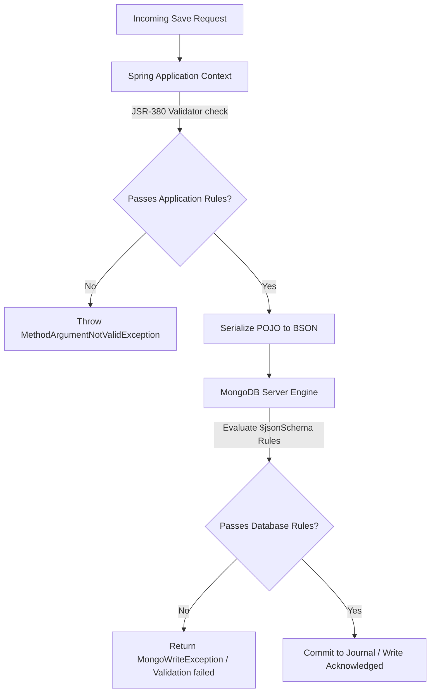

# Module 09: Validation and Schema Control

This module covers validation models and schema evolution strategies in MongoDB. It explores application-level validation, database-level MongoDB JSON Schema validation, and zero-downtime migrations using the Expand-Contract pattern.

---

## 1. What Problem It Solves

While MongoDB's schema flexibility is a major advantage during early development, it can lead to problems in production. Over time, multiple microservices with different versions of the code can write malformed or incomplete BSON documents, causing runtime exceptions.

Validation and Schema Control solve these problems by:
* **Enforcing Schema Rules at the Database Level**: MongoDB `$jsonSchema` validation rejects write or update operations that do not conform to defined structure rules.
* **Preventing Application Errors**: Standard Java Bean Validation (`@NotNull`, `@Size`) validates inputs before serialization occurs, preventing dirty writes.
* **Supporting Zero-Downtime Deployments**: The Expand-Contract (Parallel Change) pattern allows updating document schemas without taking the application offline.
* **Simplifying Migration Management**: Lazy migration scripts process legacy documents dynamically when they are loaded, avoiding slow offline batch updates.

---

## 2. Why MongoDB Instead of Relational Databases (RDBMS)

In relational databases, schema changes require executing `ALTER TABLE` statements:
* **Eliminate Tables Locks**: In relational systems, adding a column with a default value to a table with 100 million rows can lock the table for hours, causing service downtime. MongoDB allows adding fields to documents dynamically without locking collections.
* **Gradual Schema Rollout**: In MongoDB, different documents inside the same collection can exist in different schema versions simultaneously. This allows gradual rollouts of new schemas, which is impossible in rigid relational tables.
* **Programmable Validation Rules**: MongoDB's `$jsonSchema` supports conditional rules (e.g., if field `payment_type` is `"CC"`, then field `card_number` is required), providing more flexibility than standard SQL column constraints.

---

## 3. Trade-offs and Limitations

| Architectural Choice | Application-Level Validation (JSR-380) | Database-Level Validation ($jsonSchema) |
| :--- | :--- | :--- |
| **Execution Overhead** | Runs on the application JVM; scales horizontally with microservices. | Evaluated on the database server; consumes CPU resources on the MongoDB node. |
| **Strict Security** | Easily bypassed if administrators modify data using `mongosh` directly. | Enforced at the engine layer; applies to all database drivers and shell clients. |
| **Complex Relationships** | Can check complex business rules by querying other beans/services. | Limited to document-internal JSON schema rules; cannot query other collections. |
| **Error Feedback** | Returns detailed Java constraint violation messages. | Returns generic write failure exceptions that must be parsed. |

---

## 4. Common Mistakes & Anti-patterns

### Offline Migration for Large Collections
Running a blocking script that locks the database to update millions of documents during a maintenance window.
* *Why it's bad*: Causes application downtime, fills the transaction oplog, and can overload database memory.
* *Production Fix*: Use lazy migrations (updates are applied in memory when documents are read, and written back on save) or run migration scripts in small, throttled background batches.

### Missing Validation on Nested Arrays
Configuring validation for top-level fields but leaving nested arrays or objects completely unchecked.
* *Why it's bad*: Leaves the schema vulnerable to malformed subdocuments, which can cause deserialization errors when read.
* *Production Fix*: Define validation rules for nested objects and arrays using the `$jsonSchema` `properties` and `items` definitions.

### Enforcing Strict Validations without Version Isolation
Applying database-level validations on active collections without exempting existing legacy documents.
* *Why it's bad*: Existing documents that do not match the new schema rules will trigger errors whenever the application attempts to update them, even if the update only targets unrelated fields.
* *Production Fix*: Configure MongoDB's validation level to `validationLevel: "moderate"`. This ensures that new validation rules apply only to newly inserted documents and modified fields, leaving existing valid fields untouched.

---

## 5. When NOT to Use Database-Level Validations

* **Rapidly Changing Prototype Schemas**: If you are prototyping a feature and fields are changing daily, database-level validation slows down velocity. Enforce validation in the application layer until the schema stabilizes.
* **Complex Cross-Entity Rules**: If validating a field requires checking values in another collection, `$jsonSchema` cannot help. Keep this logic inside your Spring Service layer.

---

## 6. Spring Boot & Spring Data Implementation

This project implements a User Profile collection with both application-level JSR validation and database-level JSON Schema validation.

### Domain Object with JSR Validation
```java
package com.masterclass.mongodb.domain;

import jakarta.validation.constraints.Email;
import jakarta.validation.constraints.NotBlank;
import jakarta.validation.constraints.Size;
import org.springframework.data.annotation.Id;
import org.springframework.data.mongodb.core.mapping.Document;
import org.springframework.data.mongodb.core.mapping.Field;

@Document(collection = "user_profiles")
public class UserProfile {

    @Id
    private String id;

    @NotBlank(message = "Username cannot be empty")
    @Size(min = 4, max = 20, message = "Username must be between 4 and 20 characters")
    private String username;

    @NotBlank(message = "Email cannot be empty")
    @Email(message = "Invalid email format")
    private String email;

    @Field("schema_version")
    private int schemaVersion = 1;

    public UserProfile() {}

    public UserProfile(String id, String username, String email, int schemaVersion) {
        this.id = id;
        this.username = username;
        this.email = email;
        this.schemaVersion = schemaVersion;
    }

    public String getId() { return id; }
    public String getUsername() { return username; }
    public void setUsername(String username) { this.username = username; }
    public String getEmail() { return email; }
    public void setEmail(String email) { this.email = email; }
    public int getSchemaVersion() { return schemaVersion; }
    public void setSchemaVersion(int schemaVersion) { this.schemaVersion = schemaVersion; }
}
```

### Programmatic JSON Schema Configuration Service
```java
package com.masterclass.mongodb.service;

import com.masterclass.mongodb.domain.UserProfile;
import com.mongodb.client.MongoDatabase;
import com.mongodb.client.model.CreateCollectionOptions;
import com.mongodb.client.model.ValidationOptions;
import org.bson.Document;
import org.springframework.data.mongodb.core.MongoTemplate;
import org.springframework.stereotype.Service;

@Service
public class SchemaEnforcementService {

    private final MongoTemplate mongoTemplate;

    public SchemaEnforcementService(MongoTemplate mongoTemplate) {
        this.mongoTemplate = mongoTemplate;
    }

    /**
     * Recreates or updates the user_profiles collection, applying a JSON Schema validator.
     * Rejects writes if username is not a string between 4 and 20 characters, or if email is invalid.
     */
    public void enforceDatabaseSchema() {
        String collectionName = "user_profiles";
        
        // Define BSON schema rules
        Document jsonSchema = new Document("$jsonSchema", new Document()
                .append("bsonType", "object")
                .append("required", java.util.Arrays.asList("username", "email", "schema_version"))
                .append("properties", new Document()
                        .append("username", new Document()
                                .append("bsonType", "string")
                                .append("minLength", 4)
                                .append("maxLength", 20)
                                .append("description", "must be a string between 4 and 20 characters and is required"))
                        .append("email", new Document()
                                .append("bsonType", "string")
                                .append("pattern", "^.+@.+$")
                                .append("description", "must be a valid email address and is required"))
                        .append("schema_version", new Document()
                                .append("bsonType", "int")
                                .append("description", "schema version must be an integer and is required"))
                )
        );

        MongoDatabase database = mongoTemplate.getDb();
        
        // Check if collection exists
        boolean collectionExists = database.listCollectionNames()
                .into(new java.util.ArrayList<>())
                .contains(collectionName);

        if (!collectionExists) {
            // Create collection with schema validation rules
            ValidationOptions validationOptions = new ValidationOptions().validator(jsonSchema);
            CreateCollectionOptions options = new CreateCollectionOptions().validationOptions(validationOptions);
            database.createCollection(collectionName, options);
        } else {
            // Update validation rules on the existing collection
            Document command = new Document("collMod", collectionName)
                    .append("validator", jsonSchema)
                    .append("validationLevel", "moderate"); //moderate lets legacy documents stay intact
            database.runCommand(command);
        }
    }
}
```

---

## 7. Production Architecture Examples

### 1. The Expand-Contract (Parallel Change) Pattern
This pattern allows updating schema fields (like renaming `phone` to `phoneNumber`) in three zero-downtime deployment stages:

```mermaid
graph TD
    subgraph Stage 1: Expand
        A[App Version 1.0] -->|Read/Write| B[(Collection)]
        A -->|Writes to both fields| B
        Note over B: Document holds both:<br/>'phone' & 'phoneNumber'
    end
    
    subgraph Stage 2: Migrate
        C[Background Script] -->|Iterates collection| B
        C -->|Copies value from phone to phoneNumber| B
        Note over B: All documents now contain<br/>the new 'phoneNumber' field
    end
    
    subgraph Stage 3: Contract
        D[App Version 2.0] -->|Read/Write| B
        D -->|Reads/Writes only 'phoneNumber'| B
        D -->|Strips 'phone' field| B
        Note over B: Legacy 'phone' field removed
    end
```

### 2. Validation Flow for Database Writes
This diagram illustrates the validation checks applied to a write request:



---

## 8. Interview-Level Questions

### Q1: How does the Expand-Contract pattern prevent application downtime during a schema change?
**Answer**:
Instead of renaming a field directly (which would break older instances of the application that are still running), the Expand-Contract pattern splits the change into three stages:
1. **Expand**: Add the new field to the database model. The application code is updated to write to both the old and new fields, while reading from the old field.
2. **Migrate**: Run a background script to backfill values from the old field to the new field in existing documents.
3. **Contract**: Once the migration is complete, update the application to read and write only from the new field, and remove the old field from the code.

### Q2: What is the difference between `moderate` and `strict` validation levels in MongoDB?
**Answer**:
* **`strict` (Default)**: MongoDB applies validation rules to all insert and update operations. If an update targets a legacy document that does not conform to the schema, the update is rejected, even if the update only modifies unrelated fields.
* **`moderate`**: MongoDB applies validation rules to new inserts, and to updates on documents that *already* conform to the schema. Updates to non-conforming legacy documents are permitted, provided the update does not modify the non-conforming fields.

### Q3: How do you implement lazy (on-the-fly) data migrations in Spring Data MongoDB?
**Answer**:
Lazy migration converts document schemas dynamically when they are loaded:
1. Add a `schemaVersion` field to the document class.
2. Register an `ApplicationListener` for the `AfterLoadEvent<YourDocument>` event.
3. When a document is loaded, check the `schemaVersion`. If the version is older, intercept the raw BSON `Document`, apply the schema modifications, and set the version to the current value.
4. When the document is saved back to the database, it will be committed with the updated schema.

---

## 9. Hands-on Exercises

### Exercise 1: Triggering $jsonSchema Validation Failures
1. Run the local replica set.
2. Deploy the `UserProfile` configuration using `SchemaEnforcementService`.
3. Open `mongosh` and attempt to insert an invalid document:
   ```javascript
   db.user_profiles.insertOne({ username: "usr", email: "invalid-email-format" })
   ```
4. Verify that the database rejects the write with a validation error.
5. Insert a valid document and verify that the write is accepted:
   ```javascript
   db.user_profiles.insertOne({ username: "engineer", email: "eng@masterclass.com", schema_version: NumberInt(1) })
   ```

### Exercise 2: Implementing a Lazy Schema Renamer
1. Add a `schemaVersion` field to your user profile document.
2. Create an listener that checks `AfterLoadEvent<UserProfile>`. If the document's version is `0`, convert the field `nick_name` to `username` dynamically.
3. Verify that querying the database returns the mapped POJO with the correct fields.

---

## 10. Mini-Project: Zero-Downtime Customer Migration System

### Scenario
You are modifying a production billing service. The database contains customer documents with a single `name` string field. 
To support internationalization, you must split this field into separate `firstName` and `lastName` fields. 
The application must remain online during the migration. 
You must:
1. Define a migration listener to parse legacy documents on the fly.
2. Implement a background migration runner that updates legacy documents in batches.
3. Verify that all documents conform to the new schema format.

### Step 1: Implement the Domain Document with Schema Versioning
```java
package com.masterclass.mongodb.miniproject.model;

import org.springframework.data.annotation.Id;
import org.springframework.data.mongodb.core.mapping.Document;
import org.springframework.data.mongodb.core.mapping.Field;

@Document(collection = "billing_customers")
public class BillingCustomer {

    @Id
    private String id;

    // Legacy field - to be deprecated
    private String name;

    // New split fields
    @Field("first_name")
    private String firstName;

    @Field("last_name")
    private String lastName;

    @Field("schema_version")
    private int schemaVersion;

    public BillingCustomer() {}

    public BillingCustomer(String id, String firstName, String lastName, int schemaVersion) {
        this.id = id;
        this.firstName = firstName;
        this.lastName = lastName;
        this.schemaVersion = schemaVersion;
    }

    public String getId() { return id; }
    public String getName() { return name; }
    public void setName(String name) { this.name = name; }
    public String getFirstName() { return firstName; }
    public void setFirstName(String firstName) { this.firstName = firstName; }
    public String getLastName() { return lastName; }
    public void setLastName(String lastName) { this.lastName = lastName; }
    public int getSchemaVersion() { return schemaVersion; }
    public void setSchemaVersion(int schemaVersion) { this.schemaVersion = schemaVersion; }
}
```

### Step 2: Implement On-The-Fly Migration Listener
This listener intercepts raw BSON documents returned by MongoDB. If the document uses the legacy schema (version 0), it splits the `name` field in-memory before mapping the BSON to the POJO.

```java
package com.masterclass.mongodb.miniproject.listener;

import com.masterclass.mongodb.miniproject.model.BillingCustomer;
import org.bson.Document;
import org.springframework.context.ApplicationListener;
import org.springframework.data.mongodb.core.mapping.event.AfterLoadEvent;
import org.springframework.stereotype.Component;

@Component
public class CustomerMigrationListener implements ApplicationListener<AfterLoadEvent<BillingCustomer>> {

    @Override
    public void onApplicationEvent(AfterLoadEvent<BillingCustomer> event) {
        Document document = event.getDocument();
        if (document == null) return;

        Integer version = document.getInteger("schema_version");
        
        // If version is missing, this is a legacy version 0 document
        if (version == null || version < 1) {
            String fullName = document.getString("name");
            if (fullName != null && !fullName.isBlank()) {
                String[] parts = fullName.split(" ", 2);
                document.put("first_name", parts[0]);
                document.put("last_name", parts.length > 1 ? parts[1] : "");
            }
            
            // Set version to 1 to indicate it has been migrated
            document.put("schema_version", 1);
        }
    }
}
```

### Step 3: Implement Background Batch Migration Runner
For documents that aren't read by users, run a background migration process. This runner queries legacy documents in batches and writes updates back using bulk operations to optimize performance.

```java
package com.masterclass.mongodb.miniproject.service;

import com.masterclass.mongodb.miniproject.model.BillingCustomer;
import com.mongodb.client.result.UpdateResult;
import org.springframework.data.mongodb.core.BulkOperations;
import org.springframework.data.mongodb.core.MongoTemplate;
import org.springframework.data.mongodb.core.query.Criteria;
import org.springframework.data.mongodb.core.query.Query;
import org.springframework.data.mongodb.core.query.Update;
import org.springframework.stereotype.Service;
import java.util.List;

@Service
public class BackgroundMigrationService {

    private final MongoTemplate mongoTemplate;

    public BackgroundMigrationService(MongoTemplate mongoTemplate) {
        this.mongoTemplate = mongoTemplate;
    }

    /**
     * Finds and migrates legacy documents in batches of 100.
     * Extracts values from the old 'name' field and writes them to 'first_name' and 'last_name'.
     */
    public int migrateLegacyRecordsBatch() {
        // Find documents with schema_version = 0 (or missing schema_version)
        Query query = new Query(
                new Criteria().orOperator(
                        Criteria.where("schema_version").exists(false),
                        Criteria.where("schema_version").is(0)
                )
        ).limit(100);

        List<BillingCustomer> legacyCustomers = mongoTemplate.find(query, BillingCustomer.class);
        if (legacyCustomers.isEmpty()) {
            return 0;
        }

        BulkOperations bulkOps = mongoTemplate.bulkOps(BulkOperations.BulkMode.UNORDERED, BillingCustomer.class);

        for (BillingCustomer customer : legacyCustomers) {
            String fullName = customer.getName();
            String firstName = "";
            String lastName = "";

            if (fullName != null && !fullName.isBlank()) {
                String[] parts = fullName.split(" ", 2);
                firstName = parts[0];
                lastName = parts.length > 1 ? parts[1] : "";
            }

            Query selectQuery = new Query(Criteria.where("id").is(customer.getId()));
            
            Update migrationUpdate = new Update()
                    .set("first_name", firstName)
                    .set("last_name", lastName)
                    .set("schema_version", 1)
                    .unset("name"); // Remove legacy field

            bulkOps.updateOne(selectQuery, migrationUpdate);
        }

        bulkOps.execute();
        return legacyCustomers.size();
    }
}
```

### Step 4: Verification CommandLineRunner
```java
package com.masterclass.mongodb.miniproject.test;

import com.masterclass.mongodb.miniproject.model.BillingCustomer;
import com.masterclass.mongodb.miniproject.service.BackgroundMigrationService;
import org.bson.Document;
import org.springframework.boot.CommandLineRunner;
import org.springframework.data.mongodb.core.MongoTemplate;
import org.springframework.stereotype.Component;

@Component
public class MigrationVerificationRunner implements CommandLineRunner {

    private final MongoTemplate mongoTemplate;
    private final BackgroundMigrationService migrationService;

    public MigrationVerificationRunner(MongoTemplate mongoTemplate, BackgroundMigrationService migrationService) {
        this.mongoTemplate = mongoTemplate;
        this.migrationService = migrationService;
    }

    @Override
    public void run(String... args) throws Exception {
        // Clear collections
        mongoTemplate.dropCollection(BillingCustomer.class);

        // Seed legacy documents directly as BSON to bypass Java mapping code
        Document legacyDoc1 = new Document("_id", "cust-01")
                .append("name", "James Gosling");
        Document legacyDoc2 = new Document("_id", "cust-02")
                .append("name", "Rod Johnson");

        mongoTemplate.getCollection("billing_customers").insertOne(legacyDoc1);
        mongoTemplate.getCollection("billing_customers").insertOne(legacyDoc2);

        System.out.println("Legacy Documents Seeded.");

        // Verify lazy migration on read
        BillingCustomer customer1 = mongoTemplate.findById("cust-01", BillingCustomer.class);
        System.out.println("Lazy Migration on Read:");
        System.out.println(" - ID: " + customer1.getId());
        System.out.println(" - First Name (Expected: James): " + customer1.getFirstName());
        System.out.println(" - Last Name (Expected: Gosling): " + customer1.getLastName());
        System.out.println(" - Schema Version (Expected: 1): " + customer1.getSchemaVersion());

        // Run background batch migration to clean remaining legacy documents
        int migratedCount = migrationService.migrateLegacyRecordsBatch();
        System.out.println("\nBackground Batch Migration:");
        System.out.println(" - Migrated records count: " + migratedCount);

        // Confirm that the legacy 'name' field has been unset in the database
        Document doc2 = mongoTemplate.getCollection("billing_customers")
                .find(new Document("_id", "cust-02"))
                .first();
        
        System.out.println("\nDatabase Document Verification:");
        System.out.println(" - Has old 'name' field? " + doc2.containsKey("name"));
        System.out.println(" - Has 'first_name' field? " + doc2.containsKey("first_name"));
        System.out.println(" - Schema Version: " + doc2.getInteger("schema_version"));
    }
}
```
This mini-project demonstrates how to design a zero-downtime schema evolution process, combining lazy on-read conversions with background batch updates to migrate legacy fields.
