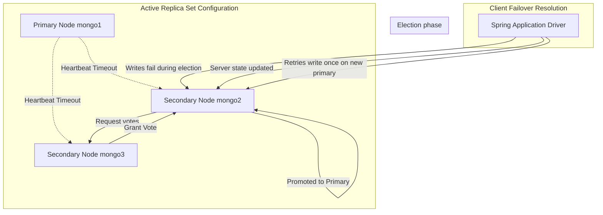
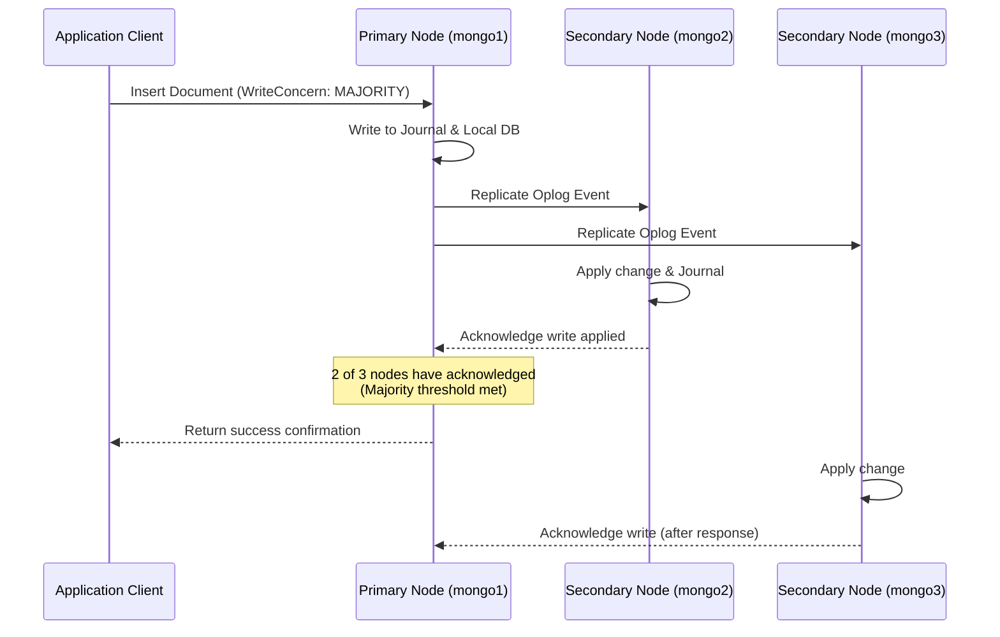

# Module 10: Reliability and High Availability

This module covers reliability and high availability in MongoDB. It explores replica set failover mechanics, write durability concerns, connection retry behaviors, and client driver configurations designed to withstand production network partition events.

---

## 1. What Problem It Solves

In production cloud environments, hardware failures, network partitions, and host reboots are inevitable. If a database runs on a single node, any hardware failure causes a complete application outage.

MongoDB replica set architecture solves this by:
* **Providing Automated Failover**: If the primary node crashes, secondary nodes detect the failure and elect a new primary within seconds, restoring database write capabilities automatically.
* **Guaranteeing Write Durability**: Configuring write concerns (like `w: "majority"` and `j: true`) ensures that committed writes survive even if a node crashes immediately after confirming the write.
* **Distributing Read Load**: Directs read traffic to secondary replicas using Read Preferences, reducing load on the primary node.
* **Managing Client Reconnections**: The MongoDB Java driver automatically tracks replica set state changes, buffers queries during elections, and retries failed operations without throwing exceptions to the application code.

---

## 2. Why MongoDB Instead of Relational Databases (RDBMS)

Relational database replica architectures (like PostgreSQL master-replica) often rely on external orchestration tools (like Patroni or Pacemaker) to handle primary node failures and promote secondaries.

MongoDB provides built-in high availability:
* **Built-in Consensus Engine**: MongoDB's replication engine features a built-in consensus protocol (similar to Raft). Nodes monitor each other using heartbeats and coordinate promotions directly, removing the need for external tools.
* **Automatic Client Routing**: The MongoDB client driver is replica-set aware. It monitors server state using heartbeats and routes writes to the primary and reads to secondaries automatically, without requiring external load balancers.
* **Oplog-Based Idempotency**: Replica syncing uses an idempotent operations log (oplog). This ensures that secondaries can safely re-apply operations during sync updates without causing data duplication.

---

## 3. Trade-offs and Limitations

### Write Latency vs Durability
Requiring writes to be acknowledged by a majority of nodes (`w: "majority"`) and written to disk journals (`j: true`) increases durability but adds latency. The application thread must wait for network round-trips to secondaries before receiving write confirmation.

### Outage during Elections
When a primary node crashes, the replica set undergoes an election to promote a secondary. This process typically takes **2 to 5 seconds**. During this election window, the replica set has no primary, and all database write operations will fail or block.

---

## 4. Common Mistakes & Anti-patterns

### Operating with `w: 1` on Critical Financial Services
Using the default write concern `w: 1` (which acknowledges writes once they are committed to the primary node's memory) for payments or order systems.
* *Why it's bad*: If the primary confirms a write and then crashes before replicating it to secondaries, the replica set will elect a new primary. The new primary will not have the write, and the data is lost (a rollback event), creating inconsistencies between the application and database.
* *Production Fix*: Configure a strict write concern of `w: "majority"` and `j: true` for all critical write paths.

### Reading Stale Data from Secondaries
Directing read-heavy, consistency-sensitive queries to secondaries using `ReadPreference.secondary()` without setting appropriate read concerns.
* *Why it's bad*: MongoDB replication is asynchronous. A secondary node can lag behind the primary by seconds or minutes. Reading from secondaries can return stale or outdated data to users.
* *Production Fix*: For queries that require strict consistency (like verifying account balance during a purchase), always read from the primary node (`ReadPreference.primary()`).

### Missing the `retryWrites=true` and `retryReads=true` Connection Parameters
Leaving retry parameters at their default values or disabling them in production connection strings.
* *Why it's bad*: During a replica set election, the application will throw network socket exceptions for any queries executed during the 2-5 second failover window, leading to user-facing errors.
* *Production Fix*: Always include `retryWrites=true` and `retryReads=true` in your MongoDB connection string. This instructs the driver to automatically retry failed operations once on the newly promoted primary.

---

## 5. When NOT to Use MongoDB Replica Sets

* **Resource-Constrained Environments**: For local debugging, dockerized integration testing, or prototype sandboxes, running a 3-node replica set consumes unnecessary memory and CPU resources. A single-node instance is sufficient.

---

## 6. Spring Boot & Spring Data Implementation

This project configures a production-ready, resilient MongoDB connection pool in Spring Boot with custom timeouts, read/write concerns, and retry behaviors.

### Resilient Mongo Client Configuration
```java
package com.masterclass.mongodb.config;

import com.mongodb.ConnectionString;
import com.mongodb.MongoClientSettings;
import com.mongodb.ReadConcern;
import com.mongodb.ReadPreference;
import com.mongodb.WriteConcern;
import org.springframework.context.annotation.Configuration;
import org.springframework.data.mongodb.config.AbstractMongoClientConfiguration;
import java.util.concurrent.TimeUnit;

@Configuration
public class ResilientMongoConfig extends AbstractMongoClientConfiguration {

    @Override
    protected String getDatabaseName() {
        return "resilient_retail_db";
    }

    /**
     * Customizes MongoClientSettings to optimize connection pool resilience.
     */
    @Override
    public MongoClientSettings mongoClientSettings() {
        // Production connection string configuring replica set nodes and retry rules
        ConnectionString connectionString = new ConnectionString(
                "mongodb://localhost:27017,localhost:27018,localhost:27019/resilient_retail_db" +
                "?replicaSet=rs0&retryWrites=true&retryReads=true"
        );

        return MongoClientSettings.builder()
                .applyConnectionString(connectionString)
                // Configure write concern durability: Majority write with journaling confirmation
                .writeConcern(WriteConcern.MAJORITY.withJournal(true).withWTimeout(3000, TimeUnit.MILLISECONDS))
                // Configure read concern: Read only data confirmed by a majority of nodes
                .readConcern(ReadConcern.MAJORITY)
                // Default read preference: Read from the primary node
                .readPreference(ReadPreference.primary())
                // Configure connection pool settings
                .applyToConnectionPoolSettings(builder -> builder
                        .minSize(10)
                        .maxSize(100)
                        .maxConnectionIdleTime(60000, TimeUnit.MILLISECONDS)
                        .maxConnectionLifeTime(1800000, TimeUnit.MILLISECONDS))
                // Configure timeout limits
                .applyToSocketSettings(builder -> builder
                        .connectTimeout(5000, TimeUnit.MILLISECONDS)
                        .readTimeout(10000, TimeUnit.MILLISECONDS))
                .build();
    }
}
```

### High-Availability Payment Processing Service
This service processes critical payment transactions. It applies programmatic write concern overrides and includes retry logic to recover from database exceptions.

```java
package com.masterclass.mongodb.service;

import com.masterclass.mongodb.domain.Payment;
import com.mongodb.MongoException;
import com.mongodb.WriteConcern;
import org.springframework.data.mongodb.core.MongoTemplate;
import org.springframework.data.mongodb.core.query.Criteria;
import org.springframework.data.mongodb.core.query.Query;
import org.springframework.data.mongodb.core.query.Update;
import org.springframework.stereotype.Service;
import java.time.Instant;

@Service
public class ResilientPaymentService {

    private final MongoTemplate mongoTemplate;

    public ResilientPaymentService(MongoTemplate mongoTemplate) {
        this.mongoTemplate = mongoTemplate;
    }

    /**
     * Executes a payment write under a strict WriteConcern (majority nodes + journaled).
     * Bypasses the default template configuration if needed.
     */
    public void processPaymentWithStrictDurability(String paymentId, double amount) {
        // Instantiate a dedicated template copy with override settings
        MongoTemplate strictTemplate = new MongoTemplate(mongoTemplate.getMongoDatabaseFactory());
        strictTemplate.setWriteConcern(WriteConcern.MAJORITY.withJournal(true));

        Document paymentDoc = new Document()
                .append("_id", paymentId)
                .append("amount", amount)
                .append("timestamp", Instant.now())
                .append("status", "SUCCESS");

        try {
            // Write to database
            strictTemplate.insert(paymentDoc, "critical_payments");
        } catch (MongoException e) {
            // Log error details for alerting dashboards
            System.err.println("Fatal write concern failure on payment write: " + e.getMessage());
            throw e;
        }
    }
}
```

---

## 7. Production Architecture Examples

### 1. Replica Set Automated Failover Flow
This diagram illustrates the sequence of events when a primary node fails and the replica set elects a new leader:



### 2. Oplog Replication and Acknowledgment Flow
How `WriteConcern.MAJORITY` ensures that data is replicated to a majority of nodes before returning confirmation to the application client:



---

## 8. Interview-Level Questions

### Q1: What happens if a primary node crashes during a write operation configured with `WriteConcern.W1`?
**Answer**:
* **Data Loss Risk**: If the primary node crashes after writing the data locally but before replicating it to secondaries, the replica set will undergo an election and promote a secondary node to primary.
* **Rollback Event**: Since the secondary did not receive the write before the promotion, the write is missing on the new primary.
* **Rollback Action**: When the failed node recovers and rejoins the replica set, it connects as a secondary. Seeing that its oplog diverges from the new primary's history, it rolls back the un-replicated write. The rolled-back data is written to a local `.bson` file in the database directory, resulting in data loss for the application.

### Q2: What is the function of the `j: true` parameter in a Write Concern, and how does it relate to the database journal?
**Answer**:
* **`j: true`**: Instructs MongoDB to wait until the write operation has been written to the physical on-disk journal before sending success confirmation to the client.
* **Journal Role**: The journal is an append-only write-ahead log. If a write is confirmed without `j: true`, MongoDB acknowledges the write once it is applied in memory. If a power failure or system crash occurs before memory dirty pages are flushed to disk (which happens every 60ms by default), the committed write is lost. Setting `j: true` protects against this data loss.

### Q3: How do the connection string parameters `retryWrites=true` and `retryReads=true` work under the hood?
**Answer**:
* **`retryWrites=true`**: If a write operation fails due to a transient network error or a replica set election, the driver automatically retrieves the updated replica set topology, locates the new primary, and retries the write operation *once*.
* **Idempotency Guarantee**: The driver assigns a unique transaction ID to each write. If the primary node received the write but crashed before sending an acknowledgment, the new primary detects the duplicate transaction ID and ignores the retried write, preventing duplicate records.

---

## 9. Hands-on Exercises

### Exercise 1: Simulating Primary Failover in Spring Boot
1. Spin up the 3-node replica set using the Docker Compose configuration from the root `README.md`.
2. Start your Spring Boot application.
3. Stop the primary node container manually:
   ```bash
   docker stop mongo1
   ```
4. Check the Spring Boot application logs. Observe that the driver detects the connection loss and initiates topology updates.
5. Send a write request to your application during this failover window. Verify that the driver handles the election and completes the write on the new primary without throwing errors to the client.

### Exercise 2: Inspecting Rollback Files
1. Configure your write concern to `w: 1` and disable journaling.
2. Block network communication between the primary node and secondary nodes.
3. Write a document to the primary.
4. Kill the primary container immediately.
5. Restore network communication and start the secondaries. One secondary will be promoted to primary.
6. Start the old primary container. Check its logs to locate the rollback message and verify the creation of the rollback BSON file on disk.

---

## 10. Mini-Project: Resilient Payment Processor

### Scenario
You are building the transaction gateway for a payment service. 
To ensure zero transaction loss, the checkout service must write transaction records using a strict durability concern: majority write concern and journaling enabled. 
Additionally, you must implement a custom retry decorator in the application layer to catch and retry transient connection exceptions.

### Step 1: Implement the Domain Document
```java
package com.masterclass.mongodb.miniproject.model;

import org.springframework.data.annotation.Id;
import org.springframework.data.mongodb.core.mapping.Document;
import org.springframework.data.mongodb.core.mapping.Field;
import java.time.Instant;

@Document(collection = "processed_transactions")
public class TransactionRecord {

    @Id
    private String id;
    
    @Field("account_number")
    private String accountNumber;
    
    private double amount;
    
    private String status;
    
    private Instant timestamp;

    public TransactionRecord() {}

    public TransactionRecord(String id, String accountNumber, double amount, String status, Instant timestamp) {
        this.id = id;
        this.accountNumber = accountNumber;
        this.amount = amount;
        this.status = status;
        this.timestamp = timestamp;
    }

    public String getId() { return id; }
    public String getAccountNumber() { return accountNumber; }
    public double getAmount() { return amount; }
    public String getStatus() { return status; }
    public Instant getTimestamp() { return timestamp; }
}
```

### Step 2: Implement Resilient Transaction Service with Application Retries
This service uses a custom retry loop to handle transient database exceptions, ensuring that connection drops during elections do not impact payment requests.

```java
package com.masterclass.mongodb.miniproject.service;

import com.masterclass.mongodb.miniproject.model.TransactionRecord;
import com.mongodb.MongoException;
import com.mongodb.MongoSocketOpenException;
import com.mongodb.MongoTimeoutException;
import com.mongodb.WriteConcern;
import org.springframework.data.mongodb.core.MongoTemplate;
import org.springframework.stereotype.Service;

@Service
public class ResilientTransactionService {

    private final MongoTemplate mongoTemplate;

    public ResilientTransactionService(MongoTemplate mongoTemplate) {
        this.mongoTemplate = mongoTemplate;
    }

    /**
     * Writes a payment transaction record under a strict WriteConcern.
     * Implements a custom retry mechanism to handle transient network errors.
     */
    public void recordTransactionWithRetry(TransactionRecord record, int maxAttempts) {
        // Configure MongoTemplate with a strict Write Concern
        MongoTemplate strictTemplate = new MongoTemplate(mongoTemplate.getMongoDatabaseFactory());
        strictTemplate.setWriteConcern(WriteConcern.MAJORITY.withJournal(true));

        int attempt = 0;
        while (attempt < maxAttempts) {
            try {
                attempt++;
                strictTemplate.insert(record);
                System.out.println("Transaction successfully written to majority nodes on attempt: " + attempt);
                return; // Write succeeded, exit method
            } catch (MongoTimeoutException | MongoSocketOpenException e) {
                System.err.println("Transient connection error during write: " 
                        + e.getClass().getSimpleName() + ". Retrying attempt " + attempt + "...");
                
                if (attempt >= maxAttempts) {
                    throw e; // Max attempts exceeded, propagate exception
                }
                
                // Sleep briefly before retrying
                try {
                    Thread.sleep(1000);
                } catch (InterruptedException ie) {
                    Thread.currentThread().interrupt();
                    throw new RuntimeException("Retry thread interrupted", ie);
                }
            } catch (MongoException e) {
                System.err.println("Fatal database error on transaction write: " + e.getMessage());
                throw e; // Non-retryable error, throw immediately
            }
        }
    }
}
```

### Step 3: Implement Verification Logic
```java
package com.masterclass.mongodb.miniproject.test;

import com.masterclass.mongodb.miniproject.model.TransactionRecord;
import com.masterclass.mongodb.miniproject.service.ResilientTransactionService;
import org.springframework.boot.CommandLineRunner;
import org.springframework.data.mongodb.core.MongoTemplate;
import org.springframework.stereotype.Component;
import java.time.Instant;

@Component
public class ResiliencyVerificationRunner implements CommandLineRunner {

    private final MongoTemplate mongoTemplate;
    private final ResilientTransactionService transactionService;

    public ResiliencyVerificationRunner(MongoTemplate mongoTemplate, ResilientTransactionService transactionService) {
        this.mongoTemplate = mongoTemplate;
        this.transactionService = transactionService;
    }

    @Override
    public void run(String... args) throws Exception {
        // Clear collections
        mongoTemplate.dropCollection(TransactionRecord.class);

        // Define payment record
        TransactionRecord payment = new TransactionRecord(
                "tx-saigon-101", 
                "ACC-12345", 
                2500.50, 
                "SUCCESS", 
                Instant.now()
        );

        System.out.println("Executing resilient transaction save...");
        
        // Save transaction with a maximum of 3 attempts
        transactionService.recordTransactionWithRetry(payment, 3);

        // Verify write was applied
        TransactionRecord saved = mongoTemplate.findById("tx-saigon-101", TransactionRecord.class);
        if (saved != null) {
            System.out.println("Resiliency Verification Completed.");
            System.out.println("Saved ID: " + saved.getId() + ", Balance: " + saved.getAmount());
        }
    }
}
```
This mini-project demonstrates how to design a resilient database access layer, combining majority write concerns with custom retry policies to handle transient connection drops.
