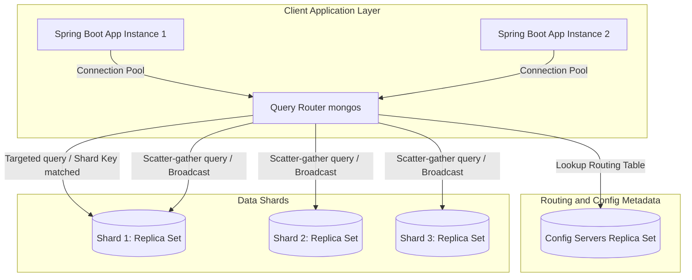
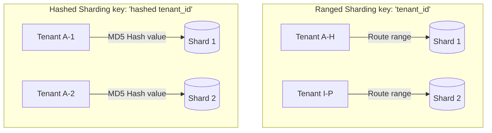

# Module 11: Sharding and Scalability

This module covers horizontal scaling and sharding architectures in MongoDB. It analyzes shard key selection criteria, compares hashed and ranged sharding, explains balancer and chunk migration behaviors, and provides strategies to design targeted queries in Spring Boot.

---

## 1. What Problem It Solves

As application traffic and data volumes grow, a single database server eventually hits hardware resource limits (CPU, RAM, and Disk I/O). While replica sets provide high availability, they do not scale writes horizontally because every node in the replica set must process every write operation.

MongoDB sharding solves this by:
* **Partitioning Data Horizontally**: Distributes collection documents across multiple independent replica sets (shards).
* **Scaling Write Capacity**: Divides write traffic among different shards, allowing the cluster to handle higher write volumes than any single node could support.
* **Expanding Storage Capacity**: Allows storing datasets that are larger than the maximum disk size of a single server.
* **Routing Queries Efficiently**: Uses query routers (`mongos`) to send client read and write requests directly to the specific shards holding the targeted documents.

---

## 2. Why MongoDB Instead of Relational Databases (RDBMS)

Relational database partitioning (sharding) often requires complex client-side configuration:
* **Native Clustering Architecture**: In relational databases, sharding usually requires application-side middleware to manage routing, or manual table partitioning. MongoDB features a native sharding architecture with built-in routing components (`mongos`) and metadata config servers.
* **Automated Data Balancing**: Relational sharded systems require manual intervention to redistribute data when a shard runs out of disk space. MongoDB automatically monitors chunk sizes and migrates data ranges across shards in the background using the cluster balancer.
* **Transparent Routing**: Spring Boot applications connect to the `mongos` router using standard MongoDB connection strings. The application does not need to know which shard holds a specific document.

---

## 3. Trade-offs and Limitations

### Join Performance ($lookup)
Performing joins (`$lookup`) across sharded collections is slow. If the collections are sharded on different keys, MongoDB must fetch documents from multiple shards and merge them in memory on the query router.

### Shard Key Immutability
In older MongoDB versions, the shard key was completely immutable. In modern versions, while you can refine or change shard keys, doing so is a complex, resource-intensive operation that can impact cluster performance.

### Transaction Complexity
Transactions that span multiple shards require a two-phase commit protocol coordinated by the router, which increases transaction latency compared to single-shard operations.

---

## 4. Common Mistakes & Anti-patterns

### Monotonically Increasing Shard Keys
Using a monotonically increasing field (like `createdAt` or standard MongoDB `ObjectId` timestamp prefixes) as a ranged shard key.
* *Why it's bad*: Because the shard key values increase over time, all new insert operations fall into the highest range block. This routes all writes to a single shard, creating a write bottleneck while other shards remain idle.
* *Production Fix*: Use a **Hashed Shard Key** to distribute writes evenly across shards, or choose a compound shard key that combines a high-cardinality field (like `customerId`) with the timestamp.

### Scatter-Gather Queries
Executing queries that do not include the collection's shard key in the filter criteria.
* *Why it's bad*: The query router (`mongos`) cannot determine which shard holds the matching data. It must broadcast the query to every shard in the cluster. This consumes resources across all shards and degrades cluster throughput.
* *Production Fix*: Ensure that all high-frequency query paths include the shard key in their query filter to perform a **Targeted Query**.

### Low Cardinality Shard Keys
Selecting a shard key with a small number of unique values (like `status: [ACTIVE, INACTIVE]` or `gender`).
* *Why it's bad*: MongoDB divides sharded data into ranges called chunks. If a key has low cardinality, chunks grow larger than the maximum size (typically 64MB) and cannot be split. This creates unbalanced data distribution that the balancer cannot resolve.
* *Production Fix*: Choose a shard key with high cardinality, containing thousands or millions of unique values.

---

## 5. When NOT to Use Sharding

* **Small or Moderate Datasets**: If your database size is under 1TB and writes do not saturate server CPU, do not shard. Sharding adds significant infrastructure complexity, requiring configuration servers, routing processes, and network hops.

---

## 6. Spring Boot & Spring Data Implementation

This configuration showcases how to target sharded collections using a shard key (`tenantId`).

### Domain Object: Sharded Audit Log
```java
package com.masterclass.mongodb.domain;

import org.springframework.data.annotation.Id;
import org.springframework.data.mongodb.core.mapping.Document;
import org.springframework.data.mongodb.core.mapping.Field;
import java.time.Instant;

@Document(collection = "sharded_audit_logs")
public class ShardedAuditLog {

    @Id
    private String id;

    // Shard Key Candidate: TenantId provides high cardinality and separates client spaces
    @Field("tenant_id")
    private String tenantId;

    private String action;
    
    private String details;
    
    private Instant timestamp;

    public ShardedAuditLog() {}

    public ShardedAuditLog(String tenantId, String action, String details, Instant timestamp) {
        this.tenantId = tenantId;
        this.action = action;
        this.details = details;
        this.timestamp = timestamp;
    }

    public String getId() { return id; }
    public String getTenantId() { return tenantId; }
    public String getAction() { return action; }
    public String getDetails() { return details; }
    public Instant getTimestamp() { return timestamp; }
}
```

### Programmatic Sharded Query Service
This service queries sharded audit logs. It ensures that queries are targeted by including the shard key in the criteria, preventing scatter-gather queries.

```java
package com.masterclass.mongodb.service;

import com.masterclass.mongodb.domain.ShardedAuditLog;
import org.springframework.data.domain.Sort;
import org.springframework.data.mongodb.core.MongoTemplate;
import org.springframework.data.mongodb.core.query.Criteria;
import org.springframework.data.mongodb.core.query.Query;
import org.springframework.stereotype.Service;
import java.util.List;

@Service
public class ShardedLogService {

    private final MongoTemplate mongoTemplate;

    public ShardedLogService(MongoTemplate mongoTemplate) {
        this.mongoTemplate = mongoTemplate;
    }

    /**
     * Retrieves logs for a specific tenant.
     * Including the tenantId (the shard key) makes this a targeted query.
     */
    public List<ShardedAuditLog> getLogsForTenant(String tenantId, int limit) {
        Query query = new Query();
        
        // CRITICAL: The shard key 'tenant_id' must be included in the criteria
        query.addCriteria(Criteria.where("tenant_id").is(tenantId));
        
        query.with(Sort.by(Sort.Direction.DESC, "timestamp"));
        query.limit(limit);

        // The query router (mongos) will route this request directly to the shard holding the tenant's data
        return mongoTemplate.find(query, ShardedAuditLog.class);
    }
}
```

---

## 7. Production Architecture Examples

### 1. MongoDB Sharded Cluster Components
Applications connect to routing instances (`mongos`), which retrieve cluster layout metadata from config servers to route queries to the correct shards:



### 2. Ranged Sharding vs Hashed Sharding
* **Ranged Sharding** groups similar keys together, which is ideal for range queries but can create write hotspots.
* **Hashed Sharding** distributes writes evenly across shards, but forces range queries to scan all shards:



---

## 8. Interview-Level Questions

### Q1: What is the difference between a "Targeted Query" and a "Scatter-Gather Query" in a sharded cluster? How do you prevent the latter?
**Answer**:
* **Targeted Query**: A query that includes the collection's shard key in its filter criteria. The routing process (`mongos`) uses this key to look up the routing metadata and forwards the query directly to the single shard holding the matching documents.
* **Scatter-Gather Query**: A query that does not include the shard key in the filter. Because the router cannot identify where the documents reside, it must broadcast the query to every shard in the cluster. This consumes resources across all shards and degrades database capacity.
* **Prevention**: Enforce design patterns that require passing the shard key (e.g. `tenantId` or `countryCode`) down from HTTP headers to the database query filters.

### Q2: Why does using a monotonically increasing field (like a timestamp or auto-incrementing ID) as a ranged shard key cause write hotspots?
**Answer**:
MongoDB sharded ranges are split into chunks. 
* If a shard key is monotonically increasing, every new document will have a key value higher than any existing document.
* Consequently, all new inserts will fall into the highest chunk range.
* Since this range sits on a single shard, that shard must process 100% of the write traffic, creating a write bottleneck. Meanwhile, other shards remain idle, defeating the purpose of sharding.

### Q3: What is the role of the Cluster Balancer in MongoDB, and how does it impact application performance?
**Answer**:
The **Balancer** is a background process that monitors the distribution of chunks across shards. 
* If the number of chunks on one shard becomes unbalanced compared to others, the balancer initiates **Chunk Migrations**, moving data ranges across shards over the network.
* **Performance Impact**: Chunk migrations consume network bandwidth and disk I/O on the source and target shards. During heavy migration windows, application query latencies can increase. 
* To prevent this, administrators often configure balancer windows to run migrations only during off-peak hours.

---

## 9. Hands-on Exercises

### Exercise 1: Simulating Scatter-Gather Queries
1. Log into your sharded MongoDB cluster using `mongosh`.
2. Enable explain plans on a query that filters by a non-sharded field:
   ```javascript
   db.sharded_audit_logs.find({ action: "LOGIN" }).explain("executionStats")
   ```
3. Locate the `shards` execution detail array in the explain output. Verify that the query was executed across every shard in the cluster.
4. Rerun the query including the shard key:
   ```javascript
   db.sharded_audit_logs.find({ tenant_id: "T-01", action: "LOGIN" }).explain("executionStats")
   ```
5. Verify that the query execution plans target only a single shard.

---

## 10. Mini-Project: Sharded Multi-Tenant Account Platform

### Scenario
You are building the transaction ledger backend for a global multi-tenant payment system. 
The system serves thousands of corporate tenants, and each tenant generates millions of transactions. 
To scale write capacity, you must shard the transaction collection. 
The shard key must distribute writes evenly across shards, support targeted queries, and prevent write hotspots. 
You will implement the programmatic setup to register sharded collections and target queries using Spring Data MongoDB.

### Step 1: Implement the Transaction Document with Shard Key
To prevent write hotspots while maintaining targeted query support, we will define a compound shard key: `{ tenant_id: 1, transaction_id: "hashed" }`. 
This hashes the transaction ID component to distribute writes across shards, while keeping the `tenant_id` to allow targeted queries for specific tenants.

```java
package com.masterclass.mongodb.miniproject.model;

import org.springframework.data.annotation.Id;
import org.springframework.data.mongodb.core.mapping.Document;
import org.springframework.data.mongodb.core.mapping.Field;
import java.time.Instant;

@Document(collection = "sharded_transactions")
public class ShardedTransaction {

    @Id
    private String id; // format: tenantId_transactionId

    @Field("tenant_id")
    private String tenantId;

    @Field("transaction_id")
    private String transactionId;

    private double amount;
    
    private String status;
    
    private Instant timestamp;

    public ShardedTransaction() {}

    public ShardedTransaction(String tenantId, String transactionId, double amount, String status, Instant timestamp) {
        this.id = tenantId + "_" + transactionId;
        this.tenantId = tenantId;
        this.transactionId = transactionId;
        this.amount = amount;
        this.status = status;
        this.timestamp = timestamp;
    }

    public String getId() { return id; }
    public String getTenantId() { return tenantId; }
    public String getTransactionId() { return transactionId; }
    public double getAmount() { return amount; }
    public String getStatus() { return status; }
    public Instant getTimestamp() { return timestamp; }
}
```

### Step 2: Implement Programmatic Shard Registration
This service runs during application startup to automatically enable sharding on the database and configure the compound shard key on the collection.

```java
package com.masterclass.mongodb.miniproject.service;

import org.bson.Document;
import org.springframework.data.mongodb.core.MongoTemplate;
import org.springframework.stereotype.Service;

@Service
public class ShardingInitializerService {

    private final MongoTemplate mongoTemplate;

    public ShardingInitializerService(MongoTemplate mongoTemplate) {
        this.mongoTemplate = mongoTemplate;
    }

    /**
     * Programmatically configures sharding on the collection.
     * Executes commands against the 'admin' database, which is required for cluster configuration.
     */
    public void initializeSharding() {
        try {
            // Step 1: Enable sharding on the database
            Document enableDbCmd = new Document("enableSharding", "resilient_retail_db");
            mongoTemplate.getDb().getSiblingDB("admin").runCommand(enableDbCmd);
            System.out.println("Sharding enabled on database: resilient_retail_db");

            // Step 2: Shard the collection using the compound key
            // { tenant_id: 1, transaction_id: "hashed" }
            Document shardKeyDef = new Document()
                    .append("tenant_id", 1)
                    .append("transaction_id", "hashed");

            Document shardCollectionCmd = new Document("shardCollection", "resilient_retail_db.sharded_transactions")
                    .append("key", shardKeyDef);

            mongoTemplate.getDb().getSiblingDB("admin").runCommand(shardCollectionCmd);
            System.out.println("Collection sharded successfully with compound key: { tenant_id: 1, transaction_id: 'hashed' }");
        } catch (Exception e) {
            // Will fail if running on a standalone local developer node—log warning and continue
            System.err.println("Sharding configuration ignored. Ensure MongoDB is running in a sharded cluster: " + e.getMessage());
        }
    }
}
```

### Step 3: Implement Targeted Query Engine
```java
package com.masterclass.mongodb.miniproject.service;

import com.masterclass.mongodb.miniproject.model.ShardedTransaction;
import org.springframework.data.mongodb.core.MongoTemplate;
import org.springframework.data.mongodb.core.query.Criteria;
import org.springframework.data.mongodb.core.query.Query;
import org.springframework.stereotype.Service;
import java.util.List;

@Service
public class TenantTransactionService {

    private final MongoTemplate mongoTemplate;

    public TenantTransactionService(MongoTemplate mongoTemplate) {
        this.mongoTemplate = mongoTemplate;
    }

    /**
     * Saves a transaction. Includes the shard key fields to ensure correct routing.
     */
    public void saveTransaction(ShardedTransaction tx) {
        mongoTemplate.save(tx);
    }

    /**
     * Queries transaction records for a specific tenant.
     * Including the tenantId (part of the shard key) ensures this is a targeted query.
     */
    public List<ShardedTransaction> findTransactionsByTenant(String tenantId, int limit) {
        Query query = new Query();
        
        // CRITICAL: Filter by the shard key field to prevent scatter-gather queries
        query.addCriteria(Criteria.where("tenant_id").is(tenantId));
        query.limit(limit);

        return mongoTemplate.find(query, ShardedTransaction.class);
    }
}
```

### Step 4: Verification CommandLineRunner
```java
package com.masterclass.mongodb.miniproject.test;

import com.masterclass.mongodb.miniproject.model.ShardedTransaction;
import com.masterclass.mongodb.miniproject.service.ShardingInitializerService;
import com.masterclass.mongodb.miniproject.service.TenantTransactionService;
import org.springframework.boot.CommandLineRunner;
import org.springframework.stereotype.Component;
import java.time.Instant;
import java.util.List;

@Component
public class ShardVerificationRunner implements CommandLineRunner {

    private final ShardingInitializerService shardingInitializer;
    private final TenantTransactionService transactionService;

    public ShardVerificationRunner(ShardingInitializerService shardingInitializer, TenantTransactionService transactionService) {
        this.shardingInitializer = shardingInitializer;
        this.transactionService = transactionService;
    }

    @Override
    public void run(String... args) throws Exception {
        // Initialize sharding configuration
        shardingInitializer.initializeSharding();

        // Seed data for Tenant Alpha
        transactionService.saveTransaction(new ShardedTransaction("TENANT-ALPHA", "TX-100", 500.00, "SUCCESS", Instant.now()));
        transactionService.saveTransaction(new ShardedTransaction("TENANT-ALPHA", "TX-101", 120.00, "SUCCESS", Instant.now()));
        // Seed data for Tenant Beta
        transactionService.saveTransaction(new ShardedTransaction("TENANT-BETA", "TX-200", 1500.00, "SUCCESS", Instant.now()));

        System.out.println("Sharded Transaction Data Seeded.");

        // Execute targeted queries for Tenant Alpha
        List<ShardedTransaction> results = transactionService.findTransactionsByTenant("TENANT-ALPHA", 10);
        System.out.println("\nQuery Verification Results:");
        System.out.println("Expected Transaction Count: 2");
        System.out.println("Actual Transaction Count: " + results.size());
        results.forEach(tx -> 
            System.out.println(" - Tenant: " + tx.getTenantId() + ", ID: " + tx.getTransactionId() + ", Amount: " + tx.getAmount())
        );
    }
}
```
This mini-project demonstrates how to design and query sharded collections in Spring, using a compound shard key to distribute writes evenly while supporting targeted queries.
