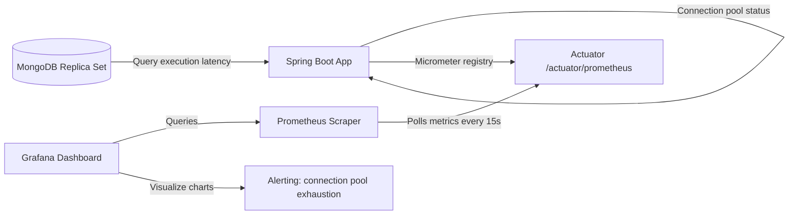
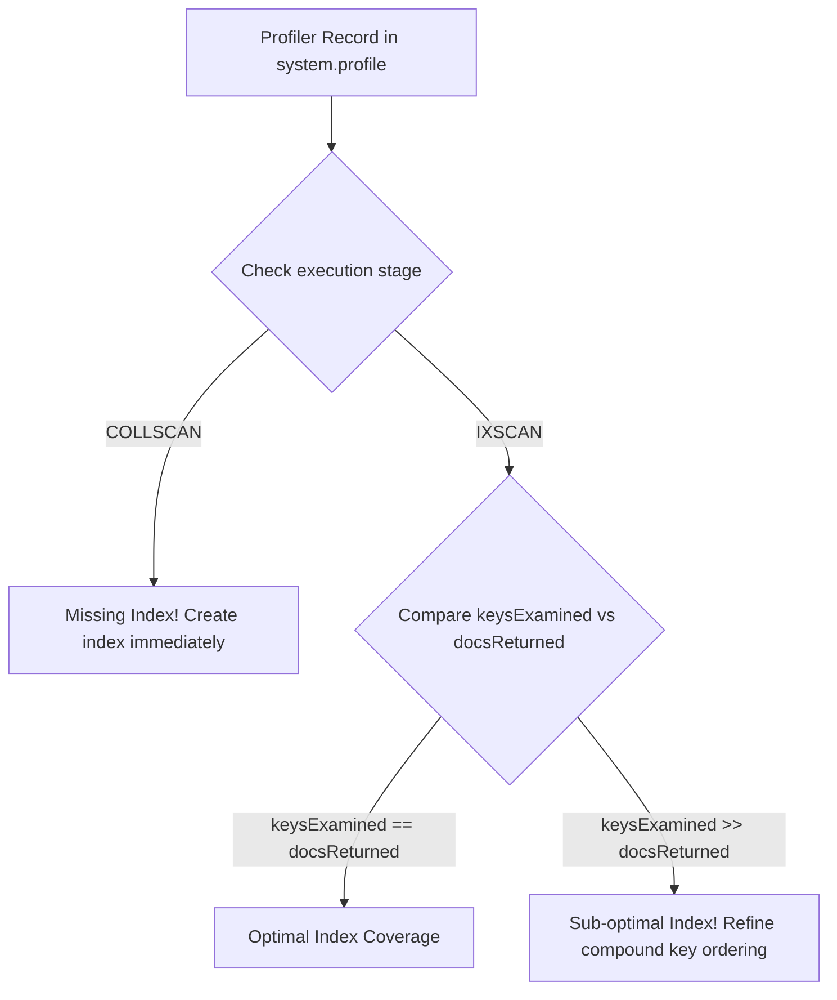

# Module 13: Observability and Operations

This module covers observability and database operations in MongoDB. It explores Spring Boot Actuator integration, Micrometer driver metrics, connection pool optimization, slow query diagnostic logs, and index usage monitoring.

---

## 1. What Problem It Solves

Once a database runs in production, it becomes a black box unless it is properly monitored. Without granular observability, issues like connection pool exhaustion, slow queries, or replication lag can cause application outages without warning, leaving engineers with no diagnostic data to locate the bottleneck.

Observability and Operations patterns solve these problems by:
* **Exposing Client-Side Metrics**: Monitors active connection pools, wait queue sizes, and query latencies directly in Spring Boot.
* **Pinpointing Slow Queries**: Configures slow query logging threshold limits and inspects execution statistics (`keysExamined` vs `docsReturned`) to identify missing indexes.
* **Auditing Index Efficiency**: Queries index usage statistics using the `$indexStats` aggregation to identify and drop unused indexes that slow down writes.
* **Preventing Memory Starvation**: Monitors disk I/O and WiredTiger cache usage to prevent the database cache from thrashing.
* **Tracking Replication Lag**: Measures sync latency between the primary node and secondaries to prevent stale read issues.

---

## 2. Why MongoDB Instead of Relational Databases (RDBMS)

Relational databases use standard statistics views (like `pg_stat_statements` in PostgreSQL).

MongoDB provides built-in collections and commands designed for document-oriented analysis:
* **JSON-Formatted Diagnostic Collections**: MongoDB exposes profiling statistics in the `system.profile` collection. This allows querying slow query details using standard BSON filters, which is simpler than parsing relational text logs.
* **Built-in Driver Metric Listeners**: The MongoDB Java driver features built-in event listeners (`ConnectionPoolListener`, `CommandListener`) that integrate directly with Micrometer, exposing connection statistics without custom agents.

---

## 3. Trade-offs and Limitations

### Profiler Resource Consumption
Running the database profiler in write-heavy environments with profiling level set to `2` (profile all operations) consumes significant CPU and disk space, as every query writes a log document to the `system.profile` capped collection.
* *Production Fix*: Use profiling level `1` (profile slow operations only) and configure a threshold (like `slowms: 100`).

### Metric Collection Latency
Gathering low-level metrics from the database (such as page faults and replication status) requires executing administrative commands (like `serverStatus` or `replSetGetStatus`). Running these commands too frequently can impact database performance.

---

## 4. Common Mistakes & Anti-patterns

### Missing Connection Pool Size Configuration under Heavy Thread Load
Leaving connection pool settings at default values (like max size of 100) while running high-frequency asynchronous execution loops.
* *Why it's bad*: When Tomcat request threads exceed the database pool limit, threads block waiting for a connection. This leads to thread pool starvation, high HTTP response latencies, and `MongoTimeoutException` errors.
* *Production Fix*: Monitor the pool's wait queue size (`waitQueueSize`). Tune connection pool sizes to match the application's concurrency demands.

### Accumulating Unused Indexes
Leaving obsolete indexes in the database after code refactoring or feature deprecations.
* *Why it's bad*: Each index consumes disk space and RAM. More importantly, every write, update, or delete operation must update all indexes, slowing down write throughput.
* *Production Fix*: Run quarterly index usage audits using the `$indexStats` operator and drop any indexes with zero read queries.

### Setting the WiredTiger Cache Size Too High on Shared Nodes
Configuring WiredTiger cache to consume 90% of host RAM on a server that also runs other services (like Elasticsearch or Spring microservices).
* *Why it's bad*: Causes the OS kernel to kill processes due to out-of-memory (OOM) conditions. WiredTiger relies on free OS page cache memory for file operations.
* *Production Fix*: Set WiredTiger cache size to the recommended default: 50% of (RAM - 1GB), leaving the remaining memory for the OS page cache and application processes.

---

## 5. When NOT to Use Advanced Profiling

* **Local Development Environments**: Local sandboxes do not need complex Actuator metrics or slow query collection profiling. Keep profiling turned off (`level: 0`) to save resources.

---

## 6. Spring Boot & Spring Data Implementation

This project integrates MongoDB driver metrics with Micrometer and exposes active connection pool status through Spring Actuator.

### Add Observability Dependencies (`pom.xml`)
```xml
<dependencies>
    <!-- Actuator for exposing health and metric endpoints -->
    <dependency>
        <groupId>org.springframework.boot</groupId>
        <artifactId>spring-boot-starter-actuator</artifactId>
    </dependency>
    <!-- Prometheus registry for Micrometer metrics format exporting -->
    <dependency>
        <groupId>io.micrometer</groupId>
        <artifactId>micrometer-registry-prometheus</artifactId>
    </dependency>
</dependencies>
```

### Enable Actuator Metrics Configuration (`application.yml`)
```yaml
management:
  endpoints:
    web:
      exposure:
        include: "health,metrics,prometheus"
  endpoint:
    health:
      show-details: "always"
  metrics:
    export:
      prometheus:
        enabled: true
```

### Micrometer Metric Registration Configuration
This class registers metric listeners on the `MongoClientSettings` bean to monitor connection pools and query latencies.

```java
package com.masterclass.mongodb.config;

import io.micrometer.core.instrument.MeterRegistry;
import io.micrometer.core.instrument.binder.mongodb.MongoMetricsCommandListener;
import io.micrometer.core.instrument.binder.mongodb.MongoMetricsConnectionPoolListener;
import org.springframework.boot.autoconfigure.mongo.MongoClientSettingsBuilderCustomizer;
import org.springframework.context.annotation.Bean;
import org.springframework.context.annotation.Configuration;

@Configuration
public class MongoObservabilityConfig {

    private final MeterRegistry meterRegistry;

    public MongoObservabilityConfig(MeterRegistry meterRegistry) {
        this.meterRegistry = meterRegistry;
    }

    /**
     * Customizes MongoClientSettings to register Micrometer listeners.
     */
    @Bean
    public MongoClientSettingsBuilderCustomizer mongoMetricsCustomizer() {
        return clientSettingsBuilder -> clientSettingsBuilder
                // Monitor database connection pools (active, idle, wait queues)
                .addConnectionPoolListener(new MongoMetricsConnectionPoolListener(meterRegistry))
                // Monitor BSON command execution latencies and errors
                .addCommandListener(new MongoMetricsCommandListener(meterRegistry));
    }
}
```

---

## 7. Production Architecture Examples

### 1. Observability Prometheus / Grafana Pipeline
The diagram below shows how connection pool and query execution metrics flow from Spring Boot to Prometheus and Grafana dashboards:



### 2. Slow Query Diagnostics Workflow
How to read slow query indicators from MongoDB profiler entries to detect missing indexes:



---

## 8. Interview-Level Questions

### Q1: If the waitQueueSize connection pool metric starts spiking in Prometheus, what does it indicate, and how do you resolve it?
**Answer**:
* **Indication**: Indicates that all database connection slots are active, and application execution threads are blocking, waiting for a connection to be released back to the pool. This leads to thread starvation and causes `ConnectionPoolTimeoutException` errors.
* **Resolution**: 
  1. Increase the maximum pool size (`maxSize`) in the connection string.
  2. Optimize database query performance by adding missing indexes to reduce connection lease times.
  3. Ensure that the application code does not leak connections (e.g. by holding connections open during long-lived synchronous operations).

### Q2: What does a high ratio of `keysExamined` to `docsReturned` in a slow query log entry indicate?
**Answer**:
* A high ratio (e.g., examining 100,000 index keys to return only 10 documents) indicates that the query index coverage is sub-optimal.
* While the query planner uses an index (`IXSCAN`), the index does not filter the data effectively.
* To resolve this, refine the compound index definition using the **ESR (Equality, Sort, Range)** rule to place more selective equality filters before range filters in the index key.

### Q3: How do you identify unused indexes in a production collection using MongoDB commands?
**Answer**:
Execute the `$indexStats` aggregation pipeline on the target collection. 
* This stage returns statistics for each index in the collection, including the number of times it has been queried (`accesses.ops`) and the timestamp of the last access.
* Any index with `ops: 0` that has been active for a significant period (e.g., since the last deployment) is a candidate to be dropped.

---

## 9. Hands-on Exercises

### Exercise 1: Querying the MongoDB Profiler
1. Start the local replica set.
2. Enable database profiling for slow queries (threshold: 10 milliseconds):
   ```javascript
   db.setProfilingLevel(1, { slowms: 10 })
   ```
3. Run a query that performs a collection scan by searching on an unindexed field.
4. Query the `system.profile` collection to retrieve the diagnostic details:
   ```javascript
   db.system.profile.find().sort({ ts: -1 }).limit(1).pretty()
   ```
5. Identify the `millis`, `keysExamined`, `docsExamined`, and `planSummary` fields in the output BSON document.

### Exercise 2: Auditing Index Usage Statistics
1. Create a compound index on a test collection.
2. Run the `$indexStats` aggregation:
   ```javascript
   db.collection.aggregate([ { $indexStats: {} } ])
   ```
3. Verify that the access count (`ops`) is `0`.
4. Run a query that uses the index, repeat the aggregation, and confirm that the access count increments to `1`.

---

## 10. Mini-Project: Database Diagnostic Dashboard Tool

### Scenario
You are building an administrative monitoring dashboard for a SaaS platform. 
The system must run daily diagnostic audits on the MongoDB cluster to detect performance bottlenecks. 
You must implement a Spring service that queries database statistics to:
1. Retrieve slow queries from the system profiler.
2. Identify unused indexes in collections.
3. Expose connection pool statistics programmatically.

### Step 1: Implement Response Diagnostic DTOs
```java
package com.masterclass.mongodb.miniproject.dto;

import java.time.Instant;

public class SlowQueryReport {
    private final String operation;
    private final String ns;
    private final int millis;
    private final long keysExamined;
    private final long docsExamined;
    private final Instant timestamp;

    public SlowQueryReport(String operation, String ns, int millis, long keysExamined, long docsExamined, Instant timestamp) {
        this.operation = operation;
        this.ns = ns;
        this.millis = millis;
        this.keysExamined = keysExamined;
        this.docsExamined = docsExamined;
        this.timestamp = timestamp;
    }

    public String getOperation() { return operation; }
    public String getNs() { return ns; }
    public int getMillis() { return millis; }
    public long getKeysExamined() { return keysExamined; }
    public long getDocsExamined() { return docsExamined; }
    public Instant getTimestamp() { return timestamp; }
}
```

```java
package com.masterclass.mongodb.miniproject.dto;

public class IndexUsageReport {
    private final String indexName;
    private final long accessCount;

    public IndexUsageReport(String indexName, long accessCount) {
        this.indexName = indexName;
        this.accessCount = accessCount;
    }

    public String getIndexName() { return indexName; }
    public long getAccessCount() { return accessCount; }
}
```

### Step 2: Implement Diagnostic Service
```java
package com.masterclass.mongodb.miniproject.service;

import com.masterclass.mongodb.miniproject.dto.IndexUsageReport;
import com.masterclass.mongodb.miniproject.dto.SlowQueryReport;
import org.bson.Document;
import org.springframework.data.domain.Sort;
import org.springframework.data.mongodb.core.MongoTemplate;
import org.springframework.data.mongodb.core.aggregation.Aggregation;
import org.springframework.data.mongodb.core.query.Criteria;
import org.springframework.data.mongodb.core.query.Query;
import org.springframework.stereotype.Service;
import java.util.ArrayList;
import java.util.List;

@Service
public class MongoDiagnosticsService {

    private final MongoTemplate mongoTemplate;

    public MongoDiagnosticsService(MongoTemplate mongoTemplate) {
        this.mongoTemplate = mongoTemplate;
    }

    /**
     * Retrieves the top 10 slowest queries from the system.profile collection.
     */
    public List<SlowQueryReport> getSlowQueriesReport(int thresholdMs) {
        List<SlowQueryReport> reports = new ArrayList<>();
        
        // Match queries exceeding the execution threshold limit
        Query query = new Query(Criteria.where("millis").gte(thresholdMs))
                .with(Sort.by(Sort.Direction.DESC, "ts"))
                .limit(10);

        try {
            // Read from the system profiler capped collection
            List<Document> profiles = mongoTemplate.find(query, Document.class, "system.profile");
            for (Document doc : profiles) {
                reports.add(new SlowQueryReport(
                        doc.getString("op"),
                        doc.getString("ns"),
                        doc.getInteger("millis", 0),
                        doc.getLong("keysExamined"),
                        doc.getLong("docsExamined"),
                        doc.getDate("ts").toInstant()
                ));
            }
        } catch (Exception e) {
            // Profiling might be disabled in the target database
            System.err.println("Profiler collection read failed (ensure profiling is enabled): " + e.getMessage());
        }
        return reports;
    }

    /**
     * Audits a collection to retrieve usage statistics for all indexes.
     */
    public List<IndexUsageReport> getCollectionIndexStats(String collectionName) {
        List<IndexUsageReport> reports = new ArrayList<>();

        // Aggregate statistics using the $indexStats stage
        Aggregation aggregation = Aggregation.newAggregation(
                Aggregation.stage(new Document("$indexStats", new Document()))
        );

        var results = mongoTemplate.aggregate(aggregation, collectionName, Document.class);
        for (Document doc : results.getMappedResults()) {
            String name = doc.getString("name");
            Document accesses = (Document) doc.get("accesses");
            long ops = 0;
            if (accesses != null) {
                ops = accesses.getLong("ops");
            }
            reports.add(new IndexUsageReport(name, ops));
        }

        return reports;
    }
}
```

### Step 3: Implement Verification CommandLineRunner
```java
package com.masterclass.mongodb.miniproject.test;

import com.masterclass.mongodb.miniproject.dto.IndexUsageReport;
import com.masterclass.mongodb.miniproject.dto.SlowQueryReport;
import com.masterclass.mongodb.miniproject.service.MongoDiagnosticsService;
import org.bson.Document;
import org.springframework.boot.CommandLineRunner;
import org.springframework.data.mongodb.core.MongoTemplate;
import org.springframework.stereotype.Component;
import java.util.List;

@Component
public class DiagnosticsVerificationRunner implements CommandLineRunner {

    private final MongoTemplate mongoTemplate;
    private final MongoDiagnosticsService diagnosticsService;

    public DiagnosticsVerificationRunner(MongoTemplate mongoTemplate, MongoDiagnosticsService diagnosticsService) {
        this.mongoTemplate = mongoTemplate;
        this.diagnosticsService = diagnosticsService;
    }

    @Override
    public void run(String... args) throws Exception {
        // Step 1: Enable database profiling at level 1 (threshold 5ms)
        try {
            Document profileCmd = new Document("profile", 1).append("slowms", 5);
            mongoTemplate.getDb().runCommand(profileCmd);
            System.out.println("System Profiling Configured (Level: 1, slowms: 5ms)");
        } catch (Exception e) {
            System.err.println("Could not configure profiling settings: " + e.getMessage());
        }

        // Step 2: Seed test collection and create indexes to audit
        String testCollectionName = "diagnostic_test_records";
        mongoTemplate.dropCollection(testCollectionName);
        mongoTemplate.save(new Document("username", "neo").append("status", "ACTIVE"), testCollectionName);
        mongoTemplate.save(new Document("username", "morpheus").append("status", "INACTIVE"), testCollectionName);

        // Build index to monitor
        mongoTemplate.getCollection(testCollectionName).createIndex(new Document("username", 1));

        // Execute queries to generate logs
        mongoTemplate.find(new org.springframework.data.mongodb.core.query.Query(
                Criteria.where("username").is("neo")), Document.class, testCollectionName);

        System.out.println("Diagnostic Seed Queries Executed.");

        // Step 3: Audit Index Stats
        List<IndexUsageReport> indexStats = diagnosticsService.getCollectionIndexStats(testCollectionName);
        System.out.println("\n--- Collection Index Stats Audit ---");
        for (IndexUsageReport stats : indexStats) {
            System.out.println(" - Index Name: " + stats.getIndexName() + ", Read Access Operations: " + stats.getAccessCount());
        }

        // Step 4: Audit Slow Queries
        List<SlowQueryReport> slowQueries = diagnosticsService.getSlowQueriesReport(1);
        System.out.println("\n--- Profiler Slow Queries Report ---");
        if (slowQueries.isEmpty()) {
            System.out.println("No queries exceeded the diagnostic threshold limit.");
        } else {
            for (SlowQueryReport q : slowQueries) {
                System.out.println(" - Operation: " + q.getOperation() + ", Target: " + q.getNs() + ", Execution Time: " + q.getMillis() + "ms");
            }
        }
    }
}
```
This mini-project demonstrates how to implement database diagnostic reporting programmatically, exposing index operations and slow queries to help administrators maintain performance.
