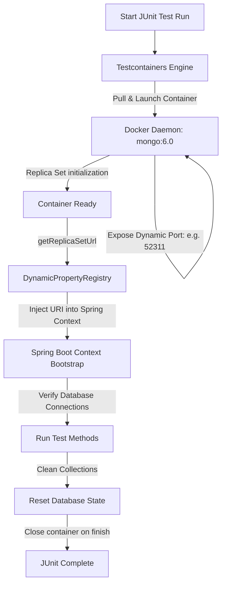

# Module 14: Testing Strategies

This module covers testing strategies for Spring Data MongoDB applications. It compares in-memory embedded databases with Docker-based Testcontainers, details integration testing setups, and explains how to verify transaction rollbacks and aggregation outputs in JUnit 5.

---

## 1. What Problem It Solves

Software tests must be reliable, fast, and representative of production environments. If developers test their database code using mock frameworks or simplified in-memory databases, they can easily miss compatibility errors, invalid query filters, or transaction failures that only occur on a real MongoDB engine.

Testing Strategies solve these problems by:
* **Ensuring Test Environment Fidelity**: Testcontainers launches a real MongoDB Docker container, guaranteeing that queries run against the same engine version used in production.
* **Verifying Distributed Transactions**: Provides a real replica set environment to test multi-document transactional rollbacks.
* **Testing Aggregation Pipelines**: Asserts that complex aggregation transformations and calculations return correct outputs.
* **Automating Schema Migration Tests**: Runs database validations to verify that lazy migrations and schema converters work correctly on older documents.
* **Enforcing Clean Test State**: Automatically resets collection data between test runs to guarantee test isolation.

---

## 2. Why MongoDB Instead of Relational Databases (RDBMS)

In relational databases (like PostgreSQL), integration testing often uses in-memory engines (like H2).

MongoDB code requires a real database engine for accurate testing:
* **H2 Lacks Document-Oriented Feature Compatibility**: H2 does not support MongoDB operators like `$unwind`, `$nearSphere`, or `$facet`. Testing MongoDB code against anything other than a real MongoDB engine is ineffective.
* **Replica Set Testing**: Testcontainers can launch a MongoDB instance in replica set mode, allowing developers to test write concerns and transaction rollbacks locally.
* **BSON Conversion Fidelity**: A real MongoDB instance ensures that custom converters (like serializing Java `ZonedDateTime` or `Money` value objects) convert BSON data types correctly.

---

## 3. Trade-offs and Limitations

| Architectural Choice | In-Memory Embedded MongoDB (Flapdoodle) | Testcontainers MongoDB (Docker) |
| :--- | :--- | :--- |
| **Startup Speed** | Fast (starts in under 2 seconds) | Moderate (requires 5-10 seconds to download and boot the container) |
| **Environment Fidelity** | Low (uses native binary wrappers; features diverge from official server) | High (runs the official MongoDB server Docker image) |
| **ACID Transaction Support** | Poor (no replica set support by default) | Fully Supported (launches in replica set mode) |
| **Resource Overhead** | Low (executes as a local process) | Moderate (requires running Docker daemon) |
| **Platform Portability** | Low (fails on newer architectures or lock-down OS environments) | High (runs anywhere Docker is installed) |

---

## 4. Common Mistakes & Anti-patterns

### Relying on Embedded In-Memory MongoDB for Transaction Testing
Using embedded MongoDB libraries (like Flapdoodle) to verify transaction rollback logic.
* *Why it's bad*: Embedded libraries do not support replica sets by default. When the application context boots, the `MongoTransactionManager` fails to initialize, or the transaction runs without rolling back on errors, creating false positives in test runs.
* *Production Fix*: Use Testcontainers with a replica set configuration to run tests against a real MongoDB server.

### Sharing State Across Test Classes without Cleanup
Allowing test data created in one test class to persist and affect the execution of subsequent test classes.
* *Why it's bad*: Causes flaky tests that pass when run individually but fail when executed as part of a complete build pipeline.
* *Production Fix*: Implement an abstract base integration class that truncates all collections using `MongoTemplate` before or after each test method.

### Mocking the `MongoTemplate` or Repository Layer in Integration Tests
Using `@MockBean` to mock database access interfaces in integration tests.
* *Why it's bad*: Mocking database layers bypasses the actual BSON serialization, query translation, and index utilization paths, rendering the test useless for detecting query bugs.
* *Production Fix*: Keep mocks in unit tests. Use Testcontainers to test the data access layer in integration tests.

---

## 5. When NOT to Use Testcontainers

* **Pure Unit Tests**: If you are testing business rules or DTO calculations that do not query the database, use mock frameworks (like Mockito) to keep tests fast.

---

## 6. Spring Boot & Spring Data Implementation

This project implements a complete integration testing suite using Testcontainers MongoDB, verifying transaction rollbacks.

### Core Test Dependencies (`pom.xml`)
```xml
<dependencies>
    <!-- Testcontainers MongoDB Integration Support -->
    <dependency>
        <groupId>org.testcontainers</groupId>
        <artifactId>mongodb</artifactId>
        <version>1.19.7</version>
        <scope>test</scope>
    </dependency>
    <dependency>
        <groupId>org.testcontainers</groupId>
        <artifactId>junit-jupiter</artifactId>
        <version>1.19.7</version>
        <scope>test</scope>
    </dependency>
    <dependency>
        <groupId>org.springframework.boot</groupId>
        <artifactId>spring-boot-starter-test</artifactId>
        <scope>test</scope>
    </dependency>
</dependencies>
```

### Abstract Base Integration Test Class
This class manages the lifecycle of the MongoDB Docker container and configures the Spring application properties dynamically.

```java
package com.masterclass.mongodb.test;

import org.springframework.boot.test.context.SpringBootTest;
import org.springframework.test.context.DynamicPropertyRegistry;
import org.springframework.test.context.DynamicPropertySource;
import org.testcontainers.containers.MongoDBContainer;
import org.testcontainers.junit.jupiter.Container;
import org.testcontainers.junit.jupiter.Testcontainers;

@SpringBootTest
@Testcontainers
public abstract class AbstractBaseIntegrationTest {

    // Configure Testcontainers to launch a real MongoDB 6.0 engine
    @Container
    protected static final MongoDBContainer mongoDBContainer = new MongoDBContainer("mongo:6.0")
            // Starts the container with replica set capabilities configured
            .withReuse(true);

    /**
     * Overrides Spring application properties dynamically to route traffic to the container.
     */
    @DynamicPropertySource
    static void setMongoProperties(DynamicPropertyRegistry registry) {
        registry.add("spring.data.mongodb.uri", mongoDBContainer::getReplicaSetUrl);
    }
}
```

### Repository Under Test
```java
package com.masterclass.mongodb.repository;

import com.masterclass.mongodb.domain.Customer;
import org.springframework.data.mongodb.repository.MongoRepository;
import org.springframework.stereotype.Repository;
import java.util.Optional;

@Repository
public interface CustomerTestRepository extends MongoRepository<Customer, String> {
    Optional<Customer> findByEmail(String email);
}
```

---

## 7. Production Architecture Examples

### 1. Testcontainers Lifecycle Execution flow
How JUnit and Testcontainers manage the Docker lifecycle and bootstrap the Spring application context:



---

## 8. Interview-Level Questions

### Q1: Why is a replica set URL returned by `mongoDBContainer.getReplicaSetUrl()` required to test Spring transactions?
**Answer**:
Spring Data MongoDB transactions require the Oplog to track changes and coordinate rollbacks, which is only available when MongoDB runs in a Replica Set or Sharded Cluster. 
* If you connect to the container using a standard standalone connection string (e.g. `mongodb://host:port`), the driver disables transactions.
* The `MongoDBContainer` automatically configures and initializes a replica set inside the Docker container when it starts. The `getReplicaSetUrl()` method returns the replica set connection string, enabling transactional support in tests.

### Q2: What is the purpose of `@DataMongoTest`, and how does it compare to `@SpringBootTest`?
**Answer**:
* **`@DataMongoTest`**: A slice testing annotation. It disables full application configuration auto-scanning, loading only the components required to test Spring Data MongoDB (such as repositories, `MongoTemplate`, and mapping configurations). This keeps tests fast.
* **`@SpringBootTest`**: Boots the entire application context, including REST controllers, security configurations, and scheduled tasks. Use this for full integration tests.

### Q3: How do you handle database cleanup between tests when running concurrent integration tests?
**Answer**:
If tests run in parallel, using `mongoTemplate.dropCollection()` can cause issues if one test deletes a collection while another test is writing to it.
* To prevent this, do not run integration tests in parallel within the same JVM instance.
* For sequential tests, implement a setup or cleanup method (annotated with `@BeforeEach` or `@AfterEach`) that iterates through all collections managed by the `MappingContext` and calls `mongoTemplate.remove(new Query(), entityClass)` to truncate the data. This keeps the collection schemas and indexes intact while clearing document state.

---

## 9. Hands-on Exercises

### Exercise 1: Writing an Aggregation Integration Test
1. Set up a test class that extends `AbstractBaseIntegrationTest`.
2. Seed the database with 5 mock sales documents.
3. Call the aggregation reporting service.
4. Write assertions to verify that the aggregated revenue, item counts, and category classifications match the seeded dataset.

### Exercise 2: Simulating and Testing Transaction Rollbacks
1. Write a test that attempts to execute a database transaction (such as transferring money from Account A to Account B).
2. Force the transaction to fail by passing a negative amount.
3. Assert that the transaction throws an exception.
4. Verify that Account A's balance remains unchanged in the database, proving that the rollback was applied.

---

## 10. Mini-Project: Integration Test Suite for Billing Engine

### Scenario
You are writing the test suite for a billing microservice. 
The service contains a transactional checkout method that:
1. Deducts balance from a user account.
2. Creates an invoice record.
You must build a complete integration test suite using Testcontainers that:
1. Verifies successful checkouts update both the user balance and invoice collections.
2. Verifies that checkout failures (e.g., due to insufficient balance) roll back all modifications, leaving the database unchanged.

### Step 1: Implement Domain Mappings
```java
package com.masterclass.mongodb.miniproject.model;

import org.springframework.data.annotation.Id;
import org.springframework.data.mongodb.core.mapping.Document;
import java.math.BigDecimal;

@Document(collection = "billing_accounts")
public class BillingAccount {
    @Id
    private String id;
    private String username;
    private BigDecimal balance;

    public BillingAccount() {}

    public BillingAccount(String id, String username, BigDecimal balance) {
        this.id = id;
        this.username = username;
        this.balance = balance;
    }

    public String getId() { return id; }
    public String getUsername() { return username; }
    public BigDecimal getBalance() { return balance; }
    public void setBalance(BigDecimal balance) { this.balance = balance; }
}
```

```java
package com.masterclass.mongodb.miniproject.model;

import org.springframework.data.annotation.Id;
import org.springframework.data.mongodb.core.mapping.Document;
import java.math.BigDecimal;

@Document(collection = "billing_invoices")
public class BillingInvoice {
    @Id
    private String id;
    private String accountId;
    private BigDecimal amountCharged;

    public BillingInvoice() {}

    public BillingInvoice(String accountId, BigDecimal amountCharged) {
        this.accountId = accountId;
        this.amountCharged = amountCharged;
    }

    public String getId() { return id; }
    public String getAccountId() { return accountId; }
    public BigDecimal getAmountCharged() { return amountCharged; }
}
```

### Step 2: Implement Billing Service
```java
package com.masterclass.mongodb.miniproject.service;

import com.masterclass.mongodb.miniproject.model.BillingAccount;
import com.masterclass.mongodb.miniproject.model.BillingInvoice;
import org.springframework.data.mongodb.core.MongoTemplate;
import org.springframework.data.mongodb.core.query.Criteria;
import org.springframework.data.mongodb.core.query.Query;
import org.springframework.data.mongodb.core.query.Update;
import org.springframework.stereotype.Service;
import org.springframework.transaction.annotation.Transactional;
import java.math.BigDecimal;

@Service
public class BillingCheckoutService {

    private final MongoTemplate mongoTemplate;

    public BillingCheckoutService(MongoTemplate mongoTemplate) {
        this.mongoTemplate = mongoTemplate;
    }

    /**
     * Deducts charge amount from user account and saves an invoice.
     * Everything executes atomically inside a transaction.
     */
    @Transactional
    public void chargeCustomer(String accountId, BigDecimal amountToCharge) {
        // Query to check balance and deduct in a single atomic update
        Query query = new Query(
                Criteria.where("id").is(accountId)
                        .and("balance").gte(amountToCharge)
        );
        Update deductUpdate = new Update().inc("balance", amountToCharge.negate());

        var result = mongoTemplate.updateFirst(query, deductUpdate, BillingAccount.class);

        // If no document was modified, balance is insufficient
        if (result.getModifiedCount() == 0) {
            throw new IllegalStateException("Insufficient balance for account ID: " + accountId);
        }

        // Save invoice
        BillingInvoice invoice = new BillingInvoice(accountId, amountToCharge);
        mongoTemplate.save(invoice);
    }
}
```

### Step 3: Implement the Integration Test
This test class extends our abstract test base, seeds initial data, and executes assertions to verify both successful purchases and transactional rollbacks.

```java
package com.masterclass.mongodb.miniproject.test;

import com.masterclass.mongodb.miniproject.model.BillingAccount;
import com.masterclass.mongodb.miniproject.model.BillingInvoice;
import com.masterclass.mongodb.miniproject.service.BillingCheckoutService;
import com.masterclass.mongodb.test.AbstractBaseIntegrationTest;
import org.junit.jupiter.api.AfterEach;
import org.junit.jupiter.api.BeforeEach;
import org.junit.jupiter.api.Test;
import org.springframework.beans.factory.annotation.Autowired;
import org.springframework.data.mongodb.core.MongoTemplate;
import org.springframework.data.mongodb.core.query.Query;
import java.math.BigDecimal;
import static org.junit.jupiter.api.Assertions.*;

public class BillingCheckoutIntegrationTest extends AbstractBaseIntegrationTest {

    @Autowired
    private MongoTemplate mongoTemplate;

    @Autowired
    private BillingCheckoutService checkoutService;

    @BeforeEach
    void setUp() {
        // Seed initial test account with $500 balance
        BillingAccount account = new BillingAccount("acc-test-01", "tester", new BigDecimal("500.00"));
        mongoTemplate.save(account);
    }

    @AfterEach
    void tearDown() {
        // Truncate collections to guarantee test isolation
        mongoTemplate.remove(new Query(), BillingAccount.class);
        mongoTemplate.remove(new Query(), BillingInvoice.class);
    }

    @Test
    void testSuccessfulChargeDeductsBalanceAndCreatesInvoice() {
        // Execute successful purchase of $150
        checkoutService.chargeCustomer("acc-test-01", new BigDecimal("150.00"));

        // Verify balance was deducted
        BillingAccount account = mongoTemplate.findById("acc-test-01", BillingAccount.class);
        assertNotNull(account);
        assertEquals(0, new BigDecimal("350.00").compareTo(account.getBalance()));

        // Verify invoice was created
        long invoiceCount = mongoTemplate.count(new Query(), BillingInvoice.class);
        assertEquals(1, invoiceCount);
    }

    @Test
    void testInsufficientBalanceTriggersRollback() {
        // Attempt to charge $600 (exceeds the $500 balance limit)
        Exception exception = assertThrows(IllegalStateException.class, () -> {
            checkoutService.chargeCustomer("acc-test-01", new BigDecimal("600.00"));
        });

        assertTrue(exception.getMessage().contains("Insufficient balance"));

        // Verify that account balance remains $500 (rolled back)
        BillingAccount account = mongoTemplate.findById("acc-test-01", BillingAccount.class);
        assertNotNull(account);
        assertEquals(0, new BigDecimal("500.00").compareTo(account.getBalance()));

        // Verify that no invoice was created (rolled back)
        long invoiceCount = mongoTemplate.count(new Query(), BillingInvoice.class);
        assertEquals(0, invoiceCount);
    }
}
```
This mini-project demonstrates how to set up integration tests using Testcontainers, verifying database query execution, updates, and transaction rollbacks against a real MongoDB server.
