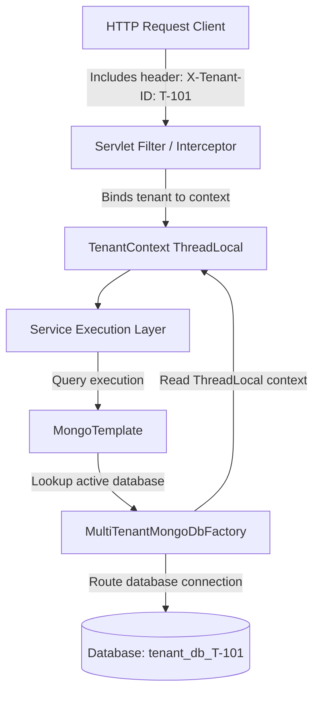
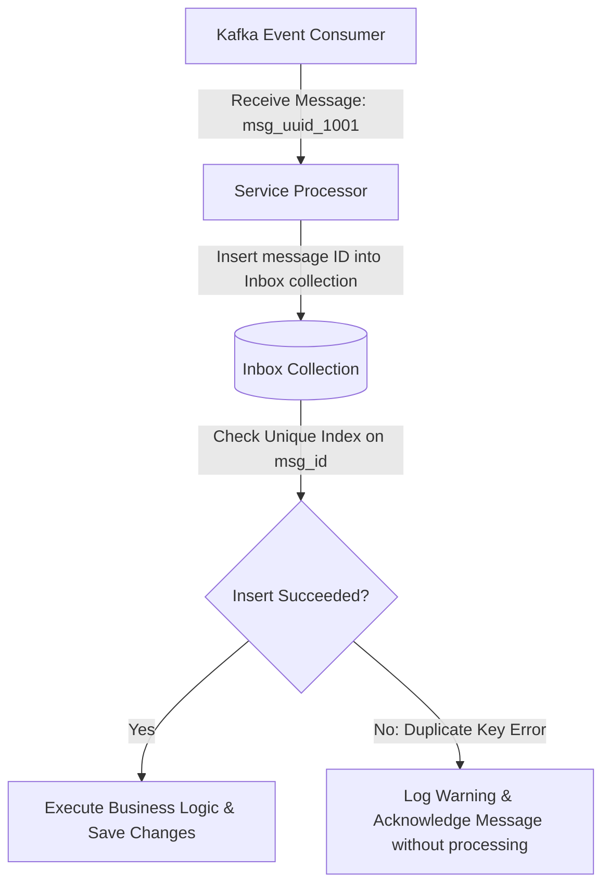

# Module 15: Advanced Production Patterns

This module covers advanced design patterns in high-scale production environments. It explores multi-tenancy strategies, soft delete implementation, Change Data Capture (CDC) using Change Streams, and message deduplication patterns like the Inbox pattern.

---

## 1. What Problem It Solves

Enterprise software architectures must manage complex challenges like client data isolation, data audits, search index synchronization, and reliable messaging.

Advanced Production Patterns solve these problems by:
* **Enforcing Client Data Isolation**: Isolates client spaces using database-per-tenant or discriminator-based multi-tenancy strategies.
* **Preserving Historical Records**: Implements soft deletes to hide documents from queries while retaining the data for compliance audits.
* **Propagating Changes (CDC)**: Uses MongoDB Change Streams to tail database modifications and sync them to search engines (like Elasticsearch) or event brokers (like Kafka) asynchronously.
* **Guaranteeing Message Deduplication**: Uses the Inbox pattern to ensure that distributed subscribers process messages exactly once, preventing duplicate transaction errors.

---

## 2. Why MongoDB Instead of Relational Databases (RDBMS)

Relational database systems handle these patterns using foreign keys, database triggers, and outbox pollers.

MongoDB provides native features that simplify these architectures:
* **Native Oplog Change Streams**: MongoDB exposes changes in real-time through Change Streams. Instead of running query pollers that scan tables, applications can subscribe to database change feeds directly.
* **Dynamic Connection Sourcing**: MongoDB's client settings allow dynamic, routing database selection at runtime without needing to reboot the application context or manage complex Hibernate routing sources.
* **TTL-Driven Soft Delete Cleanups**: Combined with soft deletes, TTL indexes can automatically remove documents with a `deleted: true` flag after a retention period, eliminating the need for cron cleanup jobs.

---

## 3. Trade-offs and Limitations

### Multi-Tenancy Strategy Comparisons
* **Database-per-tenant** offers high isolation but has high resource overhead. Each database maintains separate connection pools, indexes, and cache spaces, which can saturate database RAM.
* **Shared-collection** is highly scalable and cost-effective but carries the risk of data leaks if a query fails to include the tenant filter.

### Change Streams Limits
Change Streams rely on the replica set oplog. If a massive batch write occurs, the oplog can wrap around before the application can process all changes, causing the stream to lose sync.
* *Production Fix*: Ensure the oplog size is configured large enough to hold at least 24 hours of write history.

---

## 4. Common Mistakes & Anti-patterns

### Querying Soft-Deleted Data
Using soft deletes (`deleted: true`) but failing to include the filter `deleted = false` in query paths.
* *Why it's bad*: Soft-deleted records are returned to users, leading to data inconsistencies.
* *Production Fix*: Enforce soft-delete filtering in all queries using custom repository fragments or a custom query interceptor.

### Processing Change Streams Synchronously
Running heavy business logic or blocking HTTP calls directly inside the change stream event loop thread.
* *Why it's bad*: Blocks the database client connection, causing change stream events to queue up and increasing replication sync lag.
* *Production Fix*: Hand off incoming change stream events to an asynchronous message queue (like Kafka) or execute them on a separate thread pool.

### Missing Deduplication Keys in Message Consumers
Assuming event brokers like Kafka deliver messages exactly once, and writing events directly to the database without checking for duplicates.
* *Why it's bad*: Network retries and consumer rebalances can cause duplicate messages to be processed, leading to duplicate writes or double-billing.
* *Production Fix*: Implement the **Inbox Pattern** by storing processed message IDs in a deduplication collection with a unique index.

---

## 5. When NOT to Use Advanced Patterns

* **Low-Complexity Monolithic Apps**: If you are building a simple, single-tenant internal dashboard, do not implement complex multi-tenancy routing or change stream synchronization. Keep the architecture simple to reduce operational overhead.

---

## 6. Spring Boot & Spring Data Implementation

This project implements a dynamic database-per-tenant routing configurator and an idempotent message processor (Inbox pattern).

### Dynamic Multi-Tenant Context Holder
```java
package com.masterclass.mongodb.multitenant;

public class TenantContext {
    private static final ThreadLocal<String> CONTEXT = new ThreadLocal<>();

    public static void setTenantId(String tenantId) {
        CONTEXT.set(tenantId);
    }

    public static String getTenantId() {
        return CONTEXT.get();
    }

    public static void clear() {
        CONTEXT.remove();
    }
}
```

### Dynamic Mongo Database Factory
This class overrides the default database factory to resolve the database name dynamically based on the current tenant ID in the thread context.

```java
package com.masterclass.mongodb.config;

import com.masterclass.mongodb.multitenant.TenantContext;
import com.mongodb.client.MongoDatabase;
import org.springframework.data.mongodb.core.SimpleMongoClientDatabaseFactory;
import com.mongodb.client.MongoClient;

public class MultiTenantMongoDbFactory extends SimpleMongoClientDatabaseFactory {

    public MultiTenantMongoDbFactory(MongoClient mongoClient, String defaultDatabaseName) {
        super(mongoClient, defaultDatabaseName);
    }

    /**
     * Overrides getMongoDatabase to resolve the database name dynamically.
     */
    @Override
    public MongoDatabase getMongoDatabase() {
        String tenantId = TenantContext.getTenantId();
        if (tenantId != null && !tenantId.isBlank()) {
            // Route to a tenant-specific database: e.g. "tenant_db_TENANT-A"
            return getMongoClient().getDatabase("tenant_db_" + tenantId);
        }
        return super.getMongoDatabase(); // Fallback to default
    }
}
```

### Multi-Tenant Configuration Registration
```java
package com.masterclass.mongodb.config;

import com.mongodb.client.MongoClient;
import com.mongodb.client.MongoClients;
import org.springframework.context.annotation.Bean;
import org.springframework.context.annotation.Configuration;
import org.springframework.data.mongodb.MongoDatabaseFactory;
import org.springframework.data.mongodb.core.MongoTemplate;

@Configuration
public class MultiTenantMongoConfig {

    @Bean
    public MongoDatabaseFactory mongoDatabaseFactory() {
        MongoClient mongoClient = MongoClients.create("mongodb://localhost:27017,localhost:27018,localhost:27019/?replicaSet=rs0");
        return new MultiTenantMongoDbFactory(mongoClient, "default_tenant_db");
    }

    @Bean
    public MongoTemplate mongoTemplate(MongoDatabaseFactory factory) {
        return new MongoTemplate(factory);
    }
}
```

---

## 7. Production Architecture Examples

### 1. Dynamic Database Routing Flow
How the application routes requests to tenant-specific databases at runtime based on the thread context:



### 2. Idempotent Consumer Inbox pattern
How the Inbox pattern ensures messages are processed exactly once using a message deduplication collection:



---

## 8. Interview-Level Questions

### Q1: Compare database-per-tenant, collection-per-tenant, and shared-collection multi-tenancy in MongoDB. What are the scaling implications?
**Answer**:
* **Database-per-tenant**: Offers high data isolation. However, it is not highly scalable because each database maintains separate collection namespaces, indexes, and connection pools, which can saturate database RAM.
* **Collection-per-tenant**: Groups all tenant data in a single database but uses separate collections for each tenant (e.g. `T1_orders`, `T2_orders`). This provides moderate isolation but can lead to namespace bloat if you have thousands of tenants.
* **Shared-collection (Discriminator field)**: Stores all tenant data in the same collection, using a `tenantId` field to partition data. This is highly scalable and cost-effective but requires enforcing tenant filters on all queries to prevent data leaks.

### Q2: How do you implement a soft delete mechanism in Spring Data MongoDB that automatically purges expired records using a database TTL index?
**Answer**:
1. Add a `deleted` boolean field and a `deletedAt` date field to the document model.
2. Update the application queries to filter for `deleted = false`.
3. Create a TTL index on the `deletedAt` field:
   ```javascript
   db.collection.createIndex({ "deletedAt": 1 }, { expireAfterSeconds: 2592000 }) // Purge after 30 days
   ```
4. When deleting a document, set `deleted = true` and `deletedAt = Instant.now()`. MongoDB will automatically purge the document 30 days after deletion.

### Q3: Why is a unique index on the message ID required to implement the Inbox pattern?
**Answer**:
In distributed microservices, message delivery is **at-least-once**. Network retries can cause a consumer to receive the same message multiple times.
* To prevent duplicate processing, the consumer writes the message ID to an `inbox` collection that has a unique index on the `messageId` field.
* If a duplicate message arrives, the insert will fail with a duplicate key error (`MongoWriteException`), alerting the consumer to skip the message.

---

## 9. Hands-on Exercises

### Exercise 1: Building a Dynamic Multi-Tenant API
1. Implement the `MultiTenantMongoDbFactory` in a test project.
2. Create an endpoint `/items` that saves item documents.
3. Send requests with different headers:
   * `X-Tenant-ID: TENANT-A`
   * `X-Tenant-ID: TENANT-B`
4. Verify using `mongosh` that two separate databases (`tenant_db_TENANT-A` and `tenant_db_TENANT-B`) were created and populated automatically.

### Exercise 2: Implementing a Soft Delete Interceptor
1. Add `deleted` and `deletedAt` fields to your document class.
2. Write a Spring Data repository method that filters out documents where `deleted` is true.
3. Verify that soft-deleted documents are excluded from queries but remain visible in the database.

---

## 10. Mini-Project: Idempotent Message Inbox Processor

### Scenario
You are building the order fulfillment service for a retail platform. 
The service consumes order events from a message broker. 
Because the broker guarantees **at-least-once** delivery, you must implement the **Inbox Pattern** to ensure each order event is processed exactly once, preventing duplicate order records.

### Step 1: Implement Domain Mappings
```java
package com.masterclass.mongodb.miniproject.model;

import org.springframework.data.annotation.Id;
import org.springframework.data.mongodb.core.mapping.Document;
import org.springframework.data.mongodb.core.mapping.Field;
import java.time.Instant;

@Document(collection = "inbox_processed_messages")
public class InboxMessage {

    @Id
    private String messageId; // Unique message ID used for deduplication

    @Field("processed_at")
    private Instant processedAt;

    public InboxMessage() {}

    public InboxMessage(String messageId, Instant processedAt) {
        this.messageId = messageId;
        this.processedAt = processedAt;
    }

    public String getMessageId() { return messageId; }
    public Instant getProcessedAt() { return processedAt; }
}
```

```java
package com.masterclass.mongodb.miniproject.model;

import org.springframework.data.annotation.Id;
import org.springframework.data.mongodb.core.mapping.Document;

@Document(collection = "fulfillment_orders")
public class FulfillmentOrder {
    @Id
    private String id;
    private String customerId;
    private double totalAmount;

    public FulfillmentOrder() {}

    public FulfillmentOrder(String id, String customerId, double totalAmount) {
        this.id = id;
        this.customerId = customerId;
        this.totalAmount = totalAmount;
    }

    public String getId() { return id; }
    public String getCustomerId() { return customerId; }
    public double getTotalAmount() { return totalAmount; }
}
```

### Step 2: Implement Idempotent Processor Service
```java
package com.masterclass.mongodb.miniproject.service;

import com.masterclass.mongodb.miniproject.model.FulfillmentOrder;
import com.masterclass.mongodb.miniproject.model.InboxMessage;
import com.mongodb.MongoWriteException;
import org.springframework.data.mongodb.core.MongoTemplate;
import org.springframework.stereotype.Service;
import org.springframework.transaction.annotation.Transactional;
import java.time.Instant;

@Service
public class IdempotentFulfillmentService {

    private final MongoTemplate mongoTemplate;

    public IdempotentFulfillmentService(MongoTemplate mongoTemplate) {
        this.mongoTemplate = mongoTemplate;
    }

    /**
     * Processes an incoming order event idempotently.
     * Uses the Inbox pattern to prevent duplicate processing.
     */
    @Transactional
    public void processOrderEvent(String eventId, String orderId, String customerId, double amount) {
        // Step 1: Attempt to register the message ID in the inbox collection
        try {
            InboxMessage inboxRecord = new InboxMessage(eventId, Instant.now());
            mongoTemplate.insert(inboxRecord);
        } catch (Exception e) {
            // Catch duplicate key errors to detect duplicate messages
            if (e.getMessage().contains("E11000") || e instanceof MongoWriteException) {
                System.out.println(">>> DUPLICATE EVENT DETECTED: Event ID " + eventId + " already processed. Skipping.");
                return; // Exit method without processing
            }
            throw e; // Propagate other errors
        }

        // Step 2: Process the order (executed only if the inbox registration succeeded)
        FulfillmentOrder order = new FulfillmentOrder(orderId, customerId, amount);
        mongoTemplate.save(order);
        System.out.println(">>> Event ID " + eventId + " processed successfully. Order ID: " + orderId);
    }
}
```

### Step 3: Verification CommandLineRunner
```java
package com.masterclass.mongodb.miniproject.test;

import com.masterclass.mongodb.miniproject.model.FulfillmentOrder;
import com.masterclass.mongodb.miniproject.model.InboxMessage;
import com.masterclass.mongodb.miniproject.service.IdempotentFulfillmentService;
import org.springframework.boot.CommandLineRunner;
import org.springframework.data.mongodb.core.MongoTemplate;
import org.springframework.data.mongodb.core.query.Query;
import org.springframework.stereotype.Component;

@Component
public class InboxVerificationRunner implements CommandLineRunner {

    private final MongoTemplate mongoTemplate;
    private final IdempotentFulfillmentService fulfillmentService;

    public InboxVerificationRunner(MongoTemplate mongoTemplate, IdempotentFulfillmentService fulfillmentService) {
        this.mongoTemplate = mongoTemplate;
        this.fulfillmentService = fulfillmentService;
    }

    @Override
    public void run(String... args) throws Exception {
        // Clear collections
        mongoTemplate.remove(new Query(), InboxMessage.class);
        mongoTemplate.remove(new Query(), FulfillmentOrder.class);

        String uniqueEventId = "evt-checkout-9912";

        // Test 1: First Event Processing
        System.out.println("Processing event...");
        fulfillmentService.processOrderEvent(uniqueEventId, "order-01", "cust-44", 350.00);

        // Test 2: Duplicate Event Processing (should be skipped)
        System.out.println("Processing duplicate event...");
        fulfillmentService.processOrderEvent(uniqueEventId, "order-01", "cust-44", 350.00);

        // Verify database state
        long inboxCount = mongoTemplate.count(new Query(), InboxMessage.class);
        long orderCount = mongoTemplate.count(new Query(), FulfillmentOrder.class);

        System.out.println("\nInbox Verification Results:");
        System.out.println(" - Inbox Records (Expected: 1): " + inboxCount);
        System.out.println(" - Total Orders Created (Expected: 1): " + orderCount);
    }
}
```
This mini-project demonstrates how to implement the Inbox pattern using a deduplication collection, ensuring idempotent message processing in distributed architectures.
