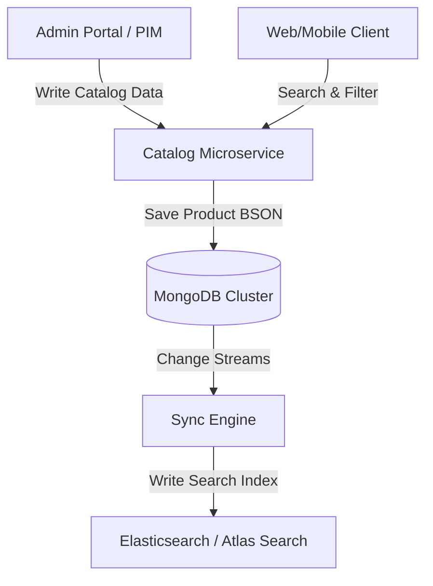
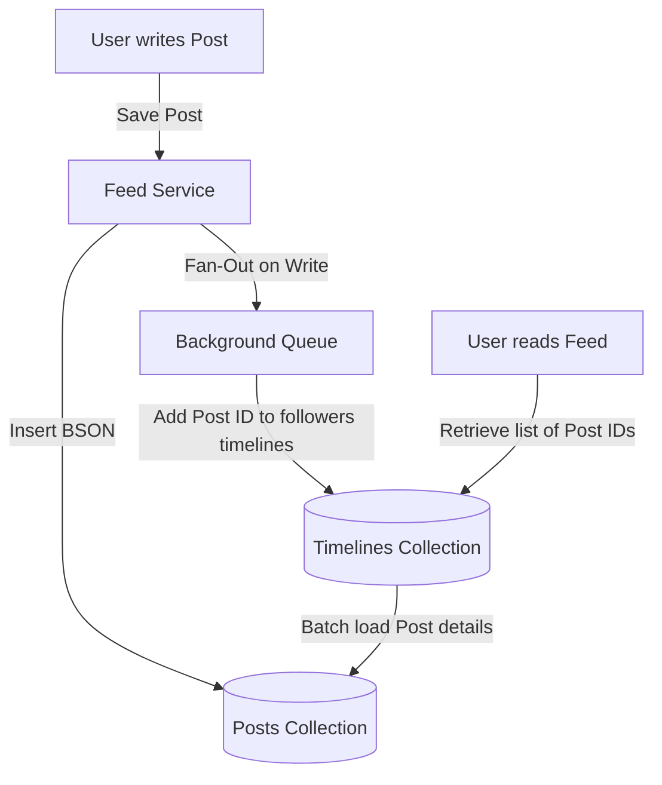
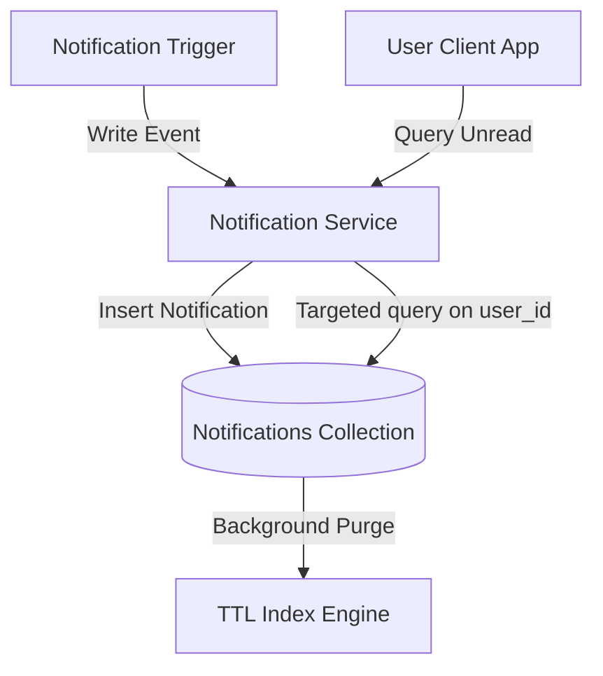
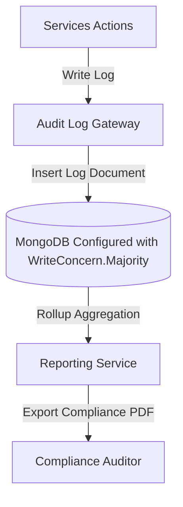
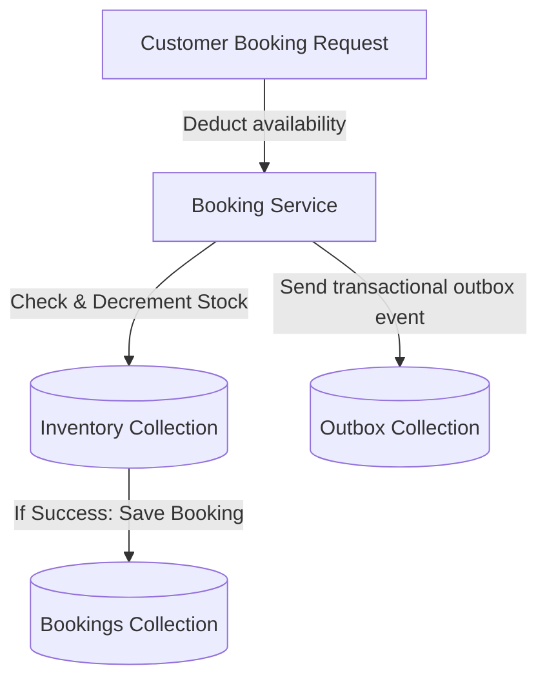

# Module 16: Real Production Case Studies

This module analyzes five production database architectures built on MongoDB. It explores data model decisions, indexing strategies, scaling challenges, operational plans, and roadmaps to scale systems under 10x, 100x, and 1000x traffic loads.

---

## 1. Case Study 1: E-Commerce Catalog Service

This service manages product information, category hierarchies, and product variants (e.g. size, color) for a retail site.



### Architectural Details

* **Why MongoDB**: Products have highly dynamic attributes (electronics have specs, clothing has sizes and colors). Storing these in relational tables requires a complex EAV (Entity-Attribute-Value) schema or dozens of table joins. MongoDB allows nesting variants and dynamic attributes inside a single product document.
* **Alternatives**:
  * *PostgreSQL*: Can store JSONB, but index optimization for dynamic keys is complex compared to MongoDB.
  * *Elasticsearch*: Excellent for search and filtering, but is not designed to be the primary system of record for product writes and inventory.
* **Data Model Decisions**: We use the **Attribute Pattern** to represent dynamic specifications, allowing a single index to cover all attributes:
  ```json
  {
    "_id": ObjectId("647a8f114c0a5e2f1837bc01"),
    "sku": "IPHONE-15-PRO-256G",
    "name": "iPhone 15 Pro",
    "category": "Electronics/Phones",
    "price": 999.00,
    "variants": [
      { "sku_variant": "IP15P-BLK", "color": "Titanium Black", "stock": 50 },
      { "sku_variant": "IP15P-BLU", "color": "Titanium Blue", "stock": 22 }
    ],
    "specifications": [
      { "k": "screen_size", "v": "6.1 inch" },
      { "k": "storage", "v": "256 GB" }
    ]
  }
  ```
* **Indexing Strategy**: 
  * Compound index for catalog navigation: `{ category: 1, price: 1 }`.
  * Unique single-field index: `{ sku: 1 }`.
  * Compound multikey index on specifications: `{ "specifications.k": 1, "specifications.v": 1 }`.
* **Scaling Roadmap**:
  * **10x Traffic**: Scale read replicas and configure `ReadPreference.secondaryPreferred()` for catalog browsing, keeping write traffic on the primary.
  * **100x Traffic**: Set up a sharded cluster. Shard the products collection using `{ category: 1, sku: 1 }` as the shard key to target queries by category.
  * **1000x Traffic**: Integrate Redis to cache catalog details, offloading 95% of read queries from the database. Sync database changes to Elasticsearch and route search queries there.

---

## 2. Case Study 2: Social Media Feed Service

This service handles user posts, comments, likes, and generates real-time activity feeds for users.



### Architectural Details

* **Why MongoDB**: Read paths must serve user timelines quickly. Storing posts, comments, and likes in normalized tables requires joining massive datasets. MongoDB allows denormalizing comment counts and likes directly inside the post document, serving feeds in a single read query.
* **Alternatives**:
  * *Cassandra*: Highly scalable for writes, but does not support the flexible sorting, secondary indexing, and nested aggregations required for comments and likes.
  * *Redis*: Excellent for storing active user timelines in memory, but is too expensive to use as the primary storage for historical posts.
* **Data Model Decisions**: Use the **Fan-Out on Write (Push) Pattern** for active users, and **Fan-Out on Read (Pull) Pattern** for users following celebrities (who have millions of followers) to prevent write bottlenecks:
  ```json
  // Posts Collection
  {
    "_id": ObjectId("647a8f114c0a5e2f1837bc02"),
    "user_id": "usr_9921",
    "content": "Building scalable architectures with MongoDB!",
    "created_at": ISODate("2026-06-12T10:00:00Z"),
    "likes_count": 1420,
    "recent_comments": [
      { "user_id": "usr_102", "text": "Great post!", "timestamp": 1718186400 }
    ]
  }
  ```
* **Indexing Strategy**:
  * Index for user profiles: `{ user_id: 1, created_at: -1 }`.
  * Index for timeline retrieval: `{ owner_id: 1, post_id: -1 }`.
* **Scaling Roadmap**:
  * **10x Traffic**: Separate comments into their own collection referencing post IDs to prevent post documents from hitting the 16MB limit.
  * **100x Traffic**: Shard the posts collection using a hashed shard key `{ user_id: "hashed" }` to distribute writes. Cache active timelines in Redis using sorted sets.
  * **1000x Traffic**: Implement a hybrid feed engine. Store active user feeds in Redis, and use MongoDB Change Streams to asynchronously sync posts to an offline search cluster.

---

## 3. Case Study 3: Notification System

This system processes and delivers user notifications, tracks read/unread states, and automatically cleans up expired notifications.



### Architectural Details

* **Why MongoDB**: The system generates massive write volumes of transient data (most notifications are read once and never accessed again). MongoDB's TTL indexes automatically delete expired documents in the background, keeping disk usage stable.
* **Alternatives**:
  * *Kafka*: Great for routing notifications, but does not support the persistent storage, status updates, and query filters needed for user inbox history.
* **Data Model Decisions**: Group notifications by user to optimize read performance and minimize document counts:
  ```json
  {
    "_id": ObjectId("647a8f114c0a5e2f1837bc03"),
    "user_id": "usr_5511",
    "unread_count": 2,
    "notifications": [
      { "id": "nt_1", "type": "ALERT", "text": "Security Login from Vietnam", "read": false },
      { "id": "nt_2", "type": "PROMO", "text": "Discount code: SPRING20", "read": false }
    ],
    "expire_at": ISODate("2026-07-12T10:00:00Z")
  }
  ```
* **Indexing Strategy**:
  * Index for user inbox queries: `{ user_id: 1 }`.
  * TTL index: `{ expire_at: 1 }` (configured with `expireAfterSeconds = 0`).
* **Scaling Roadmap**:
  * **10x Traffic**: Adjust the TTL window to purge read notifications faster, reducing database size.
  * **100x Traffic**: Shard the collection using `{ user_id: "hashed" }` to distribute write traffic evenly across shards.
  * **1000x Traffic**: Cache unread notification counts in Redis, querying the database only when the user opens their notifications inbox.

---

## 4. Case Study 4: Audit Log Platform

An append-only compliance engine that logs financial and administrative changes across systems.



### Architectural Details

* **Why MongoDB**: Audit logs require high-write throughput and flexible schemas to record different event payloads. MongoDB's append-only model can write thousands of documents per second under strict write concerns, and stores event metadata as nested BSON.
* **Alternatives**:
  * *Elasticsearch*: Good for log analysis, but lacks the write concern guarantees (`w: "majority"`, `j: true`) and transaction boundaries needed for strict financial compliance.
* **Data Model Decisions**: Use a flat, append-only document structure. Configure a partial validator schema to prevent document updates or deletions:
  ```json
  {
    "_id": ObjectId("647a8f114c0a5e2f1837bc04"),
    "system": "PAYMENT_GATEWAY",
    "event": "CREDIT_CARD_DEBIT",
    "operator_id": "system_svc",
    "payload": {
      "transaction_id": "tx_8832",
      "amount": 250.00,
      "card_provider": "VISA"
    },
    "timestamp": ISODate("2026-06-12T10:00:00Z")
  }
  ```
* **Indexing Strategy**:
  * Compound index for audit audits: `{ system: 1, timestamp: -1 }`.
  * Index on nested identifiers: `{ "payload.transaction_id": 1 }`.
* **Scaling Roadmap**:
  * **10x Traffic**: Configure capped collections or partition data by creating monthly collections (e.g. `audit_logs_2026_06`) to simplify archiving.
  * **100x Traffic**: Shard the platform using a hashed shard key `{ "payload.transaction_id": "hashed" }` to prevent write bottlenecks.
  * **1000x Traffic**: Archive historical collections to cold storage (like Amazon S3 or MongoDB Atlas Online Archive) and use MongoDB solely to store active audit windows.

---

## 5. Case Study 5: Booking Platform

This platform handles hotel room and flight bookings, managing availability and preventing double bookings under high concurrent load.



### Architectural Details

* **Why MongoDB**: Booking platforms require single-document atomic operations and low-latency inventory lookups. MongoDB allows modeling hotel rooms and their daily availability inside a single document, enabling atomic reservations using query filters.
* **Alternatives**:
  * *PostgreSQL*: Excellent for ACID transactions, but locking rows during peak booking sales can create database bottlenecks, increasing request latencies.
* **Data Model Decisions**: Model availability as a daily inventory array inside the Room document, enabling atomic updates without row locks:
  ```json
  {
    "_id": "room_saigon_101",
    "hotel_name": "Rex Hotel Saigon",
    "room_type": "DELUXE",
    "availability": [
      { "date": "2026-06-12", "booked_slots": 3, "max_slots": 5 },
      { "date": "2026-06-13", "booked_slots": 0, "max_slots": 5 }
    ]
  }
  ```
* **Indexing Strategy**:
  * Compound index for room search: `{ hotel_name: 1, room_type: 1 }`.
  * Index on availability dates: `{ "availability.date": 1 }`.
* **Scaling Roadmap**:
  * **10x Traffic**: Use optimistic concurrency locking (`@Version`) to reject overlapping checkout requests.
  * **100x Traffic**: Shard the collections using `{ hotel_name: 1 }` to keep hotel details local to specific shards.
  * **1000x Traffic**: Implement a pre-claim reservation engine using Redis. Temporary locks are held in Redis, and written to MongoDB asynchronously once the user completes payment.

---

## 6. Mini-Project: Race-Free Reservation Booking Engine

### Scenario
You are building the reservation engine for a hotel booking system. 
To prevent double bookings during peak sales, the system must atomically deduct available slots for a room type on a specific date. 
You must:
1. Model rooms and their daily booking slots.
2. Implement a service that checks availability and reserves a slot atomically in a single database operation.
3. Verify that concurrent requests do not exceed the room's maximum capacity.

### Step 1: Implement the Domain Entities
```java
package com.masterclass.mongodb.miniproject.model;

import org.springframework.data.annotation.Id;
import org.springframework.data.mongodb.core.mapping.Document;
import org.springframework.data.mongodb.core.mapping.Field;
import java.util.List;

@Document(collection = "hotel_rooms")
public class HotelRoom {

    @Id
    private String id;

    @Field("hotel_name")
    private String hotelName;

    @Field("room_type")
    private String roomType;

    // List of daily slots mapping availability
    private List<DailyAvailability> availability;

    public HotelRoom() {}

    public HotelRoom(String id, String hotelName, String roomType, List<DailyAvailability> availability) {
        this.id = id;
        this.hotelName = hotelName;
        this.roomType = roomType;
        this.availability = availability;
    }

    public String getId() { return id; }
    public String getHotelName() { return hotelName; }
    public String getRoomType() { return roomType; }
    public List<DailyAvailability> getAvailability() { return availability; }
    public void setAvailability(List<DailyAvailability> availability) { this.availability = availability; }
}
```

```java
package com.masterclass.mongodb.miniproject.model;

public class DailyAvailability {
    private String date; // format: YYYY-MM-DD
    private int booked;
    private int capacity;

    public DailyAvailability() {}

    public DailyAvailability(String date, int booked, int capacity) {
        this.date = date;
        this.booked = booked;
        this.capacity = capacity;
    }

    public String getDate() { return date; }
    public int getBooked() { return booked; }
    public void setBooked(int booked) { this.booked = booked; }
    public int getCapacity() { return capacity; }
}
```

### Step 2: Implement Booking Service
```java
package com.masterclass.mongodb.miniproject.service;

import com.masterclass.mongodb.miniproject.model.HotelRoom;
import com.mongodb.client.result.UpdateResult;
import org.springframework.data.mongodb.core.MongoTemplate;
import org.springframework.data.mongodb.core.query.ArrayFilter;
import org.springframework.data.mongodb.core.query.Criteria;
import org.springframework.data.mongodb.core.query.Query;
import org.springframework.data.mongodb.core.query.Update;
import org.springframework.stereotype.Service;

@Service
public class BookingEngineService {

    private final MongoTemplate mongoTemplate;

    public BookingEngineService(MongoTemplate mongoTemplate) {
        this.mongoTemplate = mongoTemplate;
    }

    /**
     * Atomically reserves a room slot for a specific date.
     * Ensures booked slots do not exceed the room capacity in a single database operation.
     */
    public boolean reserveRoom(String roomId, String targetDate) {
        // Query matches the room ID and checks if the slot for the target date has availability
        Query query = new Query(
                Criteria.where("id").is(roomId)
                        .and("availability").elemMatch(
                                Criteria.where("date").is(targetDate)
                                        // $expr booked < capacity
                                        .andExpression("this.booked < this.capacity")
                        )
        );

        // Increment booked slot count atomically using the filtered positional operator
        Update update = new Update()
                .inc("availability.$[day].booked", 1);

        // Apply array filter targeting the matching date
        update.filterArray(ArrayFilter.of(Criteria.where("day.date").is(targetDate)));

        UpdateResult result = mongoTemplate.updateFirst(query, update, HotelRoom.class);

        // If modifiedCount is 1, reservation succeeded and stock was deducted safely
        return result.getModifiedCount() > 0;
    }
}
```

### Step 3: Implement Verification Runner
```java
package com.masterclass.mongodb.miniproject.test;

import com.masterclass.mongodb.miniproject.model.DailyAvailability;
import com.masterclass.mongodb.miniproject.model.HotelRoom;
import com.masterclass.mongodb.miniproject.service.BookingEngineService;
import org.springframework.boot.CommandLineRunner;
import org.springframework.data.mongodb.core.MongoTemplate;
import org.springframework.stereotype.Component;
import java.util.Arrays;
import java.util.concurrent.ExecutorService;
import java.util.concurrent.Executors;
import java.util.concurrent.TimeUnit;
import java.util.concurrent.atomic.AtomicInteger;

@Component
public class CaseStudyVerificationRunner implements CommandLineRunner {

    private final MongoTemplate mongoTemplate;
    private final BookingEngineService bookingService;

    public CaseStudyVerificationRunner(MongoTemplate mongoTemplate, BookingEngineService bookingService) {
        this.mongoTemplate = mongoTemplate;
        this.bookingService = bookingService;
    }

    @Override
    public void run(String... args) throws Exception {
        // Clear collections
        mongoTemplate.dropCollection(HotelRoom.class);

        // Seed Rex Hotel Room with a maximum capacity of 2 slots for target date 2026-06-12
        HotelRoom room = new HotelRoom("room-rex-01", "Rex Hotel", "DELUXE", Arrays.asList(
                new DailyAvailability("2026-06-12", 0, 2),
                new DailyAvailability("2026-06-13", 0, 5)
        ));
        mongoTemplate.save(room);

        System.out.println("Hotel Room Inventory Seeded (Capacity: 2).");

        // Simulate 5 concurrent booking requests attempting to book the 2 available slots
        ExecutorService executor = Executors.newFixedThreadPool(5);
        AtomicInteger successfulBookings = new AtomicInteger(0);

        for (int i = 0; i < 5; i++) {
            executor.submit(() -> {
                boolean success = bookingService.reserveRoom("room-rex-01", "2026-06-12");
                if (success) {
                    successfulBookings.incrementAndGet();
                }
            });
        }

        executor.shutdown();
        executor.awaitTermination(5, TimeUnit.SECONDS);

        // Verify state in database
        HotelRoom updatedRoom = mongoTemplate.findById("room-rex-01", HotelRoom.class);
        DailyAvailability dayInfo = updatedRoom.getAvailability().stream()
                .filter(d -> d.getDate().equals("2026-06-12"))
                .findFirst()
                .orElseThrow();

        System.out.println("\nConcurrent Booking Verification Results:");
        System.out.println(" - Successful Bookings (Expected: 2): " + successfulBookings.get());
        System.out.println(" - Booked slots count in DB (Expected: 2): " + dayInfo.getBooked());
    }
}
```
This mini-project demonstrates how to design a booking availability engine using query filters to prevent overbooking, eliminating the need for expensive database row locks.
