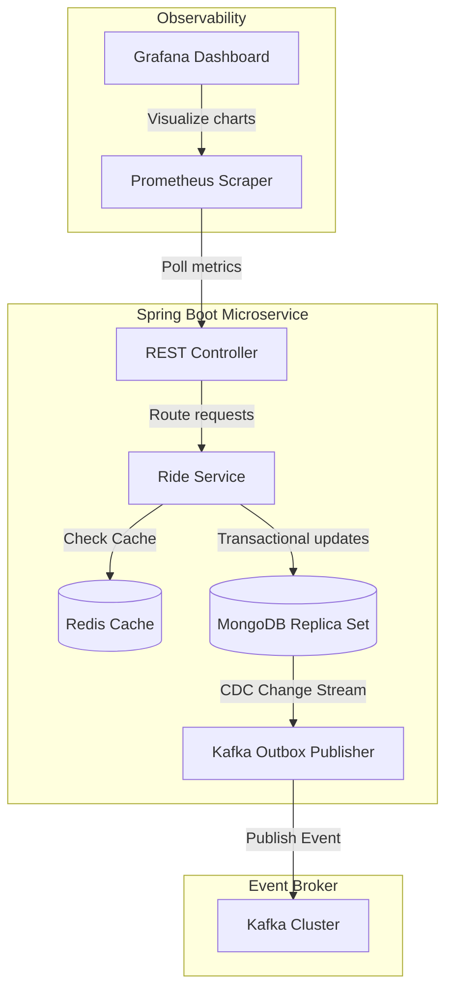

# Module 17: Final Capstone Project

This document specifies the requirements, architecture, and deployment configurations for the final capstone project.

---

## 1. Project Goal

You will build a production-grade **High-Scale Distributed Ride-Hailing & Payment Platform** using Spring Boot and Spring Data MongoDB. The application must handle ride bookings, atomic payments, driver tracking, real-time analytics, and event propagation. 

The project must integrate **Redis caching, Apache Kafka messaging, Spring Security, Testcontainers, and Prometheus/Grafana monitoring**, following the production patterns established throughout this course.



---

## 2. Platform Requirements

### Phase 1: Document Modeling & Index Design
Implement the MongoDB document models using Spring Data annotations. You must design optimized compound indexes using the **ESR Rule**, multikey indexes for arrays, and TTL indexes for session expiry.
* **Driver Profile**: Stores driver details, active vehicle status, and a list of historical ratings.
* **Ride Booking**: Tracks pickup and drop-off coordinates (using GeoJSON `Point`), fares, and ride status (`"REQUESTED"`, `"ACTIVE"`, `"COMPLETED"`).
* **Outbox Event**: Stores outgoing events to be sent to Kafka.

### Phase 2: Transactional Integrity (ACID)
Implement a checkout process that executes the following operations atomically inside a single MongoDB transaction:
1. Deduct the fare amount from the passenger's account balance.
2. Credit the fare amount to the driver's earnings.
3. Save the invoice document.
4. Write a `"PAYMENT_COMPLETED"` event to the Outbox collection.
* *Failures* (such as insufficient passenger balance or non-existent accounts) must roll back all operations, leaving the database unchanged.

### Phase 3: High-Performance Analytics Aggregation
Implement a reporting pipeline that aggregates completed rides to calculate:
* Total fares generated.
* Average ride distance.
* Average ratings grouped by driver.
* Filter results by date range using indexes, and optimize memory footprint.

### Phase 4: Cache-Aside Pattern with Redis
To protect MongoDB from heavy read traffic:
* Cache driver profiles in Redis.
* Read requests must check the cache first. On a cache miss, load the profile from MongoDB and write it to Redis with a 5-minute TTL.
* Writes or updates to driver profiles must invalidate the corresponding Redis cache key.

### Phase 5: Event-Driven CDC Integration
Implement an Outbox Event Publisher. 
* Use MongoDB Change Streams to monitor writes to the `outbox` collection.
* Retrieve new event documents and publish them to Kafka.
* Once Kafka acknowledges receipt, delete or update the outbox document in MongoDB to prevent double delivery.

### Phase 6: Production Observability & Micrometer Metrics
Integrate Actuator and Micrometer to expose connection pool and command metrics:
* Monitor `waitQueueSize`, checkouts, and query latency.
* Expose these metrics in Prometheus format at `/actuator/prometheus`.

---

## 3. Local Infrastructure Stack (`docker-compose.yml`)

Create this file in your project root to spin up the local replica set, Redis cache, Kafka broker, and monitoring tools:

```yaml
version: '3.8'

services:
  # MongoDB Nodes
  mongo1:
    image: mongo:6.0
    container_name: mongo1
    command: ["mongod", "--replSet", "rs0", "--bind_ip_all", "--port", "27017"]
    ports:
      - "27017:27017"
    volumes:
      - mongo1_data:/data/db
    networks:
      - platform-network

  mongo2:
    image: mongo:6.0
    container_name: mongo2
    command: ["mongod", "--replSet", "rs0", "--bind_ip_all", "--port", "27018"]
    ports:
      - "27018:27018"
    volumes:
      - mongo2_data:/data/db
    networks:
      - platform-network

  mongo3:
    image: mongo:6.0
    container_name: mongo3
    command: ["mongod", "--replSet", "rs0", "--bind_ip_all", "--port", "27019"]
    ports:
      - "27019:27019"
    volumes:
      - mongo3_data:/data/db
    networks:
      - platform-network

  mongo-init:
    image: mongo:6.0
    container_name: mongo-init
    depends_on:
      - mongo1
      - mongo2
      - mongo3
    networks:
      - platform-network
    entrypoint: [ "bash", "-c", "sleep 5 && mongosh --host mongo1:27017 --eval 'rs.initiate({_id: \"rs0\", members: [{_id: 0, host: \"mongo1:27017\", priority: 2}, {_id: 1, host: \"mongo2:27018\", priority: 1}, {_id: 2, host: \"mongo3:27019\", priority: 1}]})'" ]

  # Redis Cache
  redis:
    image: redis:7.0-alpine
    container_name: redis_cache
    ports:
      - "6379:6379"
    networks:
      - platform-network

  # Kafka + KRaft
  kafka:
    image: confluentinc/cp-kafka:7.3.0
    container_name: kafka_broker
    ports:
      - "9092:9092"
    environment:
      KAFKA_NODE_ID: 1
      KAFKA_LISTENER_SECURITY_PROTOCOL_MAP: 'CONTROLLER:PLAINTEXT,PLAINTEXT:PLAINTEXT,PLAINTEXT_HOST:PLAINTEXT'
      KAFKA_ADVERTISED_LISTENERS: 'PLAINTEXT://kafka:29092,PLAINTEXT_HOST://localhost:9092'
      KAFKA_OFFSETS_TOPIC_REPLICATION_FACTOR: 1
      KAFKA_GROUP_INITIAL_REBALANCE_DELAY_MS: 0
      KAFKA_TRANSACTION_STATE_LOG_MIN_ISR: 1
      KAFKA_TRANSACTION_STATE_LOG_REPLICATION_FACTOR: 1
      KAFKA_PROCESS_ROLES: 'broker,controller'
      KAFKA_LATEST_BINSTACKS: 'true'
      KAFKA_CONTROLLER_QUORUM_VOTERS: '1@kafka:29093'
      KAFKA_LISTENERS: 'PLAINTEXT://0.0.0.0:29092,CONTROLLER://0.0.0.0:29093,PLAINTEXT_HOST://0.0.0.0:9092'
      KAFKA_INTER_BROKER_LISTENER_NAME: 'PLAINTEXT'
      KAFKA_CONTROLLER_LISTENER_NAMES: 'CONTROLLER'
      KAFKA_LOG_DIRS: '/tmp/kraft-combined-logs'
      CLUSTER_ID: 'MkU3OEVBNTcwNTJENDM2Qk'
    networks:
      - platform-network

  # Prometheus
  prometheus:
    image: prom/prometheus:latest
    container_name: prometheus
    volumes:
      - ./prometheus.yml:/etc/prometheus/prometheus.yml
    ports:
      - "9090:9090"
    networks:
      - platform-network

  # Grafana
  grafana:
    image: grafana/grafana:latest
    container_name: grafana
    ports:
      - "3000:3000"
    networks:
      - platform-network

volumes:
  mongo1_data:
  mongo2_data:
  mongo3_data:

networks:
  platform-network:
    driver: bridge
```

---

## 4. Prometheus Configuration (`prometheus.yml`)

Configure Prometheus to scrape metrics from the Spring Boot application context endpoint:

```yaml
global:
  scrape_interval: 15s

scrape_configs:
  - job_name: 'spring-boot-app'
    metrics_path: '/actuator/prometheus'
    static_configs:
      - targets: ['host.docker.internal:8080'] # Points to Spring Boot app port
```

---

## 5. Core Spring Code Templates

### 1. Spring Security & Least-Privilege RBAC Context
Configure Spring Security to authorize API requests:

```java
package com.masterclass.mongodb.capstone.config;

import org.springframework.context.annotation.Bean;
import org.springframework.context.annotation.Configuration;
import org.springframework.security.config.annotation.web.builders.HttpSecurity;
import org.springframework.security.config.annotation.web.configuration.EnableWebSecurity;
import org.springframework.security.core.userdetails.User;
import org.springframework.security.core.userdetails.UserDetails;
import org.springframework.security.core.userdetails.UserDetailsService;
import org.springframework.security.provisioning.InMemoryUserDetailsManager;
import org.springframework.security.web.SecurityFilterChain;

@Configuration
@EnableWebSecurity
public class WebSecurityConfig {

    @Bean
    public SecurityFilterChain securityFilterChain(HttpSecurity http) throws Exception {
        http
            .csrf(csrf -> csrf.disable()) // Disable for REST testing
            .authorizeHttpRequests(auth -> auth
                .requestMatchers("/actuator/**").permitAll() // Public metrics access
                .requestMatchers("/admin/**").hasRole("ADMIN") // Admin diagnostics
                .requestMatchers("/booking/**").hasAnyRole("CUSTOMER", "ADMIN")
                .anyRequest().authenticated()
            )
            .httpBasic(httpBasic -> {}); // Basic Auth authentication path

        return http.build();
    }

    @Bean
    public UserDetailsService userDetailsService() {
        UserDetails customer = User.withDefaultPasswordEncoder()
                .username("passenger")
                .password("bookingPass")
                .roles("CUSTOMER")
                .build();

        UserDetails admin = User.withDefaultPasswordEncoder()
                .username("ops_admin")
                .password("adminSecret")
                .roles("ADMIN")
                .build();

        return new InMemoryUserDetailsManager(customer, admin);
    }
}
```

### 2. Transactional Checkout Payment Service
```java
package com.masterclass.mongodb.capstone.service;

import org.bson.Document;
import org.springframework.data.mongodb.core.MongoTemplate;
import org.springframework.data.mongodb.core.query.Criteria;
import org.springframework.data.mongodb.core.query.Query;
import org.springframework.data.mongodb.core.query.Update;
import org.springframework.stereotype.Service;
import org.springframework.transaction.annotation.Transactional;
import java.math.BigDecimal;
import java.time.Instant;

@Service
public class PaymentCheckoutService {

    private final MongoTemplate mongoTemplate;

    public PaymentCheckoutService(MongoTemplate mongoTemplate) {
        this.mongoTemplate = mongoTemplate;
    }

    /**
     * Executes atomic billing transactions across multiple collections.
     */
    @Transactional
    public void executePaymentTransaction(String rideId, String passengerId, String driverId, BigDecimal fare) {
        // Step 1: Deduct balance from passenger account
        Query passengerQuery = new Query(
                Criteria.where("_id").is(passengerId)
                        .and("balance").gte(fare)
        );
        Update deductBalance = new Update().inc("balance", fare.negate());
        var res1 = mongoTemplate.updateFirst(passengerQuery, deductBalance, "passenger_accounts");

        if (res1.getModifiedCount() == 0) {
            throw new IllegalStateException("Insufficient balance or missing account: " + passengerId);
        }

        // Step 2: Credit balance to driver account
        Query driverQuery = new Query(Criteria.where("_id").is(driverId));
        Update creditEarnings = new Update().inc("earnings", fare);
        var res2 = mongoTemplate.updateFirst(driverQuery, creditEarnings, "driver_accounts");

        if (res2.getMatchedCount() == 0) {
            throw new IllegalArgumentException("Driver account " + driverId + " does not exist");
        }

        // Step 3: Write Invoice document
        Document invoice = new Document()
                .append("ride_id", rideId)
                .append("amount", fare)
                .append("timestamp", Instant.now());
        mongoTemplate.save(invoice, "invoices");

        // Step 4: Write Outbox Event for Kafka propagation
        Document outboxEvent = new Document()
                .append("aggregate_id", rideId)
                .append("event_type", "RIDE_COMPLETED")
                .append("payload", String.format("{\"rideId\":\"%s\",\"fare\":%s}", rideId, fare.toString()))
                .append("status", "PENDING")
                .append("created_at", Instant.now());
        mongoTemplate.save(outboxEvent, "outbox_events");
    }
}
```

---

## 6. Project Verification & Assessment Checklist

To complete the project, you must write a verification report that shows your system is fully functional:

- [ ] **Docker Compose Verification**: Run `docker compose up -d` and verify that all containers (MongoDB replica set, Redis, Kafka, Prometheus, and Grafana) start successfully.
- [ ] **NoSQL Injection Check**: Write a test verifying that raw input containing NoSQL operators (such as `{"$ne": ""}`) is rejected or parsed as a literal string.
- [ ] **Transaction Rollback Test**: Write a Testcontainers integration test asserting that when a checkout fails (due to insufficient balance), no balance is deducted and no invoice is created.
- [ ] **Index Profiler Stats**: Run an explain plan on your ride-booking query and verify it uses a compound index (`IXSCAN`) and does not perform a collection scan (`COLLSCAN`).
- [ ] **Prometheus Metrics Hook**: Access `http://localhost:8080/actuator/prometheus` and verify that the MongoDB connection pool metrics (`mongodb.driver.connection...`) are exposed.
