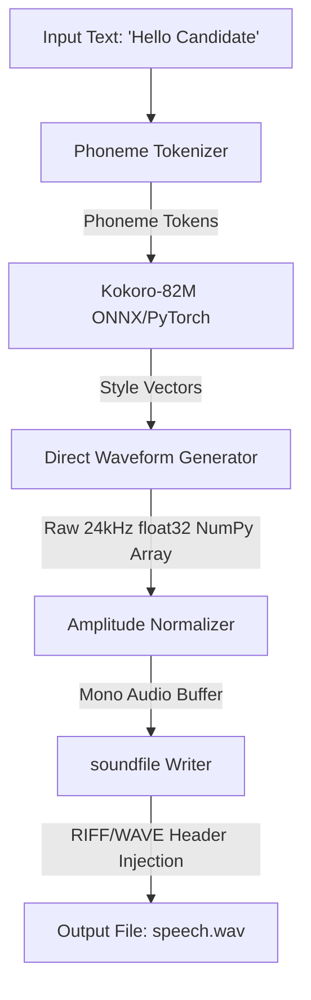

# Module 01: Local Speech Generation & Kokoro-82M

Welcome back, class. Today we analyze **Local Speech Generation & Kokoro-82M (CS-526)**.

To make an automated interviewer feel interactive, the system must speak. While cloud APIs (like ElevenLabs or AWS Polly) are easy to set up, they introduce severe downsides: dynamic follow-up questions require real-time requests, generating high token bills, and adding network latency that ruins the flow of conversation. To build a self-hosted platform, we must synthesize speech locally.

Today we study **Kokoro-82M**, a compact 82-million parameter text-to-speech model. We will analyze its architecture, learn to convert raw model float array outputs into valid `.wav` file containers using `soundfile`, and write a non-blocking async synthesis service.

---

## 1. Academic Lecture: Direct-to-Waveform Text-to-Speech

### 1. Traditional TTS vs. End-to-End Synthesis
Historically, text-to-speech pipelines were split into two heavy neural networks:
*   **A Acoustic Model**: Converts input text tokens into a visual-audio intermediate representation called a Mel-spectrogram (e.g. Tacotron2).
*   **A Vocoder**: Processes the Mel-spectrogram frame-by-frame to generate actual sound waves (e.g. WaveNet or WaveGlow).

This multi-stage execution was slow, hardware-demanding, and prone to compounding artifacts. Modern architectures like **Kokoro** bypass this. Kokoro maps text inputs directly to raw audio waveforms using optimized style-guide parameters, yielding high-speed inference in a tiny 82M memory footprint.

### 2. Audio Container Math: Sample Rates and Format Constraints
When a model finishes processing text, it returns the generated audio as a one-dimensional array of 32-bit floating-point numbers (`float32`), where each value represents the sound amplitude at that specific microsecond.
*   **Sample Rate**: Kokoro outputs audio at **24,000Hz (24kHz)**. This means it generates 24,000 amplitude values for every second of speech.
*   **WAV Container Structure**: To play this array on a standard device, we must convert the float array into a structured file format (WAV). The file must start with a **RIFF/WAVE header** defining the format type (PCM), the sample rate (24000), the channel count (1 for mono), and the bits per sample (16-bit signed integer or 32-bit float).



---

## 2. Theory vs. Production Trade-offs

When designing speech generation layers, balance performance against model complexity:

| Metric / Dimension | Hosted Voice APIs (e.g. ElevenLabs) | Local Heavyweight TTS (e.g. XTTS v2 / Bark) | Local Lightweight TTS (e.g. Kokoro-82M) |
| :--- | :--- | :--- | :--- |
| **Operational Cost** | High (Pay-per-character rates) | Zero (Self-hosted execution) | Zero (Self-hosted execution) |
| **Inference Latency** | Slow (Network trip + generation) | Slow (Heavy weights: 1.0s - 3.0s) | Fast (Light weights: 100ms - 300ms) |
| **System Memory (VRAM)**| Minimal (Internet connection) | High (Requires >= 4GB VRAM) | Minimal (Requires < 200MB VRAM) |
| **Voice Customization** | Excellent (Easy cloning UI) | Good (Dynamic cloning files) | Fair (Static voice vectors only) |
| **Deployability** | Easy (REST endpoints) | Hard (Complex cuda/C++ compiling)| Easy (Python wrappers / ONNX runtime) |

*   **Production Rule**: For low-latency dialogue and local execution constraints, run **Kokoro-82M**. Use GPU acceleration if available, but fallback to CPU execution without hesitation; its 82M parameter scale enables real-time generation speeds even on standard laptop CPUs.

---

## 3. How to Use: Thread-Safe Async Speech Synthesis

Let us write a compile-grade Python 3.11+ application that instantiates the Kokoro pipeline, executes synthesis safely inside thread executors to prevent blocking the event loop, and writes standard WAV containers.

### A. The Blocking Core Pattern (Anti-Pattern)

Avoid executing heavy mathematical model evaluations directly on the main event loop thread. Doing so will freeze your web endpoints, blocking concurrent candidate requests:

```python
# DANGER: Running TTS generation synchronously on the main thread
# halts the Python event loop. While this runs, no other requests
# (such as candidate transcripts or connection heartbeats) can process.
def blocking_synthesize(kokoro_pipeline, text: str, output_path: str):
    # Synchronously processes text, freezing the thread
    generator = kokoro_pipeline(text, voice="af_heart", speed=1.0)
    for _, _, audio in generator:
        # Save directly
        import soundfile as sf
        sf.write(output_path, audio, 24000)
```

### B. The Hardened Non-Blocking TTS Service (Production Pattern)

Here is the hardened pattern. We write an async manager service that isolates model execution using `asyncio.to_thread`, normalizes float waveforms, and applies header injections safely.

```python
import os
import asyncio
from typing import Optional, Tuple
import numpy as np
import soundfile as sf

class AsyncTtsGeneratorService:
    def __init__(self, model_dir: Optional[str] = None):
        self.sample_rate = 24000  # Enforce Kokoro standard
        self.default_voice = "af_heart"
        self._initialized = False

    def _initialize_model(self):
        """
        Private synchronous loading helper.
        """
        # Import internally to avoid top-level load bottlenecks
        from kokoro import KPipeline
        # Initialize KPipeline targeting English ('a')
        self.pipeline = KPipeline(lang_code="a")
        self._initialized = True

    async def initialize(self):
        """
        Async loader wrapping model instantiation.
        """
        if not self._initialized:
            # Load weights in separate thread to prevent loop blocking
            await asyncio.to_thread(self._initialize_model)

    def _generate_audio_sync(self, text: str, voice: str) -> np.ndarray:
        """
        Runs the actual neural network forward pass.
        """
        generator = self.pipeline(text, voice=voice, speed=1.0)
        audio_segments = []
        
        # Kokoro yields segments (graphemes, phonemes, float array)
        for _, _, audio in generator:
            if audio is not None and len(audio) > 0:
                audio_segments.append(audio)
                
        if not audio_segments:
            raise ValueError("TTS model generated an empty audio buffer.")
            
        # Concatenate segments into a single 1D waveform array
        combined_audio = np.concatenate(audio_segments)
        
        # Normalize amplitude to prevent digital clipping (scaling between -0.98 and 0.98)
        max_val = np.max(np.abs(combined_audio))
        if max_val > 0:
            combined_audio = (combined_audio / max_val) * 0.98
            
        return combined_audio

    async def generate_speech_wav(self, text: str, output_filepath: str, voice_name: Optional[str] = None) -> bool:
        """
        Asynchronously generates speech and saves a valid 24kHz mono WAV container.
        """
        await self.initialize()
        voice = voice_name or self.default_voice
        
        try:
            # Execute inference in worker thread pool
            audio_data = await asyncio.to_thread(self._generate_audio_sync, text, voice)
            
            # Write to disk inside executor thread
            def write_file():
                sf.write(
                    file=output_filepath,
                    data=audio_data,
                    samplerate=self.sample_rate,
                    subtype="PCM_16"  # Enforce standard 16-bit depth
                )
                
            await asyncio.to_thread(write_file)
            return True
            
        except Exception as e:
            # Handle runtime errors gracefully
            print(f"Speech synthesis execution failure: {str(e)}")
            return False
```

---

## 4. Common Errors & Pitfalls

### Pitfall 1: Event Loop Starvation
Attempting to run model loading or waveform concatenation on the main server thread.
*   **Why it fails**: NumPy concatenation and ONNX executions are CPU-bound operations. Running them synchronously blocks FastAPI's ASGI worker thread, causing incoming websocket connections to disconnect.
*   **Mitigation**: Always wrap ONNX execution and file writes in `asyncio.to_thread()` or `loop.run_in_executor()`.

### Pitfall 2: Silent Truncation on Character Limits
Passing large blocks of dialogue text (e.g. > 500 characters) to Kokoro in a single block.
*   **Why it fails**: Like LLMs, TTS models have strict token/phoneme context limits (typically 512 tokens). If your text exceeds this limit, the model will throw an exception or return abruptly truncated audio buffers.
*   **Mitigation**: Split long paragraphs into sentences using regex patterns (e.g. splitting at `.`, `?`, `!`) and compile the segments sequentially.

---

## 5. Socratic Review Questions

### Question 1
Why must we normalize the float32 array output of the model (scaling by max absolute value) before saving it as a PCM WAV file?

#### Answer
The model generates waveforms with arbitrary float ranges. If the output contains values outside the range of `[-1.0, 1.0]`, converting it directly to a 16-bit PCM integer WAV format will cause **digital clipping**. Clipping crops the sound wave peaks, generating harsh distortion artifacts during audio playback.

### Question 2
What is the purpose of the KPipeline `lang_code` configuration, and why does selection drift (e.g., using English weights for Spanish text) degrade synthesis quality?

#### Answer
The `lang_code` parameter controls the tokenizer that translates raw text words into phoneme symbols (e.g. mapping "school" to `/skul/`). If there is a mismatch (using English rules on Spanish sentences), the tokenizer will output incorrect phoneme patterns, causing the generator to speak with a heavy, garbled accent or fail to generate recognizable audio.

---

## 6. Hands-on Challenge: Text Splitter & WAV Synthesizer

### The Challenge
In this challenge, you will implement an input sentence splitter and wav compiler.
Your task:
1. Complete the `split_and_compile_audio` method inside `TtsSegmenter`.
2. Split input text into sentences based on punctuation boundaries (`.`, `!`, `?`).
3. For each sentence, call the `mock_synthesize` method to generate a NumPy array buffer.
4. Concatenate the segments with a 0.2-second silent pause between sentences.
5. Write the final array to the destination path using `soundfile.write`.

Complete the implementation below:

```python
import re
import numpy as np
import soundfile as sf
from typing import List

class TtsSegmenter:
    def __init__(self, sample_rate: int = 24000):
        self.sample_rate = sample_rate

    def mock_synthesize(self, text: str) -> np.ndarray:
        """
        Simulate TTS waveform generation.
        Returns a mock sine wave based on text length.
        """
        duration = len(text) * 0.05  # 0.05 seconds per char
        t = np.linspace(0, duration, int(self.sample_rate * duration), endpoint=False)
        return np.sin(2 * np.pi * 440 * t) * 0.5  # 440Hz tone

    def split_and_compile_audio(self, text: str, output_path: str):
        # TODO: Implement the segmentation pipeline:
        # 1. Use regex re.split(r'(?<=[.!?])\s+', text) to extract sentences.
        # 2. Loop through sentences, discarding empty entries.
        # 3. Call self.mock_synthesize(sentence) to generate audio segments.
        # 4. Generate a 0.2-second silent segment (np.zeros(int(self.sample_rate * 0.2))) to insert between sentences.
        # 5. Concatenate all segments (sentence waves and silent segments) into a single 1D numpy array.
        # 6. Save the array to output_path using sf.write(output_path, combined_array, self.sample_rate).
        
        pass
```

Write the segmentation and file compiling logic. Save the completed file and verify that segmented WAV outputs behave correctly under `modules/01-kokoro-tts-inference.md`.
