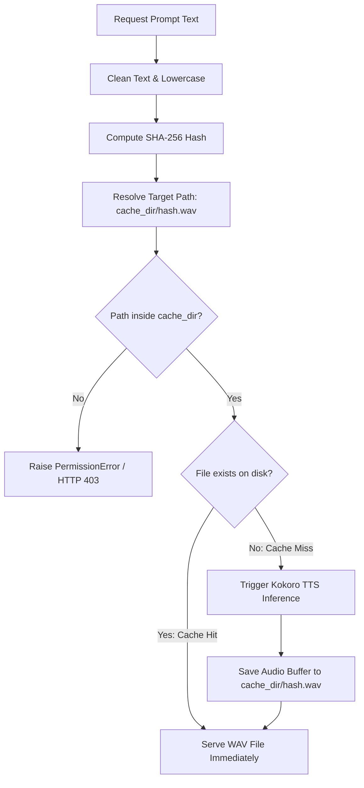

# Module 02: Dialogue Latency & Caching Strategy

Welcome back, class. Today we analyze **Dialogue Latency & Caching Strategy (CS-526)**.

In an interactive technical interview, response latency is the primary barrier to a natural conversation. If a candidate finishes speaking and has to wait 3 to 5 seconds for the ASR, LLM, and TTS pipelines to execute sequentially, the illusion of an active conversation is broken. A critical engineering optimization is recognizing that a large portion of the interview dialogue consists of static scripts.

Today we study **Content-Hashed Audio Caching**. We will analyze how to pre-generate audio for static questions, construct a local lookup directory indexed by SHA-256 hashes, and implement a defensive router that serves cached assets instantly while falling back to dynamic TTS on demand.

---

## 1. Academic Lecture: Static Dialogue vs. Dynamic Generation

### 1. The Anatomy of Interview Dialogue
An interview session contains two distinct categories of speech:
*   **Static Prompts**: Standard questions, instructions, and greetings. Examples:
    *   *Greeting*: `"Welcome to the technical evaluation. Please introduce yourself."`
    *   *Transition*: `"Let us proceed to the system design portion of the interview."`
    *   *Closing*: `"We have completed the interview. Thank you for your time."`
*   **Dynamic Prompts**: Customized follow-up questions generated by the LLM based on the candidate's answers. Example:
    *   *Follow-up*: `"You mentioned utilizing a thread pool. How would you monitor its queue length in production?"`

### 2. Hashing Index Strategy
To serve static audio without latency, we pre-generate files during project build or server deployment. 
*   **Cryptographic Indexing**: We normalize the prompt text (stripping surrounding spaces and converting to lowercase) and compute its **SHA-256 hash**. This hash serves as the primary key. The corresponding audio is saved to disk as `{sha256_hash}.wav`.
*   **Zero-Inference Serving**: When a script requests speech synthesis for a prompt, the application hashes the target text, performs an async directory check for `{hash}.wav`, and returns the file path immediately, bypassing neural model inference.

### 3. Path Traversal & Injection Risks
When exposing files to a client API using string identifiers, malicious clients might pass traversal characters (like `../../etc/passwd`). The serving system must validate that all file operations are securely confined within the designated cache directory boundary.



---

## 2. Theory vs. Production Trade-offs

When designing caching structures for voice assets, compare these operational models:

| Caching Model | Pros | Cons | Recommendation |
| :--- | :--- | :--- | :--- |
| **No Cache (Pure Dynamic)** | Minimal disk footprint; supports infinite dialogue variability. | High GPU/CPU resource load; latency penalty on every sentence. | Avoid for static pipelines. |
| **Static Pre-render Only** | Zero running inference costs; fast serving speeds. | Cannot handle dynamic follow-up questions or customization. | Use for structured, non-adaptive bots. |
| **Hybrid Cache-on-Demand** | Automatically caches repeating dynamic responses; low latency. | Disk space grows over time; requires cache eviction algorithms. | **Recommended for Production Environments**. |
| **Memory-Resident Cache (RAM)**| Fastest possible delivery speeds. | High RAM consumption; cache is lost on server restart. | Use for high-frequency short audio tokens (e.g. system UI sounds). |

---

## 3. How to Use: Secure Hashed Cache Router

Let us write a compile-grade Python 3.11+ application that implements a secure, content-hashed TTS cache router, preventing path traversal and routing inference requests.

### A. The Un-Sanitized File Serving Pattern (Anti-Pattern)

Avoid routing file access requests by using unvalidated strings or string concatenation. This allows malicious path directory traversal attacks:

```python
import os

# DANGER: Directly using client input to navigate paths allows attackers
# to read arbitrary files by passing '../../etc/passwd' or similar strings.
# Furthermore, it does not normalize text, leading to redundant model executions.
def serve_audio_unsafe(text_prompt: str, cache_directory: str) -> str:
    # No path validation, no hashing
    filename = f"{text_prompt}.wav"
    target_path = os.path.join(cache_directory, filename)
    if os.path.exists(target_path):
        return target_path
    return "Trigger TTS"
```

### B. The Hardened Hashed Cache Manager (Production Pattern)

Here is the hardened pattern. We write a cache manager class that normalizes prompt strings, generates cryptographic SHA-256 keys, verifies path constraints, and coordinates pipeline routing.

```python
import os
import hashlib
from pathlib import Path
from typing import Tuple, Dict, Any, Optional

class HashedTtsCacheManager:
    def __init__(self, cache_dir: str):
        # Enforce absolute path resolution for boundary checks
        self.cache_path = Path(cache_dir).resolve()
        self.cache_path.mkdir(parents=True, exist_ok=True)

    def normalize_prompt(self, text: str) -> str:
        """
        Normalize input text to maximize cache hits.
        Strips surrounding spaces, removes duplicate linebreaks, and lowercases.
        """
        text = re.sub(r'\s+', ' ', text)  # Collapse whitespace
        return text.strip().lower()

    def generate_cache_key(self, normalized_text: str) -> str:
        """
        Generates a deterministic SHA-256 content key.
        """
        return hashlib.sha256(normalized_text.encode("utf-8")).hexdigest()

    def resolve_safe_path(self, cache_key: str) -> Path:
        """
        Converts the cache key into a path, verifying that it resides inside the directory boundary.
        """
        target_file = (self.cache_path / f"{cache_key}.wav").resolve()
        
        # Security Guard: Path Traversal Mitigations
        if not target_file.is_relative_to(self.cache_path):
            raise PermissionError(
                f"Path Traversal Attempt Detected: Target file path {target_file} falls outside "
                f"the cache directory boundary {self.cache_path}"
            )
        return target_file

    async def check_cache(self, text_prompt: str) -> Tuple[bool, str, Path]:
        """
        Verifies if a pre-generated audio file exists on disk.
        Returns: (is_cache_hit, cache_key, resolved_safe_path)
        """
        # Normalize input
        clean_text = self.normalize_prompt(text_prompt)
        
        # Generate hash signature
        key = self.generate_cache_key(clean_text)
        
        # Securely resolve path
        safe_path = self.resolve_safe_path(key)
        
        # Check existence
        # Non-blocking disk checks using run_in_executor
        def exists_check() -> bool:
            return safe_path.exists() and safe_path.is_file()
            
        loop = asyncio.get_running_loop()
        hit = await loop.run_in_executor(None, exists_check)
        
        return hit, key, safe_path
```

Now let us write the high-level router service that integrates with the TTS compiler:

```python
class CacheTtsRouter:
    def __init__(self, cache_manager: HashedTtsCacheManager, tts_compiler: Any):
        self.cache = cache_manager
        self.tts = tts_compiler

    async def get_audio_path_for_prompt(self, text_prompt: str) -> str:
        """
        Orchestrator pipeline: returns cached asset path immediately, or triggers synthesis on miss.
        """
        hit, key, file_path = await self.cache.check_cache(text_prompt)
        
        if hit:
            # CACHE HIT: Return immediately, zero latency
            return str(file_path)
            
        # CACHE MISS: Trigger synthesis pipeline
        success = await self.tts.generate_speech_wav(text_prompt, str(file_path))
        if not success:
            raise RuntimeError("Text-to-speech synthesis failed to generate waveform.")
            
        return str(file_path)
```

---

## 4. Common Errors & Pitfalls

### Pitfall 1: Space & Punctuation Mismatches
Failing to strip whitespaces or punctuation characters in prompts (e.g. `"Hello class"` and `"Hello class  "` returning different SHA-256 hashes).
*   **Why it fails**: The system misses the cache due to whitespace variance, triggering redundant CPU/GPU model compilations, which degrades latency.
*   **Mitigation**: Always execute a strict string normalizer (collapsing multiple spaces and stripping end punctuation markers) before computing the SHA-256 digest.

### Pitfall 2: Disk Space Exhaustion
Saving dynamic audio files continuously without managing directory size.
*   **Why it fails**: Over time, thousands of dynamic candidate follow-up speech recordings fill the server disk storage, leading to writes blocking or service downtime.
*   **Mitigation**: Implement a Least Recently Used (LRU) cache evictor script that monitors the folder size and deletes oldest audio files when storage thresholds (e.g. 5GB limit) are hit.

---

## 5. Socratic Review Questions

### Question 1
Why are cryptographic hashes (like SHA-256) preferred over raw sentence string snippets as filenames for storing voice cache files?

#### Answer
Filenames have character limits and cannot contain special characters (like `/`, `\`, `:`, or `*`) depending on the host operating system. Using the raw sentence string as a filename leads to file system errors. A SHA-256 hash produces a standardized, fixed-length (64-character) alphanumeric string that is valid across all file systems.

### Question 2
Under what scenarios would a hybrid cache-on-demand approach fail, and how can we mitigate those risks?

#### Answer
If candidates speak highly dynamic sentences that are rarely repeated, the hit rate will approach zero. Under this scenario, the caching system only adds parsing overhead. We mitigate this by categorizing prompts: we flag static prompts explicitly in the system state machine, and only route static states to check cache lookups, routing dynamic scripts directly to inference.

---

## 6. Hands-on Challenge: Cryptographic Cache Router with Eviction

### The Challenge
In this challenge, you will implement a cached audio router with a simple directory size limit check.
Your task:
1. Complete the `get_cached_audio` method inside `TtsCacheRegistry`.
2. Compute the SHA-256 hash of the prompt text.
3. Check if the file exists under `self.folder/hash.wav`.
4. If it exists, return the path.
5. If missing, simulate synthesis by writing a dummy file, and check if the total folder size exceeds `self.max_size_bytes`. If exceeded, delete the oldest file.

Complete the implementation below:

```python
import os
import hashlib
from pathlib import Path
from typing import Optional

class TtsCacheRegistry:
    def __init__(self, folder_path: str, max_size_bytes: int = 1000):
        self.folder = Path(folder_path).resolve()
        self.folder.mkdir(parents=True, exist_ok=True)
        self.max_size_bytes = max_size_bytes

    def get_cached_audio(self, prompt: str) -> str:
        # TODO: Implement the cached routing and eviction loop:
        # 1. Normalize the prompt (lowercase, strip whitespace).
        # 2. Generate the SHA-256 hash key.
        # 3. Resolve target file path securely (e.g., self.folder / f"{key}.wav").
        # 4. If target file exists, return the string file path.
        # 5. If missing, write dummy bytes (e.g., b"RIFF-WAVE-MOCK") to the path.
        # 6. Check total folder size by sum of stat().st_size for all files.
        # 7. If total size > self.max_size_bytes:
        #    - Find the file in the folder with the oldest modification time (stat().st_mtime).
        #    - Delete it (excluding the newly created file if possible).
        # 8. Return the string file path.
        
        return ""
```

Write the caching, path validation, and eviction logic. Save the completed file and verify that caching operations run correctly under `modules/02-audio-caching-strategy.md`.
