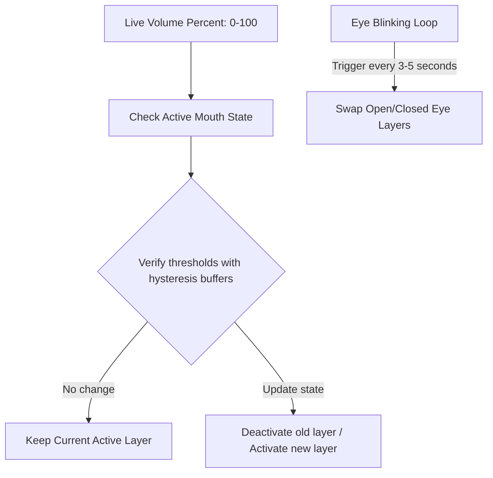

# Module 04: Visual Mouth State Mapping & Hysteresis

Welcome back, class. Today we analyze **Visual Mouth State Mapping & Hysteresis (CS-526)**.

Once you have calculated the Root-Mean-Square (RMS) volume of the playing audio, the next challenge is translating this numeric value (a float between `0.0` and `1.0` or a percentage `0` to `100`) into visual updates. In professional 2D character animation, we split the mouth into discrete shapes (visemes). If we update the visual layers instantly on every numeric swing, the mouth will flicker rapidly, creating a distracting, artificial appearance.

Today we study **Threshold Mapping** and **Hysteresis**. We will analyze how to translate volume ranges into 2D mouth assets, implement hysteresis boundaries to block jitter, and write a CSS-bound layer renderer.

---

## 1. Academic Lecture: Viseme Categorization and Hysteresis

### 1. 2D Layer-Swapping Mechanics
In a 2D SVG/vector character model, the face is composed of overlapping layers: body, eyes, head outline, and mouth. To animate the mouth, we define a set of target mouth shapes:
*   **Closed**: Silence (no sound).
*   **Small**: Low-volume speech (consonants like *m, p, b, f*).
*   **Medium**: Mid-volume speech (vowels like *e, i, o*).
*   **Open**: High-volume speech (vowels like *a, u*, and accented syllables).

We control visibility by toggling a CSS class (e.g. `.visible { display: block; }` and `.hidden { display: none; }`).

### 2. Jitter and the Need for Hysteresis
If we define rigid volume threshold boundaries (e.g., Small is `5-20` and Medium is `20-50`), what happens if the audio volume hovers right at `20.1` and `19.9` on consecutive frame samples? The mouth layer will rapidly switch back and forth between Small and Medium every 16 milliseconds (at 60 FPS). This visual artifact is called **jitter**.
To prevent this, we introduce **hysteresis**:
*   **Hysteresis Principle**: The threshold for entering a state is different from the threshold for leaving it.
*   **Implementation**: If the mouth is currently in `Small`, the volume must exceed `23` (an upward buffer) to trigger a transition to `Medium`. Conversely, if the mouth is currently in `Medium`, the volume must drop below `17` (a downward buffer) to transition back to `Small`.

```text
    Volume Rising:
    [Closed] ──(5)──> [Small] ──(23)──> [Medium] ──(63)──> [Open]

    Volume Falling:
    [Closed] <──(3)── [Small] <──(17)── [Medium] <──(57)── [Open]
```

### 3. Secondary Actions (Blinking)
A character that only moves its mouth looks unnatural. To make the avatar feel alive, we implement independent secondary actions, such as a random blinking cycle that periodically swaps the `eyes_open` and `eyes_closed` SVG layers.



---

## 2. Theory vs. Production Trade-offs

When choosing an animation strategy for browser-based avatars, consider these trade-offs:

| Animation Strategy | Pros | Cons | Recommendation |
| :--- | :--- | :--- | :--- |
| **SVG Path Morphing** | Extremely smooth transition between mouth shapes. | High computational complexity; requires matching path vertex counts. | Use for high-budget interactive sites. |
| **Layer Toggling (Display)** | High performance; simple asset construction. | Sharp transitions between shapes. | **Recommended for standard Web MVPs**. |
| **Canvas Redrawing** | Allows complex sprite animations. | Bypasses CSS class structures; harder to style dynamically. | Use for retro-game style avatars. |
| **3D WebGL (Three.js)** | Highly realistic; supports camera tracking. | Massive bundle sizes; requires significant processing power. | Avoid unless 3D models are explicitly requested. |

---

## 3. How to Use: Jitter-Free Avatar Renderer

Let us write a compile-grade HTML5, CSS, and JavaScript implementation of a layered SVG avatar that integrates volume threshold checks with hysteresis.

### A. The Jitter-Prone Update Pattern (Anti-Pattern)

Avoid mapping states with rigid, un-buffered comparison operations:

```javascript
// DANGER: Direct comparison causes visual jitter.
// If volume alternates between 19 and 21, the mouth alternates
// between closed and open on every frame, looking chaotic.
function updateMouthNaive(volume) {
    const closedEl = document.getElementById("mouth-closed");
    const openEl = document.getElementById("mouth-open");
    
    if (volume > 20) {
        closedEl.style.display = "none";
        openEl.style.display = "block";
    } else {
        closedEl.style.display = "block";
        openEl.style.display = "none";
    }
}
```

### B. The Hardened Hysteresis Controller (Production Pattern)

Here is the hardened pattern. We write an SVG-bound controller class that implements threshold mapping with upward and downward hysteresis guards, alongside an independent eye blinking loop.

```html
<!DOCTYPE html>
<html lang="en">
<head>
    <meta charset="UTF-8">
    <title>Jitter-Free 2D Avatar</title>
    <style>
        .avatar-container {
            width: 300px;
            height: 300px;
            position: relative;
            background: #121214;
            border-radius: 12px;
            overflow: hidden;
        }
        /* Absolute layering */
        .avatar-layer {
            position: absolute;
            top: 0;
            left: 0;
            width: 100%;
            height: 100%;
        }
        .hidden {
            display: none !important;
        }
    </style>
</head>
<body>
    <div class="avatar-container">
        <!-- Base Body Layer -->
        <svg class="avatar-layer" viewBox="0 0 100 100">
            <circle cx="50" cy="50" r="40" fill="#2c3e50"/>
        </svg>
        
        <!-- Eyes Layers -->
        <svg id="eyes-open" class="avatar-layer" viewBox="0 0 100 100">
            <circle cx="40" cy="45" r="3" fill="#ffffff"/>
            <circle cx="60" cy="45" r="3" fill="#ffffff"/>
        </svg>
        <svg id="eyes-closed" class="avatar-layer hidden" viewBox="0 0 100 100">
            <line x1="37" y1="45" x2="43" y2="45" stroke="#ffffff" stroke-width="2"/>
            <line x1="57" y1="45" x2="63" y2="45" stroke="#ffffff" stroke-width="2"/>
        </svg>

        <!-- Mouth Layers -->
        <svg id="mouth-closed" class="avatar-layer" viewBox="0 0 100 100">
            <line x1="45" y1="65" x2="55" y2="65" stroke="#ffffff" stroke-width="2"/>
        </svg>
        <svg id="mouth-small" class="avatar-layer hidden" viewBox="0 0 100 100">
            <ellipse cx="50" cy="65" rx="5" ry="2" fill="#e74c3c"/>
        </svg>
        <svg id="mouth-medium" class="avatar-layer hidden" viewBox="0 0 100 100">
            <ellipse cx="50" cy="65" rx="7" ry="5" fill="#e74c3c"/>
        </svg>
        <svg id="mouth-open" class="avatar-layer hidden" viewBox="0 0 100 100">
            <circle cx="50" cy="65" r="8" fill="#e74c3c"/>
        </svg>
    </div>

    <script>
        class AvatarVisualController {
            constructor() {
                // DOM bindings
                this.mouths = {
                    CLOSED: document.getElementById("mouth-closed"),
                    SMALL: document.getElementById("mouth-small"),
                    MEDIUM: document.getElementById("mouth-medium"),
                    OPEN: document.getElementById("mouth-open")
                };
                
                this.eyes = {
                    OPEN: document.getElementById("eyes-open"),
                    CLOSED: document.getElementById("eyes-closed")
                };

                this.currentState = "CLOSED";
                this.hysteresisThresholds = {
                    // Format: [EnteringThreshold, LeavingThreshold]
                    CLOSED: [0, 0],
                    SMALL: [5, 3],     // Must exceed 5 to enter, drop below 3 to leave
                    MEDIUM: [25, 20],   // Must exceed 25 to enter, drop below 20 to leave
                    OPEN: [60, 52]      // Must exceed 60 to enter, drop below 52 to leave
                };

                this.initializeBlinkingLoop();
            }

            evaluateState(volume) {
                // Determine target state based on current state and thresholds
                let targetState = this.currentState;

                if (this.currentState === "CLOSED") {
                    if (volume >= this.hysteresisThresholds.OPEN[0]) targetState = "OPEN";
                    else if (volume >= this.hysteresisThresholds.MEDIUM[0]) targetState = "MEDIUM";
                    else if (volume >= this.hysteresisThresholds.SMALL[0]) targetState = "SMALL";
                } 
                else if (this.currentState === "SMALL") {
                    if (volume >= this.hysteresisThresholds.OPEN[0]) targetState = "OPEN";
                    else if (volume >= this.hysteresisThresholds.MEDIUM[0]) targetState = "MEDIUM";
                    else if (volume < this.hysteresisThresholds.SMALL[1]) targetState = "CLOSED";
                } 
                else if (this.currentState === "MEDIUM") {
                    if (volume >= this.hysteresisThresholds.OPEN[0]) targetState = "OPEN";
                    else if (volume < this.hysteresisThresholds.MEDIUM[1]) {
                        if (volume < this.hysteresisThresholds.SMALL[1]) targetState = "CLOSED";
                        else targetState = "SMALL";
                    }
                } 
                else if (this.currentState === "OPEN") {
                    if (volume < this.hysteresisThresholds.OPEN[1]) {
                        if (volume < this.hysteresisThresholds.MEDIUM[1]) {
                            if (volume < this.hysteresisThresholds.SMALL[1]) targetState = "CLOSED";
                            else targetState = "SMALL";
                        } else {
                            targetState = "MEDIUM";
                        }
                    }
                }

                if (targetState !== this.currentState) {
                    this.updateMouthLayers(targetState);
                }
            }

            updateMouthLayers(newState) {
                // Toggle visibility
                this.mouths[this.currentState].classList.add("hidden");
                this.mouths[newState].classList.remove("hidden");
                this.currentState = newState;
            }

            initializeBlinkingLoop() {
                const triggerBlink = () => {
                    // Swap eyes
                    this.eyes.OPEN.classList.add("hidden");
                    this.eyes.CLOSED.classList.remove("hidden");
                    
                    setTimeout(() => {
                        // Restore eyes after 150ms
                        this.eyes.CLOSED.classList.add("hidden");
                        this.eyes.OPEN.classList.remove("hidden");
                        
                        // Schedule next blink at random interval (3-6 seconds)
                        const nextInterval = 3000 + Math.random() * 3000;
                        setTimeout(triggerBlink, nextInterval);
                    }, 150);
                };
                
                // Start first blink
                setTimeout(triggerBlink, 3000);
            }
        }

        // Initialize visual controller
        const avatar = new AvatarVisualController();
        
        // Simulating volume inputs (e.g. mock audio analysis tick)
        // avatar.evaluateState(45); // Transitions to MEDIUM
    </script>
</body>
</html>
```

---

## 4. Common Errors & Pitfalls

### Pitfall 1: Visual State Locking
Getting stuck in a high-volume state (like `OPEN`) because the downward leaving threshold is too low or equal to zero.
*   **Why it fails**: When audio stops, the volume drops to zero. If the leaving thresholds are incorrectly computed, the system misses the state change path, and the avatar remains with its mouth wide open, looking unnatural.
*   **Mitigation**: Always ensure leaving thresholds are greater than zero (except for transitioning to `CLOSED` which handles absolute silence).

### Pitfall 2: High DOM Manipulation Overhead
Updating element styles directly on every single raw audio sample (e.g., thousands of times per second).
*   **Why it fails**: Modifying layout attributes (like `display` or `opacity`) at high frequencies causes browser reflow operations, consuming CPU cycles and dropping page rendering performance.
*   **Mitigation**: Only touch the DOM when the logical state switches (e.g., `targetState !== currentState`).

---

## 5. Socratic Review Questions

### Question 1
How does the addition of a hysteresis buffer (e.g. setting an entry threshold of `25` and exit threshold of `20`) mitigate visual rendering jitter?

#### Answer
If the signal hovers around the threshold values (e.g. oscillating between `24` and `21`), the mouth is locked in its current state. The signal must rise above `25` to transition upward, or drop below `20` to transition downward. This creates a safety zone (dead-band) that prevents rapid oscillation between states.

### Question 2
Why is it important to run the blinking loops using `setTimeout` triggers nested inside callbacks rather than using a fixed `setInterval` timer?

#### Answer
A fixed `setInterval` causes the character to blink at predictable, rhythmic intervals (e.g., exactly every 4 seconds). Human blinking is irregular. Nesting dynamic timeouts with randomized wait times (e.g. `3000 + Math.random() * 3000`) creates a natural, human-like appearance.

---

## 6. Hands-on Challenge: Viseme Switcher with Jitter Guards

### The Challenge
In this challenge, you will implement a state mapping controller in JavaScript.
Your task:
1. Complete the `computeMouthState` method inside `MouthStateEvaluator`.
2. Apply the upward and downward thresholds defined in `this.rules`.
3. Account for the current state to enforce hysteresis.
4. Return the new target state string.

Complete the implementation below:

```javascript
class MouthStateEvaluator {
    constructor() {
        this.currentState = "CLOSED";
        // Threshold rules: [upward_threshold, downward_threshold]
        this.rules = {
            CLOSED: [0, 0],
            SMALL: [10, 8],
            MEDIUM: [30, 26],
            OPEN: [70, 64]
        };
    }

    /**
     * Evaluates volume to determine state, enforcing hysteresis.
     * @param {number} volume - Current volume level (0-100).
     * @returns {string} - The target mouth state name ("CLOSED", "SMALL", "MEDIUM", "OPEN").
     */
    computeMouthState(volume) {
        let nextState = this.currentState;

        // TODO: Implement the state mapping logic:
        // 1. If currentState is CLOSED:
        //    - Transition to OPEN if volume >= rules.OPEN[0]
        //    - Otherwise transition to MEDIUM if volume >= rules.MEDIUM[0]
        //    - Otherwise transition to SMALL if volume >= rules.SMALL[0]
        // 2. If currentState is SMALL:
        //    - Transition to OPEN if volume >= rules.OPEN[0]
        //    - Otherwise transition to MEDIUM if volume >= rules.MEDIUM[0]
        //    - Transition back to CLOSED if volume < rules.SMALL[1]
        // 3. If currentState is MEDIUM:
        //    - Transition to OPEN if volume >= rules.OPEN[0]
        //    - Transition down to SMALL if volume < rules.MEDIUM[1]
        //    - Transition down to CLOSED if volume < rules.SMALL[1]
        // 4. If currentState is OPEN:
        //    - Transition down to MEDIUM if volume < rules.OPEN[1]
        //    - Transition down to SMALL if volume < rules.MEDIUM[1]
        //    - Transition down to CLOSED if volume < rules.SMALL[1]
        // 5. Update self.currentState to nextState and return it.

        return nextState;
    }
}

// Verification checks
const evaluator = new MouthStateEvaluator();
console.assert(evaluator.computeMouthState(15) === "SMALL", "Should enter SMALL at 15");
console.assert(evaluator.computeMouthState(9) === "SMALL", "Should stay SMALL at 9 due to hysteresis (down limit is 8)");
console.assert(evaluator.computeMouthState(7) === "CLOSED", "Should drop to CLOSED at 7");
```

Write the state mapping logic. Save the completed file and verify that the hysteresis checks behave correctly under `modules/04-avatar-mouth-sync.md`.
