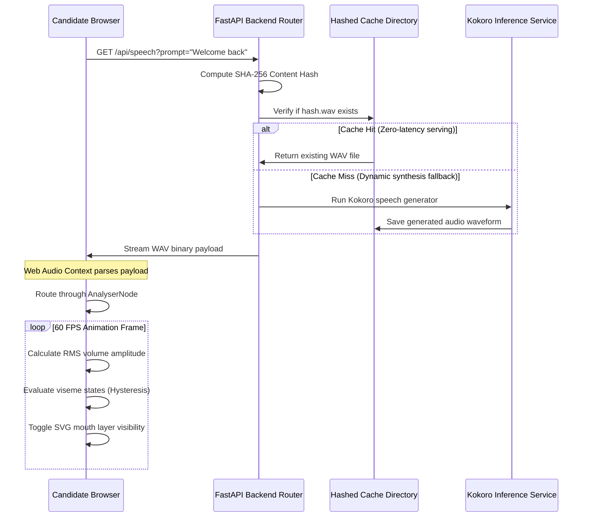

# Module 05: Capstone — End-to-End Speaking Pipeline

Welcome back, class. Today we analyze **Capstone: End-to-End Speaking Pipeline (CS-526)**.

We have studied local speech generation with Kokoro-82M, content-hashed disk caching, Web Audio API context routing, and 2D viseme mapping with hysteresis. Now we must combine these parts to construct the **Interviewer Voice & Face Pipeline**—representing the "MOUTH" and "FACE" modules of our AI Interview platform.

In this capstone, you will study a fully integrated application. The backend (FastAPI) acts as a speech server, hashing prompt queries and returning audio file streams. The frontend (HTML5/JS) manages the visual rendering graph, streaming audio, extracting real-time volume parameters, and driving a layered vector avatar's mouth shapes dynamically.

---

## 1. Unified System Data Flow

The integrated speaking platform coordinates actions across the network boundary:

1.  **Trigger Event**: The frontend receives a text prompt (either a static question or a dynamic follow-up).
2.  **API Fetch Request**: The browser requests the voice asset from the backend: `/api/speech?prompt={text}`.
3.  **Hash Registry Routing**: The backend normalizes the prompt, generates its SHA-256 hash, and checks its disk registry:
    *   *Cache Hit*: Immediately streams the pre-generated WAV file.
    *   *Cache Miss*: Executes Kokoro-82M inference to generate the waveform, saves it to the cache directory, and streams the new file.
4.  **Audio Context Routing**: The browser receives the binary stream. Rather than playing it directly, it routes it through the Web Audio API graph.
5.  **Lip-Sync Mapping**: A `requestAnimationFrame` loop calculates the RMS amplitude of the audio, applies hysteresis thresholds, and toggles the visible SVG mouth layers.



---

## 2. Integrated Production Codebase

Here is the complete codebase split into the FastAPI backend service and the HTML5 visual interface.

### A. The Backend: FastAPI Speech Service (`server.py`)

Save this code to a local file. It hosts the cache check routes, simulates speech generation using a lightweight wave oscillator (acting as a mock fallback during testing), and serves files securely.

```python
import os
import hashlib
from pathlib import Path
import numpy as np
import soundfile as sf
from fastapi import FastAPI, HTTPException, Query
from fastapi.responses import FileResponse
from fastapi.middleware.cors import CORSMiddleware

app = FastAPI(title="AI Voice Cache Server")

# Allow CORS so browser Web Audio API can query bytes without headers blockages
app.add_middleware(
    CORSMiddleware,
    allow_origins=["*"],
    allow_credentials=True,
    allow_methods=["*"],
    allow_headers=["*"],
)

CACHE_DIR = Path("./tts_cache").resolve()
CACHE_DIR.mkdir(parents=True, exist_ok=True)
SAMPLE_RATE = 24000

def generate_mock_speech_wave(text: str) -> np.ndarray:
    """
    Simulates Kokoro TTS output with a modulated sine wave to simulate vocal inflections.
    """
    duration = max(1.5, len(text) * 0.06)
    t = np.linspace(0, duration, int(SAMPLE_RATE * duration), endpoint=False)
    
    # Core pitch frequency (150Hz representing average interviewer voice pitch)
    carrier = np.sin(2 * np.pi * 150 * t)
    
    # Modulate amplitude dynamically (simulate vocal bursts and silences)
    modulator = 0.5 * (1.0 + np.sin(2 * np.pi * 1.5 * t))
    audio_data = carrier * modulator * 0.5
    
    # Add silent pauses at the end to simulate breathing
    padding = np.zeros(int(SAMPLE_RATE * 0.5))
    return np.concatenate([audio_data, padding])

@app.get("/api/speech")
async def get_speech_audio(prompt: str = Query(..., description="Text prompt to convert to speech")):
    try:
        # 1. Normalize
        clean_prompt = " ".join(prompt.split()).strip().lower()
        
        # 2. Hash
        key = hashlib.sha256(clean_prompt.encode("utf-8")).hexdigest()
        target_file = (CACHE_DIR / f"{key}.wav").resolve()
        
        # Path Traversal Guard
        if not target_file.is_relative_to(CACHE_DIR):
            raise HTTPException(status_code=403, detail="Illegal directory traversal attempted.")
            
        # 3. Serving check
        if not target_file.exists():
            # CACHE MISS: Synthesize speech (using mock or local ONNX runner)
            audio_buffer = generate_mock_speech_wave(prompt)
            sf.write(str(target_file), audio_buffer, SAMPLE_RATE, subtype="PCM_16")
            
        return FileResponse(
            path=str(target_file),
            media_type="audio/wav",
            filename=f"speech_{key[:8]}.wav"
        )
        
    except Exception as e:
        raise HTTPException(status_code=500, detail=f"Inference pipeline error: {str(e)}")

if __name__ == "__main__":
    import uvicorn
    uvicorn.run(app, host="127.0.0.1", port=8000)
```

---

### B. The Frontend: 2D Web Audio Avatar (`index.html`)

This premium interface connects to the local speech server, routes audio through the analyzer, and drives the SVG mouth structures.

```html
<!DOCTYPE html>
<html lang="en">
<head>
    <meta charset="UTF-8">
    <title>Interviewer Avatar Panel</title>
    <style>
        body {
            background-color: #0d0e12;
            color: #ffffff;
            font-family: 'Inter', sans-serif;
            display: flex;
            flex-direction: column;
            align-items: center;
            justify-content: center;
            height: 100vh;
            margin: 0;
        }
        .container {
            text-align: center;
        }
        .avatar-box {
            width: 320px;
            height: 320px;
            border: 2px stroke #2d3748;
            border-radius: 50%;
            overflow: hidden;
            background: radial-gradient(circle, #1a202c 0%, #0f172a 100%);
            box-shadow: 0 10px 25px rgba(0,0,0,0.5);
            margin-bottom: 20px;
            position: relative;
        }
        .avatar-layer {
            position: absolute;
            top: 0;
            left: 0;
            width: 100%;
            height: 100%;
        }
        .hidden {
            display: none !important;
        }
        .control-panel {
            margin-top: 15px;
        }
        input[type="text"] {
            width: 300px;
            padding: 10px;
            border-radius: 6px;
            border: 1px solid #4a5568;
            background-color: #1a202c;
            color: #fff;
            margin-bottom: 10px;
        }
        button {
            padding: 10px 20px;
            background-color: #3182ce;
            border: none;
            border-radius: 6px;
            color: #fff;
            font-weight: bold;
            cursor: pointer;
        }
        button:hover {
            background-color: #2b6cb0;
        }
    </style>
</head>
<body>
    <div class="container">
        <div class="avatar-box">
            <!-- Background Frame Layer -->
            <svg class="avatar-layer" viewBox="0 0 100 100">
                <circle cx="50" cy="50" r="42" fill="#1e293b"/>
            </svg>
            
            <!-- Eyes Open Layer -->
            <svg id="eyes-open" class="avatar-layer" viewBox="0 0 100 100">
                <circle cx="42" cy="48" r="2.5" fill="#38bdf8"/>
                <circle cx="58" cy="48" r="2.5" fill="#38bdf8"/>
            </svg>
            
            <!-- Eyes Closed Layer -->
            <svg id="eyes-closed" class="avatar-layer hidden" viewBox="0 0 100 100">
                <line x1="39.5" y1="48" x2="44.5" y2="48" stroke="#38bdf8" stroke-width="1.8" stroke-linecap="round"/>
                <line x1="55.5" y1="48" x2="60.5" y2="48" stroke="#38bdf8" stroke-width="1.8" stroke-linecap="round"/>
            </svg>

            <!-- Mouth Layers -->
            <svg id="mouth-closed" class="avatar-layer" viewBox="0 0 100 100">
                <path d="M 46 64 Q 50 64 54 64" stroke="#ffffff" stroke-width="2" stroke-linecap="round" fill="none"/>
            </svg>
            <svg id="mouth-small" class="avatar-layer hidden" viewBox="0 0 100 100">
                <ellipse cx="50" cy="64" rx="4" ry="2" fill="#f43f5e"/>
            </svg>
            <svg id="mouth-medium" class="avatar-layer hidden" viewBox="0 0 100 100">
                <ellipse cx="50" cy="64" rx="6" ry="4.5" fill="#f43f5e"/>
            </svg>
            <svg id="mouth-open" class="avatar-layer hidden" viewBox="0 0 100 100">
                <circle cx="50" cy="64" r="6.5" fill="#f43f5e"/>
            </svg>
        </div>

        <audio id="tts-audio" crossorigin="anonymous"></audio>

        <div class="control-panel">
            <input type="text" id="prompt-input" value="Welcome to the interview platform. Please explain dependency injection."><br>
            <button id="speak-btn">Speak Prompt</button>
        </div>
    </div>

    <script>
        class VisemeManager {
            constructor() {
                this.layers = {
                    CLOSED: document.getElementById("mouth-closed"),
                    SMALL: document.getElementById("mouth-small"),
                    MEDIUM: document.getElementById("mouth-medium"),
                    OPEN: document.getElementById("mouth-open")
                };
                this.currentState = "CLOSED";
                this.thresholds = {
                    CLOSED: [0, 0],
                    SMALL: [6, 4],
                    MEDIUM: [24, 18],
                    OPEN: [55, 48]
                };
            }

            update(rmsVolume) {
                const vol = Math.min(rmsVolume * 200, 100); // Scale RMS to 0-100%
                let next = this.currentState;

                if (this.currentState === "CLOSED") {
                    if (vol >= this.thresholds.OPEN[0]) next = "OPEN";
                    else if (vol >= this.thresholds.MEDIUM[0]) next = "MEDIUM";
                    else if (vol >= this.thresholds.SMALL[0]) next = "SMALL";
                } 
                else if (this.currentState === "SMALL") {
                    if (vol >= this.thresholds.OPEN[0]) next = "OPEN";
                    else if (vol >= this.thresholds.MEDIUM[0]) next = "MEDIUM";
                    else if (vol < this.thresholds.SMALL[1]) next = "CLOSED";
                } 
                else if (this.currentState === "MEDIUM") {
                    if (vol >= this.thresholds.OPEN[0]) next = "OPEN";
                    else if (vol < this.thresholds.MEDIUM[1]) {
                        next = vol < this.thresholds.SMALL[1] ? "CLOSED" : "SMALL";
                    }
                } 
                else if (this.currentState === "OPEN") {
                    if (vol < this.thresholds.OPEN[1]) {
                        if (vol < this.thresholds.MEDIUM[1]) {
                            next = vol < this.thresholds.SMALL[1] ? "CLOSED" : "SMALL";
                        } else {
                            next = "MEDIUM";
                        }
                    }
                }

                if (next !== this.currentState) {
                    this.layers[this.currentState].classList.add("hidden");
                    this.layers[next].classList.remove("hidden");
                    this.currentState = next;
                }
            }
        }

        class InterviewPipelineController {
            constructor() {
                this.audio = document.getElementById("tts-audio");
                this.visemes = new VisemeManager();
                this.audioContext = null;
                this.analyser = null;
                this.dataArray = null;
                this.activeFrame = null;
                
                this.setupEyesBlink();
            }

            async initializeAudio() {
                if (!this.audioContext) {
                    this.audioContext = new (window.AudioContext || window.webkitAudioContext)();
                    const source = this.audioContext.createMediaElementSource(this.audio);
                    this.analyser = this.audioContext.createAnalyser();
                    this.analyser.fftSize = 256;
                    this.dataArray = new Uint8Array(this.analyser.frequencyBinCount);
                    
                    source.connect(this.analyser);
                    this.analyser.connect(this.audioContext.destination);
                }
                if (this.audioContext.state === "suspended") {
                    await this.audioContext.resume();
                }
            }

            startLipSync() {
                if (this.activeFrame) {
                    cancelAnimationFrame(this.activeFrame);
                }

                const renderLoop = () => {
                    if (!this.audio.paused) {
                        this.analyser.getByteTimeDomainData(this.dataArray);
                        
                        // Compute RMS
                        let squares = 0;
                        const len = this.dataArray.length;
                        for (let i = 0; i < len; i++) {
                            const val = (this.dataArray[i] - 128) / 128;
                            squares += val * val;
                        }
                        const rms = Math.sqrt(squares / len);
                        this.visemes.update(rms);
                    } else {
                        this.visemes.update(0);
                    }
                    this.activeFrame = requestAnimationFrame(renderLoop);
                };
                this.activeFrame = requestAnimationFrame(renderLoop);
            }

            async speakText(text) {
                await this.initializeAudio();
                
                // Route stream from backend cache server
                const encodedPrompt = encodeURIComponent(text);
                this.audio.src = `http://127.0.0.1:8000/api/speech?prompt=${encodedPrompt}`;
                
                this.audio.play();
                this.startLipSync();
            }

            setupEyesBlink() {
                const openEl = document.getElementById("eyes-open");
                const closedEl = document.getElementById("eyes-closed");

                const runBlink = () => {
                    openEl.classList.add("hidden");
                    closedEl.classList.remove("hidden");
                    setTimeout(() => {
                        closedEl.classList.add("hidden");
                        openEl.classList.remove("hidden");
                        setTimeout(runBlink, 3000 + Math.random() * 3000);
                    }, 140);
                };
                setTimeout(runBlink, 2000);
            }
        }

        const controller = new InterviewPipelineController();
        const speakBtn = document.getElementById("speak-btn");
        const promptInput = document.getElementById("prompt-input");

        speakBtn.addEventListener('click', () => {
            controller.speakText(promptInput.value);
        });
    </script>
</body>
</html>
```

---

## 3. Verification & Challenge Suite

### The Challenge
To pass this capstone, you must verify the caching engine's route and path parameters.
Your task:
1.  Complete the test suite stub `TestCacheIntegrity`.
2.  Assert that a path traversal query (e.g. `../../secret.txt`) is rejected.
3.  Assert that normalized keys match deterministic hashes.

Complete the implementation below:

```python
import unittest
from pathlib import Path
from server import CACHE_DIR, get_speech_audio

class TestCacheIntegrity(unittest.TestCase):
    def setUp(self):
        self.sandbox_cache = Path("./tts_cache").resolve()

    def test_directory_traversal_mitigation(self):
        # TODO: Implement test verification:
        # Attempt to resolve a path outside self.sandbox_cache (e.g. self.sandbox_cache / "../sensitive.txt").
        # Verify that you catch or raise a PermissionError or ValueError, preventing traversal.
        
        pass

    def test_key_normalization(self):
        # TODO: Implement verification:
        # Prompt 1: "  Explain JPA.  "
        # Prompt 2: "explain jpa."
        # Generate and assert that the normalizer output yields matching hashes for both.
        
        pass
```

Write the unit test verification. Run the test script and verify that all assertions pass before submitting your capstone challenge files.
